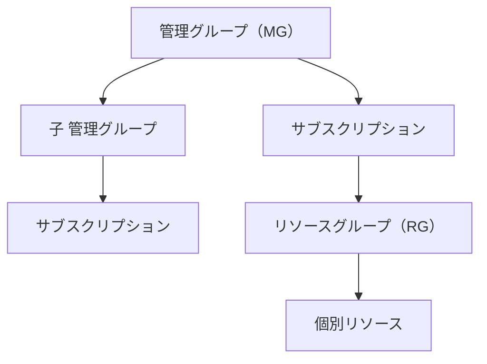
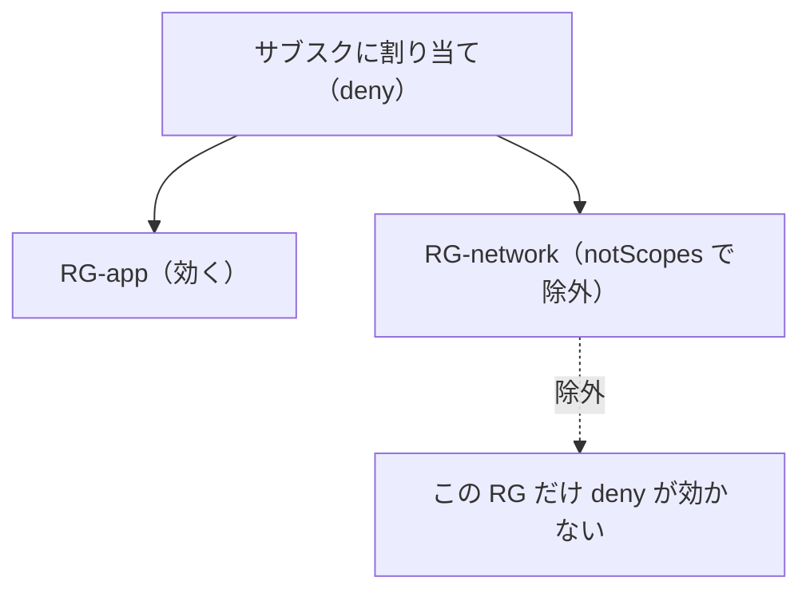

# Week 7 — 割り当て（assignment）とスコープ：定義を「どこに・どう効かせるか」

> **Phase 2b** | 学習プラン Week 7 / 10
> 学習目標：定義／イニシアティブを実際に効かせる **割り当て（assignment）**と **スコープ**を深掘りする。管理グループ／サブスクリプション／リソースグループの**階層と継承**、`notScopes`（除外）、`enforcementMode`（`Default` vs `DoNotEnforce`）、割り当てに付く **identity**（DINE/modify 用マネージド ID）、`overrides`（効果の上書き）・`resourceSelectors`（段階的ロールアウト）を読み書きできるようになる。W2 で保留した「定義の置き場所」と「割り当てスコープ」の違いをここで完結させる。

---

## 0. 今週の位置づけ

W2〜W6 で「何を（定義）・どう束ねるか（イニシアティブ）」が揃った。今週は **「どこに・どう効かせるか」＝割り当て**。ワークフロー（W1 §4）の 3 段目にあたる。


> **用語補足：割り当て（assignment）とは**
> 「定義／イニシアティブ」＋「スコープ」＋「パラメータ値」を結びつけた**実体（`Microsoft.Authorization/policyAssignments`）**。定義はレシピ、割り当ては「そのレシピをこの範囲で・この設定で実行せよ」という指示書。**評価対象は割り当てのスコープで決まる。**

---

## 1. スコープ階層と継承 — Azure の入れ子構造

Azure のリソースは**入れ子（ツリー）**になっている。上から順に：



**最重要ルール：割り当ては、そのスコープと"配下すべて"に継承される。** RG に割り当てれば RG 内の全リソースに、サブスクに割り当てればその下の全 RG・全リソースに効く。公式：「すべての子リソースは割り当てを継承する」。

| スコープ | 割り当てると効く範囲 |
| --- | --- |
| 管理グループ | 配下の全サブスク・全 RG・全リソース |
| サブスクリプション | その下の全 RG・全リソース |
| リソースグループ | その中の全リソース |
| 個別リソース | そのリソースのみ |

> **落とし穴（W1 の回収）：MG に割り当てても、評価されるのはサブスク/RG 以下**
> 公式：「ポリシーは MG レベルで割り当てられるが、**評価されるのはサブスクリプションまたはリソースグループレベルのリソースだけ**」。MG は"割り当てを広く配る入れ物"で、MG そのもの（や MG 自体のプロパティ）が評価対象になるわけではない。

> **用語補足：Azure Policy は「明示的な拒否（explicit deny）」システム（W1 の回収）**
> 上位で `deny` した割り当ては、下位で"より緩い割り当て"を足しても**覆せない**。緩めたい範囲は、上位割り当ての **`notScopes` で除外**してから、その範囲に別の割り当てを置く。「下位で上書きして許可」はできない、と覚える。

---

## 2. 割り当ての骨格

割り当ても JSON。主な要素（出典：[割り当て構造](https://learn.microsoft.com/en-us/azure/governance/policy/concepts/assignment-structure)）。

| 要素 | 役割 | 節 |
| --- | --- | --- |
| `scope` | 効かせる範囲（作成時に指定） | §1 |
| `policyDefinitionId` | 割り当てる**定義 or イニシアティブ**の ID（1 個。配列不可） | — |
| `definitionVersion` | 参照するバージョン（`1.*.*` 等） | — |
| `notScopes` | **除外**するスコープ | §3 |
| `enforcementMode` | 強制する / 評価だけ | §4 |
| `parameters` | パラメータの**値**を確定 | §5 |
| `identity` | DINE/modify 用マネージド ID | §6 |
| `overrides` | 効果・バージョンの**上書き** | §7 |
| `resourceSelectors` | 段階的ロールアウト | §8 |
| `nonComplianceMessages` | 非準拠時の独自メッセージ | §9 |

> **補足：`policyDefinitionId` は定義でもイニシアティブでも同じ欄**。1 割り当て＝1 定義 or 1 イニシアティブ。複数を一緒に当てたいならイニシアティブにまとめる（W6 の推奨）。

---

## 3. `notScopes` — 除外スコープ

割り当てはスコープ配下すべてに効くが、**一部だけ外したい**ときに `notScopes`（除外）を使う。配列で複数指定でき、割り当て後にも追加・更新できる。



公式例（W1 の回収）：「サブスク全体にネットワーク作成禁止を割り当て、ネットワーク専用 RG だけ `notScopes` で除外し、そこには信頼できる担当者に作成を許す」。

> **用語補足：除外（notScopes）と例外（exemption）は別物**
> - **除外（notScopes）**＝割り当ての設定。「この範囲は最初から**割り当ての対象外**」。
> - **例外（exemption）**＝別リソースとして作る「免除」（W9）。対象ではあるが**個別に免除**し、期限や理由を残せる。
> 「割り当ての形で外す＝notScopes／後から個別に免除＝exemption」。詳細は W9。

---

## 4. `enforcementMode` — 強制する / 評価だけ（What-If）

W3 で予告した「効果を出さず評価だけ」の正体。新しい割り当てを**本番に効かせる前に影響を見たい**ときに使う。

| enforcementMode | 効果の実行 | Activity ログ | 意味 |
| --- | --- | --- | --- |
| `Default`（既定） | **する** | 残る | 通常。deny/modify 等が実際に効く |
| `DoNotEnforce` | **しない** | 残らない | **What-If**。準拠/非準拠は評価・記録するが、**効果は発動しない** |

`DoNotEnforce` なら、`deny` の割り当てを当てても**実リソースの作成はブロックされず**、「もし強制したら何が非準拠になるか」だけ分かる。まず audit（W4）で観測、あるいは deny を `DoNotEnforce` で試す、という安全な導入ができる。

> **`DoNotEnforce` と `disabled` 効果の違い（重要）**
> - **`enforcementMode: DoNotEnforce`**＝**評価はする**が効果を出さない（非準拠は分かる）。
> - **`disabled` 効果（W4）**＝**そもそも評価しない**（非準拠すら出ない）。
> 「What-If で影響を見たい＝DoNotEnforce／完全に止めたい＝disabled」。
> なお公式注記：**`DoNotEnforce` でも DINE の remediation task は起動できる**（W8）。

---

## 5. `parameters` — 割り当てで値を確定（W2・W5・W6 の回収）

W5・W6 で定義した「穴」に、**割り当てで実際の値を入れる**のがここ。

```json
"parameters": {
  "prefix": { "value": "DeptA" },
  "suffix": { "value": "-LC" }
}
```

同じ定義を、部署ごとに違うパラメータで割り当てられる（再利用）。イニシアティブなら、イニシアティブレベルのパラメータに入れた値が中の各定義へ配られる（W6）。

> **W2 の宿題を完結：「定義の置き場所」と「割り当てスコープ」は別物**
> - **定義の置き場所（definition location, W2）**＝定義という部品をしまう棚（MG/サブスク）。「どこまでに割り当て可能か」の上限。
> - **割り当てスコープ（scope, 本週）**＝その定義を実際に効かせる範囲（MG/サブスク/RG/リソース）。
> 例：定義を親 MG に置き（＝配下どこにでも割り当て可）、割り当ては特定サブスクだけにする——W1 の overview 推奨「定義は上位・割り当ては子階層」の実装。

---

## 6. `identity` — DINE/modify 用のマネージド ID

W4 で「DINE/modify は remediation にマネージド ID が要る」と学んだ。その ID を**割り当てに付ける**のがここ。

| 種類 | 書き方 | 特徴 |
| --- | --- | --- |
| **システム割り当て**（SystemAssigned） | `identityType: SystemAssigned` ＋ 最上位 `location` 必須 | 割り当てと一蓮托生。Azure が自動生成・破棄 |
| **ユーザー割り当て**（UserAssigned） | `identityType: UserAssigned` ＋ `userAssignedIdentities` に ID | 事前に作った ID を使い回せる |

- 1 割り当てにつき ID は **1 つだけ**（system か user のいずれか）。ただしその ID に**複数ロールを付けられる**。
- **システム割り当ては `location` 必須**（`global` 不可・変更不可）。ユーザー割り当ては不要。
- 付けた ID に、`roleDefinitionIds`（W4）相当の権限を与える（Portal は自動、Bicep/CLI は自前——W5 の `assignPermissions` 補足の話とつながる）。

> **用語補足：DINE の「2 つの ID」の分担（公式注記）**
> DINE では登場人物が 2 人いる。
> - **呼び出し元の ID（requestor）**＝リソースを作った人。**存在条件の評価（読み取り）**に使われる。
> - **割り当ての ID（assignment identity）**＝マネージド ID。**実際のテンプレート配備（書き込み）**に使われる。
> 例：Key Vault に診断設定を配る DINE なら、呼び出し元に `diagnosticSettings/read`、割り当て ID に `diagnosticSettings/write` が要る。「読むのは作った人・書くのはポリシーの ID」。

> **初学者向け用語補足：「呼び出し元（requestor / caller）」とは何か**
>
> Azure の操作は**すべて API（ARM への REST リクエスト）**で行われる。Portal のボタンも `az` コマンドも Bicep デプロイも、裏では「ARM に"この Key Vault を作れ"という PUT を送る」という同じ形。**呼び出し元 ＝ その"作れ/変えろ"というリクエストを送った本人**。特別な用語ではなく「今このリソースを作ろうとしている操作をした主体」のこと。
>
> | 呼び出し元の実体 | 例 |
> | --- | --- |
> | 人間（Portal/CLI） | 開発者が `az keyvault create` を実行 |
> | CI/CD のサービスプリンシパル | GitHub Actions / Azure DevOps のパイプライン |
> | IaC ツールの ID | Terraform / Bicep デプロイを実行する ID |
>
> **なぜ ID が 2 人に分かれるか**：DINE 内部で「あるか確認（読み）」と「無いものを作る（書き）」の 2 動作があり、起きるタイミングと性質が違う。
>
> ```mermaid
> sequenceDiagram
>     participant U as 呼び出し元<br/>(開発者/パイプライン)
>     participant ARM as Azure Resource Manager
>     participant POL as Policy エンジン
>     participant MI as 割り当ての<br/>マネージドID
>     U->>ARM: ① Key Vault を作れ（PUT）
>     ARM->>POL: ② DINE を評価
>     POL->>ARM: ③ 診断設定は存在する?（読み取り）
>     Note over POL,ARM: 読み取りは呼び出し元(U)の権限で
>     POL->>MI: ④ 無い → 配備して
>     MI->>ARM: ⑤ 診断設定を作る（書き込み）
>     Note over MI,ARM: 書き込みは割り当てのIDで
> ```
>
> - **③ 存在チェック（読み取り）** … 呼び出し元の作成リクエストを処理している最中に起きるので、**呼び出し元の権限**で読む → 呼び出し元に `diagnosticSettings/read`。
> - **⑤ 実際の配備（書き込み）** … ポリシーが代理でリソースを作る動作 → **割り当てのマネージド ID**が実行 → 割り当て ID に `diagnosticSettings/write`。
>
> **なぜ分けるのか（直感）**：読み取りは呼び出し元の PUT 処理の一部として同期的に起きるので呼び出し元の文脈が自然。書き込み（是正）は呼び出し元の操作と独立にポリシーが起こす副作用なので、ポリシー専用の ID で行う。1 つの ID でやると「Key Vault を作りたいだけの開発者」全員に「診断設定を書く権限」を配る羽目になる。それを避け、**書き込み権限をポリシーの ID に一元化**しているのが狙い。
>
> **帰結**：呼び出し元に read が無いと存在チェックが失敗しうる／割り当て ID に write が無いと配備が失敗する。**既存リソースを後から remediation task で直す場合（W8）**は作成リクエストが無いので、配備は常に割り当て ID が行う（公式：DINE のテンプレート配備は常に割り当て ID）。

---

## 7. `overrides` — 効果・バージョンの上書き

定義そのものを書き換えず、**割り当て側で効果を差し替える**仕組み。とくにイニシアティブで威力を発揮する。

`kind` は 2 種：

| kind | 上書きするもの | value |
| --- | --- | --- |
| `policyEffect` | **効果** | `audit`/`deny`/`disabled` 等（W4） |
| `policyVersion` | **バージョン** | `definitionVersion` 以上の版 |

公式例：イニシアティブ *CostManagement* の中の 1 定義（`policyDefinitionReferenceId: corpVMSizePolicy`）だけ、効果を `audit` → `disabled` に上書き。

```json
"overrides": [
  {
    "kind": "policyEffect",
    "value": "disabled",
    "selectors": [
      { "kind": "policyDefinitionReferenceId", "in": [ "corpVMSizePolicy" ] }
    ]
  }
]
```

- `selectors.kind: policyDefinitionReferenceId` で「イニシアティブ内の**どの定義に**上書きを効かせるか」を指定（W6 のあだ名がここで効く）。
- 1 つの override で**最大 50 の `policyDefinitionReferenceId`**、1 割り当てに**最大 10 の override**。
- **使いどころ**：多数の定義を含むイニシアティブで、**複数の効果を一括で切り替える**（1 個ずつ定義を直さずに済む）。

> **初学者向け用語補足：「1 override で 50・1 割り当てで 10」の意味**
>
> この 2 つは**別々の軸**の上限。override 1 個は「**これらのポリシーを → この 1 つの値にせよ**」という一括置換ルール（`value` は 1 つだけ）。`selectors.in` がその対象ポリシー（refId）のリスト。
>
> | 上限 | 軸 | 意味 |
> | --- | --- | --- |
> | **1 override に refId 最大 50** | 横（1 ルールの対象数） | **同じ値**を一度に最大 50 個のポリシーへ適用できる |
> | **1 割り当てに override 最大 10** | 縦（ルールの本数） | **違う値のグループ**を最大 10 種類作れる |
>
> **なぜ複数要るか**：override 1 個の `value` は 1 つだけなので、「一部は無効化・一部は監査・一部は拒否」のように**違う効果に振り分けたい**なら、**効果の種類ごとに override を分ける**。
>
> **具体例**：200 ポリシーのイニシアティブで「50 個→disabled／30 個→audit／20 個→deny」に振り分けたい → override は **3 本**。
> ```json
> "overrides": [
>   { "kind": "policyEffect", "value": "disabled",
>     "selectors": [{ "kind": "policyDefinitionReferenceId", "in": [ "pol1", "…(最大50個)" ] }] },
>   { "kind": "policyEffect", "value": "audit",
>     "selectors": [{ "kind": "policyDefinitionReferenceId", "in": [ "polA", "…(最大30個)" ] }] },
>   { "kind": "policyEffect", "value": "deny",
>     "selectors": [{ "kind": "policyDefinitionReferenceId", "in": [ "polX", "…(最大20個)" ] }] }
> ]
> ```
> ```mermaid
> flowchart TD
>     A["1つの割り当て（overrides 配列）"] --> O1["override① value=disabled<br/>refId 最大50個"]
>     A --> O2["override② value=audit<br/>refId 最大30個"]
>     A --> O3["override③ value=deny<br/>refId 最大20個"]
>     O1 --> G1["対象50ポリシー → 無効化"]
>     O2 --> G2["対象30ポリシー → 監査"]
>     O3 --> G3["対象20ポリシー → 拒否"]
> ```
> - この例は override 3 本（上限 10 まで余裕）。効果を 11 種類に振り分けたいと 11 本目が要り**作れない**が、効果の種類は実質数種なので 10 本で足りる。
> - 「同じ `disabled` を 60 個へ」なら 1 本に 50 個までなので、**2 本に分けて 50＋10**（同じ値の override を並べてよい）。
> - 全体：横 50 × 縦 10 ＝ 理論上最大 500 件の refId を、最大 10 種類の値に振り分けられる。override は**書いた順に評価**。
>
> ひとことで：**「50 は 1 グループのメンバー上限、10 はグループ自体の個数上限」**。

> **効果を変える 3 つの手段の違い**
> - **パラメータ化した効果**（定義側 `allowedValues` で `audit/deny/disabled`、W4/W5）＝定義作者が用意した切り替え。
> - **`overrides`**（割り当て側）＝定義を触らず、割り当てで強制的に差し替え。
> - **`enforcementMode`**（§4）＝効果は変えず「実行するか否か」だけ。
> 「候補から選ぶ＝パラメータ／強制差し替え＝override／実行 ON-OFF＝enforcementMode」。

---

## 8. `resourceSelectors` — 段階的ロールアウト（SDP）

新しい割り当てを**いきなり全体に効かせず、一部から徐々に広げる**ための仕組み。SDP＝Safe Deployment Practices（安全な展開の実践）。

```json
"resourceSelectors": [
  {
    "name": "SDPRegions",
    "selectors": [
      { "kind": "resourceLocation", "in": [ "eastus", "westus" ] }
    ]
  }
]
```

これで**East US / West US のリソースだけ評価**される。慣らし運転して問題なければ、`in` にリージョンを足して広げる（割り当てを更新するだけ）。

`selectors.kind` の値：

| kind | 何で絞るか |
| --- | --- |
| `resourceLocation` | リソースの**リージョン** |
| `resourceType` | リソースの**型** |
| `resourceWithoutLocation` | 場所を持たないサブスクレベルのリソース |

- `in`（許可）/`notIn`（除外）で候補を指定（各最大 50・両方同時は不可）。
- 1 割り当てに最大 10 の `resourceSelectors`。**いずれか 1 つを満たせば**評価対象（selectors 内は AND）。

> **`resourceSelectors` と `notScopes` の違い**
> - **`notScopes`**（§3）＝**スコープ（RG/サブスク単位）**で除外。
> - **`resourceSelectors`**＝**リソースの属性（リージョン/型）**で評価対象を絞る。段階展開向き。
> 「場所の階層で外す＝notScopes／リソースの性質で絞る＝resourceSelectors」。

---

## 9. `nonComplianceMessages` — 非準拠の理由メッセージ（任意）

非準拠時に表示する独自メッセージを設定できる。deny で作成が拒否されたとき、利用者に理由を伝えられる。

```json
"nonComplianceMessages": [
  { "message": "リソース名は 'DeptA' で始まり '-LC' で終わる必要があります。" }
]
```

イニシアティブでは、`policyDefinitionReferenceId`（W6）ごとに別メッセージを出せる。Resource Manager モード（W2）の定義でのみ対応。

---

## ハンズオン チェックリスト

- [ ] スコープ階層（MG/サブスク/RG/リソース）と「配下すべてに継承」を図で説明できた
- [ ] 「MG 割り当てでも評価はサブスク/RG 以下」「明示的 deny は下位で覆せない」を理解した
- [ ] `notScopes` で一部 RG を除外する形を書けた
- [ ] `enforcementMode` の `Default` と `DoNotEnforce`、`disabled` 効果との違いを説明できた
- [ ] 割り当ての `parameters` で値を確定する形を書き、「定義の置き場所」と「割り当てスコープ」の違いを言えた
- [ ] `identity` の system/user 割り当ての違いと、DINE の「読むのは呼び出し元・書くのは割り当て ID」を説明できた
- [ ] `overrides`（効果差し替え）と `resourceSelectors`（段階展開）の使い分けを説明できた
- [ ] Portal で組み込みポリシーを 1 つ `DoNotEnforce` で割り当て、効果が出ないことを確認した

---

## 自己チェック

週末にドキュメントを閉じて答えてみる。

1. **スコープ階層 4 段と継承のルールは？ MG 割り当ての注意点は？**
   - キーワード：MG→サブスク→RG→リソース／**配下すべてに継承**／MG でも評価はサブスク/RG 以下
2. **上位で deny した範囲を、下位で緩めるには？**
   - キーワード：下位で上書き**不可**（明示的 deny）／上位割り当ての **`notScopes` で除外**して別割り当て
3. **`enforcementMode` の 2 値と、`disabled` 効果との違いは？**
   - キーワード：Default＝強制／DoNotEnforce＝**評価はするが効果を出さない（What-If）**／disabled＝そもそも評価しない
4. **DINE の割り当てに要る `identity` の 2 種と、DINE の 2 つの ID の分担は？**
   - キーワード：SystemAssigned（location 必須）/UserAssigned／読むのは**呼び出し元**・書くのは**割り当て ID**
5. **`overrides` は何を上書きできるか？ イニシアティブでの使いどころは？**
   - キーワード：`policyEffect`/`policyVersion`／`policyDefinitionReferenceId` で対象指定／**複数定義の効果を一括切替**
6. **`resourceSelectors` と `notScopes` の違いは？**
   - キーワード：notScopes＝スコープ単位で除外／resourceSelectors＝**リージョン/型**で絞る・**段階展開（SDP）**

---

## 次週の予告（Week 8）

W7 までで「定義 → イニシアティブ → 割り当て」が全部つながった。W8 では、割り当てた後に起きる **コンプライアンス評価**と **修復（remediation）**を扱う。評価トリガー（割り当て時・リソース変更時・24 時間周期・オンデマンドスキャン）、コンプライアンス状態（Compliant / Non-compliant / Exempt / Conflicting）、そして「**既存の非準拠を実際に直す**」remediation task——W4・W7 で繰り返し予告してきた **DINE/modify のマネージド ID による是正**を、ついに手を動かして完成させる。
