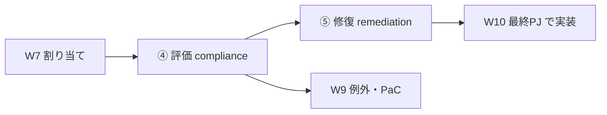
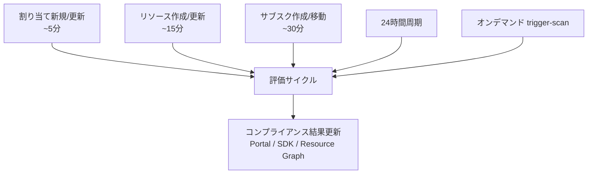
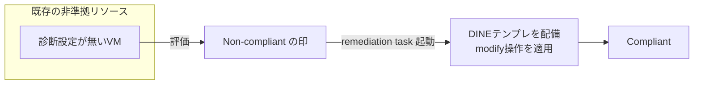
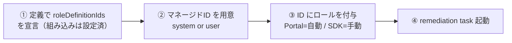

# Week 8 — コンプライアンス評価と修復（remediation）：測る・既存を直す

> **Phase 2c** | 学習プラン Week 8 / 10
> 学習目標：割り当てた後に起きる **評価**と **修復（remediation）**を理解する。評価トリガー（割り当て時・リソース変更時・24 時間周期・オンデマンドスキャン）、コンプライアンス状態（Compliant / Non-compliant / Exempt / Conflicting …）、そして「**既存の非準拠を実際に直す**」remediation task を、`az policy` コマンドを交えて手を動かせるようにする。W4・W7 で繰り返し予告してきた DINE/modify のマネージド ID による是正を、ここで完成させる。

---

## 0. 今週の位置づけ

W7 までで「定義 → イニシアティブ → 割り当て」が繋がった。今週はワークフロー（W1 §4）の **④評価**と **⑤是正**。



---

## 1. 評価トリガー — いつ評価されるか

コンプライアンスは"常時リアルタイム"ではなく、**特定のイベントと定期サイクル**で更新される（出典：[コンプライアンスデータの取得](https://learn.microsoft.com/en-us/azure/governance/policy/how-to/get-compliance-data)）。

| トリガー | 反映までの目安 |
| --- | --- |
| 割り当て（or イニシアティブ）を**新規/更新** | 割り当て適用に約 **5 分**、その後に評価サイクル開始 |
| スコープ内で**リソースを作成/更新** | そのリソースの結果が約 **15 分後**（他リソースは再評価しない） |
| **サブスクの作成/MG 階層内の移動**（サブスク対象の割り当て） | 約 **30 分** |
| **例外（exemption）**の作成/更新/削除 | 対応する割り当てが再評価 |
| **標準コンプライアンス評価サイクル** | **24 時間ごと**に自動で全再評価 |
| **オンデマンドスキャン** | 手動起動（§3） |



> **用語補足：なぜ 24 時間周期があるのか**
> deny は作成時に即効くが、**audit 系や既存リソースの状態**は「作成イベント」が無いと気づけない。だから 24 時間ごとに全部を測り直す。「今すぐ確かめたい」ときは §3 のオンデマンドスキャンで前倒しする。

---

## 2. コンプライアンス状態 — 6 つの状態

評価結果は各リソースに状態として付く（出典：[コンプライアンス状態](https://learn.microsoft.com/en-us/azure/governance/policy/concepts/compliance-states)）。

| 状態 | 意味 |
| --- | --- |
| **Compliant（準拠）** | ルールを満たしている |
| **Non-compliant（非準拠）** | ルールに違反（deny なら作成拒否、audit なら記録） |
| **Exempt（免除）** | 例外（exemption, W9）で評価から免除されている |
| **Conflicting（競合）** | 同じプロパティを複数の modify が矛盾して触る等の衝突 |
| **Not started（未開始）** | 評価サイクルがまだ始まっていない |
| **Unknown（不明）** | 主に manual 効果。人が手で状態を設定するまで不明 |

> **準拠率の考え方**：準拠率は「準拠リソース数 ÷ 該当リソース総数」。**非準拠が 1 つでもあると、その割り当ては非準拠として集計**される。Portal の「コンプライアンス」画面で、非準拠リソースへドリルダウンできる（W1 で体感した動き）。

---

## 3. オンデマンドスキャン — 今すぐ評価する

24 時間を待たず、サブスク／RG を**手動で即評価**する。W10 で使う `az policy` を先取りする。

**Azure CLI**（この教材の最終週スタック）：
```bash
az policy state trigger-scan --resource-group "myResourceGroup"
```

**Azure PowerShell**：
```bash
Start-AzPolicyComplianceScan -ResourceGroupName 'myResourceGroup'
```

**REST**（サブスク単位）：`POST .../policyStates/latest/triggerEvaluation?api-version=2019-10-01`

> **コマンドの読み方（az policy state trigger-scan）**
> - `policy state`＝ポリシーの**評価状態**を扱うコマンド群。
> - `trigger-scan`＝評価スキャンを**引き起こす（trigger）**。
> - `--resource-group`＝対象 RG（省略時は現在のサブスク全体）。
> - **非同期**（asynchronous）＝実行するとすぐ戻り、裏で走る。全ポリシーに対して全リソースを評価するので時間がかかる。

**確認系コマンド**（W10 の検証で使う）：
```bash
az policy state summarize --top 1          # 非準拠が多い割り当ての要約
az policy state list --top 1               # 直近の評価レコード
az policy state list --filter "ResourceType eq 'Microsoft.Network/virtualNetworks'"
```

---

## 4. なぜ「修復」が要るのか

W4・W7 で繰り返した核心を、ここで結ぶ。

- **`deny` は"これから"にしか効かない**。既存の違反リソースは拒否できず、**非準拠として可視化されるだけ**。
- **既存リソースを実際に直せるのは `deployIfNotExists`（DINE）と `modify` だけ**。しかも評価サイクルでは既存を勝手に変えず、**非準拠の印を付けるだけ**。実際に直すには **remediation task（修復タスク）**を起動する。



> **用語補足：修復（remediation）とは**
> **既存の非準拠リソースを、DINE のテンプレート配備／modify の操作で"あるべき状態"に直す**こと。新規作成時の自動適用とは別に、**過去に作られた分**をまとめて是正するための仕組み。audit や deny には修復は無い（それらは"直す"効果ではないから）。

---

## 5. 修復の準備 — 4 ステップ

公式の手順（出典：[非準拠リソースの修復](https://learn.microsoft.com/en-us/azure/governance/policy/how-to/remediate-resources)）。



**① 定義で `roleDefinitionIds`**（W4）… DINE/modify のテンプレ配備に必要なロールを定義側で宣言。**組み込みは設定済み**。カスタムは `details.roleDefinitionIds` に書く。ロール ID はフルパスで、short 名は不可：
```bash
az role definition list --name "Contributor"   # ID を調べる
```

**② マネージド ID を用意**（W7）… 割り当てに system-assigned か user-assigned を 1 つ付ける。system は `location` 必須。

**③ ロールを付与** … ②の ID に①のロールを与える。**Portal は自動付与**。**SDK（Bicep/CLI/PowerShell）は手動**で `az role assignment create`（または `New-AzRoleAssignment`）が必要。W5・W7 の「Portal は自動・SDK は自前」がここでも効く。

> **手動付与が要る場面（公式）**：SDK で割り当てた／DINE・modify が**割り当てスコープ外**のリソースを触る（W5 の `assignPermissions` の話）／テンプレートがスコープ外のプロパティにアクセスする。

**④ remediation task 起動**（§6）。

---

## 6. remediation task の作成

### Portal（3 つの経路）

1. **Remediation ページ**の「修復するポリシー」タブから
2. **非準拠の割り当て**（Compliance ページ）から「Create Remediation Task」
3. **割り当て作成時**の Remediation タブで「修復タスクも作成」にチェック（サブスク割り当てで最も手軽。MG 割り当ては評価後に 1・2 で作る）

### Azure CLI（W10 で使う）
```bash
az policy remediation create \
  --name myRemediation \
  --policy-assignment "/subscriptions/{subId}/providers/Microsoft.Authorization/policyAssignments/{assignmentId}"
```

### Azure PowerShell
```bash
Start-AzPolicyRemediation -Name 'myRemediation' -PolicyAssignmentId '/.../policyAssignments/{id}'
```

**調整できる主なオプション**：

| オプション（CLI/PS） | 意味 | 既定 |
| --- | --- | --- |
| `-ResourceCount` | 一度に修復する非準拠リソース数 | 500（最大 50,000） |
| `-ParallelDeploymentCount` | 同時に修復する数 | 10（1〜30） |
| `-FailureThreshold` | 失敗率がこれを超えたらタスク失敗（0〜100%） | 100% |

> **重要（W7 の回収）**：`enforcementMode: DoNotEnforce` でも **DINE の remediation task は起動できる**。「効果は出したくないが、既存だけは直したい」も可能。

> **修復で配備した ID の分担（W7 の回収）**：remediation task の配備は**常に割り当てのマネージド ID**が行う（既存リソース対象なので"呼び出し元"は絡まない）。

---

## 7. 権限まとめ

Azure Policy と修復に関わる代表的なロール（W1 の overview の回収）。

| ロール | できること |
| --- | --- |
| **Resource Policy Contributor** | 定義・割り当ての作成/更新など Policy 操作の大半 |
| **Owner** | フル権限 |
| **Contributor** | 修復の起動は可。ただし**定義・割り当ての作成/更新は不可** |
| **User Access Administrator** | DINE/modify の**マネージド ID にロールを付与**するのに必要 |

> ポイント：**マネージド ID に権限を付ける行為**（③）には `User Access Administrator` か `Owner` が要る。「ポリシーを作る」権限と「ID に権限を配る」権限は別、と押さえる。

---

## ハンズオン チェックリスト

- [ ] 評価トリガー 5 つ（割り当て・リソース変更・サブスク・24 時間・オンデマンド）と目安時間を言えた
- [ ] コンプライアンス状態 6 つ（Compliant/Non-compliant/Exempt/Conflicting/Not started/Unknown）を説明できた
- [ ] `az policy state trigger-scan --resource-group ...` でオンデマンド評価を起動した
- [ ] `az policy state list` / `summarize` で結果を確認した
- [ ] 「deny は新規のみ・既存は remediation で直す・直せるのは DINE/modify だけ」を説明できた
- [ ] 修復 4 ステップ（roleDefinitionIds → ID → ロール付与 → task）を並べられた
- [ ] `az policy remediation create --policy-assignment ...` の形を書けた
- [ ] マネージド ID へのロール付与には User Access Administrator が要る、を理解した

---

## 自己チェック

週末にドキュメントを閉じて答えてみる。

1. **評価が起きるトリガーを 4 つ以上、それぞれの目安時間は？**
   - キーワード：割り当て(~5 分)/リソース変更(~15 分)/サブスク(~30 分)/24 時間周期/オンデマンド
2. **コンプライアンス状態を 4 つ以上挙げ、Exempt と Conflicting の意味は？**
   - キーワード：Compliant/Non-compliant/Exempt(例外で免除)/Conflicting(modify 衝突)/Not started/Unknown(manual)
3. **24 時間待たずに今すぐ評価するには？（CLI）**
   - キーワード：`az policy state trigger-scan --resource-group ...`（非同期）
4. **既存の非準拠リソースを直せる効果は？ deny では直せないのはなぜ？**
   - キーワード：**DINE / modify のみ**／deny は新規/更新の拒否だけ・既存は可視化のみ
5. **修復の準備 4 ステップは？**
   - キーワード：定義に roleDefinitionIds → マネージド ID 用意 → ID にロール付与(Portal自動/SDK手動) → remediation task
6. **マネージド ID にロールを付けるのに要る権限は？ Contributor でできない Policy 操作は？**
   - キーワード：User Access Administrator（or Owner）／Contributor は**定義・割り当ての作成/更新不可**

---

## 次週の予告（Week 9）

W8 で「測って・直す」までできた。W9 では、正当な理由で**評価から外す**仕組み＝**例外（exemptions）**を扱う。`Waiver`（免除）/`Mitigated`（別手段で緩和済み）の区別と `expiresOn`（期限）、そして **notScopes（除外）vs exemption（例外）vs disabled 効果 vs enforcementMode の使い分け**を総整理する。さらに運用の話——**Policy as Code**（定義のエクスポート・Git・CI/CD）、Azure Policy for Kubernetes（Gatekeeper/OPA）と Azure Arc 対応の俯瞰、コストの再確認。W10 の最終 PJ（Bicep + az policy）へ向けた仕上げの回。
