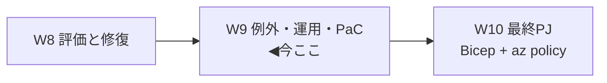
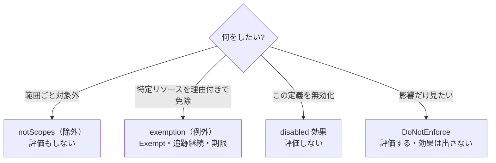
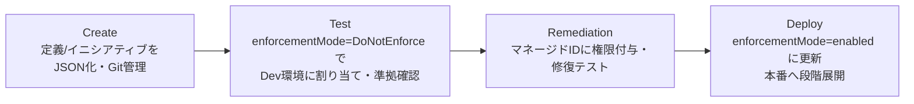

# Week 9 — 例外（exemptions）・運用・Policy as Code：外す仕組みと、コードで回す運用

> **Phase 2d** | 学習プラン Week 9 / 10
> 学習目標：正当な理由で評価から**外す**仕組み＝**例外（exemptions）**を理解する。`Waiver`（免除）/`Mitigated`（緩和済み）の区別と `expiresOn`（期限）、そして本教材の核心の 1 つ——**notScopes（除外）／exemption（例外）／disabled 効果／enforcementMode** の使い分けを総整理する。さらに運用として **Policy as Code（PaC）**、Kubernetes（Gatekeeper/OPA）と Arc の俯瞰、コストの再確認まで。W10 の最終 PJ 直前の仕上げ。

---

## 0. 今週の位置づけ

W8 で「測って・直す」までできた。今週は「**正当に外す**（例外）」と「**コードで回す**（PaC）」という運用の話。W10 の実装へつなぐ仕上げの回。



---

## 1. 例外（exemptions）の正体

**例外は、リソース（階層）を割り当ての評価から一時的に外す**仕組み（出典：[例外構造](https://learn.microsoft.com/en-us/azure/governance/policy/concepts/exemption-structure)）。特徴：

- 例外にしたリソースは **`Exempt`（免除）**状態になり、**全体のコンプライアンスにはカウントされる**（＝"隠す"のではなく"免除として追跡"）。
- 例外は、対象リソース（階層）の**子オブジェクトとして作られる**。**親リソースが消えると例外も消える**。
- イニシアティブ割り当てに対して、**中の一部の定義だけ**を免除できる（`policyDefinitionReferenceId` の配列で指定）。

> **用語補足：「除外」ではなく「免除」— 追跡され続ける**
> 例外（exemption）は「見なかったことにする」ではなく「**理由付きで評価を免除し、記録に残す**」。`metadata` に `requestedBy`（申請者）/`approvedBy`（承認者）/`ticketRef`（チケット番号）等を残す慣習があり、**誰が・なぜ・いつまで**免除したかを追える。ガバナンスの一部として"正しく外す"ための仕組み。

---

## 2. `exemptionCategory` と `expiresOn`

### 2-1. カテゴリ（免除の理由の種類）

| exemptionCategory | 意味 |
| --- | --- |
| **`Waiver`（免除）** | 非準拠を**一時的に受け入れる**。または「イニシアティブ全体でなく一部の定義だけ外したい」場合 |
| **`Mitigated`（緩和済み）** | ポリシーの意図が**別の手段で満たされている**（例：Azure Policy 以外の方法で同等の統制が効いている） |

> **使い分け**：「**今は目をつぶる**（後で直す/削除予定）＝Waiver」「**別のやり方で達成済み**＝Mitigated」。W8 の Conflicting とは無関係で、これは"外す理由のラベル"。

### 2-2. 有効期限（`expiresOn`）

`expiresOn`（ISO 8601 形式）で**いつまで免除するか**を設定できる（任意）。

> **落とし穴**：期限が来ても**例外オブジェクトは自動削除されない**。記録保持のため残るが、**期限を過ぎると免除が効かなくなる**（＝再び評価対象に戻る）。期限切れの例外は運用で定期的に見直して削除する。

---

## 3. 例外の主なプロパティ

| プロパティ | 役割 |
| --- | --- |
| `policyAssignmentId` | **どの割り当てから**免除するか（1 個・配列不可） |
| `policyDefinitionReferenceId` | イニシアティブ内の**どの定義を**免除するか（配列。W6 のあだ名） |
| `exemptionCategory` | Waiver / Mitigated |
| `expiresOn` | 期限 |
| `resourceSelectors` | 段階的な適用/解除（W7 と同じ仕組み。リージョン/型で絞る） |
| `assignmentScopeValidation` | 割り当てスコープ外に例外を作れるか（`Default`/`DoNotValidate`） |

> **用語補足：ID ベースの例外（identity based exemption）**
> `resourceSelectors` の `kind` に **`userPrincipalId` / `groupPrincipalId`** を使うと、「**特定のユーザー/グループ/サービスプリンシパルが行う操作だけ**」を割り当ての強制から外せる。例：「VM サイズ制限を全体にかけつつ、高権限グループだけは例外」。

> **用語補足：コンプライアンスサブ状態（compliance substate）**
> 例外リソースには、状態 `Exempt` に加えて「**もし例外を外したら準拠/非準拠のどちらになるか**」を示すサブ状態が付く（Waiver/Mitigated の内訳も）。免除で"隠れている"実態を把握するためのもの。Resource Graph の `properties.stateDetails.complianceSubState` で照会できる。

---

## 4. 総整理 — 「外す/効かせない」4 つの手段の使い分け ★核心

ここまでで「効果を出さない・対象から外す」手段が 4 つ登場した。混同しやすいので一枚に整理する。

| 手段 | どこの設定 | 評価は? | 効果は? | 粒度 | 使いどころ |
| --- | --- | --- | --- | --- | --- |
| **`notScopes`（除外）** | 割り当て（W7） | **しない** | 出ない | スコープ（RG/サブスク単位） | 「この範囲は最初から対象外」 |
| **`exemption`（例外）** | 別リソース（本週） | **免除（Exempt）** | 出ない | リソース/階層・定義単位 | 「対象だが**理由付き・期限付き**で免除、追跡は続ける」 |
| **`disabled` 効果** | 定義（W4） | **しない** | 出ない | その定義そのもの | 「この定義を丸ごと無効化」 |
| **`enforcementMode: DoNotEnforce`** | 割り当て（W7） | **する** | 出ない | 割り当て全体 | 「**What-If**：評価はして影響を見るが強制しない」 |



**見分けのコツ**：
- **評価結果が欲しいか？** → 欲しい（影響を見たい）なら `DoNotEnforce`／`exemption`（Exempt として見える）。要らないなら `notScopes`／`disabled`。
- **追跡・期限・承認記録を残したいか？** → 残すなら `exemption` 一択。
- **範囲全体か・個別リソースか？** → 範囲なら `notScopes`、個別なら `exemption`。

---

## 5. Policy as Code（PaC）— 定義をコードとして回す

大規模になると、Portal で手作業は限界。**定義・割り当て・例外を JSON/Bicep でソース管理し、CI/CD で展開**するのが PaC（出典：[Policy as Code ワークフロー](https://learn.microsoft.com/en-us/azure/governance/policy/concepts/policy-as-code)）。

> 公式定義：**Infrastructure as Code ＋ DevOps** の組み合わせ。「ポリシー定義をソース管理に置き、変更のたびにテスト・検証する」。

### 5-1. 推奨ワークフロー



- **ソース管理**：既存の定義は **エクスポート**（PowerShell/CLI/Resource Graph）して Git（GitHub / Azure DevOps）へ。
- **テスト**：本番から最も遠い環境（通常 Dev）に **`DoNotEnforce`** で当て、`PUT`/`PATCH`・準拠/非準拠・エッジケース（プロパティ欠落）を試す（W3 の暗黙 deny 対策とつながる）。
- **修復検証** → **本番展開**（`enabled` に切替、環境を近い順に広げる）。
- **中央集権的な展開**（GitHub Actions / Azure Pipelines）を推奨：レビュー済みのものだけがデプロイされ、Policy への **書き込み権限をデプロイ用 ID に限定**できる。

### 5-2. 推奨フォルダ構造（抜粋）

```text
policies/
  policy1/
    versions/
      policy-v1.json            # 定義まるごと
      policy-v1.parameters.json # parameters 部分
      policy-v1.rules.json      # policyRule 部分
    assign.<name>.json          # 割り当て
    exemptions.<name>/          # その割り当ての例外
```

> **W10 との接続**：本教材の最終 PJ は、この PaC の考え方を **Bicep** で実装する（定義・イニシアティブ・割り当てをコード化し、`az policy` で評価・修復）。「アプリ/インフラのデプロイ時にポリシー評価を組み込み、非準拠なら早期に落とす」という統合も PaC の要点。

---

## 6. Kubernetes（Gatekeeper/OPA）と Arc の俯瞰

### 6-1. Azure Policy for Kubernetes

Resource Provider モード `Microsoft.Kubernetes.Data`（W2）で、**クラスタ内部**（ポッド・コンテナ等）にポリシーを効かせる。内部では **Gatekeeper**（OPA を Kubernetes に組み込むアドオン）が動く。効果は **audit / deny / disabled** に限られる（W2 の回収）。詳細な Rego 記述は本教材のスコープ外。

> **用語補足（W2 の再掲）**：OPA＝Open Policy Agent（汎用ポリシーエンジン）、Gatekeeper＝それを K8s に統合するもの。Azure Policy はこれらを"下請け"にしてクラスタを統制する。

### 6-2. Azure Arc 対応（W1 の回収）

**Arc**（オンプレ/他クラウドを Azure 管理面に接続する橋渡し）経由で、**Azure 外のサーバー・K8s にもポリシーを効かせられる**。ハイブリッド・ガバナンスの要。

---

## 7. コストの再確認（W1 の回収）

- **Azure リソースの統制は無料**（割り当て数・評価回数で課金されない）。
- 例外：**マシン構成（Machine Configuration）**は **Arc 接続の Azure 外サーバー**に対し 1 サーバー月額課金。**DINE/modify が実際に作った/変えたリソース**は通常課金。
- 例外（exemption）・PaC の運用自体に追加費用は無い。

---

## ハンズオン チェックリスト

- [ ] 例外（exemption）が「除外」でなく「Exempt として追跡する免除」だと説明できた
- [ ] `Waiver` と `Mitigated` の違いを言えた
- [ ] `expiresOn` は期限切れでも**自動削除されず、免除が効かなくなるだけ**、を理解した
- [ ] notScopes / exemption / disabled / DoNotEnforce の 4 手段を表で使い分けられた
- [ ] Portal で組み込みポリシーの非準拠リソースに**例外**を作り、`Exempt` になることを確認した
- [ ] PaC の Create→Test(DoNotEnforce)→Remediation→Deploy(enabled) の流れを説明できた
- [ ] Kubernetes(Gatekeeper/OPA) と Arc が「Azure リソース以外にも効かせる」俯瞰を掴んだ

---

## 自己チェック

週末にドキュメントを閉じて答えてみる。

1. **例外（exemption）は何をするか？ コンプライアンス上どう見えるか？**
   - キーワード：割り当ての評価から**理由付き免除**／状態 `Exempt`／全体にはカウント・追跡継続
2. **`Waiver` と `Mitigated` の違いは？**
   - キーワード：Waiver＝一時的に受容/一部定義だけ外す／Mitigated＝**別手段で意図を達成済み**
3. **`expiresOn` 到達後、例外オブジェクトはどうなるか？**
   - キーワード：**自動削除されない**（記録保持）／免除が効かなくなる（再評価対象に戻る）
4. **notScopes / exemption / disabled / DoNotEnforce をどう使い分けるか？**
   - キーワード：notScopes＝範囲対象外・評価せず／exemption＝個別免除・Exempt・期限/追跡／disabled＝定義無効化・評価せず／DoNotEnforce＝評価するが効果出さず（What-If）
5. **Policy as Code の推奨ワークフローは？**
   - キーワード：Git 管理→Dev に DoNotEnforce でテスト→修復検証→enabled で段階展開／CI/CD 中央集権
6. **Kubernetes 版ポリシーは内部で何を使うか？ Arc で何ができるか？**
   - キーワード：Gatekeeper/OPA（効果は audit/deny/disabled）／Arc で Azure 外のサーバー・K8s も統制

---

## 次週の予告（Week 10・最終 PJ）

いよいよ最終週。ここまで学んだ全要素を **Bicep + Azure CLI（az policy）**で E2E 実装する。**カスタムポリシー定義 → イニシアティブ → マネージド ID 付き割り当て（DINE/modify）**を Bicep でサブスク or MG スコープにデプロイし、`az policy state trigger-scan` で評価、`az policy remediation create` で既存リソースを是正、最後に後片付け。W2〜W9 の各要素（条件・効果・パラメータ・エイリアス・イニシアティブ・割り当て・スコープ・identity・評価・修復）が、実際に動く 1 つのコードにどう対応するかを、対応表で振り返って締めくくる。
