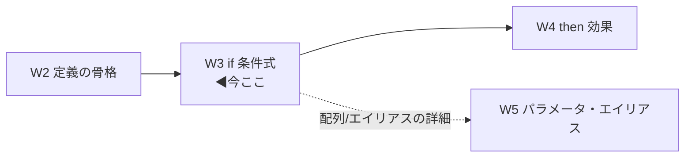
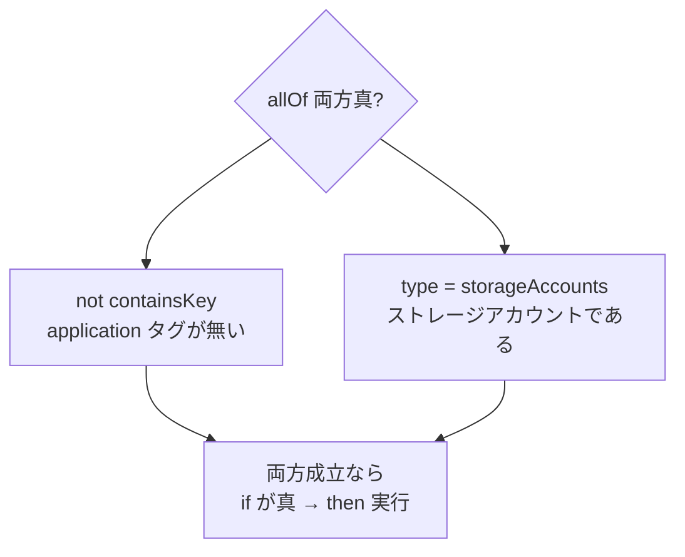

# Week 3 — 条件式（`if`）の深掘り：論理演算子・条件・field・value・count

> **Phase 1c** | 学習プラン Week 3 / 10
> 学習目標：`policyRule` の `if`（条件）を自分で読み書きできるようにする。論理演算子 **`allOf`／`anyOf`／`not`**、条件演算子（**`equals`・`like`・`match`・`in`・`exists`・`less/greater`** 等）、**`field`**（リソースのプロパティの指し方）と **`value`**（式で作る値）の違い、そして配列を数える **`count`** 式の俯瞰まで。「タグが無ければ」「特定 SKU なら」という実務の条件を組み立てられる状態を目指す。

---

## 0. 今週の位置づけ

W2 では定義の骨格を地図化し、心臓部が `policyRule`（`if` ＋ `then`）だと確認した。今週はその **`if`（どのリソースが対象か）**を分解する。効果 `then`（対象に何をするか）は W4、パラメータとエイリアスの深掘りは W5 で扱う。



`if` の骨格は次のとおり。**「条件（condition）」を「論理演算子（logical operator）」で束ねて**、対象リソースを言い表す（出典：[ポリシー定義ルールの構造](https://learn.microsoft.com/en-us/azure/governance/policy/concepts/definition-structure-policy-rule)）。

```json
{
  "if": { "<条件> または <論理演算子>" },
  "then": { "effect": "deny | audit | modify | ..." }
}
```

---

## 1. 論理演算子 — 条件を束ねる 3 つ

条件が 1 つなら演算子は要らないが、複数を組み合わせるときに使う。公式がサポートするのは 3 つだけ。

| 演算子 | 対応する論理 | 意味 | 形 |
| --- | --- | --- | --- |
| **`allOf`** | AND（かつ） | **すべての条件が真**なら真 | 配列 `[ {…}, {…} ]` |
| **`anyOf`** | OR（または） | **1 つ以上の条件が真**なら真 | 配列 `[ {…}, {…} ]` |
| **`not`** | NOT（否定） | 中の条件の結果を**反転** | 単一 `{…}` |

> **読み方**：`all`=すべて／`any`=いずれか／`not`=〜でない。`allOf`＝「〜の**すべて**（of の後の配列全部）」、`anyOf`＝「〜の**いずれか**」。

**ネスト（入れ子）できる。** 公式の例は「`allOf` の中に `not` を入れ子」にしたもの。読み下すと **「`application` タグを持た**ない、**かつ** 種類がストレージアカウント」**である。

```json
"if": {
  "allOf": [
    { "not": { "field": "tags", "containsKey": "application" } },
    { "field": "type", "equals": "Microsoft.Storage/storageAccounts" }
  ]
}
```



> **落とし穴：`not` は単一、`allOf`/`anyOf` は配列**
> `not` の中身は条件 1 つ（`{ }`）。`allOf`/`anyOf` は条件の**配列**（`[ ]`）。カッコの種類を間違えると定義が壊れる。「NOT は 1 個をひっくり返す、ALL/ANY は複数を束ねる」と覚える。

---

## 2. 条件演算子 — 値をどう照合するか

条件は「ある値が基準を満たすか」を判定する。主要な演算子を、**読み方・破壊力（大小/部分/存在）**で分類して並べる。

### 2-1. 等値・集合

| 演算子 | 意味 | 大文字小文字 |
| --- | --- | --- |
| `equals` / `notEquals` | 完全一致／不一致 | 区別しない |
| `in` / `notIn` | **配列のいずれかに一致**／しない（例 `["a","b"]`） | 区別しない |
| `contains` / `notContains` | 文字列を**部分的に含む**／含まない（`*` 不可） | 区別しない |
| `containsKey` / `notContainsKey` | **キーが存在する**／しない（主に `tags` 用） | 区別しない |
| `exists` | プロパティが**存在するか**（`"true"`/`"false"`） | — |

### 2-2. パターン一致（ワイルドカード）

| 演算子 | ワイルドカード | 例 | 大文字小文字 |
| --- | --- | --- | --- |
| `like` / `notLike` | `*`（**1 個まで**） | `"Microsoft.Network/*"` | 区別しない |
| `match` / `notMatch` | `#`=数字 / `?`=英字 / `.`=任意の 1 文字 | `"##.##"` | **区別する** |
| `matchInsensitively` / `notMatchInsensitively` | 同上 | 同上 | 区別しない |

> **読み方の要点**
> - `like`（ライク）＝「〜のような」。`*`（アスタリスク＝ワイルドカード）で「任意の文字列」を表す。ただし **`*` は 1 つまで**。
> - `match`（マッチ）は**位置指定の型判定**。`#`＝1 桁の数字、`?`＝1 文字の英字、`.`＝任意の 1 文字、それ以外はその文字そのもの。**大文字小文字を区別する**唯一の系統（区別したくないなら `matchInsensitively`）。
> - `contains` は `*` を**使えない**（純粋な部分一致）。ワイルドカードを使いたいなら `like`。

### 2-3. 大小比較

| 演算子 | 意味 |
| --- | --- |
| `less` / `lessOrEquals` | より小さい／以下 |
| `greater` / `greaterOrEquals` | より大きい／以上 |

数値・文字列・日付に使える。**プロパティ型と条件型が食い違うとエラー**になる（後述 §5 の「暗黙の deny」につながる）。文字列比較は `InvariantCultureIgnoreCase`（カルチャ非依存・大文字小文字無視）。

---

## 3. `field` — リソースのプロパティを指す

条件の左辺には、**`field`（リソースのどのプロパティを見るか）**を置くことが多い。公式がサポートする主な field は次のとおり。

| field | 指すもの |
| --- | --- |
| `name` | リソース名 |
| `fullName` | 親を含む完全名（例 `myServer/myDatabase`） |
| `kind` | 種別（kind） |
| `type` | リソース型（例 `Microsoft.Storage/storageAccounts`） |
| `location` | 場所。表記ゆれを正規化（`East US 2` ＝ `eastus2`）。場所非依存は `global` |
| `id` | リソース ID（フルパス） |
| `identity.type` | マネージド ID の種類（`None`/`SystemAssigned`/`UserAssigned` 等） |
| `tags['<名前>']` | 特定タグの値（記号を含む名前に対応。例 `tags['Acct.CostCenter']`） |
| **プロパティ エイリアス** | 上記以外の細かいプロパティ（例：ストレージの HTTPS 設定）。**W5 で深掘り** |

> **用語補足：エイリアス（alias）とは（W5 で本格解説）**
> `name` や `location` のような"共通 field"では届かない、**各リソース型に固有の深いプロパティ**を指すための別名。例：ストレージの「HTTPS のみ許可」設定は `Microsoft.Storage/storageAccounts/supportsHttpsTrafficOnly` というエイリアスで指す。今週は「共通 field で足りないときはエイリアスを使う」とだけ押さえ、探し方・配列エイリアス `[*]` は W5 で扱う。

> **豆知識：古い `"source": "action"` は廃止**
> かつて書き込み操作を捕まえるのに使った `"source": "action"` は**もう使えない**。同じ意図は `{ "field": "type", "equals": "..." }` のように **`field` で表現**する（出典：同上）。

### タグを `field` で指す実務例

もっとも頻出するのが**タグの検査**。「`application` タグが無ければ」は次のように書く。

```json
{ "not": { "field": "tags", "containsKey": "application" } }
```

特定タグの**値**を見るなら `tags['CostCenter']` のようにブラケット記法を使う（ハイフンやドットを含む名前でも安全）。

---

## 4. `value` — 式で作った値を照合する

`field`（リソースのプロパティ）ではなく、**式の計算結果**を左辺に置きたいときは `value` を使う。`value` にはリテラル・パラメータ・**テンプレート関数の戻り値**を書ける。

公式例：**「名前が `*netrg` で終わる RG の中で、`Microsoft.Network/*` 以外の型を拒否」**

```json
"if": {
  "allOf": [
    { "value": "[resourceGroup().name]", "like": "*netrg" },
    { "field": "type", "notLike": "Microsoft.Network/*" }
  ]
},
"then": { "effect": "deny" }
```

- `resourceGroup().name` … 評価中リソースが属する RG の名前を返す関数。
- これを `value` に入れて `like "*netrg"` で照合している。**`field` では表せない"計算した値"を条件にできる**のが `value` の役割。

> **用語補足：`field` と `value` の使い分け**
> - **`field`**＝リソース自身のプロパティを**直接**指す（location, type, tags…）。
> - **`value`**＝関数やパラメータで**組み立てた値**を指す（`resourceGroup().name`, `length(field('tags'))`…）。
> 「リソースの生プロパティなら `field`、加工した値なら `value`」。

### 4-1. タグが 3 つ未満なら拒否（value ＋ 関数のネスト）

```json
"if": {
  "value": "[less(length(field('tags')), 3)]",
  "equals": "true"
},
"then": { "effect": "deny" }
```

`length(field('tags'))`（タグの数）を `less(…, 3)`（3 未満か）で判定し、その真偽を `equals "true"` で確かめている。**`field()` 関数**は「評価中リソースの field 値」を関数の中で取り出す道具（`field` 式そのものとは別。関数版）。

### 4-2. 最重要の落とし穴 —「テンプレート関数のエラー＝暗黙の `deny`」

公式は明確に警告している。

> "If the result of a *template function* is an error, policy evaluation fails. A failed evaluation is an implicit `deny`."
> （テンプレート関数の結果がエラーになると評価は失敗し、失敗した評価は**暗黙の `deny`（拒否）**になる。出典：同上）

たとえば `substring(field('name'), 0, 3)`（名前の先頭 3 文字）は、**名前が 3 文字未満だとエラー**になり、その定義は意図せず「拒否」ポリシーに化ける。対策は `if()` 関数で**長さを先にチェック**してから `substring` する。

```json
"value": "[if(greaterOrEquals(length(field('name')), 3), substring(field('name'),0,3), 'not starting with abc')]"
```

> **運用のコツ**：新しい定義を試すときは、割り当ての **`enforcementMode` を `doNotEnforce`（W7）**にすると、評価が失敗しても**実リソースの作成・更新をブロックしない**。まず安全に検証してから強制に移る。

---

## 5. `count` 式の俯瞰 — 配列の要素を数える

リソースのプロパティが**配列**（例：NSG のセキュリティ規則の一覧）のとき、「**少なくとも 1 つ**」「**ちょうど 1 つ**」「**すべて**」「**1 つも無い**」を判定したいことがある。これを担うのが `count` 式である。仕組みは「配列の各要素を `where` の条件で評価し、**真の個数を数え**、その個数を条件演算子（`greater`, `equals` 等）と比べる」。

> **用語補足：NSG（Network Security Group＝ネットワークセキュリティグループ）**
> 仮想ネットワークの通信を許可／拒否する**ファイアウォール規則の集まり**。規則（securityRules）が**配列**なので、Policy でよく `count` の題材になる。

### field count — リクエスト内の配列を数える

```json
{
  "count": {
    "field": "Microsoft.Network/networkSecurityGroups/securityRules[*]",
    "where": { "field": "...securityRules[*].description", "equals": "My common description" }
  },
  "greaterOrEquals": 1
}
```

「セキュリティ規則のうち description が一致するものが **1 つ以上**あるか」。`greaterOrEquals: 1`＝「少なくとも 1 つ」。`equals: 0`＝「1 つも無い」。要素すべてを対象にしたいなら `where` を省く。

| 条件の言い換え | count の書き方 |
| --- | --- |
| 少なくとも 1 つ | `"greater": 0`（または `greaterOrEquals: 1`） |
| ちょうど 1 つ | `"equals": 1` |
| 1 つも無い（空/該当なし） | `"equals": 0` |
| すべて | `"equals": "[length(field('...[*]'))]"`（要素総数と一致） |

### value count — 配列パラメータ等を数える

配列（リテラル or パラメータ）側を数えるのが value count。例：「リソース名が、与えたパターン群 `["prefix1_*","prefix2_*"]` の**いずれか**に一致するか」。`current()` 関数で「今見ている要素」を参照する。

```json
{
  "count": {
    "value": [ "prefix1_*", "prefix2_*" ],
    "name": "pattern",
    "where": { "field": "name", "like": "[current('pattern')]" }
  },
  "greater": 0
}
```

> **今週は "こう読む" まで。** `[*]` 配列エイリアスの正確な意味・`current()`/`field()` の使い分け・入れ子 count は、**エイリアスを扱う W5** で改めて掘る。ここでは「配列を条件にしたいときは `count`」という地図だけ持てばよい。

---

## 6. まとめ実例 — 「特定タグ必須」と「特定 SKU 拒否」

学んだ部品で、実務頻出の 2 パターンを読み解く。

**(A) ストレージに `application` タグを必須化（無ければ違反）**

```json
"if": {
  "allOf": [
    { "field": "type", "equals": "Microsoft.Storage/storageAccounts" },
    { "not": { "field": "tags", "containsKey": "application" } }
  ]
},
"then": { "effect": "audit" }
```

「ストレージ**かつ** `application` タグが**無い**」＝違反として `audit`（記録）。effect を `deny` にすれば作成拒否、`modify` にすればタグ自動付与（W4）。

**(B) 許可 SKU 以外の VM を拒否**

```json
"if": {
  "allOf": [
    { "field": "type", "equals": "Microsoft.Compute/virtualMachines" },
    { "not": { "field": "Microsoft.Compute/virtualMachines/sku.name",
               "in": "[parameters('allowedSkus')]" } }
  ]
},
"then": { "effect": "deny" }
```

「VM **かつ** SKU が許可リストに**無い**」を拒否。`sku.name` は**エイリアス**（W5）、`allowedSkus` は**パラメータ**（W5）。W1 の「許可される場所」とまったく同じ「**not + in ＝ ホワイトリスト**」の型である。

---

## ハンズオン チェックリスト

- [ ] `allOf`／`anyOf`／`not` の違い（AND／OR／否定・配列か単一か）を言えた
- [ ] 「`application` タグが無い、かつ ストレージ」を `allOf`＋`not`＋`containsKey` で書けた
- [ ] `like`（`*` 1 個）・`match`（`#?.`・大文字小文字を区別）・`contains`（`*` 不可）の違いを説明できた
- [ ] `field`（生プロパティ）と `value`（式の結果）の使い分けを説明できた
- [ ] 「テンプレート関数がエラー→**暗黙の deny**」を理解し、`if()` での回避と `doNotEnforce` での検証を知った
- [ ] `count` で「少なくとも 1 つ／ちょうど 1 つ／1 つも無い／すべて」の書き分けを対応づけた
- [ ] Portal で組み込み定義（例「Allowed Storage Account SKUs」）の `if` を開き、上の部品で読み解いた

---

## 自己チェック

週末にドキュメントを閉じて答えてみる。

1. **論理演算子 3 つと、それぞれの意味・形（配列か単一か）は？**
   - キーワード：allOf＝AND・配列／anyOf＝OR・配列／not＝否定・単一
2. **`like` と `match` と `contains` の違いは？ 大文字小文字はどれが区別する？**
   - キーワード：like＝`*`1 個のワイルドカード／match＝`#`数字`?`英字`.`任意・**区別する**／contains＝部分一致・`*` 不可
3. **`field` と `value` はどう使い分けるか？**
   - キーワード：field＝リソースの**生プロパティ**／value＝関数・パラメータで**組み立てた値**（例 `resourceGroup().name`, `length(field('tags'))`）
4. **テンプレート関数がエラーになると何が起きるか？ 回避策は？**
   - キーワード：評価失敗＝**暗黙の deny**／`if()` で事前チェック／`doNotEnforce` で安全に検証
5. **`count` 式で「少なくとも 1 つ」「1 つも無い」「すべて」はどう書くか？**
   - キーワード：`greater:0`／`equals:0`／`equals:[length(...[*])]`
6. **「特定タグ必須」を `if` で書くと？（骨格でよい）**
   - キーワード：`allOf`＋`field type equals`＋`not containsKey <タグ名>`

---

## 次週の予告（Week 4）

W3 では「どのリソースが対象か（`if`）」を組み立てられるようになった。W4 では対になる **`then`（効果 effect）**を全種掘る。`audit`／`deny`／`append`／`modify`／`deployIfNotExists`／`auditIfNotExists`／`disabled`／`denyAction` などの挙動と、**評価順序**（disabled → append/modify → deny → audit → …）、`modify`・`deployIfNotExists` が要求する `then.details`（`roleDefinitionIds` や `existenceCondition`）まで。「違反を止める／直す／補う」の作り分けを学ぶ。
