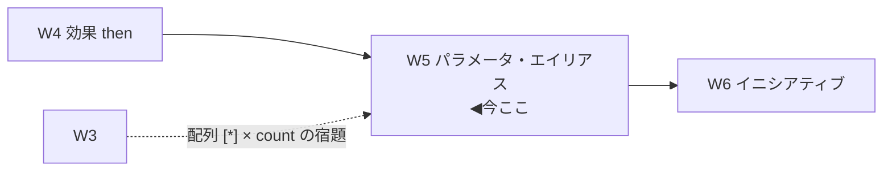
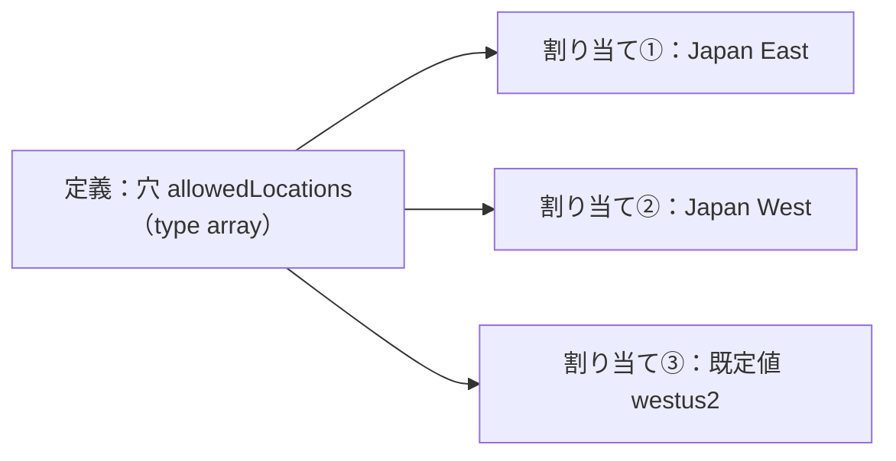
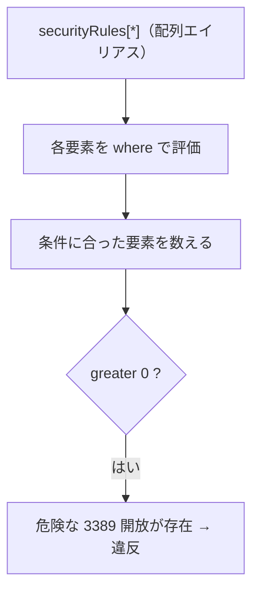

# Week 5 — パラメータとエイリアス：定義を「使い回す穴」と「深いプロパティを指す別名」

> **Phase 1e** | 学習プラン Week 5 / 10
> 学習目標：W1〜W4 に何度も顔を出した **`parameters`（パラメータ）**と **エイリアス（alias）**を回収する。パラメータの `type`/`allowedValues`/`defaultValue`/`metadata`(`strongType`/`assignPermissions`)、割り当て時に値を差し込む仕組み、そして「共通 `field` で届かない深いプロパティ」を指すエイリアスの正体と**探し方**（VS Code 拡張／`az provider show`／`Get-AzPolicyAlias`）。最後に W3 で保留した **`[*]` 配列エイリアス × `count`** を正式に回収する。

---

## 0. 今週の位置づけ

ここまで、条件（W3）と効果（W4）に **`[parameters('allowedLocations')]`** や **`sku.name`・`supportsHttpsTrafficOnly`** のような表現が何度も出た。今週はこの 2 つ——**割り当て時に値を差し込む「穴」＝パラメータ**と、**リソースの深いプロパティを指す「別名」＝エイリアス**——を正面から扱う。



---

## 1. パラメータの正体 —「フォームの空欄」

公式のたとえが分かりやすい。パラメータは**申込用紙の空欄（name / address / city …）**のようなもの。**欄（構造）は同じで、書き込む値だけが人によって変わる**。定義に空欄を用意しておけば、**1 つの定義を割り当てごとに違う値で使い回せる**。

> W1 の「許可される場所」を、東京チームには `Japan East`、大阪チームには `Japan West` で割り当てる——**定義は 1 個、割り当てで値だけ変える**。これがパラメータの狙い。

---

## 2. パラメータのプロパティ

パラメータ定義の主な項目（出典：[パラメータ構造](https://learn.microsoft.com/en-us/azure/governance/policy/concepts/definition-structure-parameters)）。

| プロパティ | 役割 |
| --- | --- |
| `name` | パラメータ名。ルール内で `[parameters('name')]` として参照 |
| `type` | 型（下表） |
| `metadata.description` | 説明（受け入れ可能な値の例など） |
| `metadata.displayName` | Portal に表示される名前 |
| `metadata.strongType` | Portal で**文脈に応じた選択肢**を出す（§4） |
| `metadata.assignPermissions` | 割り当て時に**ロール割り当てを自動作成**（§4 補足） |
| `defaultValue` | 値が指定されないときの既定値 |
| `allowedValues` | 割り当て時に**選べる値の候補**（配列） |
| `schema` | `object` 型の入力を**JSON スキーマで検証**（object 型のみ） |

`type` に使える値：

| type | 例 |
| --- | --- |
| `string` | `"Japan East"` |
| `array` | `["eastus2","westus2"]` |
| `object` | `{ "matchLabels": {...} }` |
| `boolean` | `true` / `false` |
| `integer` | `3` |
| `float` | `1.5` |
| `dateTime` | ISO 8601（`yyyy-MM-ddTHH:mm:ss.fffffffZ`） |

W1 の「許可される場所」のパラメータを再読する（`allowedValues` と `strongType` 付きの拡張版）。

```json
"parameters": {
  "allowedLocations": {
    "type": "array",
    "metadata": {
      "description": "The list of allowed locations for resources.",
      "displayName": "Allowed locations",
      "strongType": "location"
    },
    "defaultValue": [ "westus2" ],
    "allowedValues": [ "eastus2", "westus2", "westus" ]
  }
}
```

> **用語補足：`allowedValues` の大文字小文字**
> 公式によると、割り当て時の値選択は `allowedValues` と**大文字小文字まで一致**する必要がある（`allowedValues` に `Dev` とあれば割り当てでも `Dev`）。ただし**選んだ後の評価**は、使う条件（§W3 の `equals` 等）が大文字小文字を区別しないので、タグ値 `dev` も `Dev` と一致し得る。「候補選択は厳密・評価は演算子次第」。

---

## 3. 値の差し込みと参照

### 3-1. ルール内での参照

パラメータは `parameters()` 関数で参照する。W1 で見たあの形。

```json
{ "field": "location", "in": "[parameters('allowedLocations')]" }
```

### 3-2. 割り当て時に値を渡す

`defaultValue` があれば省略でき、無ければ割り当て時に必ず値を指定する。`allowedValues` があれば候補から選ぶ。この「割り当てで値を確定する」操作の詳細は **W7**（割り当て）で扱う。



### 3-3. パラメータの追加・削除の制約

- **追加**：割り当て済み定義にも足せるが、**`defaultValue` 必須**（既存割り当てが壊れないように）。
- **削除**：**できない**（そのパラメータに値を設定している割り当ての参照が壊れるため）。組み込みは `metadata.deprecated: true` で Portal から隠す。カスタムでは「複製して作り直す」のが手。

---

## 4. `strongType` と `assignPermissions`

### 4-1. `strongType`

`metadata.strongType` を付けると、**Portal の割り当て画面で"文脈に応じた選択リスト"**が出る（生の文字列入力でなく、実在のリージョンや型から選べる）。

指定できる値は「リソース型（`<Provider>/<Type>`）」または次の非リソース型：

| strongType | 出る選択肢 |
| --- | --- |
| `location` | リージョン一覧 |
| `resourceTypes` | リソース型一覧 |
| `storageSkus` | ストレージ SKU 一覧 |
| `vmSKUs` | VM サイズ一覧 |
| `existingResourceGroups` | 既存 RG 一覧 |

例：`"strongType": "location"` なら、`allowedLocations` の割り当て時に**リージョンをドロップダウンで複数選択**できる。

### 4-2. `assignPermissions`（注意して使う）

`metadata.assignPermissions: true` にすると、**割り当て時に Portal がロール割り当てを自動作成**する（そのパラメータ値が指すリソース/スコープに対して）。割り当てスコープ外に権限を与えたいときに使うが、**権限が自動で付与される**ため影響を理解して使う。

> **用語補足：`strongType` は"入力補助"、機能挙動は変えない**
> `strongType` は **Portal の UX（入力体験）を良くするだけ**で、ポリシーの評価ロジックそのものは変えない。付けなくても動くが、割り当てる人が値を間違えにくくなる。`allowedValues`（候補を固定）と併用するとさらに堅い。

---

## 5. エイリアスの正体 —「深いプロパティを指す別名」

W3 で「共通 `field`（`name`/`location`/`type`/`tags`…）で届かないプロパティはエイリアスで指す」と予告した。その正体を掘る。

公式定義：**エイリアスは、あるリソース型の"特定プロパティ"にアクセスするための別名。各エイリアスは、リソース型の API バージョンごとのプロパティパスにマップされる。** 評価時、ポリシーエンジンがその API バージョンのパスを解決する。

> **なぜ必要か**：`location` や `tags` は"どのリソースにもある共通項"なので専用 field がある。だが「ストレージが HTTPS のみ許可か」「VM の OS ディスク暗号化」のような**リソース型ごとに固有の深いプロパティ**には共通 field が無い。しかも同じプロパティでも **API バージョンによってパスが違う**ことがある。この差を吸収して「1 つの安定した名前」で指せるようにしたのがエイリアス。

### 命名規則

`<Provider>/<Type>/<プロパティパス>` の形。例：

| エイリアス | 指すもの |
| --- | --- |
| `Microsoft.Storage/storageAccounts/supportsHttpsTrafficOnly` | HTTPS のみ許可の真偽 |
| `Microsoft.Compute/virtualMachines/sku.name` | VM の SKU 名 |
| `Microsoft.Storage/storageAccounts/allowBlobPublicAccess` | Blob 公開アクセス可否 |

`field` に共通 field と同じ書き方で置ける：

```json
{ "field": "Microsoft.Storage/storageAccounts/supportsHttpsTrafficOnly", "equals": "true" }
```

---

## 6. エイリアスの探し方

エイリアス一覧は増え続けるので**丸暗記せず、都度調べる**のが正道。公式が挙げる方法。

| 方法 | コマンド / 手段 |
| --- | --- |
| **VS Code 拡張（推奨）** | Azure Policy 拡張。プロパティにホバーするとエイリアス名を表示 |
| **Azure CLI** | `az provider show --namespace Microsoft.Compute --expand "resourceTypes/aliases" --query "resourceTypes[].aliases[].name"` |
| **Azure PowerShell** | `(Get-AzPolicyAlias -NamespaceMatch 'compute').Aliases` |
| **REST API** | `GET .../providers/?api-version=2019-10-01&$expand=resourceTypes/aliases` |

> **コマンドの読み方（az provider show）**
> - `provider show`＝リソースプロバイダー（RP、W4）の情報を表示。
> - `--namespace Microsoft.Compute`＝対象の名前空間（ここでは Compute＝VM 系）。
> - `--expand "resourceTypes/aliases"`＝通常は省略される**エイリアス情報まで展開**して取得。
> - `--query "resourceTypes[].aliases[].name"`＝結果 JSON から**エイリアス名だけ**を抜き出す（`[]` は配列を全走査、W3 の `[*]` と似た JMESPath 記法）。

> **`modify` で使えるエイリアスだけ絞る**（W4）：`Get-AzPolicyAlias | Select-Object -ExpandProperty 'Aliases' | Where-Object { $_.DefaultMetadata.Attributes -eq 'Modifiable' }`。**Modifiable（変更可能）**属性のエイリアスだけが `modify` の対象になる。

---

## 7. 配列エイリアス `[*]` × `count` の回収（W3 の宿題）

エイリアスには、**通常版**と **`[*]` 付き（配列エイリアス）**の 2 種があるものがある。公式例：

- `Microsoft.Storage/storageAccounts/networkAcls.ipRules` … **通常版**（配列全体を 1 つの値として、完全一致比較に使う）
- `Microsoft.Storage/storageAccounts/networkAcls.ipRules[*]` … **配列エイリアス**（配列の**各要素**を選ぶ）

| エイリアス | 選ばれる値 |
| --- | --- |
| `...ipRules[*]` | `ipRules` 配列の各要素 |
| `...ipRules[*].action` | 各要素の `action` プロパティの値 |

### 7-1. `[*]` を `field` 条件で使うと

配列エイリアスを `field` 条件に置くと、**各要素を個別に比較**し、要素間は論理 AND で束ねられる（W3 で触れた挙動）。

### 7-2. `[*]` を `count` で使うと（本命）

W3 の field count は、まさにこの配列エイリアスを数えていた。改めて NSG の例を読む。

```json
{
  "count": {
    "field": "Microsoft.Network/networkSecurityGroups/securityRules[*]",
    "where": {
      "allOf": [
        { "field": "...securityRules[*].direction", "equals": "Inbound" },
        { "field": "...securityRules[*].access", "equals": "Allow" },
        { "field": "...securityRules[*].destinationPortRange", "equals": "3389" }
      ]
    }
  },
  "greater": 0
}
```

「**受信 かつ 許可 かつ ポート 3389** の規則が 1 つ以上あるか」。`count.field` が `[*]`（配列エイリアス）、`where` が各要素に対する条件、外側の `greater: 0` が「そういう要素の個数 > 0」。公式は `[*]` × `count` でできることを次のように整理する。

- 配列の**サイズ**を調べる
- 全要素が / いずれかが / どの要素も〜でない（all / any / none）を判定
- **ちょうど n 個**が条件を満たすかを判定



> **通常版と `[*]` の使い分け**
> - **通常版**（`ipRules`）＝「配列**まるごと**が定義どおり完全一致か」。
> - **`[*]`**（`ipRules[*]`）＝「**要素ごと**に条件を当てる」。要素単位の検査や `count` はこちら。
> W3 §5 で「W5 で回収」と保留した `[*]`／`current()`／入れ子 count は、この配列エイリアスの上で動いていた、というのが答え。

---

## 8. まとめ実例 — 3 つを結び直す

**(A) 許可される場所（parameters + strongType）** … W1 の定義は「`array` 型 `allowedLocations` を `strongType: location` で用意し、`if` で `[parameters('allowedLocations')]` を参照」。定義は 1 個、割り当てで地域を選ぶ。

**(B) HTTPS 必須（エイリアス）**

```json
"if": {
  "allOf": [
    { "field": "type", "equals": "Microsoft.Storage/storageAccounts" },
    { "field": "Microsoft.Storage/storageAccounts/supportsHttpsTrafficOnly", "equals": "false" }
  ]
},
"then": { "effect": "deny" }
```

「ストレージ **かつ** HTTPS のみが無効」を拒否。共通 field では届かないので**エイリアス**で指す。

**(C) NSG に 3389 全開放が無いこと（`[*]` × count）** … §7 の例。配列エイリアス＋count で「危険な受信許可規則」を数える。

この 3 つで、**パラメータ（使い回し）・エイリアス（深いプロパティ）・配列エイリアス（要素の検査）**が一通りつながった。

---

## ハンズオン チェックリスト

- [ ] パラメータの主要プロパティ（`type`/`allowedValues`/`defaultValue`/`metadata`）を言えた
- [ ] `[parameters('name')]` でルールから参照する形を書けた
- [ ] パラメータは**削除不可**・追加時は **`defaultValue` 必須**という制約を理解した
- [ ] `strongType: location` が Portal でどう効くか説明できた
- [ ] エイリアスが「API バージョン差を吸収して深いプロパティを指す別名」だと説明できた
- [ ] `az provider show ... --expand "resourceTypes/aliases"` でエイリアス名を一覧した（または VS Code 拡張でホバー確認）
- [ ] 通常エイリアスと `[*]` 配列エイリアスの違い、`[*]` × `count` の意味を説明できた

---

## 自己チェック

週末にドキュメントを閉じて答えてみる。

1. **パラメータを使うと何が嬉しいか？ たとえで説明せよ。**
   - キーワード：**申込用紙の空欄**／欄は同じ・値だけ変える／**1 定義を割り当てごとに使い回す**
2. **`type` に使える値を 4 つ以上、`allowedValues` と `defaultValue` の役割を説明せよ。**
   - キーワード：string/array/object/boolean/integer/float/dateTime／allowedValues＝候補・defaultValue＝既定
3. **パラメータの削除ができないのはなぜか？ 追加時の必須条件は？**
   - キーワード：割り当ての参照が壊れる／追加は **`defaultValue` 必須**
4. **エイリアスとは何か？ なぜ共通 `field` では足りないのか？**
   - キーワード：リソース型固有の**深いプロパティ**への別名／**API バージョン差を吸収**／location/tags は共通だが HTTPS 設定等は型固有
5. **エイリアスの探し方を 2 つ挙げよ。`modify` 可能なものだけ絞るには？**
   - キーワード：VS Code 拡張／`az provider show --expand`／`Get-AzPolicyAlias`／**Modifiable** 属性で絞る
6. **通常エイリアスと `[*]` 配列エイリアスの違いは？ `[*]` × `count` で何ができる？**
   - キーワード：通常＝配列まるごと完全一致／`[*]`＝**要素ごと**に条件／count で size・all/any/none・ちょうど n

---

## 次週の予告（Week 6）

W5 までで、単体のポリシー定義（条件・効果・パラメータ・エイリアス）は一通り読み書きできる。W6 では、複数の定義を束ねる **イニシアティブ（policySet / ポリシーセット）**を扱う。`policyDefinitions` 配列と `policyDefinitionReferenceId`、`policyDefinitionGroups` による分類、**イニシアティブのパラメータを各ポリシーへ引き回す**仕組み、そして規制コンプライアンス系の**組み込みイニシアティブ**（Microsoft Cloud Security Benchmark 等）。「なぜ 1 個ずつでなく束ねて割り当てるのか」を理解する。
