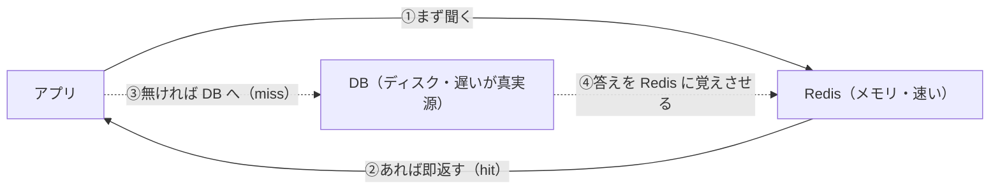
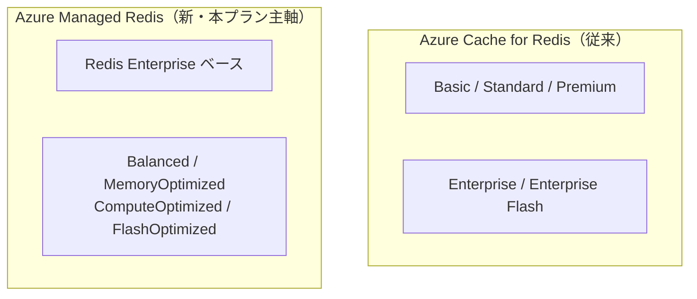

# Week 1 — なぜインメモリ・キャッシュか（設計思想）と最初の成功体験

> **Phase 1a** | 学習プラン Week 1 / 9
> 学習目標：Azure Managed Redis が「なぜ存在するのか」「DB に毎回問い合わせるのと何が違うのか」を自分の言葉で説明でき、実際にキャッシュを1つ作って `SET`/`GET` できる

---

## 0. 今週の位置づけ

この学習プランは **Azure Managed Redis（マネージド Redis）を主軸**に、要所で従来製品 **Azure Cache for Redis** と対比しながら進める。Week 1 は 2 つのことをやる。

1. **思想**：なぜインメモリのキャッシュが必要か、Redis が何者で、Azure の中でどんな立ち位置か
2. **手を動かす**：Managed Redis を 1 つ作って、キーを 1 つ `SET`／`GET` する（**数分で成功体験**）

> Storage アカウントは数秒で作れたが、**Managed Redis は作成に 5〜15 分**ほどかかる（裏でクラスタを組むため）。待っている間に §1〜§4 を読むとちょうどよい。

---

## 1. なぜ「毎回 DB に聞く」と困るのか

Web アプリの典型は「リクエストが来る → DB に問い合わせる → 結果を返す」。これだけだと、アクセスが増えたときに必ず詰まる。

| 素朴なやり方 | 何が起きるか |
|---|---|
| **毎回リレーショナル DB に問い合わせる** | 同じ問い合わせ（人気商品・ログイン中ユーザー情報など）が何千回も DB に飛ぶ。DB は計算・整合性が仕事なので、読み取り集中で CPU とディスクが先に飽和する |
| **DB をスケールアップして耐える** | 一番高価な部品（DB）を増強し続けることになり、コストが跳ね上がる。書き込みは1台に集約されがちで限界が早い |

つまり「**同じ答えを何度も返すだけの読み取り**」を、計算と整合性が仕事の DB に押し付けると、高い部品から先に壊れる。

> **初学者向け用語補足：レイテンシ（遅延）とメモリ階層**
> データの取り出しは「どこにあるか」で速さが桁違いに変わる。
>
> | 置き場所 | 取り出しの目安 | 特徴 |
> |---|---|---|
> | **メモリ（RAM）** | 数十マイクロ秒〜1ミリ秒 | 速いが電源が消えると揮発。容量あたり高価 |
> | **SSD / ディスク（DB の実体）** | 数〜数十ミリ秒 | 永続するが遅い。DB はここ |
> | **別リージョンの DB** | 数十〜数百ミリ秒 | ネットワーク往復が乗る |
>
> Redis は **メモリにデータを置く**。だから「DB に行けば数ミリ秒かかる答え」を、**サブミリ秒で返せる**。これが速さの正体。

---

## 2. 解決策：キャッシュ（手前に速い置き場を挟む）

DB の手前に「**よく使う答えを覚えておく速い箱**」を置く。これがキャッシュだ。



- **ヒット（hit）**：キャッシュに答えがある → DB に行かずサブミリ秒で返す
- **ミス（miss）**：キャッシュに無い → DB から取り、次回のために Redis に覚えさせる

この「**まずキャッシュ、無ければ DB→キャッシュに充填**」という型を **Cache-Aside** と呼ぶ（Week 3 で深掘り。Week 9 で実装する）。

> **重要な概念の区別：キャッシュは"真実源"ではない**
> Redis の中身は消えてもよい（揮発してもよい）。**真実源（source of truth）は DB**で、Redis はその写しを一時的に持つだけ。だから「Redis が落ちる＝データ消失」ではなく、「Redis が落ちる＝一時的に DB が重くなる」だけで済む設計にするのが定石。

---

## 3. Redis とは何者か

**Redis = REmote DIctionary Server**。ネットワーク越しに使える、超高速な「キー → 値」のインメモリ・データストア。

- **キー・バリュー**：`item:42` というキーに、文字列やハッシュ（オブジェクト）などの値を結びつけて持つ（データ型は Week 2）
- **インメモリ**：データを RAM に置くから速い
- **単なるキャッシュ以上**：TTL（有効期限）、アトミックなカウンタ、Pub/Sub、分散ロック、レート制限など、土台部品としても使える（Week 8）

> **初学者向け用語補足：「ディクショナリ（辞書）」**
> プログラミングの辞書型（Python の `dict`、JS の `Map`）と同じ発想。「キーを言えば値が返る」構造を、**1台のプロセス内ではなくネットワーク越しに、多数のアプリから共有して**使えるようにしたのが Redis。

---

## 4. Azure Managed Redis の立ち位置と、従来製品との違い

Azure で Redis を使うマネージドサービスには 2 系統ある。



| 観点 | Azure Cache for Redis（従来） | **Azure Managed Redis（新）** |
|---|---|---|
| リソース種別 | `Microsoft.Cache/redis` | `Microsoft.Cache/redisEnterprise` |
| 階層 | Basic/Standard/Premium（family C/P）+ Enterprise | **Balanced / MemoryOptimized / ComputeOptimized / FlashOptimized** |
| 中身 | オープンソース Redis | **Redis Enterprise**（高可用・モジュール対応） |
| 既定ポート | 6380（TLS） | **10000（TLS）** |
| 位置づけ | 長年の実績・情報が豊富 | **後継として推奨**。性能・コスト効率・機能が強化 |

> **重要な概念の区別：「マネージド」とは何を肩代わりしてくれるのか**
> 自前で Redis サーバを VM に立てると、パッチ・冗長化・フェイルオーバー・監視・スケールを全部自分で見ることになる。**Managed Redis はそれらを Azure が肩代わり**し、こちらは「キャッシュを作る・接続する・使う」に集中できる。APIM・Storage で学んだ「マネージドサービスの旨み」と同じ構図。

本プランは新しい **Managed Redis** を使うが、世の中の情報・既存システムは Cache for Redis が多いので、要所で対比する。移行は Week 8 で扱う。

---

## 5. 最初の成功体験：キャッシュを作って SET / GET する

### 5-1. リソースを作る（Portal でも CLI でも）

CLI 例（Managed Redis ＝ redisenterprise）：

```bash
# リソースグループ
az group create -n rg-redis-learn -l japaneast

# Managed Redis クラスタ（学習用最小の Balanced_B0）
az redisenterprise create \
  -g rg-redis-learn -n redis-learn-<一意な文字列> \
  -l japaneast --sku Balanced_B0

# 既定データベース（TLS必須・ポート10000）は作成時に併せて構成される
```

> ⚠️ **公式の重要注意**：作成には数分〜15分かかる。名前はリージョン内で一意にする。学習が終わったら `az group delete -n rg-redis-learn` で**まるごと削除**して課金を止めること。

### 5-2. つないで SET / GET する

最短は `redis-cli`（TLS・ポート10000）。アクセスキーは Portal の「Access keys」から取得できる（キーレス認証は Week 7）。

```bash
redis-cli -h <name>.<region>.redis.azure.net -p 10000 --tls -a <access-key>

> SET item:42 "Coffee"     # キー item:42 に文字列を入れる
OK
> GET item:42              # 取り出す
"Coffee"
> SET session:abc "tako" EX 60   # 60秒で自動消滅（TTL）… Week 3
OK
> TTL session:abc          # 残り秒数を見る
(integer) 60
```

これで「メモリ上のキー・バリューに、サブミリ秒で読み書きできた」という成功体験が得られた。`EX 60` の **TTL（有効期限）** が、キャッシュを陳腐化させない要（Week 3）。

---

## ハンズオン チェックリスト

- [ ] リソースグループと Managed Redis（`Balanced_B0`）を作成できた
- [ ] `redis-cli`（TLS・ポート 10000）で接続できた
- [ ] `SET` / `GET` でキーを 1 つ読み書きできた
- [ ] `SET ... EX 60` と `TTL` で有効期限の挙動を確認できた
- [ ] 「真実源は DB、Redis は写し」を自分の言葉で説明できる
- [ ] 学習後にリソースグループを削除して課金を止めた

---

## 自己チェック

1. **なぜ「毎回 DB に問い合わせる」設計は高負荷時に詰まるのか？**
   - キーワード：読み取り集中／DB は計算・整合性が仕事／高い部品から飽和
2. **キャッシュの hit と miss はそれぞれ何が起きるか？**
   - キーワード：hit＝即返す／miss＝DBから取得して充填／Cache-Aside
3. **「Redis が落ちてもデータは消えない」と言える設計上の理由は？**
   - キーワード：真実源は DB／Redis は写し／一時的に DB が重くなるだけ
4. **Azure Managed Redis と Azure Cache for Redis の違いを3点挙げよ。**
   - キーワード：redisEnterprise／階層名（Balanced等）／ポート10000／Redis Enterprise ベース
5. **Redis が DB より速いのはなぜか？**
   - キーワード：インメモリ（RAM）／メモリ階層／サブミリ秒

---

## 次週の予告（Week 2）

- 文字列だけじゃない：**String / Hash / List / Set / Sorted Set / Stream** の使い分け
- 「いつどのデータ型を選ぶか」の判断軸
- TTL・有効期限の基本コマンドと、Python（redis-py）からの操作
