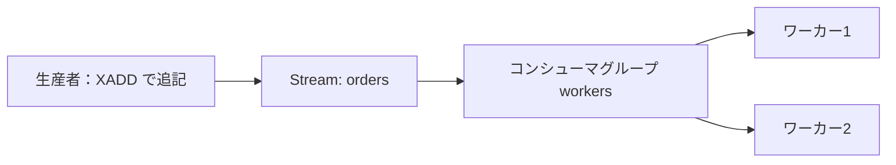

# Week 2 — データ構造とコマンドの基礎

> **Phase 1b** | 学習プラン Week 2 / 9
> 学習目標：Redis の主要データ型（String/Hash/List/Set/Sorted Set/Stream）が「何のためにあるか」を説明でき、用途に応じて型を選び、TTL を含む基本コマンドを `redis-cli` と Python から使える

---

## 0. 今週の位置づけ

Week 1 では `SET`/`GET` で文字列を 1 つ扱った。だが Redis の強みは「**値が単なる文字列ではなく、用途に合った構造を持てる**」こと。今週は 6 つの代表的データ型を、**「どんな問題を解くために選ぶか」**の視点で押さえる。

> **重要な概念の区別：Redis は"型付きの値"を持つ**
> 多くのキャッシュは「キー → バイト列」しか持てない。Redis は「キー → ハッシュ（オブジェクト）」「キー → ランキング表」のように、**サーバ側で構造を理解した操作**ができる。だから「ハッシュの1フィールドだけ更新」「ランキングに1票足して順位を取る」がアトミックに 1 コマンドで済む。

---

## 1. String — 最も基本の値

- 用途：キャッシュ値（JSON 文字列）、カウンタ、フラグ、トークン
- 数値として**アトミックに増減**できるのが地味に強い（在庫・PV カウントなど）

> **初学者向け用語補足：カウンタ（counter）**
> 「数を1つ覚えておいて、増やしたり減らしたりする入れ物」。日本語の「数取り器（カウンター）」と同じ。
> - **PV カウント**：ページが見られるたびに +1
> - **在庫**：売れたら -1、入荷で +N
> - **残り回数**：API を叩くたびに -1（レート制限・Week 8）
> - **「いいね」数**：押されたら +1
>
> Redis は値を「数字の文字列」として持ち、`INCR`（+1）/`INCRBY`（+N）/`DECR`（-1）で増減する。「`GET` して +1 して `SET` で書き戻す」を**自分で組まずに 1 コマンドで**できるのが利点。

> **コマンドの読み方**：`SET`=値を入れる／`GET`=値を取り出す（消えない・覗くだけ）／`INCR`=INCRement＝+1／`INCRBY`=指定数だけ加算／`DECR`=DECrement＝-1。`SET ... EX 60` の `EX`=EXpire＝60秒で有効期限（§7）。

```bash
SET item:42 '{"name":"Coffee","price":380}'   # JSON をそのまま入れる（Cache-Aside の典型）
GET item:42

SET pv:home 0
INCR pv:home        # 1
INCRBY pv:home 10   # 11（複数クライアントが同時に叩いても壊れない＝アトミック）
```

> **初学者向け用語補足：アトミック（不可分）**
> 「途中の状態が他から見えない・割り込まれない」性質。語源は「これ以上分けられない原子（atom）」。
>
> なぜ重要かは、`INCR` を**使わずに**手動で増やす「やってはいけない例」を見ると分かる：
>
> ```text
>   ① GET pv     → 100 を読む
>   ② +1 して 101 を作る
>   ③ SET pv 101 → 書き戻す
> ```
>
> この①②③のすき間に別リクエストが割り込むと取りこぼす：
>
> ```text
>   A: ① GET → 100
>   B: ① GET → 100     ← A がまだ書く前に同じ 100 を読む
>   A: ③ SET → 101
>   B: ③ SET → 101     ← 本当は 102 のはずが、A の +1 が消えた！
> ```
>
> 2回押したのに 1 しか増えない（**更新の取りこぼし＝lost update**）。
> 一方 `INCR pv` は「読んで +1 して書く」を**1つの分けられない操作**として Redis 側で行うので、何千クライアントが同時に叩いても合計が必ず正しくなる。これが「アトミックだから安全」の意味。

---

## 2. Hash — オブジェクトを1キーに

- 用途：1エンティティの複数フィールド（ユーザープロフィール、商品属性）
- フィールド単位で読み書きできるので、**全体を読み直さずに一部だけ更新**できる

> **初学者向け用語補足：エンティティとフィールド**
> - **エンティティ（entity）＝「1つのモノ・人」**（例：ユーザー田中さん 1 人、商品1件）
> - **フィールド（field）＝「そのモノが持つ項目（属性）」**（例：名前・年齢・プラン）
>
> 「会員カード1枚」のたとえ：
>
> ```text
>   ┌──────────────────────────────┐
>   │ 会員カード（＝エンティティ：1人のユーザー）│
>   │   name  : Tanaka   ← フィールド          │
>   │   age   : 30       ← フィールド          │
>   │   plan  : pro      ← フィールド          │
>   └──────────────────────────────┘
> ```
>
> 「1エンティティの複数フィールド」＝**1人のユーザーが持つ名前・年齢・プランなど複数の項目**のこと。Excel でいえば **1行＝エンティティ／列＝フィールド**。
> Redis の Hash は、この「カード1枚」を**まるごと1キー**（`user:1`）に入れ、`HGET user:1 plan` で**1項目だけ**読んだり `HINCRBY user:1 age 1` で**1項目だけ**更新できる。String に JSON を丸ごと入れると毎回カード全体を読み書きする必要がある——この差が下の比較表につながる。

> **コマンドの読み方**：先頭の `H`＝Hash。`HSET`=フィールドに値を入れる／`HGET`=1フィールドを取り出す（消えない）／`HINCRBY`=1フィールドを指定数だけ加算／`HGETALL`=GET ALL＝全フィールドを取り出す。String 版（`SET`/`GET`/`INCRBY`）の「フィールド単位」版、と捉える。

```bash
HSET user:1 name "Tanaka" age 30 plan "pro"
HGET user:1 plan          # "pro"
HINCRBY user:1 age 1      # 31（1フィールドだけアトミックに+1）
HGETALL user:1            # 全フィールド
```

| String に JSON を入れる | Hash を使う |
|---|---|
| 一部更新でも全体を読み書き | フィールド単位で更新できる |
| クライアントで JSON 解析が必要 | サーバ側でフィールド操作 |

> **具体例：同じ田中さんを2通りで持つと、触り方がこう変わる**
> ```bash
> # 方式A：String に JSON を丸ごと
> SET  user:1 '{"name":"Tanaka","age":30,"plan":"pro"}'
> # 方式B：Hash でフィールドに分ける
> HSET user:1 name "Tanaka" age 30 plan "pro"
> ```
>
> **「年齢だけ 30→31」にしたいとき：**
> - 方式A：Redis は中身を**ただの文字列**としか見ないので、年齢だけ直すコマンドが無い。
>   `GET`で丸ごと取得 → アプリで JSON を分解 → age を直す → `SET`で丸ごと書き戻す（**全体往復**・割り込みで取りこぼしの恐れ）。
> - 方式B：`HINCRBY user:1 age 1` の**1コマンド**。年齢フィールドだけアトミックに +1、他は触らない。
>
> **「プランだけ知りたいとき」：**
> - 方式A：`GET user:1` で**全フィールドが届き**、アプリで JSON を解析（parse）して `.plan` を取り出す。
> - 方式B：`HGET user:1 plan` で `"pro"` **だけ**届く（name も age も運ばれない）。
>
> 要は、Redis が中身を「文字列」と見るか「フィールドの集まり」と見るかの差。
> **一部だけ頻繁に触る**なら Hash、**いつも全部まとめて読む**だけなら String/JSON でも困らない。

---

## 3. List — 順序つきの並び（両端キュー）

- 用途：最新N件（タイムライン）、ジョブキュー、ログバッファ
- 両端への push/pop が速い。`LPUSH`+`RPOP` でキュー、`LPUSH`+`LRANGE` で最新一覧

> **コマンドの読み方**：`L`=Left（左端＝先頭）/`R`=Right（右端＝末尾）、`PUSH`=入れる、`POP`=取り出す（取ると消える）、`RANGE`=範囲を覗く（消えない）。
> List は「一列に並んだ箱」で、その**両端から出し入れ**できる、とイメージする。

`LPUSH` で左から積むと、新しいものが先頭に来る：

```text
LPUSH timeline:1 "post-100"      [ 100 ]
LPUSH timeline:1 "post-101"      [ 101 | 100 ]
LPUSH timeline:1 "post-102"      [ 102 | 101 | 100 ]
                                   ↑左(新)        ↑右(古)
```

**用途1：最新一覧（タイムライン）= LPUSH + LRANGE**（左から N 件覗く＝新しい順。リストは減らない）

```text
LRANGE timeline:1 0 1   →  [ 102, 101 ]   # 最新2件を覗くだけ
```

**用途2：ジョブキュー = LPUSH + RPOP**（左から入れ、右＝一番古い端から取り出す＝先入れ先出し FIFO）

```text
LPUSH jobs "A"   [ A ]
LPUSH jobs "B"   [ B | A ]
RPOP  jobs  → "A"   （一番古い右端を取り出して消す）[ B ]
```

> たとえ：ラーメン屋の整理券。来た人を列の左に足し（`LPUSH`）、店員は右端＝一番先に来た人から呼ぶ（`RPOP`）。

**用途3：ログバッファ = LPUSH + LTRIM**（積み続けると無限に伸びるので、最新N件だけ残す）

```bash
LPUSH applog "line..."   # 新ログを左に積む
LTRIM applog 0 99        # 0〜99番目（最新100件）だけ残し古いものを捨てる（メモリ管理・Week 4）
```

> **初学者向け用語補足：キュー（queue）／FIFO／push・pop**
> - **キュー**＝順番待ちの行列。先に並んだものから処理＝**FIFO（First In, First Out／先入れ先出し）**。
> - **push**＝列に入れる、**pop**＝列から取り出す（**取ると消える**）。`LRANGE` の「覗くだけ（消えない）」とは別物。
> - List は**両端**で push/pop できるので、入れる端と出す端の組み合わせでキューにも最新一覧にもなる。

---

## 4. Set — 重複なしの集合

- 用途：タグ、ユニーク訪問者、フォロー関係、「いいね」した人
- 和・積・差集合をサーバ側で計算できる

Set は「**重複を許さない・順番のない入れ物**」。同じものを何度入れても1個になる。

> **コマンドの読み方**：先頭の `S`＝Set。`SADD`=ADD＝要素を足す（重複は無視）／`SCARD`=CARDinality＝要素数（ユニーク数）／`SISMEMBER`=IS MEMBER＝含まれるか（1/0）／`SINTER`=INTERsection＝積（共通）／`SUNION`=UNION＝和（どちらか）／`SDIFF`=DIFFerence＝差（片方だけ）。

```text
SADD online "u1"        { u1 }
SADD online "u2"        { u1, u2 }
SADD online "u1"        { u1, u2 }   ← もう居るので無視（重複しない）
SCARD online            → 2          ← 要素数＝ユニークな人数
```

**用途別の例：**

```bash
# ① タグ：付いているかを即答（SISMEMBER）
SADD tags:42 "drink" "hot"
SISMEMBER tags:42 "hot"          # 1（含まれる）

# ② ユニーク訪問者：同じ人が何回来ても1人
SADD visitors:2026-06-25 "user-1"
SADD visitors:2026-06-25 "user-1"  # 2回来ても無視
SCARD visitors:2026-06-25          # その日のユニークユーザー数

# ④「いいね」：誰が押したか・何人か
SADD likes:post-100 "alice" "bob"
SCARD likes:post-100             # いいね数
SISMEMBER likes:post-100 "alice" # alice は押した？(1/0)
```

**③ フォロー関係＋集合演算（和・積・差）：** 2つの集合を掛け合わせて答えを出す。

```text
followers:alice = { u1, u2, u3 }     # alice のフォロワー
followers:bob   = { u2, u3, u4 }     # bob のフォロワー

SINTER followers:alice followers:bob  → { u2, u3 }      # 積＝両方に居る（共通のフォロワー）
SUNION followers:alice followers:bob  → { u1,u2,u3,u4 } # 和＝どちらかに居る（重複は1つに）
SDIFF  followers:alice followers:bob  → { u1 }          # 差＝alice だけ・bob にはいない
```

ベン図で見ると：

```text
     followers:alice        followers:bob
        ┌────────┐      ┌────────┐
        │  u1    │ u2,u3 │   u4   │
        │ (差)   │ (積) │  (差)   │
        └────────┘      └────────┘
        └──────── 和(全部) ───────┘
```

> **「サーバ側で計算できる」の意味**：u1〜u4 を**アプリに全部ダウンロードして突き合わせる**必要がない。`SINTER` 1コマンドで **Redis が中で計算して答えだけ返す**。データが何万件でも、ネットワークに流れるのは結果だけ＝速い・軽い。

> **初学者向け用語補足：集合（set）と和・積・差**
> - **集合**＝重複のない要素の集まり（順番は気にしない）。「居る／居ない」だけを持つ。
> - **積集合（AND・共通）**＝両方にあるもの → `SINTER`（例：共通のフォロワー）
> - **和集合（OR・合算）**＝どちらかにあるもの → `SUNION`（例：どちらかをフォロー）
> - **差集合（引き算）**＝A にあって B にないもの → `SDIFF`（例：A だけがフォロー）
> 数えるなら `SCARD`（要素数＝ユニーク数）、含まれるか確かめるなら `SISMEMBER`。

---

## 5. Sorted Set（ZSet）— スコア付きの順位表

- 用途：**ランキング/リーダーボード**、優先度キュー、時系列インデックス
- 各メンバーに **score** を持ち、score 順で並ぶ。順位取得・範囲取得が速い（Week 8 で応用）

Sorted Set ＝ **Set（重複なし）＋ 各メンバーに score（点数）を付け、score 順に自動整列**する入れ物。

> **コマンドの読み方**：先頭の `Z`＝Sorted Set（ZSet）。`ADD`=追加／`INCRBY`=score を加算／`RANGE`=範囲取得（覗くだけ）／`RANK`=順位／`POPMIN`=最小 score を取り出す（消える）。`REV`＝REVerse＝高い順（付けないと低い順）、`BYSCORE`＝score の範囲で。例：`ZREVRANGE`＝Z の、高い順に、範囲取得。

```text
ZADD leaderboard 100 "alice"     alice(100)
ZADD leaderboard  80 "bob"       bob(80), alice(100)          ← score 順に内部整列
ZADD leaderboard 120 "carol"     bob(80), alice(100), carol(120)
```

- **メンバー**＝並べたい対象（重複しない）／**score**＝並び順を決める数値
- 入れた瞬間に整列済みなので「上位N件」「○○の順位」が**その場で**返る（アプリ側で並べ替え不要）

**用途① ランキング／リーダーボード**（`REV`=Reverse＝高い順）

```bash
ZINCRBY leaderboard 30 "bob"          # bob のスコアに +30（アトミック）
ZREVRANGE leaderboard 0 2 WITHSCORES  # 上位3名をスコア付き → carol,bob,alice
ZREVRANK leaderboard "bob"            # bob は今何位？（0始まり）
```

**用途② 優先度キュー**（score＝優先度。List のキューは先着順、こちらは優先度順）

```bash
ZADD tasks 5 "send-email"     # 優先度5
ZADD tasks 1 "urgent-alert"   # 優先度1（小さいほど先に処理する設計）
ZPOPMIN tasks                 # 最小 score（=最優先）を取り出す → "urgent-alert"
```

**用途③ 時系列インデックス**（score＝UNIXタイムスタンプ＝時刻を数値化したもの）

```bash
ZADD events 1750000000 "login"
ZADD events 1750003600 "purchase"
ZRANGEBYSCORE events 1750000000 1750003600  # この時間帯のイベントを順に取得
```

> **初学者向け用語補足：Sorted Set（ZSet）と score／順位**
> - **Sorted Set**＝Set（重複なし）に **score（並び順を決める数値）** を足したもの。入れると score 順に**自動整列**。
> - **score の意味は用途で変わる**：点数（ランキング）／優先度（優先度キュー）／時刻（時系列）。
> - 主なコマンド：`ZADD`（追加）/`ZINCRBY`（score 加算）/`ZREVRANGE`（高い順に範囲取得）/`ZREVRANK`（順位）/`ZRANGEBYSCORE`（score 範囲で取得）/`ZPOPMIN`（最小 score を取り出す）。`REV` は Reverse＝高い順（付けなければ低い順）。
> - Set との最大の違いは「**並べ替えを Redis が常に肩代わりしてくれる**」こと。

---

## 6. Stream — 追記型のイベントログ

- 用途：イベントソーシング、メッセージング（コンシューマグループで分担処理）
- List より高機能なログ。各エントリに ID が付き、消費位置を管理できる

Stream ＝ **追記専用のイベント記録帳**。末尾に足すだけで過去は書き換えず、各イベントに ID が付く。

> **コマンドの読み方**：先頭の `X`＝Stream（X は eXtended のイメージ）。`XADD`=末尾に追記／`XLEN`=LENgth＝件数／`XRANGE`=範囲を読む（消えない・`-`＝最古、`+`＝最新）／`XGROUP CREATE`=コンシューマグループを作る／`XREADGROUP`=グループとして次の未処理を読む／`XACK`=ACKnowledge＝処理完了を通知。`XADD orders *` の `*`＝「ID は自動で付けて」。

```text
XADD orders * item 42 qty 2  → "1750000000000-0"   # ID は「ミリ秒時刻-連番」で自動付与
XADD orders * item 43 qty 1  → "1750000000005-0"

記録帳 orders:
  [1750000000000-0] item=42 qty=2
  [1750000000005-0] item=43 qty=1   ← 追記されるだけ（時間順に一意な ID で並ぶ）
```

```bash
XLEN orders            # 件数
XRANGE orders - +      # 最古(-)から最新(+)まで全件読む
```

**用途① イベントソーシング**：最終状態だけでなく「起きたこと」を順に全部残す。

```text
注文100 の履歴:  created → paid → shipped → delivered
```
> 「今は配達済み」だけでなく**経緯まるごと**を持つ。後から遡れる・再生して状態を作り直せる（監査ログ向き）。

**用途② メッセージング＋コンシューマグループ**：1つの Stream を複数ワーカーで分担し、「誰がどこまで処理したか」を Redis が管理する。



```bash
XGROUP CREATE orders workers 0                       # 処理グループを作る
XREADGROUP GROUP workers w1 COUNT 1 STREAMS orders > # w1 に「まだ誰も取ってない次の1件」を渡す
XACK orders workers <ID>                             # 「処理完了」を通知（消費位置が進む）
```

> **List のキュー（§3）との違い**：List の `RPOP` は「取ったら消える・1人取って終わり・進捗は残らない」。Stream は「**取っても記録は残る／複数グループが独立に読める／処理済み位置を管理／落ちたワーカーの未処理を再配布**」できる＝堅牢なメッセージキュー。

> **初学者向け用語補足：Stream の用語**
> - **エントリ**＝追記された1イベント。各エントリに **ID（時刻-連番）** が自動付与され、時間順に一意。
> - **追記専用（append-only）**＝末尾に足すだけ・過去は不変。「起きた順の事実」が壊れない。
> - **生産者／消費者**＝`XADD` で入れる側／`XREADGROUP` で読む側。
> - **コンシューマグループ**＝1 Stream を複数消費者で分担。二重配布せず、各自の進捗（消費位置）を Redis が管理。
> - **XACK（確認応答）**＝「処理し終えた」と知らせる操作。これで消費位置が進み、未 ACK は再配布対象として残る。

> 本プランでは「**List より堅牢で、複数ワーカーで取りこぼさず分担できるイベントログ**」と押さえれば十分（コンシューマグループの深掘りは将来テーマ）。

---

## 7. TTL（有効期限）— どの型にも効く

キャッシュの肝。キーに寿命を持たせ、自動で消す。

> **コマンドの読み方**：`TTL`＝Time To Live＝残り寿命（秒）。`EX`＝EXpire＝有効期限を秒で指定（`SET ... EX 60`）。`EXPIRE`＝既存キーに後付けで寿命を付ける。`PERSIST`＝寿命を外して無期限化（persist＝永続させる）。`TTL` の戻り値 `-1`＝無期限、`-2`＝キーが存在しない。

```bash
SET session:abc "tako" EX 60   # 60秒後に自動削除
TTL session:abc                # 残り秒数（-1=無期限, -2=存在しない）
EXPIRE item:42 30              # 既存キーに後付けで30秒
PERSIST session:abc           # TTL を外す（無期限化）
```

> **重要な概念の区別：TTL は"キャッシュの陳腐化対策"の最前線**
> 元データが変わってもキャッシュは自動更新されない。TTL を付けておけば「最長でも N 秒で消えて、次のミスで最新を取り直す」ので、陳腐化の上限を時間で縛れる（Week 3）。

---

## 8. 型の選び方（早見表）

| やりたいこと | 選ぶ型 | 代表コマンド |
|---|---|---|
| 値をまるごとキャッシュ | String（JSON） | `SET`/`GET` |
| カウント | String | `INCR` |
| オブジェクトの一部更新 | Hash | `HSET`/`HINCRBY` |
| 最新N件・キュー | List | `LPUSH`/`LRANGE` |
| 重複なし集合・タグ | Set | `SADD`/`SINTER` |
| ランキング | Sorted Set | `ZADD`/`ZREVRANGE` |
| イベントログ | Stream | `XADD`/`XRANGE` |

---

## 9. Python から触る（redis-py）

```python
import redis
r = redis.Redis(host="<host>", port=10000, ssl=True, password="<key>", decode_responses=True)

r.set("item:42", '{"name":"Coffee"}', ex=60)  # TTL付き
print(r.get("item:42"))
r.hset("user:1", mapping={"name": "Tanaka", "plan": "pro"})
r.zadd("leaderboard", {"alice": 100})
```

> 本番はアクセスキー（`password=`）ではなく Entra ID（キーレス）でつなぐ。それは Week 7、実装は Week 9。

---

## ハンズオン チェックリスト

- [ ] String で JSON キャッシュと `INCR` カウンタを作れた
- [ ] Hash でユーザーオブジェクトを作り、1フィールドだけ更新できた
- [ ] List で最新N件、Sorted Set でランキングを作れた
- [ ] `EX`/`TTL`/`EXPIRE` で有効期限の挙動を確認できた
- [ ] redis-py から同じ操作を Python でできた

---

## 自己チェック

1. **String に JSON を入れるのと Hash を使うのは、どう使い分けるか？**
   - キーワード：一部更新／フィールド単位／全体読み書きの回避
2. **`INCR` がアプリ側の「読んで足して書く」より優れる理由は？**
   - キーワード：アトミック／競合で壊れない／1コマンド
3. **ランキングを作るならどの型か。なぜか？**
   - キーワード：Sorted Set／score 順／順位取得が速い
4. **TTL がキャッシュ運用で重要なのはなぜか？**
   - キーワード：陳腐化の上限を時間で縛る／自動削除／次のミスで再取得
5. **List と Stream はどちらもログ的に使えるが、Stream の利点は？**
   - キーワード：エントリID／消費位置の管理／コンシューマグループ

---

## 次週の予告（Week 3）

- キャッシュの設計パターン：**Cache-Aside / Read-Through / Write-Through / Write-Behind**
- TTL 設計と**キャッシュスタンピード**（同時ミス殺到）対策
- 元データ更新時の**キャッシュ無効化**（Week 9 の実装に直結）
