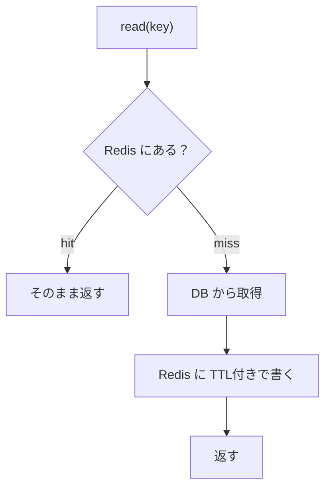
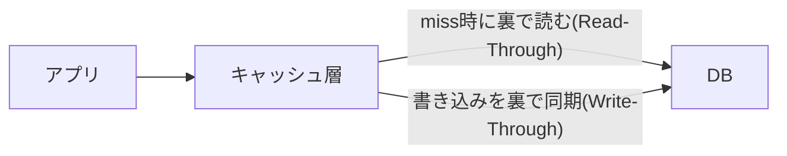
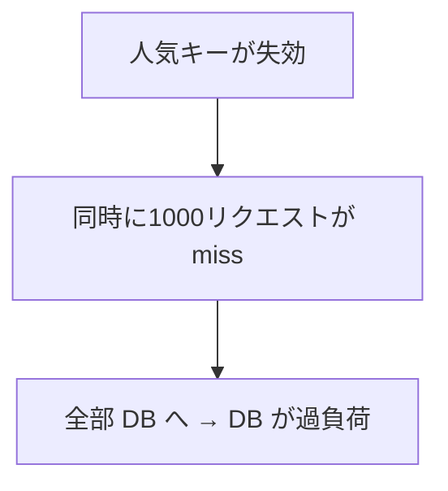
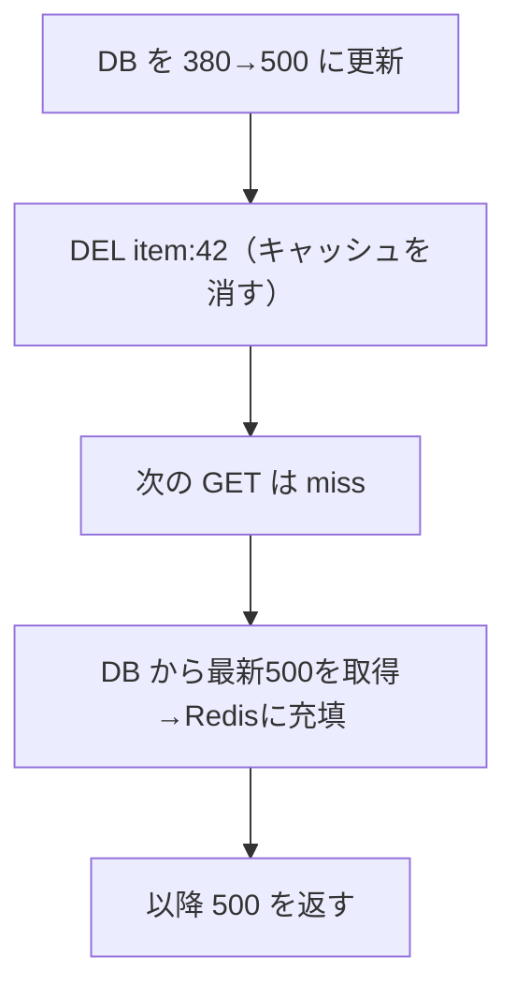

# Week 3 — キャッシュ戦略とパターン

> **Phase 1b** | 学習プラン Week 3 / 9
> 学習目標：Cache-Aside / Read-Through / Write-Through / Write-Behind の違いを説明でき、TTL 設計とキャッシュスタンピード対策・無効化の方針を選べる。これは Week 9 の実装の設計図になる

---

## 0. 今週の位置づけ

Week 1 で「キャッシュを手前に挟む」発想を、Week 2 で「型と TTL」を学んだ。今週は **「キャッシュと DB をどう連携させるか」** の設計パターンを整理する。ここが Week 9 の実装の核になる。

問題は常に同じ：**キャッシュと真実源（DB）の2つにデータがあると、ズレる（陳腐化する）**。各パターンは「読み書きの責務を誰が持つか」でズレ方を制御する。

> **初学者向け用語補足：陳腐化（staleness／stale）**
> キャッシュの中身が**古くなって真実源（DB）と食い違う**こと。「陳腐」＝古くて新鮮でない。英語ではキャッシュが **stale（古びた）** と言う。
> キャッシュは DB の**写し**（Week 1）なので、DB が更新されても**自動では追従しない**。その瞬間からズレる：
>
> ```text
>   T0:  DB price=380   Redis price=380   ← 一致（新鮮）
>   T1:  DB を 380→500 に更新
>        DB price=500   Redis price=380   ← ズレた！（Redis が陳腐化＝古い380を返す）
> ```
>
> 完全にゼロにはできないので、**TTL（最長 N 秒で自動失効・§4）** と **無効化（更新時に `DEL`・§6）** で「古さの度合い」を抑える。「**何秒までの古さなら許せるか**」を決めるのが TTL 設計。これが今週ずっと出てくるキーワード。

---

## 1. Cache-Aside（キャッシュアサイド／遅延読み込み）

最も基本で、本プランの実装で採用するパターン。**アプリがキャッシュと DB の両方を見る。**



- **読み取り**：まずキャッシュ → 無ければ DB → キャッシュに充填（lazy loading）
- **書き込み**：DB を更新し、**該当キャッシュを削除（無効化）**する。次の読みでミス→最新を再充填

> **初学者向け用語補足：遅延読み込み（lazy loading）とコールドスタート**
> - **遅延読み込み（lazy loading）**＝「**実際に要求されて初めて**キャッシュに載せる」やり方。事前に全部載せず、最初の miss のときに DB から取って充填する。だから「使われないデータはキャッシュを占めない」＝メモリ効率がよい。
> - **コールドスタート（cold start）**＝キャッシュが空の状態（＝冷えている）。立ち上げ直後やキャッシュ全消し後は、しばらく miss が続いて DB に負荷が寄る。逆に十分に温まった（hot）状態は hit が多い。

| 長所 | 短所 |
|---|---|
| 実装が素直・障害に強い（Redis 落ちても DB で動く） | 初回アクセスは必ず miss（コールドスタート） |
| 実際に使うデータだけ載る（メモリ効率） | 更新直後に無効化を忘れると陳腐化 |

> **重要な概念の区別：更新時は「更新」ではなく「削除」**
> キャッシュを"新しい値で上書き"したくなるが、定石は**削除（無効化）**。理由：上書きは「DB 更新とキャッシュ書き込みの順序」次第で競合し、古い値が残る事故が起きやすい。**消しておけば、次の読みで必ず最新を取り直す**ので安全。

---

## 2. Read-Through / Write-Through（キャッシュが DB を代理）

アプリはキャッシュだけを見る。キャッシュ層（ライブラリ/プロバイダ）が裏で DB を読み書きする。



- **Read-Through**：miss をキャッシュ層が肩代わりして DB から読む（アプリは miss を意識しない）
- **Write-Through**：書き込みをキャッシュと DB に**同時**反映。常に一致するが、書き込みが遅くなる

| Cache-Aside | Write-Through |
|---|---|
| アプリが両方を管理 | キャッシュ層が DB 同期を肩代わり |
| 更新は「無効化」 | 更新は「キャッシュ＋DB 同時書き込み」 |
| 障害に強い | 整合性が高いが書き込みレイテンシ増 |

---

## 3. Write-Behind（Write-Back／遅延書き込み）

書き込みはまずキャッシュにだけ行い、**少し遅れてまとめて DB に流す**。

- 長所：書き込みが超高速・DB への書き込み回数を削減（バッチ化）
- 短所：DB 反映前に Redis が落ちると**データ欠損**。整合性要件が低い用途向け（カウンタ集計など）

> **重要な概念の区別：どれを選ぶかは"何を犠牲にできるか"**
> - 整合性最優先・読み中心 → **Cache-Aside**（無効化で管理）
> - 常に一致させたい → **Write-Through**（書き込み遅延を許容）
> - 書き込みスループット最優先・多少の欠損許容 → **Write-Behind**
> 本プランは最も汎用で堅牢な **Cache-Aside** を実装する（Week 9）。

---

## 4. TTL 設計

TTL は「陳腐化の上限を時間で縛る」最前線（Week 2 §7）。

| TTL の長さ | hit 率 | 陳腐化リスク | 向く対象 |
|---|---|---|---|
| 短い（数秒〜数十秒） | 低め | 小 | 価格・在庫など変動が速いもの |
| 長い（数時間〜） | 高い | 大 | マスタ・設定など滅多に変わらないもの |

定石：**「変わりやすさ」と「古くても許せる度合い」で決める**。さらに**ジッター（揺らぎ）**を足して、大量キーの同時失効を防ぐ（次節）。

> **初学者向け用語補足：マスタ（マスタデータ／master data）**
> **めったに変わらない、土台になる基準データ**。「master＝大元・原本」から。業務システムの「台帳・基準表」にあたる。対になるのが**トランザクションデータ**（日々発生する取引）。
>
> | 種類 | 例 | 変化 |
> |---|---|---|
> | **マスタデータ** | 商品マスタ（商品名・定価）、社員一覧、都道府県一覧 | めったに変わらない |
> | **トランザクションデータ** | 注文、入出庫、ログイン履歴 | どんどん増える/変わる |
>
> レストランでいえば **マスタ＝メニュー表**（たまに改訂）、**トランザクション＝注文伝票**（次々発生）。
> マスタは変わりにくいので**長い TTL** で載せても陳腐化しにくく、hit 率を高く取れる。だから上の表で「長い TTL が向く対象」になっている。

---

## 5. キャッシュスタンピード（同時ミス殺到）

人気キーの TTL が切れた瞬間、**大量のリクエストが一斉に miss して DB に殺到**する現象（thundering herd）。



対策：

| 対策 | 内容 |
|---|---|
| **TTL にジッター** | 失効時刻をキーごとに少しずらし、一斉失効を防ぐ |
| **再計算ロック** | 最初の1リクエストだけが DB を引き、他は待つ（分散ロック・Week 8） |
| **事前リフレッシュ** | 失効前に裏でこっそり更新（early recompute） |

> **初学者向け用語補足：ジッター（jitter）と thundering herd**
> - **thundering herd（サンダリングハード／殺到する群れ）**＝合図と同時に大群が一斉に押し寄せる様子。ここでは「人気キーが失効した瞬間、待っていた大量リクエストが同時に DB へ殺到する」こと。
> - **ジッター（jitter＝揺らぎ・ばらつき）を足す**＝TTL に**わざと少しランダムな秒数を上乗せ**して、失効時刻をキーごとにバラけさせること。
>
> ```text
>   TTL 固定 60秒:          1000キーが同じ瞬間に失効 → 同時 miss で DB 殺到
>   TTL = 60 + random(0〜10):
>       キーA→63秒  キーB→67秒  キーC→61秒  … 失効がバラけ、miss が時間的に分散
> ```
>
> ```python
>   ttl = 60 + random.randint(0, 10)   # キーごとに 60〜70秒のどこか
>   r.set("item:42", value, ex=ttl)
> ```
>
> たとえ：信号が青で全車が一斉発進すると交差点が詰まる。発進を各車で少しずらせば流れる。ジッターは TTL でこの「少しずらす」をやること。

---

## 6. 無効化（Invalidation）

**無効化＝古くなったキャッシュをわざと消して『無効』にすること**。目的は1つ、**陳腐化（古い値が残る）を防ぐ**こと。「**2つの難問はキャッシュ無効化と命名**」と言われるほどここが要。

> **コマンドの読み方**：`DEL`＝DELete＝キーを削除（消える）。`SET ... EX 60`＝値を入れて 60 秒の有効期限（EX=EXpire・Week2 §7）。

### なぜ要るか：消さないと古い値を返し続ける

商品42の価格を 380→500 に変えた場面：

```text
【消さない】 DB:380→500 に更新しても Redis:item:42=380 のまま
            → GET は hit して 380 を返す（陳腐化・TTLが切れるまで続く）

【消す】     DB:380→500 に更新 → DEL item:42（無効化）
            → 次の GET は miss → DB から 500 を取得し Redis に充填
            → 以降 500 を返す（直る）
```



> Week 3 §1 の「**更新時は上書きでなく削除**」がここ。新しい値を書き直すのでなく**消すだけ**にすれば、次の読みが必ず DB から最新を取り直すので順序競合の事故が起きない。

### 消す範囲の3レベル

| レベル | やり方 | たとえ |
|---|---|---|
| **① 単一キー** | `DEL item:42`（Week 9 の `DELETE /api/items/{id}` がこれ） | 1冊の本を棚から抜く |
| **② 関連キーをまとめて** | 1更新で複数キャッシュが古くなる時。コロン区切りの命名規約（Week 4）で `user:1:*` を範囲指定して消す | 特定の人の本を棚ごと片付ける |
| **③ 広域無効化** | キー名にバージョンを埋め、番号を上げる（`item:v1:42`→`item:v2:42`）。旧キーは誰も読まなくなり TTL で自然消滅 | 棚の番号札を新しくし、古い棚は丸ごと使うのをやめる |

```text
② user:1:cart  ┐                 ③ 旧: item:v1:42, item:v1:43 …（放置でTTL消滅）
   user:1:summary ├ user:1:* を一括無効化     番号 v1→v2
   user:1:profile ┘                 新: item:v2:42, item:v2:43 …（以降こちら）
```

---

## 7. Week 9 実装への接続

本プランの実装（Week 9）の Items API は、この章の **Cache-Aside ＋ TTL ＋ 削除による無効化**をそのまま体現する。

- `GET /api/items/{id}`：hit ならそのまま、miss なら擬似DBから取得し `SET ... EX 60` で充填
- `DELETE /api/items/{id}`：`DEL` で無効化 → 次の GET は miss で再充填
- E2E テストで **miss → hit → 無効化 → 再 miss** を検証する

---

## ハンズオン チェックリスト

- [ ] `redis-cli` で Cache-Aside を手動再現（miss→`SET EX`→hit→`DEL`→再 miss）できた
- [ ] TTL を変えて hit 率と陳腐化のトレードオフを体感した
- [ ] 「更新時は上書きでなく削除」の理由を説明できる
- [ ] スタンピード対策（ジッター/ロック/事前更新）を1つ挙げられる
- [ ] Cache-Aside / Write-Through / Write-Behind の使い分けを言える

---

## 自己チェック

1. **Cache-Aside の読み取りと書き込みの流れを説明せよ。**
   - キーワード：まずキャッシュ／miss で DB→充填／更新は無効化
2. **更新時にキャッシュを「上書き」ではなく「削除」するのはなぜか？**
   - キーワード：順序競合／古い値が残る事故／次の読みで最新
3. **Write-Through と Write-Behind の違いと、それぞれの短所は？**
   - キーワード：同時書き込み vs 遅延書き込み／書き込みレイテンシ／欠損リスク
4. **キャッシュスタンピードとは何か。対策を2つ挙げよ。**
   - キーワード：一斉失効で DB 殺到／TTLジッター／再計算ロック
5. **TTL の長短は何を見て決めるか？**
   - キーワード：変わりやすさ／古くても許せる度合い／hit率と陳腐化

---

## 次週の予告（Week 4）

- メモリは有限：**maxmemory と eviction policy（LRU/LFU/TTL/noeviction）**
- 追い出される前提でのキー設計・命名規約
- Managed Redis のデータ階層（**Flash** に冷データを逃がす）の位置づけ
