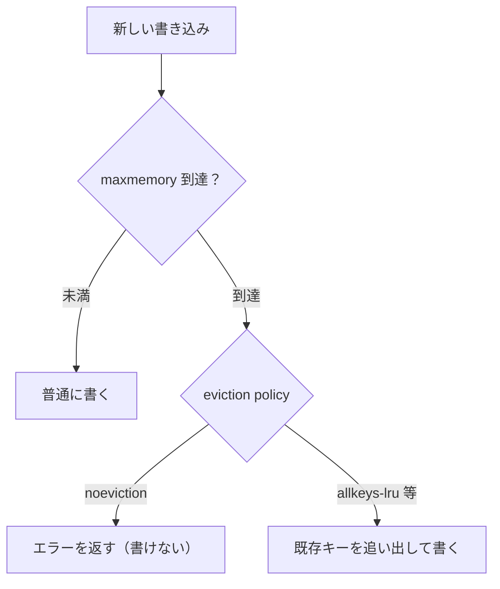
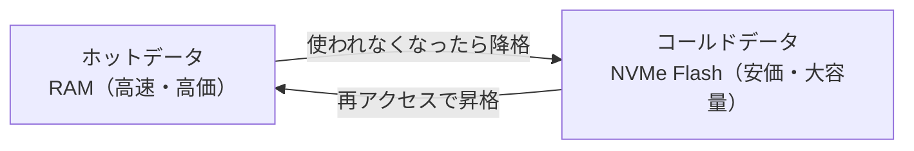

# Week 4 — メモリ管理・eviction・キー設計

> **Phase 2a** | 学習プラン Week 4 / 9
> 学習目標：メモリ上限に達したとき Redis がどう振る舞うか（eviction policy）を説明でき、用途に合った追い出し方針とキー命名規約を選べる。Managed Redis の Flash 階層の意味が分かる

---

## 0. 今週の位置づけ

Redis は**メモリにデータを置く**（Week 1）。メモリは有限なので、「**いっぱいになったらどうするか**」を必ず決めねばならない。今週は eviction（追い出し）とキー設計を扱う。ここを誤ると、本番で突然 `OOM` エラーや想定外のデータ消失が起きる。

> **初学者向け用語補足：eviction と OOM**
> - **eviction（エビクション＝追い出し・立ち退き）**＝メモリが満杯のとき、**既存のキーを消して空きを作る**こと。どのキーを消すかのルールが eviction policy（§2）。
> - **OOM（Out Of Memory＝メモリ不足）**＝メモリを使い切った状態。追い出さない設定（`noeviction`）だと、満杯時の書き込みが OOM エラーで失敗する（§3）。
> - 「eviction＝Redis が自分の判断で消す」「無効化（Week 3）＝アプリが意図して消す」。**消す主体が違う**点に注意。

---

## 1. maxmemory — メモリ上限

Redis は使えるメモリの上限（`maxmemory`）を持つ。Managed Redis では SKU（Week 6）でメモリ量が決まる。上限に達したとき、次の書き込みで何が起きるかは **eviction policy** が決める。



---

## 2. eviction policy（追い出し方針）

| ポリシー | 追い出す対象 | 何を基準に |
|---|---|---|
| **noeviction** | 追い出さない（書き込み拒否） | — |
| **allkeys-lru** | 全キー | 最近**使われていない**順（Least Recently Used） |
| **allkeys-lfu** | 全キー | 最近**使われる頻度が低い**順（Least Frequently Used） |
| **volatile-lru** | TTL付きキーのみ | LRU |
| **volatile-lfu** | TTL付きキーのみ | LFU |
| **volatile-ttl** | TTL付きキーのみ | 残り TTL が短い順 |
| **allkeys-random / volatile-random** | （対象）からランダム | ランダム |

> **初学者向け用語補足：LRU と LFU**
> - **LRU（Least Recently Used）**：「**最後に使った時刻**が一番古い」キャッシュから捨てる。直近の作業セットを残す発想。
> - **LFU（Least Frequently Used）**：「**使われた回数**が一番少ない」キャッシュから捨てる。たまにしか来ないが最近触れたものより、ずっと人気のものを残す発想。
> 一過性のアクセスが混じる実サービスでは **LFU が安定**しやすい。

> **重要な概念の区別：`allkeys-*` と `volatile-*`**
> - **allkeys-*** は「TTL の有無に関わらず**どのキーも**追い出し対象」。純粋なキャッシュ（全部消えてよい）向き。
> - **volatile-*** は「**TTL を付けたキーだけ**追い出す」。TTL 無しキーは"消したくない常駐データ"として保護される。キャッシュと常駐データを1インスタンスに同居させる時に使う。
> 本プランの実装（Week 9）の Bicep は `VolatileLRU` を設定している＝「TTL付きキャッシュから LRU で追い出す」方針。

---

## 3. どのポリシーを選ぶか

| 用途 | おすすめ | 理由 |
|---|---|---|
| 純粋な読み取りキャッシュ | `allkeys-lru` / `allkeys-lfu` | 全部キャッシュ。古い/不人気を捨てる |
| キャッシュ＋常駐データ同居 | `volatile-*` | TTL なし常駐は保護、TTL付きだけ追い出す |
| 真実源として使う（消えたら困る） | `noeviction` | 勝手に消さない。ただし満杯で書けなくなるので監視必須 |

> ⚠️ **公式の重要注意**：`noeviction` は「データを失わない」代わりに、満杯になると**書き込みが全部失敗**する。真実源用途では必ず**メモリ使用率の監視とアラート**（Week 8）をセットにする。

---

## 4. メモリを節約する設計

- **TTL を必ず付ける**：放置キーがメモリを食い潰すのを防ぐ最も簡単な手
- **値を小さく**：巨大 JSON を丸ごと入れず、必要フィールドだけ。Hash で持つと効率的なことも
- **List/ZSet を `LTRIM`/`ZREMRANGEBYRANK` で剪定**：最新N件だけ残す（Week 2 §3）
- **キー名を短く**：キー自体もメモリを使う。ただし可読性とのバランス（次節）

> **コマンドの読み方**：`LTRIM`＝List を TRIM（切り詰める）＝指定範囲だけ残して両端を捨てる（例 `LTRIM applog 0 99` で最新100件だけ残す）。`ZREMRANGEBYRANK`＝Z の REMove RANGE BY RANK＝Sorted Set を順位範囲で削除（例 下位を消して上位だけ残す）。どちらも「**増え続けるデータを一定サイズに剪定**」してメモリを守る。

---

## 5. キー命名規約

キー設計は「**後で消す範囲・探す範囲を決める**」設計でもある（Week 3 の無効化に直結）。

定石は **コロン区切りの名前空間**：

```
<エンティティ>:<id>            item:42
<エンティティ>:<id>:<属性>     user:1:profile
<機能>:<対象>                 session:abc123
<バージョン>:<...>            item:v2:42      ← 広域無効化（Week 3 §6）
```

> **初学者向け用語補足：ひな型の `<...>` は穴埋め項目（プレースホルダ）**
> `<エンティティ>` などは「ここに具体値を入れてね」という穴。実例と対応させると：
>
> | 穴 | 意味 | 例の中身 |
> |---|---|---|
> | **エンティティ** | モノの種類（Week2 §2 既出） | `item`, `user`, `order` |
> | **id** | そのモノを1つに特定する識別子 | `42`, `1` |
> | **属性（attribute）** | そのモノの「どの側面・部分か」 | `profile`, `cart`, `settings` |
> | **機能（用途）** | 「何のための」データか | `session`, `lock`, `ratelimit` |
> | **対象** | その機能が指す相手の識別子 | `abc123`（セッションID） |
> | **バージョン** | 何代目のキャッシュか（世代番号） | `v2` |
>
> ```text
>   user:1:profile   ← ユーザー1の「プロフィール」
>   user:1:cart      ← ユーザー1の「カート」     同じ user:1 でも属性で別キーに分ける
>   user:1:settings  ← ユーザー1の「設定」        → 部分ごとに更新/無効化でき、user:1:* で一括も可
> ```
>
> ①②は「**モノ中心**」（item/user）、③ `session:abc123` は「**機能中心**」（土台部品・Week8 でよく使う形）、④ `item:v2:42` の `v2` は世代番号で広域無効化用。
> 要は **コロン `:` で意味を階層に区切り、左から大きい分類 → 小さい特定へ**並べる。読んで意味が分かり、`user:1:*` で範囲をまとめて指定できる。

| 良いキー | なぜ良いか |
|---|---|
| `item:42` | 種類と ID が一目で分かる／`item:*` で範囲が見える |
| `user:1:cart` | 階層で意味が読める／ユーザー単位で消しやすい |

> **コマンドの読み方**：`KEYS pattern`＝パターンに合うキーを**一気に全部**返す（全走査・本番禁止）。`SCAN cursor MATCH pattern`＝**カーソルで少しずつ**キーを返す（分割走査・本番OK）。`MATCH`＝絞り込みパターン。`*`＝ワイルドカード（任意の文字列）。

> ⚠️ **本番での `KEYS` 禁止**：`KEYS item:*` は全キー走査で Redis を固める。範囲列挙が必要なら `SCAN`（カーソルで分割）を使う。命名規約があれば `SCAN MATCH user:1:*` で安全に絞れる。

---

## 6. Managed Redis のデータ階層（Flash の位置づけ）

Managed Redis には、よく使う**ホットデータは RAM**、あまり使わない**コールドデータは NVMe フラッシュ（SSD）**に自動で振り分ける階層がある（**FlashOptimized** 系・Week 6）。



- 旨み：**RAM だけより大容量を安く**持てる。巨大データセットを丸ごと載せたい時に効く
- トレードオフ：Flash 上のキーへのアクセスは RAM より遅い（それでも DB よりは速い）
- これは eviction（捨てる）とは別概念：**捨てずに安い層へ"降ろす"**。SKU 選定は Week 6

> **初学者向け用語補足：NVMe Flash とは何の略か**
> - **NVMe＝Non-Volatile Memory Express**（非揮発性メモリ・エクスプレス）。**Non-Volatile（非揮発性）**＝電源を切っても消えない（RAM の逆）。**Express**＝PCI Express という超高速バスに直結して SSD を使う規格（従来の SATA より桁違いに速い）。M.2 SSD などがこれ。
> - **Flash（フラッシュメモリ）**＝電気的に書き換えできる半導体の記憶素子。USBメモリ・SD・SSD の中身。電源を切っても保持する。
> - **「NVMe Flash」＝NVMe 接続の高速フラッシュ SSD**。
>
> | 置き場 | 揮発性 | 速さの目安 | 役割 |
> |---|---|---|---|
> | RAM（DRAM） | 揮発（消える） | 最速（サブ〜数μs） | ホットデータ |
> | **NVMe Flash** | 非揮発（消えない） | 速い（数十〜百μs）。RAM より遅いが SATA SSD より速い | コールドデータ |
> | DB のディスク | 非揮発 | 遅い（数〜数十ms） | 真実源 |
>
> 肝は「**RAM より遅いが DB のディスクよりずっと速い中間層**」（Week1 のメモリ階層の間）。だからコールドを Flash に逃がしても、DB に取りに行くより速く、**大容量を安く持ちつつ性能を保てる**。

---

## ハンズオン チェックリスト

- [ ] eviction policy の `allkeys-*` と `volatile-*` の違いを説明できる
- [ ] LRU と LFU の違いを説明できる
- [ ] 自分の用途に合うポリシーを根拠付きで選べる
- [ ] コロン区切りのキー命名規約で `item:`/`user:1:` を設計できた
- [ ] 本番で `KEYS` を避け `SCAN` を使う理由を言える
- [ ] Flash 階層が「追い出し」ではなく「安い層への降格」だと説明できる

---

## 自己チェック

1. **maxmemory に達したとき、`noeviction` と `allkeys-lru` で何が違うか？**
   - キーワード：書き込み拒否（エラー）／既存を追い出して書く
2. **`allkeys-*` と `volatile-*` の使い分けは？**
   - キーワード：全キー対象 vs TTL付きのみ／常駐データの保護
3. **LRU と LFU の違いと、実サービスで LFU が安定しやすい理由は？**
   - キーワード：最終利用時刻 vs 利用頻度／一過性アクセスに強い
4. **本番で `KEYS` を使ってはいけない理由と代替は？**
   - キーワード：全走査でブロック／SCAN／命名規約で絞る
5. **Managed Redis の Flash 階層は eviction とどう違うか？**
   - キーワード：捨てない／コールドを安い層へ降格／大容量を安く

---

## 次週の予告（Week 5）

- 落ちても止まらない：**レプリケーション・ゾーン冗長・フェイルオーバー**
- 永続化（**RDB / AOF**）は Managed Redis でどう扱うか
- リージョン障害に備える **Active geo-replication**
