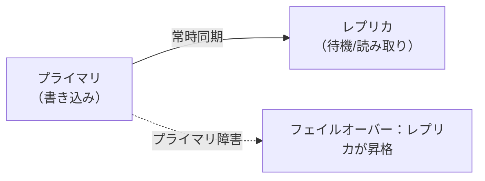
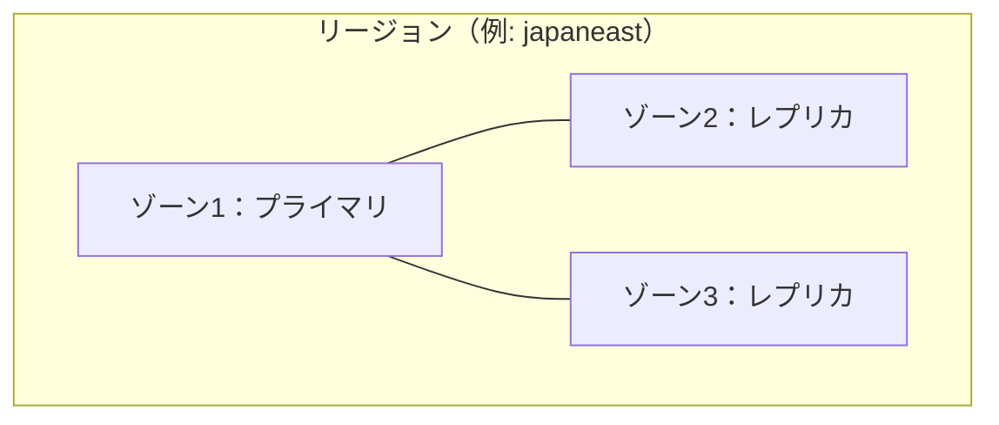
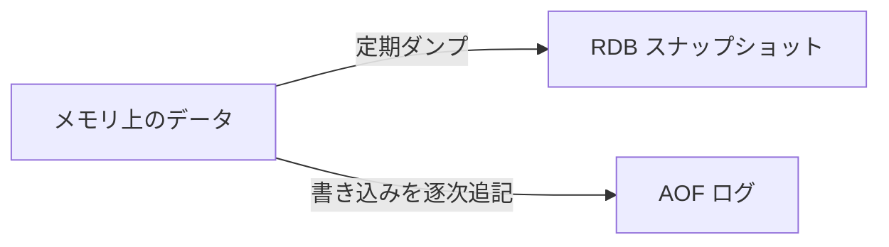
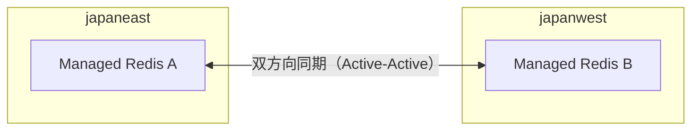

# Week 5 — 可用性・永続化・geoレプリケーション

> **Phase 2a** | 学習プラン Week 5 / 9
> 学習目標：レプリケーション・ゾーン冗長・フェイルオーバーで「落ちても止まらない」仕組みを説明でき、永続化（RDB/AOF）を有効化すべきか判断でき、Active geo-replication の用途が分かる

---

## 0. 今週の位置づけ

Week 1 で「Redis が落ちても真実源は DB」と学んだ。とはいえ Redis が落ちるたびに DB が過負荷になったり、セッションが飛んだりするのは困る。今週は **「Redis 自身をどう落ちにくく・復旧しやすくするか」** を扱う。

ここは「**何を真実源にするか**」で要件が変わる。
- **キャッシュ用途**（真実源は DB）：可用性そこそこ＋永続化不要でよい
- **データストア用途**（Redis が真実源に近い：セッション・キュー等）：可用性も永続化も重要

> **初学者向け用語補足：セッションとセッションストア**
> - **セッション（session）**＝Web サイトが「**ログイン中のあなた**」を覚えておく一時的な状態データ。HTTP は本来「毎回が赤の他人」（ステートレス）なので、何もしないとページ移動のたびに誰か忘れる。そこでログイン時に状態を作って覚える：
>   ```text
>     ① ログイン成功 → session:abc123 = { userId:1, name:"Tanaka", cart:[...] } を作る
>     ② ブラウザには合言葉（セッションID abc123）だけ Cookie で渡す
>     ③ 次のリクエストで abc123 を提示 → サーバは session:abc123 を引いて「田中さんだ」と思い出す
>   ```
> - **セッションストア（session store）**＝そのセッションを保存しておく場所。Redis が向く理由：**速い**（毎リクエスト読む）／**TTL で自動失効**（30分操作なしで消す）／**全 Web サーバで共有**できる。
>   ```text
>     セッションを各サーバのメモリに持つと… サーバBに振られると abc123 を知らずログアウト扱い！
>     Redis に集約すると…              A/B/C どのサーバでも共通の Redis を見て田中さんと分かる
>   ```
> - **どういう状態か**：セッションは「DB に元がある写し」ではなく **Redis 自身がほぼ真実源**。だから消えると**全員ログアウト**で痛い。ゆえに §5 の表ではキャッシュより手厚く「HA＋ゾーン冗長／AOF 検討」になる。

---

## 1. レプリケーション（複製）— 可用性の土台

プライマリ（書き込み担当）の写しをレプリカ（読み取り/待機）に常時同期する。



- プライマリが壊れたら**レプリカが昇格**して処理を継続（フェイルオーバー）
- Managed Redis は**高可用性（High Availability）構成**でこれを自動化する。クラスタを組み、ノード障害を検知して切り替える

> **初学者向け用語補足：HA（High Availability＝高可用性）構成とは**
> **HA** は **High Availability** の略（**High**＝高い／**Availability**＝可用性＝使える状態であること）。日本語で「高可用性」。
> 可用性は「期間中どれだけ正常に使えたか」を **9 の数（ナイン）** で表す：99.9%（スリーナイン・約8.8時間/年停止）→ 99.99%（フォーナイン・約53分/年）→ 99.999%（ファイブナイン・約5分/年）。HA 構成にする＝この稼働率を高く（9 を増やす）すること。クラウドの **SLA（Service Level Agreement＝品質保証）** もこの数字で示す（Week 8）。
>
> 「**できるだけ止まらない・落ちても自動で復旧する**ように作った構成」のこと。これまでの仕組みをセットで効かせた状態：
>
> ```text
>   HA 構成 ＝ プライマリ＋レプリカを複数ノードで持つ（複製）
>            ＋ 互いを見張り障害を検知
>            ＋ プライマリが倒れたら自動でレプリカへ切替（フェイルオーバー）
>            ＋（任意）レプリカを別ゾーンに置く（ゾーン冗長・§2）
> ```
>
> Managed Redis では HA を**有効にするか選べる**（Week 9 の Bicep の `highAvailability`）。
>
> | | HA 無効（単一ノード） | HA 有効（HA 構成） |
> |---|---|---|
> | ノード | 1台だけ | プライマリ＋レプリカ |
> | 1台壊れたら | 停止・データ消失の恐れ | 自動フェイルオーバーで継続 |
> | ゾーンまたぎ配置 | 不可 | 可（§2） |
> | 向き | 学習・検証 | 本番 |
>
> 後で出る「**HA 構成時に**ゾーンをまたいで配置できる」（§2）＝「**HA を有効にしたときだけ**ゾーン冗長が使える」という意味。HA を切った単一ノードはレプリカが無いのでゾーンまたぎもできない。

> **初学者向け用語補足：フェイルオーバー**
> 「現役（プライマリ）が倒れたら、控え（レプリカ）が即座に現役へ昇格して処理を引き継ぐ」こと。切り替え中はごく短時間の接続断が起き得るので、クライアントは**再接続・リトライ**を実装しておく（Week 8 のベストプラクティス）。

> **初学者向け用語補足：クラスタ／クラスタを組む／ノード**
> - **クラスタ（cluster＝房・群れ）**＝複数のサーバを束ねて、外からは1つのシステムのように動かす構成。**「クラスタを組む」**＝複数ノードをそう連携させること。
> - **ノード（node）**＝クラスタを構成する1台のサーバ。「クラスタ＝チーム、ノード＝各メンバー」。
>
> ```text
>   単体: ┌Redis┐ … 1台落ちたら終わり
>   クラスタ: ┌ノード1┐┌ノード2┐┌ノード3┐ … 連携して1つの Redis として振る舞う（1台落ちても継続）
> ```
>
> ⚠️ **「クラスタ」は本プランで2つの意味で出る**ので注意：
> - **§1 のクラスタ＝可用性のため**：プライマリ＋レプリカを束ね、1台落ちても**フェイルオーバー**で継続（各ノードは同じ写しを持つ＝複製）。
> - **Week 6 のクラスタリング＝スケールのため**：データを**分割（シャーディング）**して複数ノードに配り容量・処理を増やす（各ノードは別々の担当範囲）。
>
> ひとことで「**§1は複製して冗長化、Week6は分割して拡張**」。本番では両方を組み合わせる。

---

## 2. ゾーン冗長（Availability Zone redundancy）

レプリカを**同じリージョン内の別の物理データセンター（可用性ゾーン）**に置く。



- 1つのデータセンターが電源・空調・ネットワーク障害で落ちても、別ゾーンのレプリカで継続
- Managed Redis では HA 構成時にゾーンをまたいで配置できる
- APIM/Storage で学んだ「冗長の単位（LRS→ZRS→GZRS）」と同じ発想：**冗長の範囲を広げるほど強いがコストも上がる**

---

## 3. 永続化（Persistence）— 落ちても中身を失わない

メモリ上のデータをディスクに書き出し、再起動時に復元する。2方式ある。

| 方式 | 仕組み | 特徴 |
|---|---|---|
| **RDB（スナップショット）** | 一定間隔で全データをダンプ | 復元が速い・ファイルが小さい。が、最後のスナップショット以降は失う |
| **AOF（Append Only File）** | 書き込みコマンドを逐次追記 | 失うデータが少ない（ほぼ全書き込みを記録）。が、ファイルが大きく復元が遅め |

> **初学者向け用語補足：RDB / AOF / スナップショット / ダンプ**
> - **RDB＝Redis DataBase file**。ある瞬間の全データを丸ごとファイルに保存する方式。
> - **スナップショット（snapshot＝写真）**＝「その瞬間の状態をパシャっと丸ごと写し取る」こと。RDB は定期的にこの集合写真を撮るイメージ。撮影と撮影の間（前回スナップショット以降）の変更は、撮る前に落ちると失う。
> - **ダンプ（dump）**＝メモリの中身をそっくりファイルに**書き出す**こと。「スナップショットをダンプする」＝今の全データをファイルに吐き出す。
> - **AOF＝Append Only File（追記専用ファイル）**。書き込みコマンドを**起きた順にひたすら追記**する（Week2 §6 の Stream と同じ append-only 発想）。再生すれば直前の状態まで復元できるので欠損が小さい。
> たとえ：RDB＝「定期的に撮る集合写真」、AOF＝「やったこと全部を書く日記」。写真は復元が速いが撮影間隔ぶん失う、日記は全部追えるが量が増える。

> **初学者向け用語補足：スナップショット（RDB ファイル）の中身は何か**
> 「ある瞬間のメモリ全体を、そっくり1つのバイナリファイルに固めたもの」。各キーについて次の3点＋管理情報が入る：
>
> | 項目 | 中身 | 例 |
> |---|---|---|
> | **① キー名** | データの名前 | `item:42` |
> | **② 値＋型** | 実データと**データ型**（String/Hash/List/Set/ZSet/Stream）。型ごとの圧縮形式で格納 | Hash なら `{name:Coffee, price:380}` |
> | **③ TTL** | 残り寿命があれば**失効時刻**も記録 | `EX 60` の残り |
>
> あなたの言う「キー＋バリュー＋属性」の**「属性」が主に ③ の TTL と ② の型情報**にあたる。
>
> ```text
>   dump.rdb（バイナリ）
>   ├ ヘッダ: "REDIS" + RDB/Redis バージョン
>   ├ キー item:42    | 型:String | 値:"Coffee"       | TTL:なし
>   ├ キー user:1     | 型:Hash   | 値:{name,age,plan} | TTL:なし
>   ├ キー session:abc| 型:String | 値:"tako"          | TTL:失効時刻
>   └ チェックサム（破損検証）
> ```
>
> - メモリにあるものが**ほぼそのまま**入り、再起動時に読むとキー・値・型・TTL がそっくり復元される。
> - ただし**「その瞬間まで」**。撮影後の書き込みは、次に撮る前に落ちると失う（§3）。
> - TTL は「残り秒数」ではなく**失効時刻（絶対時刻）**で保存。だから復元が遅れても正しい時刻で失効する。
> - 対比：RDB＝「今ある全データの集合写真」、AOF＝「書き込みコマンドの日記」。RDB は"結果の状態"、AOF は"そこに至る操作"を保存する。



> **重要な概念の区別：永続化 ≠ バックアップ ≠ 可用性**
> - **可用性（レプリケーション）**：ノードが壊れても**別ノードで継続**（落ちない）
> - **永続化（RDB/AOF）**：プロセス再起動後に**メモリ内容を復元**（再起動で消えない）
> - この3つは別物。キャッシュ用途なら可用性だけで十分なことが多く、永続化は不要。

### キャッシュなら永続化は要らないことが多い

本プランの実装（Week 9）の Bicep は **`aofEnabled: false` / `rdbEnabled: false`**（永続化なし）にしている。理由：**真実源は DB**で、Redis が空になっても Cache-Aside で再充填されるから。永続化を有効にすると書き込み性能とコストに影響する。

逆に Redis をセッションストアやキューの真実源として使うなら、AOF を有効化して欠損を抑える判断になる。

---

## 4. Active geo-replication（リージョン間レプリケーション）

ゾーン冗長（§2）は同一リージョン内の話。**リージョンごと落ちる**災害や、世界中の利用者への低遅延配信に備えるのが geo-replication。



- Managed Redis（Redis Enterprise ベース）は **Active-Active**：複数リージョンで**同時に読み書き**でき、互いに同期する
- 競合（同じキーを別リージョンで同時更新）は **CRDT** という仕組みで自動マージされる
- 用途：リージョン障害対策（DR）、グローバル低遅延、リージョン間のデータ共有

> **初学者向け用語補足：CRDT と DR**
> - **CRDT＝Conflict-free Replicated Data Type**（競合しない複製データ型）。複数拠点で同じデータを同時に書き換えても、**あとから自動でキレイにマージできる**ように設計されたデータ構造。たとえばカウンタなら「東京で+1、大阪で+1」を、どちらが先かを争わず**合算して+2**にまとめられる。だから Active-Active で同時書き込みしても破綻しない。
> - **DR＝Disaster Recovery（災害復旧）**。地震・大規模障害でリージョンごと使えなくなっても、別リージョンで業務を継続・復旧できる備えのこと。geo-replication は DR 手段の1つ。

> **初学者向け用語補足：Active-Passive と Active-Active**
> - **Active-Passive**：片方だけが現役、もう片方は待機。切り替えが必要。
> - **Active-Active**：両方が同時に現役で読み書きできる。各地のユーザーは最寄りに書ける。Managed Redis の geo-replication はこちら（従来 Cache for Redis の Premium は Passive 中心だった点が進化）。

---

## 5. 用途別の推奨（早見表）

| 用途 | 可用性 | 永続化 | geo |
|---|---|---|---|
| 読み取りキャッシュ（真実源は DB） | HA 構成 | 不要 | 任意 |
| セッションストア | HA＋ゾーン冗長 | AOF 検討 | 任意 |
| グローバルサービス | HA | 用途次第 | Active-Active |
| キュー/カウンタの真実源 | HA＋ゾーン冗長 | AOF 推奨 | 慎重に |

---

## ハンズオン チェックリスト

- [ ] レプリケーションとフェイルオーバーの流れを説明できる
- [ ] ゾーン冗長が「同一リージョン内の別データセンター」だと言える
- [ ] RDB と AOF の違い（復元速度 vs 欠損量）を説明できる
- [ ] 「可用性・永続化・バックアップは別物」を区別できる
- [ ] キャッシュ用途で永続化を無効にしてよい理由を言える
- [ ] Active-Active geo-replication の用途を1つ挙げられる

---

## 自己チェック

1. **フェイルオーバーとは何か。クライアント側で備えるべきことは？**
   - キーワード：レプリカ昇格／短時間の接続断／再接続・リトライ
2. **ゾーン冗長は何から守るのか？**
   - キーワード：データセンター単位の障害／別ゾーンのレプリカで継続
3. **RDB と AOF の違いを、復元速度と欠損量の観点で説明せよ。**
   - キーワード：スナップショット vs 逐次追記／速い復元 vs 少ない欠損
4. **本プランの実装で永続化を無効にしているのはなぜか？**
   - キーワード：真実源は DB／再充填で回復／性能・コスト
5. **Active-Active geo-replication が従来の Active-Passive より優れる点は？**
   - キーワード：複数リージョンで同時書き込み／最寄りに書ける／CRDT で競合解決

---

## 次週の予告（Week 6）

- 大きくする2方向：**スケールアップ（SKU 階層）とスケールアウト（クラスタ/シャーディング）**
- ハッシュスロットと OSS クラスタ
- **Managed Redis の階層（Balanced/MemoryOptimized/ComputeOptimized/FlashOptimized）と Cache for Redis SKU の対比**・サイジング
