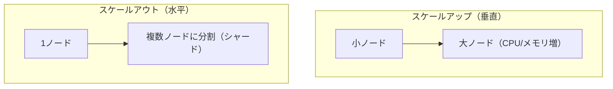
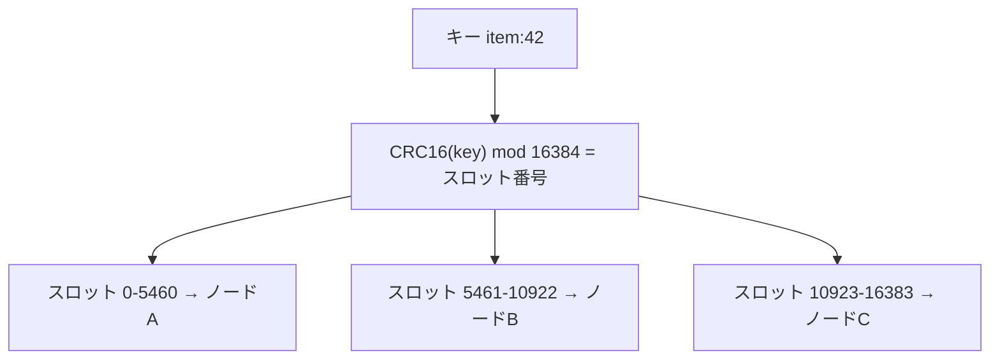

# Week 6 — スケーリング・クラスタリング・階層選択

> **Phase 2a** | 学習プラン Week 6 / 9
> 学習目標：スケールアップとスケールアウト（クラスタ/シャーディング）の違いを説明でき、ハッシュスロットの仕組みが分かり、Managed Redis の階層（Balanced/MemoryOptimized/ComputeOptimized/FlashOptimized）を用途から選べる。Cache for Redis の SKU とも対比できる

---

## 0. 今週の位置づけ

データ量・アクセス量が増えたとき、Redis を「大きく」する方法は2方向ある。今週はその2方向と、**Managed Redis の階層（SKU）の選び方**を扱う。これは Week 9 の Bicep で `skuName` を選ぶ判断の根拠になる。

---

## 1. スケールアップ vs スケールアウト



| | スケールアップ（垂直） | スケールアウト（水平） |
|---|---|---|
| やり方 | より大きい SKU に変更 | ノードを増やしデータを分割（シャーディング） |
| 上限 | 1ノードのメモリ/CPU 上限まで | ノードを足せば伸びる |
| 単純さ | 単純（アプリ変更ほぼ不要） | クラスタ対応クライアントが必要 |
| 向く局面 | まずはこれで十分なことが多い | 単一ノードに載らない/捌けない規模 |

> **初学者向け用語補足：スケールアップ／アウト（垂直・水平）と SKU**
> - **スケールアップ（scale up＝垂直スケール）**＝1台のサーバを**より高性能なものに替える**（CPU・メモリを増やす）。「1台を大きくする」＝上に伸ばすので**垂直**。たとえ：1人の作業者をベテランに替える。
> - **スケールアウト（scale out＝水平スケール）**＝**台数を増やして仕事を分担**する。「横に並べる」ので**水平**。たとえ：作業者を増やして手分けする。
> - **SKU（Stock Keeping Unit、エスケーユー）**＝もとは小売の「商品の種類コード」。クラウドでは「**サービスのプラン／型番**」を指す。Redis では `Balanced_B0` のような階層＋サイズの選択肢が SKU（§3）。「SKU を変える」＝プラン（性能・価格）を選び直すこと。

---

## 2. シャーディングとハッシュスロット

スケールアウトは「**キー空間を分割して複数ノードに配る**」こと。Redis（OSS クラスタ）は **16384 個のハッシュスロット**を使う。



- 各キーは名前から計算したスロットに属し、スロットがノードに割り当てられる
- ノードを足す/減らすと、スロットが再配分（リシャーディング）される
- クライアントは「どのスロットがどのノードか」を知って直接そのノードに行く（クラスタ対応クライアント）

> **初学者向け用語補足：シャーディング／ハッシュスロット／CRC16／mod**
> - **シャード（shard＝かけら・破片）／シャーディング**＝データを**分割して複数ノードに配る**こと。1ノードに全部載らない/捌けないとき、キーを分担させる。1つの分担分が「シャード」。
> - **ハッシュスロット**＝キーの置き場を決めるための **0〜16383 の 16384 個の区画**。キーを直接ノードに割り当てず、いったんスロットへ、スロットをノードへ、と**2段階**にするのがミソ。ノードを足しても「スロット→ノード」の対応を変えるだけで済み、再配分が楽。
> - **CRC16(key)**＝キー名から計算する**チェックサム（ハッシュ値）の一種**。同じキー名なら必ず同じ数になる。これでキーを数値化する。
>   - **CRC＝Cyclic Redundancy Check（巡回冗長検査）／16＝16ビット**（出る数は 0〜65535）。データを特定の計算式に通して短い数を作る方式で、もとは「通信やファイルが壊れていないか検査する」技術。Redis はこれを検査でなく「キー名を、よく散らばる数に変換する道具」として流用している。
>   - **チェックサム（checksum）**＝データ全体から計算する**短い照合用の数**（check＝検査＋sum＝合計）。本来は「データが壊れていないか・同じかを手早く照合」する用途：送る側と受け側で同じ計算をして数が一致すれば無事、違えば破損と分かる（Week5 §3 の RDB 末尾の破損検証もこれ）。全部を突き合わせず**短い数1個**で判定できるのが旨み。CRC16 はその数を作る方式の1つ。
> - **mod（モジュロ＝剰余・割った余り）**＝`CRC16(key) mod 16384` は「16384 で割った余り」＝必ず 0〜16383 のどれか＝スロット番号。例：余りが 42 ならスロット42。
> - **リシャーディング**＝ノード増減に合わせてスロットの担当を**配分し直す**こと。
> たとえ：キー名を CRC16 で「整理番号」に変換し、16384 個の棚（スロット）のどれかに入れ、棚をノードに割り当てる。棚単位で動かせるので増減が楽。

> **初学者向け用語補足：クラスタモードでの「複数キー操作」の制約**
> 別々のスロットに散ったキーをまたぐ操作（`MGET a b c` や Lua、トランザクション）は、キーが別ノードにあると実行できない。**同じノードに固めたいキー**は **ハッシュタグ** `{}` を使う：`user:{1}:cart` と `user:{1}:profile` は `{1}` 部分だけでスロット計算され、必ず同居する。

> **重要な概念の区別：clusteringPolicy（OSSCluster と EnterpriseCluster）**
> Managed Redis のデータベースは clusteringPolicy を選べる（Week 9 の Bicep では `OSSCluster`）。
> - **OSSCluster**：OSS Redis Cluster 互換。クライアントがスロットを意識し、各ノードへ直接アクセス（高スループット）。クラスタ対応クライアントが必要。
> - **EnterpriseCluster**：単一エンドポイントの裏で透過的に分散。クライアントは単一ノードのように扱える（互換性重視）。
> スループット最優先なら OSSCluster、互換性重視なら EnterpriseCluster。

---

## 3. Managed Redis の階層（SKU）

Managed Redis の SKU は「**何がボトルネックか**」で系統が分かれる。SKU 名は `<系統>_<サイズ>`（例：`Balanced_B0`）。

| 系統 | 最適化対象 | 向くワークロード |
|---|---|---|
| **Balanced（B）** | メモリと CPU のバランス | 汎用キャッシュ。**まず迷ったらこれ**（学習は最小 `Balanced_B0`） |
| **MemoryOptimized（M）** | メモリ多め（対 CPU） | 大量データを載せたいが計算は軽い |
| **ComputeOptimized（X）** | CPU 多め（対メモリ） | 高スループット・重い操作（多数接続/複雑コマンド） |
| **FlashOptimized（A）** | RAM＋NVMe Flash 階層 | 巨大データセットを安く（ホットは RAM、コールドは Flash・Week 4 §6） |

- サイズ（B0, B1, B3 … M10 …）が上がるほどメモリ/性能が増える
- スケールアップは SKU 変更、スケールアウトはシャード追加で行う

---

## 4. 従来 Cache for Redis の SKU との対比

| | **Azure Managed Redis（新）** | Azure Cache for Redis（従来） |
|---|---|---|
| SKU 体系 | Balanced/MemoryOptimized/ComputeOptimized/FlashOptimized | Basic / Standard / Premium / Enterprise / Enterprise Flash |
| SLA・冗長 | 階層に応じHA（ゾーン冗長対応） | Basic は SLA なし、Standard 以上で冗長 |
| クラスタ | データベース単位でクラスタ構成 | Premium 以上でクラスタ |
| Flash 階層 | FlashOptimized | Enterprise Flash |
| 位置づけ | コスト効率・性能を刷新した後継 | 実績豊富だが順次 Managed Redis へ |

> **対応のイメージ（厳密な1:1ではない）**：
> Basic/Standard 的な手軽な汎用 → **Balanced**、Enterprise Flash 的な大容量低コスト → **FlashOptimized**。同じ性能をより安く出せるのが Managed Redis の売り。移行は Week 8。

---

## 5. サイジングの考え方

| 見るべき指標 | 上げ方 |
|---|---|
| **メモリ使用率**が高い | サイズアップ or MemoryOptimized or Flash、または TTL/eviction 見直し（Week 4） |
| **CPU/サーバ負荷**が高い | ComputeOptimized or スケールアウト（シャード追加） |
| **接続数/スループット**が頭打ち | ComputeOptimized・クラスタ化・接続プール見直し（Week 8） |
| データが**載り切らない** | MemoryOptimized or FlashOptimized |

> 定石：**まず Balanced で小さく始め、Week 8 のメトリクスを見て**ボトルネックの系統へスケールする。最初から大きく作らない。

> **重要な概念の区別：メモリ使用率と CPU 負荷は"別の軸"**
> 同じ状況から起きそうに見えるが、別々の資源で**片方だけ高くなる**ことが多い。
> - **メモリ使用率＝どれだけ"溜まっているか"（容量）**。原因：データ件数が多い／値が大きい／TTL 切れず残る。たとえ：**冷蔵庫がどれだけ埋まっているか**。
> - **CPU/サーバ負荷＝どれだけ"働いているか"（処理量/秒）**。原因：リクエスト数が多い／重いコマンド（`SINTER`/`SORT`/`KEYS`/Lua など O(N)）／接続数。たとえ：**料理人がどれだけ忙しいか**。
>
> ```text
>   A. メモリ高・CPU低：1億件を載せるが秒数回しか読まれない（冷蔵庫満杯・料理人は暇）
>   B. メモリ低・CPU高：小さなカウンタを毎秒100万回 INCR（冷蔵庫は空・料理人パンク）
> ```
>
> Redis はコマンド処理が基本**シングルスレッド**（1人の料理人が順番に捌く）なので、メモリに余裕があっても処理が追いつかず CPU が詰まりうる。
> **だから対処も別**：メモリ不足→サイズアップ/MemoryOptimized/Flash/TTL見直し。CPU 不足→ComputeOptimized/スケールアウト(シャード追加)/重いコマンド是正。
> **メモリ不足に CPU 強化は効かない／CPU 詰まりにメモリ増は無駄**。だから両方を別々に監視して、高い方の系統へスケールする（Week 8）。

---

## ハンズオン チェックリスト

- [ ] スケールアップとスケールアウトの違いを説明できる
- [ ] ハッシュスロット（16384・CRC16）の仕組みを説明できる
- [ ] ハッシュタグ `{}` で関連キーを同居させる理由を言える
- [ ] OSSCluster と EnterpriseCluster の違いを説明できる
- [ ] Balanced/MemoryOptimized/ComputeOptimized/FlashOptimized を用途で選べる
- [ ] Cache for Redis の SKU と Managed Redis の階層を対比できる

---

## 自己チェック

1. **スケールアップとスケールアウトはそれぞれ何をするか。上限の違いは？**
   - キーワード：SKU変更 vs シャード追加／1ノード上限 vs 足せば伸びる
2. **ハッシュスロットとは何か。キーはどうノードに割り当たるか？**
   - キーワード：16384スロット／CRC16 mod／スロット→ノード
3. **クラスタモードで関連キーを同じノードに置くには？**
   - キーワード：ハッシュタグ `{}`／同一スロット／複数キー操作の制約
4. **OSSCluster と EnterpriseCluster の使い分けは？**
   - キーワード：スループット（直接アクセス）vs 互換性（単一エンドポイント）
5. **「まず Balanced_B0 で始める」のが推奨なのはなぜか？**
   - キーワード：小さく始める／メトリクスで判断／ボトルネックの系統へ

---

## 次週の予告（Week 7）

- 守る：**Microsoft Entra ID 認証（キーレス）・アクセスキー・RBAC**
- ネットワーク分離：**Private Link / VNet・TLS**
- APIM/Storage で学んだ **Managed Identity 認証**との接続（Week 9 実装の認証設計）
