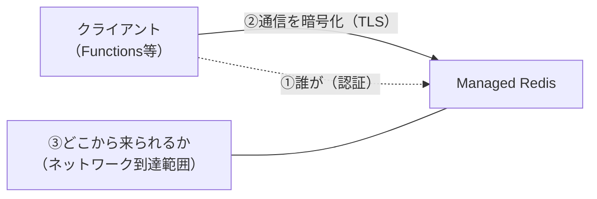
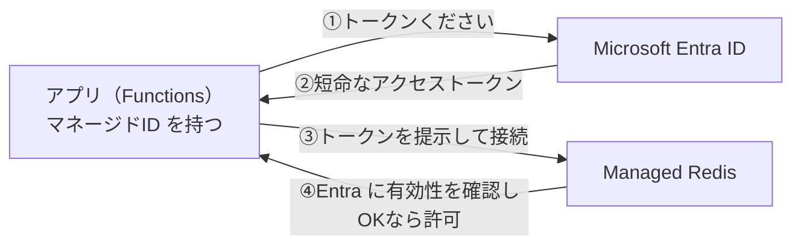
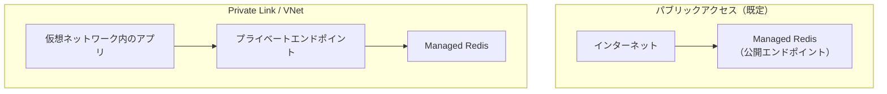
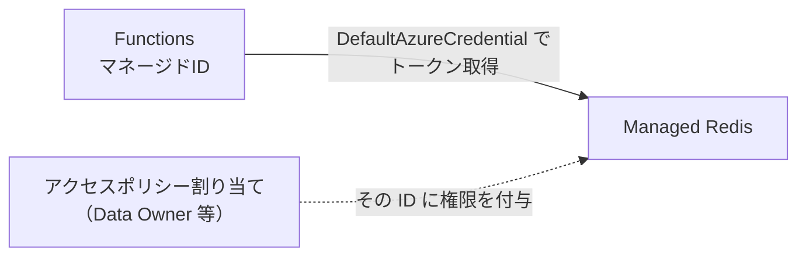

# Week 7 — セキュリティとネットワーク

> **Phase 2b** | 学習プラン Week 7 / 9
> 学習目標：Redis を「3つの層」で守る考え方を説明でき、アクセスキーと Microsoft Entra ID（キーレス）認証の違い・RBAC（アクセスポリシー）・TLS・Private Link を理解し、APIM/Storage で学んだ Managed Identity 認証と結びつけられる

---

## 0. 今週の位置づけ

ここまでで「速く・落ちにくく・大きく」できるようになった。残るは **「誰に・どう触らせるか」＝セキュリティ**。Redis はキャッシュとはいえ、セッション・個人情報・トークンなど**機微なデータ**を持ちうる。守りは3つの層に分けて考える。



| 層 | 問い | 本週の節 |
|---|---|---|
| **① 認証・認可** | 誰が、何を触ってよいか | §1〜§3 |
| **② 通信の暗号化** | 経路を盗聴・改ざんされないか | §4 |
| **③ ネットワーク到達範囲** | そもそもどこから繋げるか | §5 |

> APIM Week 5・Storage Week 4 でも同じ「**入口・経路・秘密**」の3分割で守りを学んだ。Redis でも考え方は同じ。

---

## 1. 認証の2方式：アクセスキー と Microsoft Entra ID

「誰が繋いでいるか」を確かめるのが**認証**。Managed Redis には2方式ある。

| | アクセスキー（従来型） | **Microsoft Entra ID（キーレス・推奨）** |
|---|---|---|
| 仕組み | 長いパスワード文字列を提示 | Entra ID で発行した**トークン**を提示 |
| 秘密の管理 | キー文字列をアプリに持たせる（漏洩・ローテーションが手間） | **パスワードを持たない**。ID に紐づくトークンを自動取得 |
| 失効 | キーを再生成（影響範囲が広い） | トークンは短命で**自動更新**、権限は ID 側で剥奪 |
| 監査・集中管理 | 弱い | Entra ID で一元管理（誰がいつ） |
| Managed Redis では | 利用可だが非推奨 | **既定**。これを使うべき |

> **重要な概念の区別：認証（Authentication）と認可（Authorization）**
> - **認証（AuthN）＝「あなたは誰？」**を確かめる（本人確認）。アクセスキーや Entra トークンがこれ。
> - **認可（AuthZ）＝「あなたは何をしてよい？」**を決める（権限）。Redis のアクセスポリシー（§3）がこれ。
> 認証で本人と分かっても、認可で「読み取りだけ」等を絞る。2段階で守る。

> ⚠️ **公式の推奨**：キーを使っているなら Entra ID に切り替え、**アクセスキーは無効化**する。ただしキーを無効化すると**既存の全接続が一旦切れる**ので、移行は計画的に。

---

## 2. Entra ID 認証（キーレス）の仕組み

「パスワードを持たないのに、どうやって本人確認するのか？」——**トークン**を使う。



- アプリは自分の **ID（マネージドID）** で Entra ID にトークンを要求 → 受け取ったトークンで Redis に繋ぐ
- トークンは**短命**（数十分）。期限が来たら背後で自動更新するので、アプリはパスワード管理から解放される
- ローカル開発では `az login` した開発者の ID、本番では **Functions のマネージドID** が使われる（コード共通）

> **初学者向け用語補足：トークン と マネージドID**
> - **トークン（token＝代用通貨・引換券）**＝「本人確認済み」を示す**短命の電子的な通行証**。パスワードのように使い回さず、期限切れで無効になる。盗まれても短時間で失効するので安全。
> - **マネージドID（Managed Identity）**＝Azure リソース（Functions など）に Azure が自動で持たせる**身分証**。人間のアカウントなしに「このアプリ」を Entra ID 上の主体として扱える。パスワード不要・自動ローテーション。APIM/Storage の Week でも同じ仕組みで Key Vault や Blob に繋いだ。

> **初学者向け用語補足：アクセストークンと「提示する」とは**
> **アクセストークン**＝「本人確認が済み、これだけの権限がある」と証明する**署名つきの電子的な通行証**。たとえは**ライブ会場のリストバンド**：入口で身分証を見せて本人確認 → リストバンドをもらい、中ではそれを見せるだけで通れる。当日限り（短命）で偽造防止加工（署名）つき。
> 「**トークンを提示する**」＝このリストバンドを見せること。Redis 接続時にパスワードの代わりにトークンを添えて送る。
> ```text
>   アクセストークンの中身（ざっくり）
>     誰か(sub)  : このアプリ（マネージドID）
>     宛先(aud)  : https://redis.azure.com  ← Redis 用
>     期限(exp)  : 例 60分後（短命）
>     署名       : Entra ID が署名（本物か・改ざんが無いか検証できる）
> ```
> 署名があるので Redis 側は「Entra ID が発行した本物か」を検証でき、盗まれても期限切れで無効になる。

> **重要な概念の区別：認証（AuthN）と認可（AuthZ）の仕組み**
> 2段階で「**誰？**」→「**何してよい？**」を判定する。
>
> ```mermaid
> flowchart TB
>     A1["①認証(AuthN)：アプリが自分のID(マネージドID)で<br/>Entra にトークンを要求 → 本人確認 → 署名つきトークン発行"] --> B1["②提示：トークンを添えて Redis に接続<br/>→ Redis が署名・期限を検証（本物か）"]
>     B1 --> C1["③認可(AuthZ)：このIDのアクセスポリシーを確認<br/>→ Data Reader なら GET だけ／Data Owner なら全部 許可"]
> ```
>
> | 段階 | 内容 | リストバンドのたとえ |
> |---|---|---|
> | **① 認証 AuthN** | 本人確認し、本人にトークンを渡す | 身分証 → リストバンドをもらう |
> | **② 提示** | トークンを添えて接続、Redis が署名検証 | リストバンドを見せる → 本物か確認 |
> | **③ 認可 AuthZ** | 権限（アクセスポリシー §3）で可否判定 | バンドの色で入れるエリアが決まる |
>
> 順番が肝：**先に認証（誰か）→ 次に認可（何してよいか）**。本人でなければ権限判定すらしない。パスワードを送らず短命・署名つきの通行証を送るのがトークン方式の安全性の源。

> **コマンドの読み方（接続スコープ）**：Week 9 のコードで使う `https://redis.azure.com/.default` は「**Managed Redis 用のトークンをください**」という宛先指定（スコープ）。`.default` は「このリソースに割り当て済みの既定の権限で」の意味。

これは Week 9 実装で `DefaultAzureCredential` ＋ `redis-entraid` として具体化する（§6・Week 9）。

---

## 3. RBAC とアクセスポリシー（認可）

本人と分かった次は「**何をしてよいか**」。Managed Redis は **アクセスポリシー**でデータ操作の権限を絞る。

| 組み込みポリシー | できること |
|---|---|
| **Data Owner** | 全コマンド・全キー（フルアクセス）。既定 |
| **Data Contributor** | 読み書きできるが一部管理操作は不可 |
| **Data Reader** | 読み取り専用（`GET` 等のみ、書き込み不可） |

- 「どの ID に・どのポリシーを」割り当てる＝**アクセスポリシー割り当て**（Week 9 の Bicep `accessPolicyAssignments`）
- 必要最小限のポリシーを与えるのが定石（**最小権限の原則**）。読み取りしかしないアプリに Data Reader を与えれば、万一トークンが漏れても書き換えられない

> **初学者向け用語補足：RBAC（Role-Based Access Control）と最小権限**
> - **RBAC＝役割ベースのアクセス制御**。「この ID は読み取り役」「この ID は所有者役」と**役割（ロール）**を割り当てて権限を決める方式。個別に許可を並べるより管理が楽。
> - **最小権限の原則（least privilege）**＝必要な権限だけ与える。読み取りで足りるなら書き込み権限は渡さない。被害を最小化する基本姿勢。
> APIM/Storage で「Blob 読み取りロールだけ付与」したのと同じ考え方。

> **コマンドの読み方**：Redis 自身のコマンドにも `ACL`（Access Control List）系があり、ユーザーごとに「使えるコマンド・触れるキー」を制限できる。Managed Redis ではこれを Azure の**アクセスポリシー**としてマネージドに扱う。

---

## 4. 通信の暗号化（TLS）

経路上の盗聴・改ざんを防ぐため、Managed Redis は**常に TLS で暗号化**する。

- **既定ポート 10000・TLS 必須**（平文 `Plaintext` は学習でも使わない）。Cache for Redis の 6380 に相当
- Week 9 の Bicep は `clientProtocol: 'Encrypted'` / `minimumTlsVersion: '1.2'`、コードは `ssl=True` で接続

> **初学者向け用語補足：TLS（Transport Layer Security）**
> 通信を暗号化する標準技術（HTTPS の "S" の中身）。**Transport Layer（通信層）**を **Secure（安全）**にする。盗聴（中身を見られる）・改ざん（書き換えられる）・なりすましを防ぐ。`https://` や `ssl=True` はこれを使っているサイン。古い SSL の後継で、`minimumTlsVersion: '1.2'` は「TLS 1.2 以上だけ許可」（古く脆弱なバージョンを拒否）の意味。

---

## 5. ネットワーク到達範囲（Public / Private Link / VNet）

認証の手前に「**そもそもどこから繋げるか**」の壁を置くと、より堅い。



| 方式 | 到達範囲 | 用途 |
|---|---|---|
| **パブリックアクセス** | インターネットから到達可（認証は必要） | 学習・検証。本番では絞りたい |
| **プライベートエンドポイント（Private Link）** | **VNet 内からのみ**。Redis に VNet 内の private IP が割り当たる | 本番の定石。インターネットから直接届かない |
| **ファイアウォール（IP 制限）** | 許可した IP だけ | 補助的に併用 |

> **初学者向け用語補足：VNet と プライベートエンドポイント**
> - **VNet（Virtual Network＝仮想ネットワーク）**＝Azure 上に作る**自分専用の閉じたネットワーク**。中のリソース同士はインターネットを経由せず private IP で通信できる。
> - **プライベートエンドポイント（Private Endpoint／Private Link）**＝Managed Redis に **VNet 内の private IP** を生やし、「VNet の中からしか繋げない」状態にする仕組み。公開エンドポイントを塞げるので、**インターネットからは存在すら見えない**。APIM/Storage の Week でも同じ Private Endpoint でバックエンドを隠した。

> **多層防御（defense in depth）**：①認証（誰）②TLS（経路）③ネットワーク（どこから）を**重ねる**。1枚破られても次の壁で止める、という考え方。

---

## 6. 既習との接続：Managed Identity 認証パターン

Redis の Entra ID 認証は、APIM・Storage で繰り返した「**キーを持たず、ID で繋ぐ**」パターンそのもの。

| 既習 | 認証の主体 | 繋ぐ先 |
|---|---|---|
| APIM → バックエンド/Key Vault | APIM のマネージドID | Key Vault のシークレット等 |
| Storage（Functions → Blob） | Functions のマネージドID | Blob（`DefaultAzureCredential`） |
| **Redis（Functions → Managed Redis）** | **Functions のマネージドID** | **Managed Redis（`DefaultAzureCredential` ＋ `redis-entraid`）** |



- **コードは共通の形**：`DefaultAzureCredential` がローカル（`az login`）でも本番（マネージドID）でも適切な ID を自動選択
- Week 9 の Bicep は、Functions の `principalId` に対し `accessPolicyAssignments` で `default`（Data Owner）を割り当て、キーレス接続を成立させる

> つまり Redis 固有の新しい認証を覚えるのではなく、**既習の Managed Identity パターンに Redis を一枚足すだけ**。これが「Azure をサービス横断で学ぶ」旨み。

---

## ハンズオン チェックリスト

- [ ] 守りの3層（認証／TLS／ネットワーク）を自分の言葉で説明できる
- [ ] アクセスキーと Entra ID 認証の違いと、キーレスが推奨される理由を言える
- [ ] 認証（AuthN）と認可（AuthZ）を区別できる
- [ ] アクセスポリシー（Data Owner/Contributor/Reader）と最小権限を説明できる
- [ ] TLS・ポート10000・`minimumTlsVersion` の意味を説明できる
- [ ] プライベートエンドポイントが「VNet 内からのみ」にする仕組みを説明できる
- [ ] Redis の Entra ID 認証が APIM/Storage の Managed Identity と同じ型だと言える

---

## 自己チェック

1. **アクセスキー認証より Entra ID（キーレス）が推奨されるのはなぜか？**
   - キーワード：パスワードを持たない／短命トークン自動更新／集中管理・監査
2. **認証（AuthN）と認可（AuthZ）の違いは？**
   - キーワード：誰か（本人確認）vs 何をしてよいか（権限）／トークン vs アクセスポリシー
3. **最小権限の原則とは。Redis ではどう適用するか？**
   - キーワード：必要な権限だけ／読み取りなら Data Reader／漏洩時の被害最小化
4. **TLS と `minimumTlsVersion: '1.2'` は何を守る／意味するか？**
   - キーワード：盗聴・改ざん防止／TLS1.2以上のみ許可／ポート10000必須
5. **プライベートエンドポイントを使うとセキュリティ上どう堅くなるか？**
   - キーワード：VNet 内のみ／private IP／インターネットから到達不可
6. **Redis の Entra ID 認証は、既習のどのパターンと同じか？**
   - キーワード：マネージドID／DefaultAzureCredential／キーレス（APIM/Storage と共通）

---

## 次週の予告（Week 8）

- 応用パターン：**Pub/Sub・分散ロック・レート制限・セッション・リーダーボード**
- Azure 連携：**APIM のキャッシュ/レート制限**・Storage との役割分担
- 運用：**監視メトリクス・ベストプラクティス**、そして **Cache for Redis → Managed Redis 移行**
