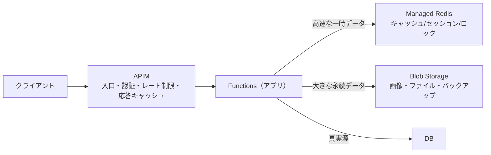
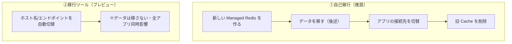

# Week 8 — 応用パターンと運用・移行

> **Phase 2b** | 学習プラン Week 8 / 9
> 学習目標：キャッシュ以外の代表的な使い方（Pub/Sub・分散ロック・レート制限・セッション・リーダーボード）を説明でき、APIM/Storage との役割分担を整理でき、監視メトリクスとベストプラクティス、Cache for Redis → Managed Redis 移行の道筋が分かる

---

## 0. 今週の位置づけ

ここまでは Redis を主に「**読み取りキャッシュ**」として見てきた。だが Redis は **アプリの土台部品**としても強力。今週は (A) 代表的な応用パターン、(B) Azure サービスとの連携、(C) 監視・運用・移行をまとめて扱う。最終 Week 9 の実装の「広がり」を知る回。

---

## 1. 応用パターン（キャッシュ以外の使い方）

### 1-1. Pub/Sub（発行・購読）

メッセージを「発行（publish）」すると、購読（subscribe）している全員に**即時配信**される仕組み。リアルタイム通知・チャット・キャッシュ無効化の合図などに使う。

```bash
# 購読側（チャンネル news を待ち受け）
SUBSCRIBE news
# 発行側（news に流すと、購読者全員に届く）
PUBLISH news "hello"
```

> **コマンドの読み方**：`PUBLISH`＝チャンネルにメッセージを流す／`SUBSCRIBE`＝チャンネルを待ち受ける。Pub＝Publisher（発行者）、Sub＝Subscriber（購読者）。
>
> **Stream（Week2 §6）との違い**：Pub/Sub は「**今いる購読者にだけ届く・履歴は残らない**」（テレビの生放送）。Stream は「**記録が残り後から読める・消費位置を管理**」（録画）。確実に届けたいなら Stream、即時通知でよければ Pub/Sub。

> **重要な概念の区別：Redis Pub/Sub と Azure Service Bus などの違い**
> 「メッセージを配る」点は同じだが、**取りこぼしをどう扱うか**が根本的に違う。
>
> | 観点 | **Redis Pub/Sub** | **Azure Service Bus** | 参考: Event Grid / Event Hubs |
> |---|---|---|---|
> | 永続化 | なし（メモリのみ） | あり（保持） | あり |
> | 配信保証 | at-most-once（届かないことも） | at-least-once（確実に最低1回） | at-least-once |
> | 購読者不在時 | **消える**（その場の購読者だけ） | **キューに溜まり後で受信** | 再試行/保持 |
> | 失敗の救済 | なし | デッドレター（失敗を退避） | 再試行/再読込 |
> | 速さ | 超低遅延（μs級） | 数ms〜 | 高スループット/配信 |
> | 向く用途 | アプリ内の即時通知・キャッシュ無効化の合図 | システム間の**確実な業務連携**（注文・決済） | イベント配信 / 大量テレメトリ |
>
> ```text
>   Pub/Sub : PUBLISH した瞬間に「今いる購読者」だけに配る。居なければ消える（生放送）
>   Service Bus: キューに永続化。受信側が落ちても復帰後に受け取れる・失敗はデッドレターへ（書留郵便）
> ```
>
> **使い分け**：軽い即時シグナル→Pub/Sub、確実な業務メッセージ→Service Bus、イベント配信→Event Grid、大量ストリーム→Event Hubs。Redis 内で確実性が欲しいなら **Stream**（永続・消費位置管理）。
> ※ Service Bus / Event Grid / Event Hubs の深掘りは別途 messaging 教材で扱う。ここは Redis Pub/Sub との立ち位置の違いを押さえれば十分。

### 1-2. 分散ロック（排他制御）

複数サーバが**同時に同じ処理をしない**ための「鍵」。Week3 §5 の再計算ロック（スタンピード対策）の正体がこれ。

```bash
SET lock:job1 <ランダム値> NX EX 10   # 取れたら処理、取れなければ他が処理中
```

> **コマンドの読み方**：`NX`＝Not eXists＝**そのキーが無いときだけ**セット（＝最初の1人だけ成功）。`EX 10`＝10秒で自動解放（持ったまま落ちても固まらない）。「`SET ... NX EX` で鍵を取り、終わったら `DEL` で返す」が定石。
>
> たとえ：トイレの鍵。`NX` で「空いていれば入る」、`EX` で「鍵を持ったまま倒れても一定時間で自動解錠」。

### 1-3. レート制限（流量制御）

「1ユーザー 1分間に N 回まで」を Redis のカウンタ（Week2 §1）で実現。API 保護の定番。

```bash
INCR rate:user1       # アクセスのたびに +1
EXPIRE rate:user1 60  # 初回だけ60秒の窓を設定 → 窓内のカウントが上限超えたら拒否
```

> APIM のレート制限ポリシー（学習済み）も、内部はこの「カウンタ＋TTL」の発想。アプリ層で細かく制御したいときは Redis で自前実装する。

> **アーキテクチャ補足：レート制限はどう実施されるか**
> 「**重い処理（DB・本処理）に入る前の門番**」として、まず Redis のカウンタを見て弾く。
>
> ```mermaid
> flowchart TB
>     REQ["リクエスト"] --> ID["誰からか識別（ユーザーID / APIキー / IP）"]
>     ID --> INCR["Redis: INCR rate:user1（窓内カウント+1）"]
>     INCR --> CHK{"上限超？"}
>     CHK -->|"超過"| REJECT["429 で即拒否（DB にも本処理にも行かない）"]
>     CHK -->|"OK"| PROC["本処理へ → 必要なら DB/キャッシュ"]
> ```
>
> **キーは「何で1人とみなすか」**：ログイン済みなら `rate:user1`、API なら `rate:apikey:xxx`、未ログインなら `rate:ip:1.2.3.4`。必ずしもログインセッションは要らない（IP で匿名も制限可）。
>
> **なぜ Redis か**（アプリのメモリ変数ではダメな理由）：
> - **複数サーバで合算**：Web サーバが3台でも全台が共通の Redis を見るので「ユーザー全体で60回」を正しく数える。各サーバのメモリだと台数分すり抜ける。
> - **同時アクセスで壊れない**：`INCR` がアトミック（Week2 §1）。
> - **窓の自動リセット**：`EXPIRE`（TTL）で「60秒で0に戻す」を自動化。
>
> **層の住み分け**：入口の粗い制限は APIM のレート制限ポリシー（中身は同じカウンタ＋TTL）、アプリ内の細かい制限は Redis 自前（§2）。
> ※ `INCR`+`EXPIRE` は最も単純な「固定窓」方式。実務ではスライディングウィンドウ等も使うが、核は「Redis の共有カウンタ」で同じ。

### 1-4. セッションストア / リーダーボード

- **セッションストア**（Week5 §0）：ログイン状態を全サーバで共有。TTL で自動失効
- **リーダーボード**（Week2 §5）：Sorted Set でランキングを即時集計。`ZINCRBY` でスコア加算→`ZREVRANGE` で上位取得

---

## 2. Azure サービスとの役割分担

Redis 単体ではなく、APIM・Storage と**組み合わせて**使う。どれに何をさせるかの整理。



| サービス | 得意 | Redis との関係 |
|---|---|---|
| **APIM** | 入口での認証・レート制限・**応答キャッシュ** | APIM 内蔵キャッシュの外部バックエンドに Redis を使える。役割が重なる部分は「入口は APIM、アプリ内は Redis」で住み分け |
| **Blob Storage** | 大きい・消えたら困るデータの永続保管 | 「重い実体は Blob、URL や一時データは Redis」。Week1 で学んだ RDB と Blob の住み分けと同じ発想 |
| **DB** | 検索・整合性・真実源 | Redis はその前のキャッシュ |

> **重要な概念の区別：APIM の応答キャッシュ と Redis**
> APIM は「**HTTP 応答まるごと**」を入口でキャッシュ（同じリクエストに即応答）。Redis は「**アプリ内部の任意のデータ**」を細かくキャッシュ。粒度と層が違う。両方使うことも多い。

---

## 3. 監視メトリクス（何を見るか）

Week6 §5 で「メモリと CPU は別軸」と学んだ。運用ではこれらを継続監視する。

| メトリクス | 何が分かる | 高いときの対処 |
|---|---|---|
| **Used Memory（メモリ使用率）** | 容量の逼迫 | サイズアップ/MemoryOptimized/Flash・TTL/eviction 見直し（Week4/6） |
| **Server Load（サーバ負荷／CPU）** | 処理の逼迫 | ComputeOptimized・スケールアウト・重いコマンド是正（Week6） |
| **Connected Clients（接続数）** | 接続の張りすぎ | 接続プール・接続使い回し（§4） |
| **Cache Hits / Misses** | キャッシュ効率 | miss 過多なら TTL/対象データ見直し（Week3） |
| **Evicted Keys（追い出し数）** | メモリ不足の兆候 | 容量 or eviction 方針見直し（Week4） |

- Week 9 の Bicep は診断設定で **`AllMetrics` を Log Analytics へ**送る（Week 8 のこの監視のため）
- しきい値を超えたら**アラート**を出す（特に `noeviction` 運用ではメモリ逼迫＝書き込み停止の前兆・Week4 §3）

> **初学者向け用語補足：接続（コネクション）とは／「張りすぎ」とは何か**
> **接続＝クライアントと Redis の間に張る TCP の通信路（ソケット）**。電話の「回線をつなぎっぱなしにする」イメージ。`Connected Clients` は今つながっている回線の本数。
>
> **どう作られるか**（`redis.Redis(...)` で繋ぐとき内部で起きること）：
> ```text
>   ① TCP 接続を開く → ② TLS ハンドシェイク（暗号化・Week7） → ③ 認証（AUTH・Week7） → ④ 通話可能
> ```
> ①〜③は**毎回そこそこ重い**（複数往復＋暗号計算＋認証）。だから「コマンドごとに繋いで切る」と無駄。
>
> **どう解放されるか**：クライアントが `QUIT`/`close()` する／プロセスが死ぬ／アイドルタイムアウト／TCP切断。**閉じないと開いたまま残る**。
>
> **「張りすぎ」の典型**：
> - ① リクエストごとに新規接続して閉じない（特に Functions で関数内 `redis.Redis(...)`）→ 毎秒大量の回線が積み上がる
> - ② 接続リーク（`close` 忘れでじわじわ増える）
> - ③ インスタンス数 × プール本数の掛け算（100台×50本＝5000本）で SKU の**最大接続数**を超え、新規接続が拒否される
>
> **なぜ問題か**：各接続が Redis のメモリと OS リソースを食い、シングルスレッド（Week6 §5）には管理負荷。上限超で**既存ユーザーも繋げなくなる**。
>
> **対策＝接続を使い回す（コネクションプール）**：最初に接続を1つ作り全リクエストで再利用する。Functions ではクライアントを**モジュールのグローバル**に1回だけ生成（Week 9 の `_r = redis.Redis(...)` がこれ）。準備は初回だけ・本数が安定する（§4）。

---

## 4. ベストプラクティス（落とし穴回避）

> **初学者向け用語補足：コネクションプールのイメージ（社用車プール）**
> 会社の「共用車5台の駐車場」を思い浮かべる。外出のたびに新車を買わず、**駐車場から1台借りて→用が済んだら返す→次の人がまた使う**。車＝接続（TCP+TLS+認証まで済んだ通信路）。
>
> ```text
>   プール（最大5本）：[接続1][接続2][接続3][接続4][接続5]  ← 準備済みで待機
>      ↑借りる(acquire)              ↓返す(release・閉じない！)
>   リクエスト来たら1本借りてコマンド実行 → 終わったらプールに戻す
> ```
>
> | 操作 | 意味 | 社用車のたとえ |
> |---|---|---|
> | 借りる(acquire) | 空き接続を1本取る | 駐車場から車を出す |
> | 使う | その接続でコマンド送受信 | 運転して用事を済ます |
> | 返す(release) | プールに戻す（**close しない**） | 車を駐車場に戻す |
> | 上限到達 | 空くまで待つ（or エラー） | 全部出払ってたら待つ |
>
> **旨み**：①重い準備（TCP/TLS/認証・Week7）は**作る1回だけ**、借りるときは即実行。②本数は「最大プールサイズ」で頭打ち＝**張りすぎない**（最大接続数を超えない）。③同時リクエストは別々の接続を借りて並行で捌ける。
> **Week 9 との関係**：redis-py の `redis.Redis(...)` は内部にプールを持つので、`_r = redis.Redis(...)` を**関数の外で1回だけ**作って使い回せば自動で借りる/返すをやる。関数内で毎回作るとプールごと作り直しで台無し。

| 観点 | 推奨 |
|---|---|
| **接続** | 接続を**使い回す**（毎リクエスト張り直さない）。Week 9 のコードもクライアントを1つ作って再利用。仕組みは下のコネクションプール補足を参照 |
| **リトライ** | フェイルオーバー（Week5）で一瞬切れるので**再接続・リトライ**を実装 |
| **重いコマンド** | `KEYS`・大きな `SINTER`/`SORT` を本番で避ける（`SCAN` を使う・Week4 §5） |
| **TTL を必ず** | 放置キーでメモリを食わない（Week4 §4） |
| **キーレス認証** | アクセスキーでなく Entra ID（Week7） |
| **小さく始める** | `Balanced_B0` から、メトリクスを見てスケール（Week6 §5） |

---

## 5. Cache for Redis → Managed Redis 移行

既存の Azure Cache for Redis（従来）から、新しい Managed Redis へ移す道筋。大きく2つ。



### データの移し方（自己移行）

| 方法 | 仕組み | 向く場面 |
|---|---|---|
| **RDB エクスポート/インポート** | 旧キャッシュの RDB スナップショット（Week5 §3）を取り、Storage 経由で新キャッシュへ取り込む | 一括移行・短時間の停止が許せる |
| **Dual-write（二重書き）** | アプリが**新旧両方に書き込み**、新が十分埋まったら読み書きを新へ切替 | **無停止に近い**移行 |
| **カスタム** | プログラムで旧から読み新へ書く | 細かい制御が要るとき |

### 移行前のサイジング

> 旧キャッシュの **Used Memory（メモリ使用率）** を Azure Monitor で確認し、実使用が小さければ**より小さい（安い）Managed Redis SKU** を選べる（Week6 §5 のサイジングと同じ）。「同じ性能をより安く」が Managed Redis の売り（Week6 §4）。

> **コマンドの読み方**：`SAVE`／`BGSAVE`＝RDB スナップショットを今すぐ作る（`BG`＝BackGround＝バックグラウンドで・本番はこちら）。移行で旧キャッシュの中身をファイル化するのに使う。

---

## ハンズオン チェックリスト

- [ ] Pub/Sub と Stream の違い（履歴の有無）を説明できる
- [ ] `SET ... NX EX` で分散ロックを取る仕組みを説明できる
- [ ] レート制限を「カウンタ＋TTL」で説明できる
- [ ] APIM の応答キャッシュと Redis の住み分けを言える
- [ ] 監視すべきメトリクス（メモリ/負荷/hit率/eviction）を挙げられる
- [ ] 接続使い回し・リトライ・重いコマンド回避を説明できる
- [ ] Cache for Redis → Managed Redis の移行方法（自己移行/dual-write）を説明できる

---

## 自己チェック

1. **Pub/Sub と Stream はどう使い分けるか？**
   - キーワード：履歴が残らない（即時）vs 残る（消費位置管理）／生放送 vs 録画
2. **分散ロックを `SET ... NX EX` で実装する理由は？**
   - キーワード：NX＝最初の1人だけ／EX＝持ったまま落ちても自動解放
3. **レート制限はどのデータ型と仕組みで作るか？**
   - キーワード：INCR カウンタ＋EXPIRE 窓／上限超で拒否
4. **APIM の応答キャッシュと Redis キャッシュの違いは？**
   - キーワード：HTTP応答まるごと（入口）vs アプリ内部の任意データ（細粒度）
5. **運用で監視すべき主なメトリクスを3つ挙げよ。**
   - キーワード：メモリ使用率／サーバ負荷／hit-miss・eviction
6. **Cache for Redis から無停止に近い移行をするには？**
   - キーワード：dual-write（新旧両方に書く）／新が埋まったら切替

---

## 次週の予告（Week 9・最終）

- **実装 capstone**：これまでの全部を1つに：
  - **Bicep**：Managed Redis（Balanced_B0）＋監視＋Entra IDアクセスポリシー（Week6/7/8）
  - **Python Functions**：Cache-Aside の Items API（Week3）＋キーレス認証（Week7）
  - **E2E テスト**：miss → hit → 無効化 → 再 miss（Week3）を検証
