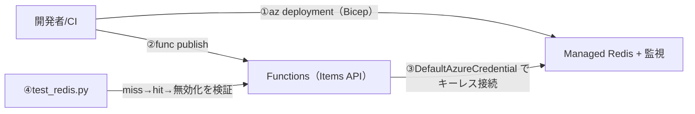

# Week 9 — 実装：Bicep + Python Function + E2E テスト

> **Phase 2b** | 学習プラン Week 9 / 9（最終）
> 学習目標：これまでの全知識を1つに統合し、**Managed Redis を Bicep でデプロイ → Functions で Cache-Aside を実装 → E2E テストで miss→hit→無効化を検証**できる

---

## 0. 今週の位置づけ

最終週は **手を動かして全部つなぐ** capstone。Week1〜8 の概念が、実際のコードのどこに対応するかを確かめる。成果物は3つ。

| 成果物 | ファイル | 対応する週 |
|---|---|---|
| **IaC（Bicep）** | `redis/infra/main.bicep` | Managed Redis(W1/6)・監視(W8)・Entra ID 認可(W7) |
| **アプリ（Functions）** | `redis/code/function_app/function_app.py` | Cache-Aside(W3)・キーレス認証(W7)・接続使い回し(W8) |
| **E2E テスト** | `redis/code/test_redis.py` | miss→hit→無効化(W3) |



---

## 1. インフラ（`infra/main.bicep`）

デプロイするもの：**Managed Redis 本体＋データベース＋監視（Log Analytics/App Insights）＋（任意の）Entra ID アクセスポリシー割り当て**。

### 主要ポイント（既習との対応）

```bicep
resource redis 'Microsoft.Cache/redisEnterprise@2024-10-01' = {
  sku: { name: skuName }            // 既定 Balanced_B0（W6：最小・学習用）
  properties: { minimumTlsVersion: '1.2' }   // W7：TLS 1.2 以上必須
}

resource redisDb 'Microsoft.Cache/redisEnterprise/databases@2024-10-01' = {
  parent: redis
  name: 'default'
  properties: {
    clientProtocol: 'Encrypted'     // W7：TLS 必須
    port: 10000                     // W1：Managed Redis 既定ポート
    clusteringPolicy: 'OSSCluster'  // W6：OSS クラスタ互換
    evictionPolicy: 'VolatileLRU'   // W4：TTL付きから LRU で追い出す
    persistence: { aofEnabled: false, rdbEnabled: false }  // W5：キャッシュなので永続化なし
  }
}
```

- **アクセスポリシー割り当て**（W7）：`principalId` を渡したときだけ作成。Functions のマネージドID に `default`（Data Owner）を与え、キーレス接続を成立させる
- **監視**（W8）：Log Analytics + Application Insights を作り、診断設定で `AllMetrics` を送る
- **出力**：`redisHostName` / `redisPort` を出す（アプリの環境変数に使う）

> **コマンドの読み方**：`Microsoft.Cache/redisEnterprise`＝Managed Redis のリソース種別（従来 Cache for Redis は `Microsoft.Cache/redis`・W6）。`@2024-10-01`＝API バージョン。`parent: redis`＝このデータベースは redis クラスタの**子リソース**（W6：クラスタ＋DB の2階層）。

---

## 2. アプリ（`function_app.py`）— Cache-Aside

`GET /api/items/{id}` と `DELETE /api/items/{id}` の2本。Week3 の Cache-Aside をそのまま実装する。

### 接続（キーレス・W7／プール・W8）

```python
from redis_entraid.cred_provider import create_from_default_azure_credential

_cred_provider = create_from_default_azure_credential(("https://redis.azure.com/.default",))
_r = redis.Redis(host=REDIS_HOST, port=10000, ssl=True,
                 credential_provider=_cred_provider, decode_responses=True)
```

- `DefaultAzureCredential`（`redis-entraid` 経由）で**トークン認証**。ローカルは `az login`、本番は Functions のマネージドID（W7）
- `_r` を**関数の外で1回だけ**生成＝接続を使い回す（W8 のコネクションプール）
- `ssl=True` / `port=10000`（W7：TLS 必須・既定ポート）

### 読み取り（Cache-Aside・W3）

```python
cached = _r.get(key)
if cached is not None:
    return _json({"item": json.loads(cached), "cache": "hit"}, 200)   # hit：そのまま返す
item = _db_lookup(item_id)                                            # miss：擬似DBから取得
_r.set(key, json.dumps(item), ex=TTL_SECONDS)                        # TTL付きで充填（W2/3）
return _json({"item": item, "cache": "miss"}, 200)
```

### 無効化（W3 §6）

```python
@app.route(route="items/{id}", methods=["DELETE"])
def invalidate_item(req):
    _r.delete(f"item:{item_id}")   # DEL で無効化 → 次の GET は miss で再充填
```

> **コマンドの読み方（コード内）**：`_r.get`/`_r.set(..., ex=60)`/`_r.delete`/`_r.ping` は、それぞれ Redis の `GET`/`SET ... EX 60`/`DEL`/`PING`（W2）。レスポンスの `cache: "hit"/"miss"` で Cache-Aside の動きを外から確認できるようにしている。

---

## 3. E2E テスト（`test_redis.py`）

Week3 の **miss → hit → 無効化 → 再 miss** をそのまま検証する。

```python
# 1. 1回目 GET → cache=miss（充填）
assert r.json()["cache"] == "miss"
# 2. 2回目 GET → cache=hit（Redisから即返る）
assert r.json()["cache"] == "hit"
# 3. DELETE → 無効化
# 4. 無効化後の GET → 再び cache=miss（再充填）
assert r.json()["cache"] == "miss"
```

これが通れば、Cache-Aside の「載る・効く・消える・再び載る」が end-to-end で動いた証拠。

---

## 4. デプロイ手順

```bash
# ① インフラをデプロイ
az group create -n rg-redis-learn -l japaneast
az deployment group create -g rg-redis-learn \
  --template-file redis/infra/main.bicep \
  --parameters redis/infra/main.bicepparam

# 出力された redisHostName を控える
```

```bash
# ② Functions を発行し、環境変数を設定
#    REDIS_HOST_NAME に ① の redisHostName を設定
func azure functionapp publish <func-app-name>
az functionapp config appsettings set -g rg-redis-learn -n <func-app-name> \
  --settings REDIS_HOST_NAME=<hostName> REDIS_PORT=10000

# ③ Functions のマネージドID を Redis に認可（W7）
#    principalId を取得して main.bicepparam に入れ、再デプロイ（or Portal でアクセスポリシー割当）
az functionapp identity assign -g rg-redis-learn -n <func-app-name>
```

```bash
# ④ E2E テスト
export FUNC_BASE_URL="https://<func-app-name>.azurewebsites.net/api"
export FUNC_KEY="<function key>"
python redis/code/test_redis.py     # → All E2E assertions passed.
```

> ⚠️ 学習が終わったら `az group delete -n rg-redis-learn` で**まるごと削除**して課金を止める。

---

## 5. ローカルでの検証（デプロイ前）

実デプロイなしに確認できる範囲：

```bash
# Bicep がコンパイルできるか
az bicep build --file redis/infra/main.bicep

# Python の構文チェック
python -m py_compile redis/code/function_app/function_app.py redis/code/test_redis.py
```

---

## ハンズオン チェックリスト

- [ ] `az bicep build` で Bicep が通った
- [ ] Managed Redis をデプロイし、`redisHostName` を取得できた
- [ ] Functions を発行し、マネージドID にアクセスポリシーを割り当てた（キーレス接続）
- [ ] `test_redis.py` で miss→hit→無効化→再miss が全て通った
- [ ] Bicep の各設定（TLS/ポート/eviction/永続化）が Week4〜7 のどれに対応するか説明できる
- [ ] 学習後にリソースグループを削除して課金を止めた

---

## 自己チェック

1. **Bicep の `evictionPolicy: 'VolatileLRU'` / `persistence:false` は、それぞれ何週の判断か？**
   - キーワード：W4（TTL付きから LRU 追い出し）／W5（キャッシュは永続化不要）
2. **コードが `DefaultAzureCredential` を使うと、ローカルと本番でどう振る舞うか？**
   - キーワード：ローカル=az login／本番=マネージドID／コード共通・キーレス（W7）
3. **`GET /api/items/{id}` の miss と hit で、内部で何が起きるか？**
   - キーワード：hit=Redisから即返す／miss=擬似DB取得→SET EX で充填（W3）
4. **`_r` を関数の外で1回だけ作るのはなぜか？**
   - キーワード：接続を使い回す／コネクションプール／張りすぎ防止（W8）
5. **E2E テストが検証している4ステップは？**
   - キーワード：miss→hit→DELETE 無効化→再 miss（W3）

---

## 修了にあたって（全9週の振り返り）

- **W1-2 基礎**：なぜキャッシュか／データ型と TTL
- **W3-4 設計**：Cache-Aside・無効化／メモリと eviction・キー設計
- **W5-6 規模と堅牢性**：可用性・永続化・geo／スケールと階層選択
- **W7-8 守りと運用**：セキュリティ・ネットワーク／応用パターン・監視・移行
- **W9 統合**：Bicep + Functions + E2E で Cache-Aside を end-to-end に動かす

> ここから先：Stream のコンシューマグループ、Active-Active geo、RediSearch などのモジュール、本番のスケール設計など、各週の「将来テーマ」を深掘りしていける。土台はこの9週で固まった。
