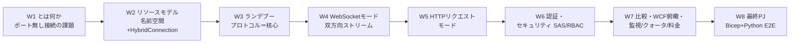
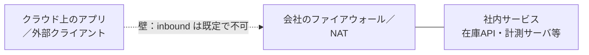
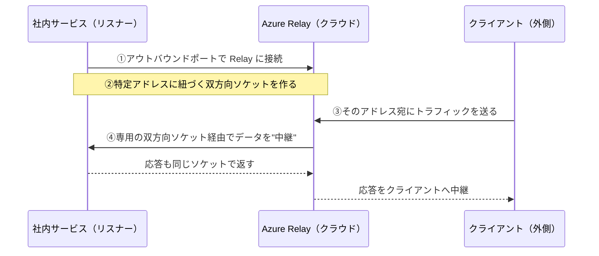
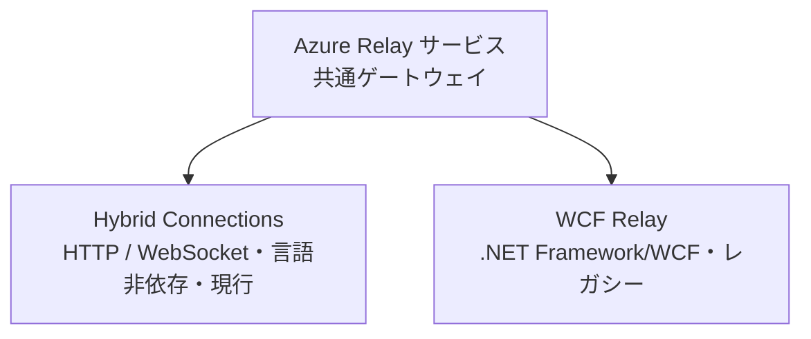

# Week 1 — Azure Relay とは何か：ファイアウォールの穴を開けず、社内ネットワークの内側で動くサービスを外から呼べるようにする仕組み

> **Phase 1a** | 学習プラン Week 1 / 8
> 学習目標：Azure Relay（アジュール・リレー）が「どんな問題を解くサービスなのか」を、素朴な解法（ポート開放・VPN）と対比しながら理解する。中核となる **「インバウンドポートを一切開けずに、内側のサービスを外から呼べる」** という発想の基本フローを掴み、Relay が持つ 2 つの機能（**Hybrid Connections** と **WCF Relay**）の役割分担を言い分けられるようになる。ハンズオンでは Relay 名前空間という"器"をポータルで 1 つ作り、後の週で接続が乗る土台を目視する。

---

## 0. 今週の位置づけ

この教材は Azure Relay を **8 週**で学ぶ。全体像は次のとおり。



今週（W1）のゴールは、**プロトコルや API の書き方にはまだ立ち入らず**、「Azure Relay とは何のためのサービスか」を腹落ちさせることである。最大の"腑に落ちポイント"である**ランデブープロトコル**（インバウンドポート無しでどう双方向接続が成立するのか）は W3、リソースの作り方は W2 以降で順に深掘りする。

> **初学者向け用語補足：略語・用語の展開**
> - **Relay**（リレー）＝「中継」。運動会のリレーと同じで、直接つながれない 2 者の間に立って**バトン（データ）を受け渡す**中継役、という製品名。機能名ではなくサービス名。
> - **オンプレミス（on-premises, オンプレ）**＝ 自社の建物・データセンター内で動かすサーバやサービス。クラウド（Azure 側）に対して「手元・社内側」を指す。
> - **ファイアウォール（firewall）**＝ ネットワークの出入口で通信を許可／遮断する関所。既定では**外から中への通信（インバウンド）を厳しく塞ぐ**。
> - **インバウンド／アウトバウンド（inbound / outbound）**＝ inbound＝外から中へ入ってくる通信、outbound＝中から外へ出ていく通信。ファイアウォールは通常 outbound には寛容、inbound には厳格。ここが Relay の勘所。
> - **NAT** = Network Address Translation（Network=ネットワーク / Address=住所 / Translation=変換）＝ 社内の機器が共有の外向き IP アドレスを使うための住所変換。副作用として、**外側からは社内の個々の機器を名指しで呼べない**。
> - **VPN** = Virtual Private Network（Virtual=仮想の / Private=専用 / Network=網）＝ 公衆網の上に仮想の専用線を張り、2 つのネットワークを"地続き"にする技術。
> - **エンドポイント（endpoint）**＝ 通信の宛先となる 1 つの口（サービス・URL・ポートの組）。Relay は「1 台のマシン上の 1 つのアプリの口」だけを狙って外に出せる。

---

## 1. そもそもの課題：社内の内側にいるサービスを、外から呼びたい

あなたの会社の社内ネットワークに、業務データを返す小さなサービス（在庫 API・工場の計測サーバ・社内 DB のフロントなど）が動いているとする。これを**クラウド上のアプリや外部のクライアントから呼び出したい**。ここで壁にぶつかる。

**社内サービスは、既定で外から到達できない。** 理由は 2 つ重なっている。

- **ファイアウォールがインバウンドを塞ぐ**：外から中への接続は関所で止められる。
- **NAT の内側にいる**：そもそも外側から社内の 1 台を名指しできる固定の住所（公開 IP）を持たないことが多い。



つまり「外から社内サービスを呼ぶ」には、**このインバウンドの壁をどう越えるか**を解かねばならない。ここが Azure Relay の出発点である。

---

## 2. 素朴な解法とその限界

Relay を使わない場合、代表的な素朴解法は次の 3 つ。いずれも壁は越えられるが、代償が大きい。

| 素朴解法 | やること | 限界・代償 |
| --- | --- | --- |
| **ポート開放（穴あけ）** | ファイアウォールで特定ポートのインバウンドを許可し、社内サービスを外に公開 | **攻撃面が広がる**。公開したポートは世界中からスキャン・攻撃対象になる。固定公開 IP や DMZ 構成も要る。運用・監査の負担が重い |
| **VPN（仮想専用線）** | 社内ネットワークとクラウドを仮想専用線で"地続き"にする | **範囲が広すぎる・侵襲的**。1 つのサービスを見せたいだけなのにネットワーク全体をつなぐ。ネットワーク構成の変更が要り、設定・維持が重い |
| **ExpressRoute（専用線）** | 通信事業者経由で Azure への物理専用線を敷く | 大規模・高信頼だが**高コスト・導入が重い**。「1 台の 1 サービスを外から呼びたい」には過剰 |

> **初学者向け用語補足：DMZ / ExpressRoute**
> - **DMZ** = DeMilitarized Zone（非武装地帯）＝ 社内網とインターネットの間に置く"緩衝地帯"。公開するサーバをここに隔離するが、設計・運用が難しい。
> - **ExpressRoute**（エクスプレスルート）＝ インターネットを経由せず Azure に**物理的な専用線**でつなぐ Azure のサービス。VPN より高信頼・高帯域だが高価。

公式も、Relay と VPN の違いをこう位置づけている。

> Azure Relay は VPN のようなネットワークレベルの統合技術とは異なる。Azure relay は**単一マシン上の単一アプリケーションエンドポイントにスコープを絞れる**。VPN 技術ははるかに侵襲的で、ネットワーク環境そのものを変更することに依存する。
> （出典：[What is Azure Relay?](https://learn.microsoft.com/en-us/azure/azure-relay/relay-what-is-it)）

ポイントは**粒度**である。VPN は「ネットワークまるごと」をつなぐが、Relay は「1 台の 1 サービスだけ」を狙って外に出せる。狙撃と絨毯爆撃ほど違う。

---

## 3. Azure Relay の正体：ポートを開けずに"中継"で橋を架ける

ここで登場するのが Azure Relay である。公式の定義：

> Azure Relay サービスは、社内ネットワークで動作するサービスを**ファイアウォールのポートを開けることなく、また社内ネットワーク基盤に侵襲的な変更を加えることなく**、安全にパブリッククラウドへ公開できるようにする。
> （出典：[What is Azure Relay?](https://learn.microsoft.com/en-us/azure/azure-relay/relay-what-is-it)）

Relay が可能にするシナリオは公式いわく次の 3 つ。

- 従来型の一方向・リクエスト/レスポンス・ピアツーピア通信
- インターネット規模でのイベント配信（パブリッシュ/サブスクライブ）
- ネットワーク境界を越えた双方向・非バッファのソケット通信

### 基本フロー：なぜインバウンドポートが不要なのか

Relay の"種明かし"は、**社内サービスの側から外向き（アウトバウンド）に接続を張る**という一点にある。公式の「基本フロー」は次の 4 ステップ。



1. 社内サービスが**アウトバウンドポート**で Relay サービスに接続する。
2. 特定のアドレスに紐づいた**双方向ソケット**を作る。
3. クライアントは、そのアドレス宛にトラフィックを送ることで社内サービスと通信できる。
4. Relay サービスが、クライアント専用の双方向ソケット経由でデータを社内サービスへ *中継* する。**クライアントは社内サービスへの直接接続を必要とせず、その場所を知る必要もなく、社内サービスはファイアウォールにインバウンドポートを一切開ける必要がない。**
   （出典：[What is Azure Relay?](https://learn.microsoft.com/en-us/azure/azure-relay/relay-what-is-it)）

これが決定的な発想の転換である。**外から中へ穴を開ける**（危険）のではなく、**中から外へ出た接続を、クラウドで折り返して使う**（安全）。ファイアウォールは既定でアウトバウンドには寛容なので、社内側は何も塞がれない。

> **用語補足：リスナー（listener）とセンダー（sender）**
> - **リスナー**＝ 接続を**待ち受ける**側。ここでは社内サービス。自分から Relay へアウトバウンド接続を張り、「呼ばれる準備ができた」と表明する。
> - **センダー**＝ 接続を**開始する**側。ここでは外側のクライアント。Relay 経由でリスナーを呼ぶ。
> - この 2 役割は W2 で正式に扱い、W3 でどう出会う（＝ランデブーする）かを深掘りする。

---

## 4. Azure Relay の 2 つの機能：Hybrid Connections と WCF Relay

Azure Relay は 1 つのサービスだが、中に**2 つの機能**を持つ。公式の対比：

> Azure Relay には 2 つの機能がある。
> - **Hybrid Connections**（ハイブリッド・コネクションズ） - オープン標準の WebSocket を使い、マルチプラットフォームのシナリオを可能にする。
> - **WCF Relays**（ダブリューシーエフ・リレーズ） - Windows Communication Foundation（WCF）を使ってリモートプロシージャコールを可能にする。WCF Relay は**レガシー**のリレー機能で、多くの顧客が既に WCF プログラミングモデルで使っている。
> （出典：[What is Azure Relay?](https://learn.microsoft.com/en-us/azure/azure-relay/relay-what-is-it)）



| 観点 | Hybrid Connections | WCF Relay |
| --- | --- | --- |
| 土台のプロトコル | **HTTP と WebSocket**（オープン標準） | **WCF**（.NET のリモート通信基盤） |
| 対応言語・環境 | **任意の言語・任意のプラットフォーム**（.NET Core / Node.js / Java / ブラウザ等） | 主に **.NET Framework** |
| 位置づけ | **現行・推奨**。新規開発はこちら | **レガシー**。既存の WCF 資産向け |
| 標準ベースのオープンプロトコル | ○ | ✗ |
| RPC プログラミングモデル | ○（req/res 含む） | ○（WCF の RPC） |

> **初学者向け用語補足：WCF / RPC / WebSocket**
> - **WCF** = Windows Communication Foundation（Windows=Windows / Communication=通信 / Foundation=基盤）＝ .NET Framework 時代の通信フレームワーク。**.NET 専用**であり、これに縛られるのが WCF Relay がレガシー扱いされる理由。
> - **RPC** = Remote Procedure Call（Remote=遠隔 / Procedure=手続き・関数 / Call=呼び出し）＝ 遠くのマシンの関数を、あたかも手元の関数のように呼ぶ方式。
> - **WebSocket**（ウェブソケット）＝ 1 本の接続を張りっぱなしにして**双方向**にデータを流せる、ブラウザにも標準搭載のプロトコル。Hybrid Connections の土台。読みは「ウェブ・ソケット」。
> - **HTTP(S)** = HyperText Transfer Protocol (Secure)＝ Web の基本プロトコル。Hybrid Connections は WebSocket に加えて HTTP リクエスト転送もできる（W5）。

本教材は**現行の Hybrid Connections を中心に手を動かす**。WCF Relay は W7 で「何であり・なぜ後継が Hybrid Connections なのか」を俯瞰対比するにとどめる（.NET 専用のレガシーであり、新規採用は推奨されないため）。

> **用語補足：この 2 機能は"同居"している**
> 公式は「Hybrid Connections は既存の WCF Relay 機能を**補完**する。2 つのサービス機能（WCF Relay と Hybrid Connections）は Azure Relay サービスの中で**並存**し、**共通のゲートウェイを共有**するが、それ以外は別実装である」と述べる（出典：同上）。つまり 1 つの Relay 名前空間の下に、2 系統の中継方式がぶら下がっているイメージ。

---

## 5. 間違えやすいものとの線引き

「境界を越える／外から中へ届ける」系は紛らわしい。ここで交通整理する（詳しい使い分け表は W7 で扱う。今週は"別物"だと分かれば十分）。

| もの | 何をするか | Relay との違い |
| --- | --- | --- |
| **Azure Relay** | 社内サービスを、ポートを開けず中継で外に見せる | **1 台の 1 サービス単位**でアウトバウンド接続を折り返す。ここが主役 |
| **VPN / ExpressRoute** | ネットワーク同士を地続きにする | 粒度が"ネットワーク全体"で侵襲的。Relay は"エンドポイント単位"で軽量 |
| **Azure AD Application Proxy** | 社内 **Web アプリ**を Entra ID 認証付きで外部公開 | 対象が Web アプリ/HTTP に特化。Relay は任意の TCP 的双方向ソケットも扱える |
| **Azure Bastion** | ブラウザから VM へ安全に RDP/SSH | 対象は VM への**管理アクセス**。用途が違う |
| **Azure Service Bus** | クラウド内の**メッセージのキューイング／pub-sub**（貯める） | Relay は**リアルタイム中継**（貯めずに素通し）。Relay は元々 Service Bus 一族で、共通ゲートウェイを持つ親戚 |
| **Azure Arc** | Azure 外のサーバ等を Azure の**管理下**に載せる | 対象は"管理面の拡張"。Relay は"アプリ間通信の中継" |

> **ひとことで**：「社内の 1 サービスを、ファイアウォールに穴を開けずに外から呼びたい」なら Azure Relay。「ネットワークごとつなぐ」のが VPN/ExpressRoute、「社内 Web アプリを認証付き公開」が App Proxy、「メッセージを貯めて非同期に配る」のが Service Bus。

---

## 6. ハンズオン — Relay 名前空間という"器"を 1 つ作って眺める

今週は**まだ接続（Hybrid Connection）もリスナー/センダーも作らない**。後の週で中継が乗る**土台＝名前空間**だけを用意し、Relay がどこに現れるかを目視する。1 サブスクリプションだけで実施できる。

> **前提**：Azure サブスクリプションがあり、ポータルにサインインできること。名前空間の作成自体に大きな課金はないが、Relay は使用量（リスナー接続時間・メッセージ）で課金される（詳細は W7）。今週は接続を張らないので発生は最小。**確認後に削除**すれば費用はほぼ生じない。

### 手順 A：ポータルで Relay 名前空間を作る

1. [Azure ポータル](https://portal.azure.com) 上部の検索窓に **`Relay`** と入力し、**Relay**（サービス）を開く。
2. **「作成（Create）」** を押し、次を指定する。
   - **サブスクリプション／リソースグループ**：任意（学習用に新規 RG を作ると後片付けが楽）。
   - **名前空間名（Namespace name）**：世界で一意な名前（例 `relay-learn-<英数字>`）。これが `<名前空間名>.servicebus.windows.net` というホスト名になる。
   - **リージョン（Location）**：近いリージョン。
3. **「確認および作成」→「作成」** でデプロイする。

> **用語補足：なぜホスト名が `servicebus.windows.net` なのか**
> Relay は歴史的に Azure Service Bus 一族から生まれたため、名前空間のドメインが `servicebus.windows.net` を共有している。W2 で見るリソースの型名も `Microsoft.Relay/namespaces` である。「Relay なのに servicebus?」と戸惑うが、親戚関係の名残と捉えればよい。

### 手順 B：作った名前空間の中を眺める

1. デプロイ完了後、作成した Relay 名前空間を開く。
2. 左メニューに **「Hybrid Connections」** と **「WCF Relays」** の 2 つのブレードがあることを確認する。これが §4 で見た 2 機能。今週はどちらも**空**で正しい（まだ 1 件も作っていない）。
3. **「Shared access policies（共有アクセスポリシー）」** を開くと、既定で **`RootManageSharedAccessKey`** が 1 つある。これが後の認証（SAS）の起点（W6 で深掘り）。今週は「認証の鍵束がここにある」とだけ確認する。

> **なぜ中身が空で正解なのか**：今週の目的は「Relay 名前空間という器が実在し、そこに Hybrid Connections / WCF Relays という 2 つの棚があり、鍵（SAS ポリシー）が備わっている」土台の把握。実際に Hybrid Connection を 1 つ作るのは W2、リスナー/センダーで通信させるのは W3 以降。

### 手順 C：CLI で名前空間を一覧する（任意）

```bash
az relay namespace list --output table
```

> **コマンドの読み方**：`az`=Azure CLI（Command Line Interface＝コマンドライン操作）、`relay namespace list`=Relay 名前空間の一覧、`--output table`=表形式で表示。手順 A で作った名前空間が並べば成功。`az` に `relay` サブコマンドが無い場合は `az extension add --name relay` で拡張を追加する（`extension add`=拡張機能を追加）。

### 後片付け

学習用リソースグループごと削除すれば、名前空間も消えて費用は生じない。

```bash
az group delete --name <作成したRG名> --yes --no-wait
```

> **読み方**：`group delete`=リソースグループを削除、`--yes`=確認プロンプトを省略、`--no-wait`=削除の完了を待たずにコマンドを返す。**W2 で再び名前空間を使うので、続けて学習するなら削除は W2 の後でもよい。**

---

## 7. 自己チェック

以下に自分の言葉で答えられれば W1 は合格である。

1. 社内サービスを外から呼ぼうとすると、既定でなぜ届かないのか（**ファイアウォール**と **NAT** の 2 点で説明できるか）。
2. ポート開放・VPN・ExpressRoute の 3 つの素朴解法は、それぞれ何が代償になるか。
3. Azure Relay が **VPN と本質的に違う**のはどこか。「Relay は◯◯単位、VPN は◯◯単位」の形で言えるか。
4. Relay の**基本フロー 4 ステップ**を説明せよ。とりわけ「なぜ社内サービスはインバウンドポートを開けなくてよいのか」を、**アウトバウンド接続の折り返し**という言葉で言えるか。
5. **リスナー**と**センダー**は、それぞれどちらが「待ち受ける側／接続を始める側」か。この例ではどちらが社内サービスか。
6. Azure Relay の **2 つの機能**（Hybrid Connections / WCF Relay）を、プロトコル・対応言語・現行かレガシーかで言い分けられるか。
7. Relay・VPN・App Proxy・Service Bus の違いを、1 行ずつで言い分けられるか。

---

## 8. 次週予告（W2：リソースモデル＝名前空間と Hybrid Connection）

W2 では、今週「器」として眺めた名前空間の**中身**に踏み込む。Relay のリソース階層は **名前空間（`Microsoft.Relay/namespaces`）→ Hybrid Connection（中継の 1 単位）** という 2 段構造で、各 Hybrid Connection に対して **リスナー**と**センダー**が結びつく。`requiresClientAuthorization`（センダー側にも認可を要求するか）や、認可ルール（SAS ポリシー）の枠を理解する。ポータルで実際に Hybrid Connection を 1 つ作り、リスナー/センダーが乗る"レール"を用意する。これが W3 の「ランデブープロトコルで実際に接続を成立させる」の前提になる。

---

### 参考（出典）
- [What is Azure Relay?（概要）](https://learn.microsoft.com/en-us/azure/azure-relay/relay-what-is-it)
- [Azure Relay Hybrid Connections protocol guide（プロトコルガイド）](https://learn.microsoft.com/en-us/azure/azure-relay/relay-hybrid-connections-protocol)
- [Azure Relay の料金](https://azure.microsoft.com/en-us/pricing/details/service-bus/)
- [Azure Relay - Hybrid Connections samples on GitHub](https://github.com/Azure/azure-relay/tree/master/samples/hybrid-connections)
