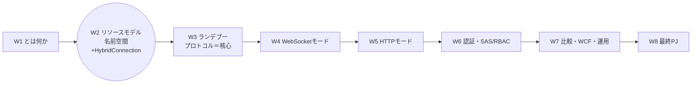
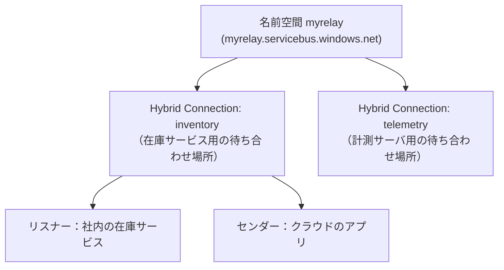
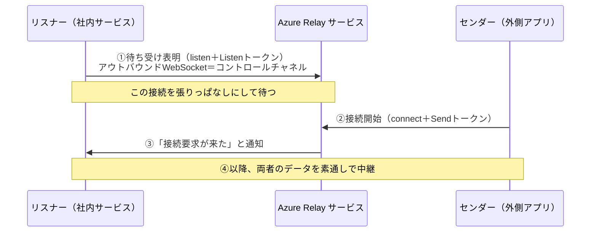
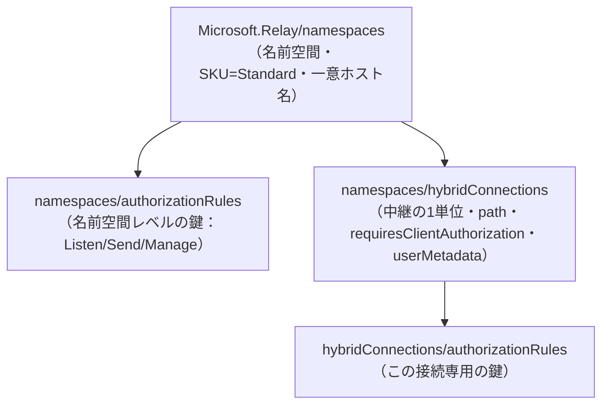

# Week 2 — リソースモデル：名前空間と Hybrid Connection、そして「リスナー／センダー」という 2 つの役割

> **Phase 1b** | 学習プラン Week 2 / 8
> 学習目標：Azure Relay のリソースが **名前空間（namespace）→ Hybrid Connection（中継の 1 単位）** という 2 段構造でできていることを理解する。各 Hybrid Connection に結びつく **リスナー（待ち受ける側）／センダー（接続を始める側）** の 2 役割、`requiresClientAuthorization`（センダーにも認可を要求するか）、認可ルール（SAS ポリシー）の枠を掴む。ハンズオンでは W1 で作った名前空間の中に Hybrid Connection を実際に 1 つ作り、接続文字列を取り出して、W3 以降でリスナー／センダーが乗る"レール"を用意する。

---

## 0. 今週の位置づけ



W1 では「Relay とは何か」を掴み、名前空間という**器**を 1 つ作った。今週（W2）は、その器の中に入る**部品（Hybrid Connection）と役割（リスナー／センダー）**を整理する。**「どう接続が成立するか」の内部プロトコルは W3**、**認証（SAS 署名）の中身は W6** で深掘りするので、今週は**リソースの地図と役割分担**に集中する。

> **初学者向け用語補足：略語・用語の展開**
> - **名前空間（namespace, ネームスペース）**＝ 関連するリソースをひとまとめにする**入れ物・スコープの単位**。Relay では「1 つのアプリ／1 つの用途」に 1 名前空間、が目安。
> - **エンティティ（entity）**＝ 名前空間の中に作る個々の実体。Relay では Hybrid Connection や WCF Relay が「エンティティ」。
> - **SAS** = Shared Access Signature（Shared=共有の / Access=アクセス / Signature=署名）＝ 「この鍵で・この範囲に・この操作を許す」を表す署名付きトークンによるアクセス制御方式。W6 で中身を分解する。今週は「認可ルール＝鍵の定義」という枠だけ押さえる。
> - **プリンシパル（principal）**＝ 「誰が」に当たる主体（ユーザー・アプリ・鍵）。Relay の SAS では「鍵の名前（ポリシー）」がこれに近い役割を持つ。
> - **冪等（べきとう, idempotent）**＝ 同じ操作を何度実行しても結果が同じこと。名前空間・Hybrid Connection の作成は名前で一意なので、同名で作り直しても増殖しない。

---

## 1. 名前空間 ＝ すべての Relay 部品を束ねるスコープの器

公式の定義：

> 名前空間は、すべての Azure Relay コンポーネントの**スコープを区切るコンテナ**である。1 つの名前空間には複数のリレーを置くことができ、名前空間はしばしばアプリケーションのコンテナとして機能する。
> （出典：[Create a Relay namespace using the Azure portal](https://learn.microsoft.com/en-us/azure/azure-relay/relay-create-namespace-portal)）

ポイントは 3 つ。

- **一意なホスト名を持つ**：名前空間を `myrelay` と名付けると、`myrelay.servicebus.windows.net` という**世界で一意な FQDN（Fully Qualified Domain Name＝完全修飾ドメイン名）**になる。すべての接続先 URL はこのホスト名から始まる。
- **課金・認可・エンティティの境界**：SKU（料金プラン）・共有アクセスポリシー（鍵）・作成できるエンティティは、この名前空間単位で管理される。
- **アプリ 1 つ＝名前空間 1 つが目安**：複数の Hybrid Connection を 1 名前空間に同居させられる。用途・環境（本番／検証）ごとに名前空間を分けるのが定石。

> **用語補足：なぜ Relay の SKU は「Standard」だけなのか**
> Relay 名前空間の SKU（Stock Keeping Unit＝料金・機能のプラン）は **Standard** のみ（Bicep では `sku: { name: 'Standard', tier: 'Standard' }`）。Storage や Service Bus のような Basic/Premium 階層は無い。したがって「どの SKU にするか」で悩む余地がなく、リージョンと名前だけ決めればよい。

---

## 2. Hybrid Connection ＝ 中継の「1 単位」

名前空間の中に作る主役のエンティティが **Hybrid Connection** である。これは「**1 本の中継の待ち合わせ場所**」を表す。公式（プロトコルガイド）はこれを **ランデブーポイント（rendezvous point）** と呼ぶ。

> Hybrid Connections リレーは、両者がそれぞれ自分のネットワークの視点から発見・接続できる**ランデブーポイントをクラウド内に提供**することで、2 者を結びつける。このランデブーポイントは、ドキュメント・API・Azure ポータルで「**Hybrid Connection**」と呼ばれる。
> （出典：[Hybrid Connections protocol guide](https://learn.microsoft.com/en-us/azure/azure-relay/relay-hybrid-connections-protocol)）

各 Hybrid Connection は **名前（path）** を持つ。この名前が接続先 URL の一部になる。



リソースの型と主なプロパティ（ARM/Bicep 表記）：

| 項目 | 値・意味 |
| --- | --- |
| リソース型 | `Microsoft.Relay/namespaces/hybridConnections`（名前空間の**子リソース**） |
| `name`（＝path） | Hybrid Connection の名前。接続 URL の `$hc/<name>` 部分になる。必須・最小 1 文字 |
| `requiresClientAuthorization` | センダー側にも認可を要求するか（bool）。§4 で詳説 |
| `userMetadata` | 任意の説明用文字列を格納できる置き場（例：担当チーム・連絡先・設定メモ） |

> **用語補足：`userMetadata`（ユーザーメタデータ）とは**
> 公式いわく「ユーザーメタデータは、Hybrid Connection エンドポイントに紐づく**ユーザー定義の文字列データを格納するためのプレースホルダ**である。たとえば担当チームとその連絡先の一覧など、説明的なデータの保存に使える。ユーザー定義の設定値の保存にも使える」（出典：[hybridConnections Bicep reference](https://learn.microsoft.com/en-us/azure/templates/microsoft.relay/namespaces/hybridconnections)）。機能には影響しない**メモ欄**。運用上「この接続は何用か」を残せるので便利。

> **用語補足：接続先 URL の形（今週は"形"だけ押さえる）**
> Hybrid Connection の待ち合わせ URL は、役割ごとに `sb-hc-action`（エスビー・エイチシー・アクション）が変わる。
> - リスナー（待ち受け）：`wss://myrelay.servicebus.windows.net/$hc/inventory?sb-hc-action=listen&sb-hc-token=...`
> - センダー（接続開始）：`wss://myrelay.servicebus.windows.net/$hc/inventory?sb-hc-action=connect&sb-hc-token=...`
>
> `wss` = WebSocket Secure（WebSocket の TLS 暗号化版）、`$hc` = Hybrid Connection の固定パス、`inventory` = Hybrid Connection 名（path）、`sb-hc-token` = SAS トークン。**この URL をどう使って接続が成立するか（＝ランデブー）が W3 の核心**。今週は「URL は名前空間ホスト名＋`$hc/`＋接続名＋アクション＋トークンでできている」と分かれば十分。

---

## 3. リスナー（listener）とセンダー（sender）という 2 つの役割

Hybrid Connection には、必ず**両側**がいる。公式はこの用語を厳密に定義している。

> 接続の両側のプログラムはどちらも「**クライアント**」と呼ばれる。サービスに対するクライアントだからである。**接続を待って受理する**クライアントが「**リスナー**（listener role）」。サービス経由で**リスナーに向けて新しい接続を開始する**クライアントが「**センダー**（sender role）」である。
> （出典：[Hybrid Connections protocol guide](https://learn.microsoft.com/en-us/azure/azure-relay/relay-hybrid-connections-protocol)）



役割の要点（W3 で内部を深掘りするので、今週は"誰が何担当か"だけ）：

| 役割 | 誰が担うことが多いか | 何をするか | 必要な権限 |
| --- | --- | --- | --- |
| **リスナー** | 社内サービス（NAT/FW の内側） | 先にアウトバウンド接続を張り「受理準備 OK」と表明し、来た接続を受理／拒否する | **Listen** |
| **センダー** | クラウド／外部のクライアント | リスナーに向けて接続を開始する | **Send**（既定。§4） |

> **用語補足：コントロールチャネルと「リスナーは最大 25」**
> リスナーが待ち受け表明のために張るアウトバウンド WebSocket は、そのまま **コントロールチャネル（control channel＝制御用の常設通路）** として維持される。公式は「サービスは 1 つの Hybrid Connection に対して**最大 25 の同時リスナー**を許可する。アクティブなリスナーが 2 つ以上ある場合、着信接続はそれらにランダム順で分散され、ベストエフォートで公平な分配が試みられる」と述べる（出典：protocol guide）。**つまり 1 つの Hybrid Connection に複数のリスナーをぶら下げて負荷分散・冗長化できる**。この「複数リスナー」の挙動は W4 で扱う。

---

## 4. `requiresClientAuthorization`：センダーにも認可を要求するか

Hybrid Connection の重要な設定が **`requiresClientAuthorization`**（クライアント認可を要求するか）である。公式の定義は素っ気ない：

> `requiresClientAuthorization`：この Hybrid Connection でクライアント認可が必要なら true を返す。そうでなければ false。
> （出典：[hybridConnections Bicep reference](https://learn.microsoft.com/en-us/azure/templates/microsoft.relay/namespaces/hybridconnections)）

意味を役割で言い直すと次のとおり。ここでいう「クライアント」は**センダー**を指す。

| 設定 | センダー（接続を開始する外側）に何が要るか | 使いどころ |
| --- | --- | --- |
| **`true`（既定）** | センダーも **Send トークンを提示**しないと接続できない | 通常。呼ぶ側を認証で絞りたい |
| **`false`** | **匿名センダー**を許可。トークン無しでも接続できる | 誰でも呼べる公開エンドポイントにしたいとき（限定的） |

公式（プロトコルガイド）も同じことを述べる。

> Relay エンドポイントでのセンダー認可は**既定で有効だが、任意（OPTIONAL）**である。Hybrid Connection の所有者は**匿名センダーを許可することを選べる**。
> （出典：[Hybrid Connections protocol guide](https://learn.microsoft.com/en-us/azure/azure-relay/relay-hybrid-connections-protocol)）

> **重要な非対称性**：`requiresClientAuthorization` が制御するのは**センダー側だけ**である。**リスナー側は常に Listen トークンが必須**（匿名リスナーという概念は無い）。理由は明白で、「誰でもリスナーになれる」と、他人の Hybrid Connection に勝手に待ち受けを差し込んで通信を横取りできてしまうため。だから**待ち受ける側（Listen）は必ず認証、呼ぶ側（Send）は任意で緩められる**、という設計になっている。

---

## 5. 認可ルール（SAS ポリシー）＝ 鍵の定義

「Listen トークン」「Send トークン」はどこから来るのか。その大元が **認可ルール（Shared access policies）** である。W1 のハンズオンで見た `RootManageSharedAccessKey` がその既定の 1 つ。

認可ルールには **3 つの権限（rights）** がある。

| 権限 | 読み | できること | 誰に渡すべきか |
| --- | --- | --- | --- |
| **Listen** | リッスン | リスナーとして待ち受ける | 社内サービス（受け手） |
| **Send** | センド | センダーとして接続を開始する | クラウド／外部クライアント（呼ぶ側） |
| **Manage** | マネージ | 上記に加えエンティティ・ルールの管理 | 管理者のみ（配布しない） |

> **用語補足：`RootManageSharedAccessKey` を配ってはいけない**
> 既定の `RootManageSharedAccessKey` は **Listen・Send・Manage の 3 権限すべて**を持つ"マスターキー"。これをリスナーやセンダーに配ると、受け手が管理操作までできてしまう。**最小権限の原則**に従い、実運用では「Listen だけの鍵」「Send だけの鍵」を個別に作って配る（この設計と SAS 署名の中身は W6 で手を動かす）。今週は「鍵は名前空間単位でも、Hybrid Connection 単位でも作れる」という枠だけ押さえる。

> **用語補足：鍵は 2 階層で作れる**
> 認可ルールは **名前空間レベル**（`Microsoft.Relay/namespaces/authorizationRules`）と **Hybrid Connection レベル**（`.../hybridConnections/authorizationRules`）の両方で作れる。名前空間レベルの鍵は配下の全エンティティに効き、エンティティレベルの鍵はその 1 つの Hybrid Connection にだけ効く。**「この接続専用の Send 鍵」**を作れるので、接続ごとに配布先を分離できる。

---

## 6. リソース階層の全体像（W8 の Bicep 先取り）

ここまでを 1 枚に畳むと、Relay のリソースモデルはこうなる。



W8 の最終 PJ ではこの階層を Bicep で組む。公式の最小サンプル（型と親子関係の確認用）：

```bicep
resource namespace 'Microsoft.Relay/namespaces@2024-01-01' = {
  name: 'myrelay'
  location: location
  sku: { name: 'Standard', tier: 'Standard' }
  properties: {}
}

resource hybridConnection 'Microsoft.Relay/namespaces/hybridConnections@2024-01-01' = {
  parent: namespace                 // 子リソースは親を指す
  name: 'inventory'                 // ＝ path（$hc/inventory）
  properties: {
    requiresClientAuthorization: true
    userMetadata: 'inventory service listener'
  }
}
```

> **コマンド／記法の読み方**：`resource`＝Bicep でリソースを 1 つ宣言、`@2024-01-01`＝API バージョン（この日付版の定義を使う）、`parent: namespace`＝この Hybrid Connection の親は上の名前空間、という意味。W8 でここに認可ルール（Listen 専用／Send 専用）を足して E2E にする。

---

## 7. ハンズオン — 名前空間の中に Hybrid Connection を 1 つ作り、接続文字列を取り出す

W1 で作った名前空間を再利用する（消していれば W1 手順 A で作り直す）。1 サブスクリプションだけで実施できる。まだリスナー／センダーのコードは動かさない（それは W3）。

### 手順 A：ポータルで Hybrid Connection を作る

1. [Azure ポータル](https://portal.azure.com) で W1 の Relay 名前空間を開く。
2. 左メニューの **「Hybrid Connections」** ブレードを開き、**「＋ Hybrid Connection」** を押す。
3. **名前（Name）** に `inventory` と入れる（これが `$hc/inventory` の path になる）。
4. **「Requires Client Authorization」** のチェックはそのまま（＝オン＝`requiresClientAuthorization: true`）。§4 で見たとおり、これがセンダーにも Send トークンを要求する既定設定。
5. **作成**する。一覧に `inventory` が現れれば成功。

### 手順 B：この接続専用の鍵（Send／Listen）を作る

1. 作成した `inventory` を開き、**「Shared access policies」** を開く。
2. **「＋ Add」** で、名前 `listen-only`・権限 **Listen のみ**にチェックして作成。
3. 同様に `send-only`・権限 **Send のみ**を作成。
4. それぞれを開くと **Primary Connection String / Primary Key** が見える。これが W3 以降でリスナー／センダーに渡す鍵になる（値はメモ帳等に控える。**共有・コミットしない**）。

> **なぜわざわざ分けるのか**：§5 の最小権限。社内リスナーには `listen-only`、クラウドのセンダーには `send-only` を渡せば、鍵が漏れても被害範囲がその権限に限定される。マスターキー（Root…）は配らない。

### 手順 C：CLI で確認する（任意）

```bash
az relay hyco list --resource-group <RG名> --namespace-name <名前空間名> --output table
```

> **コマンドの読み方**：`az relay hyco list`＝Hybrid Connection（hyco＝HYbrid COnnection の短縮）の一覧、`--resource-group`＝対象リソースグループ、`--namespace-name`＝対象名前空間。手順 A の `inventory` が並べば成功。作成も CLI で可能：`az relay hyco create --name inventory --namespace-name <ns> --resource-group <RG> --requires-client-authorization true`（`--requires-client-authorization`＝§4 の設定を指定）。

### 後片付け

続けて W3 に進むなら**残しておく**（W3 でこの `inventory` にリスナー／センダーをつなぐ）。学習を止めるなら W1 手順どおり RG ごと削除する。

---

## 8. 自己チェック

以下に自分の言葉で答えられれば W2 は合格である。

1. **名前空間**とは何の器か。名前を `myrelay` にすると接続先ホスト名はどうなるか。Relay の SKU は何種類か。
2. **Hybrid Connection** は何の「1 単位」か。公式はこれを何と呼ぶか（ランデブー◯◯）。`name`（path）は接続 URL のどこに現れるか。
3. **リスナー**と**センダー**をそれぞれ定義せよ。ふつう社内サービスはどちらか。
4. 1 つの Hybrid Connection に付けられるリスナーは最大何個か。複数いると着信はどう扱われるか。
5. **`requiresClientAuthorization`** が `true`／`false` で、**センダー**の振る舞いはどう変わるか。**リスナー**側は緩められるか（なぜ）。
6. 認可ルールの **3 権限**（Listen／Send／Manage）をそれぞれ誰に渡すべきか。`RootManageSharedAccessKey` を配ってはいけない理由は。
7. 認可ルールを作れる **2 つの階層**は何か。「この接続専用の Send 鍵」はどちらで作るか。

---

## 9. 次週予告（W3：ランデブープロトコル＝ Relay の核心）

W2 で「リスナーはアウトバウンド接続を張って待ち受け表明する」「センダーは接続を開始する」と役割を掴んだ。W3 では、その**間で実際に何が起きて双方向接続が成立するのか**——Relay の "アハ" に踏み込む。リスナーの**コントロールチャネル**（`sb-hc-action=listen` の常設 WebSocket）、センダーの `connect`、サービスがリスナーに送る **accept 通知**、そして両者が出会う **rendezvous（ランデブー）WebSocket** の確立までを、シーケンス図で 1 手ずつ追う。「なぜインバウンドポート 0 で双方向通信ができるのか」を完全に腹落ちさせるのが W3 のゴールである。

---

### 参考（出典）
- [Create a Relay namespace using the Azure portal（名前空間の作成）](https://learn.microsoft.com/en-us/azure/azure-relay/relay-create-namespace-portal)
- [Azure Relay Hybrid Connections protocol guide（プロトコルガイド：役割の定義・25リスナー・匿名センダー）](https://learn.microsoft.com/en-us/azure/azure-relay/relay-hybrid-connections-protocol)
- [Microsoft.Relay/namespaces/hybridConnections（Bicep/ARM リファレンス：プロパティ）](https://learn.microsoft.com/en-us/azure/templates/microsoft.relay/namespaces/hybridconnections)
- [What is Azure Relay?（概要・W1 復習）](https://learn.microsoft.com/en-us/azure/azure-relay/relay-what-is-it)
