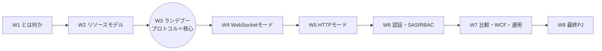
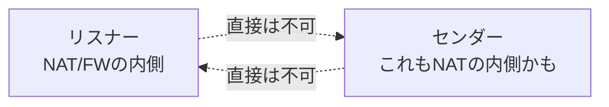
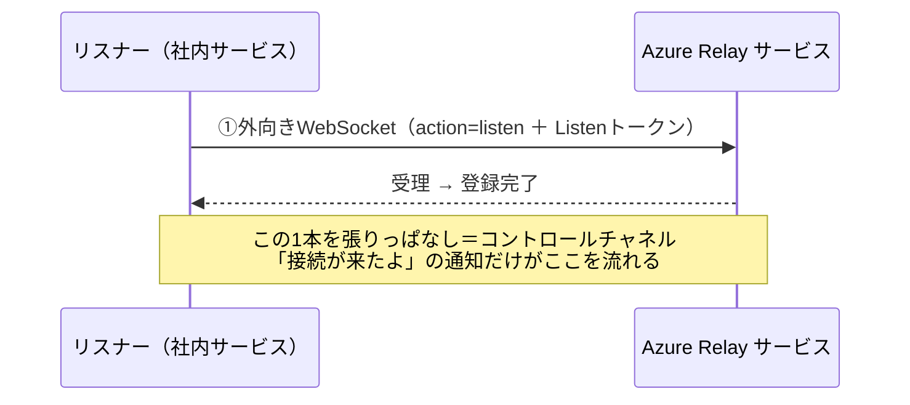
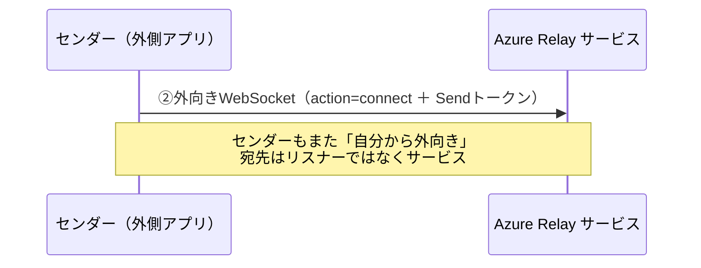
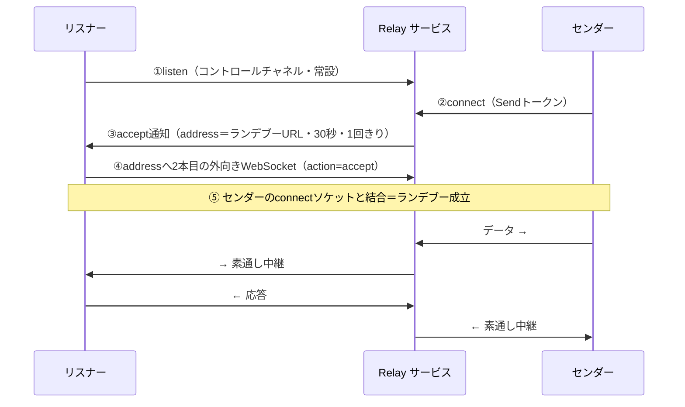
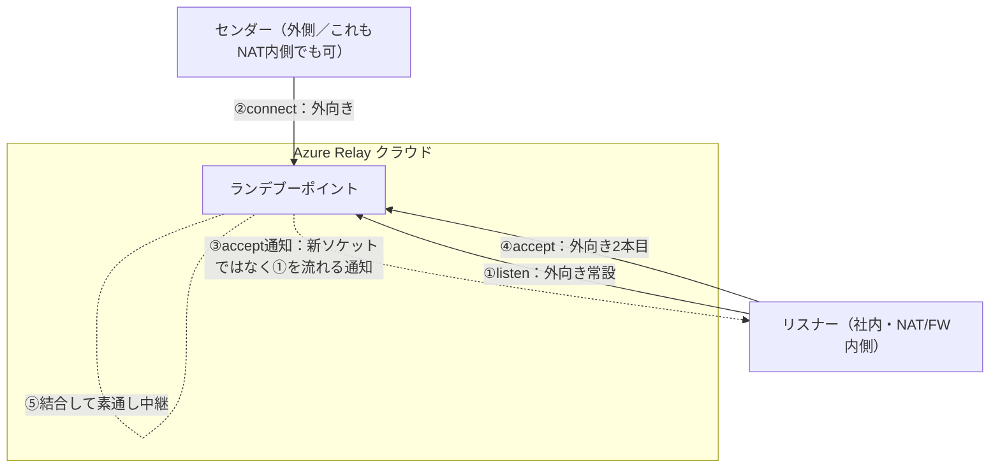
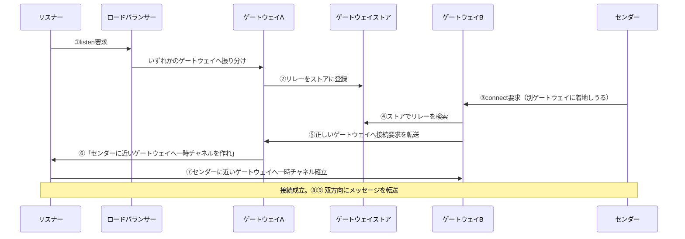

# Week 3 — ランデブープロトコル：なぜインバウンドポート 0 で双方向通信が成立するのか

> **Phase 1c** | 学習プラン Week 3 / 8
> 学習目標：Azure Relay Hybrid Connections 最大の"腑に落ちポイント"——**両側とも外向き（アウトバウンド）にしか接続を張らないのに、双方向の通信路ができる**仕組みを、1 手ずつ完全に追う。リスナーの **コントロールチャネル**（`listen`）、センダーの **connect**、サービスがリスナーへ送る **accept 通知（ランデブーアドレス）**、リスナーが 2 本目の外向き接続を張って成立する **rendezvous（ランデブー）** までをシーケンスで理解する。さらに分散サービス内部（**ゲートウェイストア**）でどう相手を見つけるか、受理／拒否・トークン更新・Ping・エラーコードまで押さえる。

---

## 0. 今週の位置づけ



W1 で「アウトバウンド接続を折り返して中継する」と概観し、W2 で「リスナー／センダー」という役割とリソースを整理した。今週（W3）は**その 2 者が具体的にどう出会って通信路を張るか**を、プロトコルのメッセージ単位で解剖する。ここが Relay の心臓部である。**実際にコードで動かすのは W8**（トークン生成は W6）なので、今週は**流れを完全に腹落ちさせる**ことに集中する。

> **初学者向け用語補足：略語・用語の展開**
> - **ランデブー（rendezvous）**＝ フランス語由来で「**待ち合わせ**」。事前に決めた 1 か所に双方が別々にやって来て落ち合うこと。Relay ではクラウド上の一点に、リスナーとセンダーがそれぞれ**自分から外向きに**やって来て落ち合う。
> - **コントロールチャネル（control channel）**＝ リスナーが最初に張る、**制御用の常設通路**。「接続要求が来たよ」という通知がここを流れる。データ本体は流れない。
> - **ハンドシェイク（handshake, 握手）**＝ 通信を始める前に、双方が手順・トークン・プロトコルを取り決める最初のやり取り。
> - **ゲートウェイ（gateway）**＝ Relay サービスの入口となるノード（サーバ）群。世界に多数あり、ロードバランサーが振り分ける。
> - **ロードバランサー（load balancer, 負荷分散装置）**＝ 多数のサーバに接続を振り分けて負荷を均す装置。
> - **FIN**＝ WebSocket/TCP で「これで送信終わり」を示すフラグ。データの区切りに使う。

---

## 1. 問題の再確認：両側が「内側」にいたら、どうやって出会うのか

Relay が解くのは次の状況である。公式（プロトコルガイド）いわく——

> Hybrid Connections は、2 つのネットワーク化されたアプリケーション間で双方向・リクエスト応答・バイナリストリーム通信、および単純なデータグラムのやり取りを可能にする。**どちらか一方、あるいは両方が NAT やファイアウォールの内側にいてもよい。**
> （出典：[Hybrid Connections protocol guide](https://learn.microsoft.com/en-us/azure/azure-relay/relay-hybrid-connections-protocol)）

ここが難しさの本質だ。**両者とも「外から呼ばれる」ことができない**（インバウンド不可）。ならば、直接つなぐのは原理的に無理。



解は 1 つしかない。**双方が「外向き」になら接続できる**（アウトバウンドは通る）ことを使い、**クラウド上の一点（サービス）を待ち合わせ場所にする**。この待ち合わせが「ランデブー」であり、その一点が W2 で作った **Hybrid Connection** である。

> **キーになる発想**：Relay は「壁に穴を開けて相手に届かせる」のではなく、「**双方を、それぞれ外向きに、同じ待ち合わせ場所へ呼ぶ**」。誰も内側に入られない。全員が自分から出ていく。

---

## 2. 第 1 手：リスナーが「待ち受け表明」する（listen ＝ コントロールチャネル）

まずリスナー（社内サービス）が動く。**自分からサービスへ外向きの WebSocket を張る**。公式：

> 受理準備ができたことをサービスに示すため、リスナーは**アウトバウンドの WebSocket 接続を作る**。この接続のハンドシェイクは、Relay 名前空間に構成された **Hybrid Connection の名前**と、その名前に対する **「Listen」権限**を与えるセキュリティトークンを運ぶ。WebSocket がサービスに受理されると登録が完了し、確立された WebSocket は以降のすべてのやり取りを可能にする **「コントロールチャネル」** として維持される。
> （出典：protocol guide）

URL はこうなる（W2 で見た形）：

```
wss://myrelay.servicebus.windows.net/$hc/inventory?sb-hc-action=listen&sb-hc-token=<Listenトークン>
```



この時点で**データはまだ流れない**。コントロールチャネルは「呼び出しベル」の線であって、通話そのものではない。リスナーはこの線を握ったまま、センダーの登場を待つ。

> **なぜ「常設で張りっぱなし」なのか**：リスナーは内側にいるので、サービスから**呼びかけられない**（インバウンド不可）。だから逆に、リスナーが**先に**外向きの線を 1 本つないでおき、その線を通じてサービスから「接続要求が来た」と知らせてもらう。これがコントロールチャネルの存在理由。W2 の「最大 25 リスナー」は、この listen 接続を最大 25 本ぶら下げられるという意味。

---

## 3. 第 2 手：センダーが接続を開始する（connect）

次にセンダー（クラウド／外部のクライアント）が、**同じ Hybrid Connection 名**へ、やはり**外向きの WebSocket**を張る。ただし `action` と権限が違う。公式：

> 「connect」操作は、サービス上に WebSocket を開き、Hybrid Connection の名前と（任意だが既定では必須の）**「Send」権限**を与えるセキュリティトークンをクエリ文字列で提供する。するとサービスは、前述の方法でリスナーとやり取りし、リスナーは**この WebSocket と結合されるランデブー接続を作る**。
> （出典：protocol guide）

```
wss://myrelay.servicebus.windows.net/$hc/inventory?sb-hc-action=connect&sb-hc-token=<Sendトークン>
```



注目すべきは、**センダーもリスナーの居場所を一切知らない**こと。センダーが知っているのは「サービスのホスト名」と「Hybrid Connection 名」だけ。宛先はリスナーではなく**サービス**である。もしこの時点で有効なリスナーが 1 つも待ち受けていなければ、接続は成立しない（HTTP モードなら 502／504 が返る。W5 で扱う）。

---

## 4. 第 3 手：サービスがリスナーへ「accept 通知」＝ランデブーアドレスを渡す

センダーの connect を受けたサービスは、待ち受け中のリスナーの中から 1 つを選び、**コントロールチャネル越しに「接続要求が来た」と通知**する。これが **accept メッセージ**。公式：

> センダーがサービス上で新しい接続を開くと、サービスは Hybrid Connection 上のアクティブなリスナーの 1 つを選んで通知する。この通知は、開いているコントロールチャネル越しに **JSON メッセージ**としてリスナーへ送られる。メッセージには、接続を受理するために**リスナーが接続しにいく WebSocket エンドポイントの URL** が含まれる。
> （出典：protocol guide）

accept メッセージの中身（抜粋）：

```json
{
  "accept": {
    "address": "wss://dc-node.servicebus.windows.net:443/$hc/inventory?...",
    "id": "4cb542c3-047a-4d40-a19f-bdc66441e736",
    "connectHeaders": { "Host": "...", "Sec-WebSocket-Protocol": "..." }
  }
}
```

- **address**＝ リスナーが**次に外向きに張りにいく**べき WebSocket の URL（＝**ランデブーアドレス**）。
- **id**＝ この接続の一意な識別子（診断・追跡用）。
- **connectHeaders**＝ センダーが提示した HTTP ヘッダ一式（リスナーが受理可否の判断に使える）。

このランデブーアドレスには重要な性質がある。公式：

> この URL はリスナーが**追加作業なしにそのまま使わなければならない**。エンコードされた情報は**短時間だけ有効**で、本質的にはセンダーが接続確立を待つ意思のある間だけ有効である。**想定すべき最大は 30 秒**。URL は**1 回の成功接続にのみ**使える。
> （出典：protocol guide）

> **用語補足：accept 通知は「折り返し電話番号」**
> サービスはリスナーに「今から一時的な待ち合わせ番号（address）を渡すから、そこに**あなたから**かけ直して」と言う。リスナーは内側にいて呼び出せないので、**サービスがリスナーを呼ぶのではなく、リスナーに"かけ直させる"**。この一手が、インバウンド不可の壁を越える鍵。番号は 30 秒・1 回きりの使い捨て。

---

## 5. 第 4 手：ランデブー成立 — リスナーが 2 本目の外向き接続を張り、素通し中継が始まる

リスナーは accept で受け取った address へ、**2 本目の外向き WebSocket**（accept ソケット）を張る。URL は `sb-hc-action=accept` を含む。これがセンダーの connect ソケットと**サービス内部で結合（join）**され、ランデブーが成立する。公式：

> ランデブー URL との WebSocket 接続が確立されるやいなや、この WebSocket 上のそれ以降のすべての活動は、**サービスによる介入も解釈もなしに**、センダーとの間で中継される。
> （出典：protocol guide）



公式はこの結果をこう総括する。

> このやり取りモデルの結果、センダークライアントはハンドシェイクを終えて **「クリーンな」WebSocket**——リスナーに接続され、追加の前置きや準備を要しない——を手にする。このモデルにより、**事実上あらゆる既存の WebSocket クライアント実装**が、正しく構成した URL を渡すだけで Hybrid Connections を使える。
> （出典：protocol guide）

これが強力な点だ。ランデブー成立後は、**ただの WebSocket**。特別なライブラリは不要で、標準の WebSocket クライアント／サーバがそのまま使える（W8 で Python の `websockets` を使うのはこのため）。

---

## 6. 全体像：なぜインバウンド 0 で成立するのか（3 本すべて外向き）

ここまでの接続を数えると、張られた WebSocket は **3 本、すべて「内側 → 外側（アウトバウンド）」**である。



図中で**実線の 3 本（①listen・②connect・④accept）だけが新しく張られる WebSocket** で、いずれも「内側 → 外側」の外向き。**③（accept 通知）は破線**で示したとおり**新しいソケットではなく、①で張ったコントロールチャネルを逆向きに流れる"通知"メッセージ**である（→ §4）。だから「3 本」には数えず、番号は **①②④** と飛ぶ。⑤はその 2 本がサービス内部で結合されること。

| 本数 | 誰が張るか | 向き | 役目 |
| --- | --- | --- | --- |
| ① listen | リスナー | 外向き（常設） | コントロールチャネル。通知の受信 |
| ② connect | センダー | 外向き | 接続開始 |
| ④ accept | リスナー | 外向き | ランデブー成立。データの実路 |

**どの 1 本もインバウンドではない。** ファイアウォールは外向き（アウトバウンド）を既定で通すので、リスナー側もセンダー側も**ポートを 1 つも開けなくてよい**。これが W1 で概観した「アウトバウンド接続を折り返す」の正体である。

> **一言で**：リスナーが待ち合わせ場所に線を 1 本つないで待つ（listen）→ センダーも同じ場所に来る（connect）→ サービスがリスナーに「使い捨ての番号」を渡す（accept 通知）→ リスナーがその番号へもう 1 本かけ直す（accept）→ 2 本が結合してただの WebSocket になる。**全員が自分から外へ出ていくだけ**で双方向通信ができる。

---

## 7. サービス内部：分散ゲートウェイでどう相手を見つけるか

ここまでは「サービス」を 1 つの箱として描いた。実際の Relay は世界中に多数のゲートウェイを持つ分散システムで、**リスナーとセンダーが別々のゲートウェイに着地しても出会えるように**、内部で仲介する。公式アーキテクチャの 9 ステップ（要約）：



1. リスナーの listen 要求を、ロードバランサーがいずれかのゲートウェイへ振り分ける。
2. Relay がその**リレーをゲートウェイストア**（＝どのリスナーがどこにいるかの台帳）に作る。
3. センダーが connect 要求を送る（**別のゲートウェイ**に着地することもある）。
4. 受けたゲートウェイがゲートウェイストアでリレーを検索する。
5. 正しい（リスナーがいる）ゲートウェイへ接続要求を転送する。
6. そのゲートウェイがリスナーに「**センダーに最も近いゲートウェイノードへ一時チャネルを作れ**」と依頼する。
7. リスナーがそのゲートウェイへ一時チャネルを確立。ゲートウェイ経由で接続が成立し、双方がメッセージ交換できる。
8. ゲートウェイがリスナー → センダーのメッセージを転送。
9. ゲートウェイがセンダー → リスナーのメッセージを転送。
（出典：[What is Azure Relay?（Architecture）](https://learn.microsoft.com/en-us/azure/azure-relay/relay-what-is-it)）

> **用語補足：ゲートウェイストア（gateway store）**
> 「どの Hybrid Connection のリスナーが、どのゲートウェイに、今つながっているか」を記録する**分散台帳**。センダーが別のゲートウェイに着地しても、この台帳を引けばリスナーの居所（ゲートウェイ）が分かる。§4 の accept 通知に入っていた `dc-node.servicebus.windows.net` のような**具体ノード名**は、この仕組みで決まった「センダーに近いランデブー地点」である。

---

## 8. 受理・拒否・チャネル維持・エラー

### 受理と拒否

リスナーは accept 通知（`connectHeaders` にセンダーのヘッダが入る）を見て、**受理する／拒否する**を選べる。

- **受理（accept）**：address へ `sb-hc-action=accept` で WebSocket を張る。
- **拒否（reject）**：address に `sb-hc-statusCode`（HTTP ステータス）と `sb-hc-statusDescription`（理由）を付けて接続する。設計上、この handshake は **HTTP 410 で意図的に失敗**し、その status がセンダーへ返る。

> **用語補足：なぜ拒否も WebSocket で行うのか**
> 「拒否」も、ステータスコードと理由をセンダーへ返す必要がある。Relay は**わざと失敗する WebSocket ハンドシェイク**を使うことで、リスナー実装が別途 HTTP クライアントを持たずに、WebSocket クライアント 1 つで受理も拒否もこなせるようにしている（公式の設計意図）。

### コントロールチャネルの維持：Renew と Ping

リスナーが握る listen 接続（コントロールチャネル）は長時間続くので、2 つの保守操作がある。

| 操作 | 誰が送るか | 目的 |
| --- | --- | --- |
| **Renew（renewToken）** | リスナー | Listen トークンの**期限切れ前に差し替え**、チャネルを延命する。期限切れは進行中の接続には影響しないが、期限到来時にサービスがコントロールチャネルを切る |
| **Ping** | リスナー | 長時間アイドルだと LB／NAT が TCP を切ることがある。小さなデータを流して**接続が生きていると知らせ**、同時に**リスナーの生存確認**にもなる。Ping 失敗ならチャネルは不良とみなし再接続 |

### 主なエラーコード（listen／connect 時）

| コード | 意味 | 典型原因 |
| --- | --- | --- |
| 404 Not Found | Hybrid Connection パスが無効／URL 不正 | 接続名の打ち間違い、名前空間ホスト名ミス |
| 401 Unauthorized | トークンが無い／不正 | `sb-hc-token` 欠落・壊れ |
| 403 Forbidden | そのパス・そのアクションにトークンが不適 | Send トークンで listen しようとした等、権限違い |
| 500 Internal Error | サービス側障害 | 追跡 ID を控えてサポートへ |

チャネルがサービス都合で切れる時は WebSocket ステータスで理由が返る：**1001**＝パス削除／無効化、**1008**＝トークン期限切れ（認可違反）、**1011**＝サービス内部エラー。

---

## 9. ハンズオン — 接続を「紙上でトレース」して腹落ちさせる（実行は W8）

今週は**実コードを動かさない**（リスナー／センダーの実装にはトークン生成〔W6〕と WebSocket ライブラリ〔W8〕が要る）。代わりに、W2 で作った `inventory` を題材に、**3 本の接続 URL を自分で組み立て、accept 通知を予測する**トレース演習を行う。これができれば W8 の実装は"答え合わせ"になる。

### 演習 1：3 本の URL を書く

名前空間 `myrelay`・Hybrid Connection `inventory` として、次を（トークンは `<listen>` `<send>` のプレースホルダで）書き出す。

1. リスナーのコントロールチャネル URL
2. センダーの connect URL
3. リスナーが accept で張る 2 本目の URL に含まれる `sb-hc-action` の値

<details><summary>解答例</summary>

1. `wss://myrelay.servicebus.windows.net/$hc/inventory?sb-hc-action=listen&sb-hc-token=<listen>`
2. `wss://myrelay.servicebus.windows.net/$hc/inventory?sb-hc-action=connect&sb-hc-token=<send>`
3. `sb-hc-action=accept`（address はサービスが accept 通知で渡すので**自分では組み立てない・そのまま使う**）
</details>

### 演習 2：時系列を並べ替える

次の出来事を正しい順に並べよ：**(a) サービスがリスナーに accept 通知** / **(b) リスナーが listen で常設接続** / **(c) 素通し中継が始まる** / **(d) センダーが connect** / **(e) リスナーが address へ 2 本目を張る**。

<details><summary>解答</summary>

b → d → a → e → c
</details>

### 演習 3：エラーを診断する

「センダーが `sb-hc-action=connect` に **Listen トークン**を付けて接続したら 403 が返った」。なぜか。どのトークンに直すべきか。

<details><summary>解答</summary>

connect（センダー役割）には **Send 権限**のトークンが要る。Listen トークンは「そのパス・そのアクションに不適」なので 403 Forbidden。§2 の `send-only` 鍵（W2 で作成）から取得した Send トークンに直す。
</details>

> **任意（トークンがある人向け）**：`wscat`（WebSocket の CLI クライアント）等で、W2 の `listen-only` 鍵から作った Listen トークンを付けてコントロールチャネル URL に接続すると、listen が張れることを体感できる。ただし SAS トークンの生成手順は W6 で扱うため、**ここでは無理に実行しなくてよい**。フル E2E は W8。

### 後片付け

今週はリソースを新規作成していない（`inventory` は W2 のものを流用）。W4 でも使うので**残しておく**。

---

## 10. 自己チェック

1. リスナーとセンダーが**両方とも内側**にいるのに直接つなげない。Relay はこれをどう解くか（「待ち合わせ場所」「全員アウトバウンド」で説明できるか）。
2. **コントロールチャネル**とは何か。なぜリスナーは"先に・張りっぱなしで"これを作るのか。ここにデータ本体は流れるか。
3. センダーの connect の宛先は**リスナー**か**サービス**か。センダーはリスナーの居場所を知っているか。
4. **accept 通知**には何が入っているか。`address` の有効時間と再利用可否は。「折り返し電話番号」のたとえで説明せよ。
5. 双方向通信が成立するまでに張られる WebSocket は**何本**で、それぞれ**誰が・どちら向き**に張るか。「インバウンドが 0 本」を言えるか。
6. ランデブー成立後の WebSocket は特別なものか、ただの WebSocket か。なぜ標準ライブラリで扱えるのか。
7. **ゲートウェイストア**は何のための台帳か。センダーが別ゲートウェイに着地しても出会えるのはなぜか。
8. **Renew** と **Ping** はそれぞれ何のための操作か。403／1008 はそれぞれ何を意味するか。

---

## 11. 次週予告（W4：Hybrid Connections WebSocket モード深掘り）

W3 で「1 本の接続がどう成立するか」を追った。W4 では、この成立した WebSocket 上で**実際にデータをどうやり取りするか**——双方向バイナリストリーム、`listen → accept → relay` のライフサイクル、**複数リスナー／複数センダー**が同居したときの挙動（W2 で触れた 25 リスナーとランダム分散の実際）、接続の受理・拒否の使い分けを深掘りする。「データはサービスに解釈されず素通しされる」という Relay の透明性が、何を可能にし何を意味するかを掴む。

---

### 参考（出典）
- [Azure Relay Hybrid Connections protocol guide（listen/connect/accept・rendezvous・Renew/Ping・エラーコード）](https://learn.microsoft.com/en-us/azure/azure-relay/relay-hybrid-connections-protocol)
- [What is Azure Relay?（Architecture：ゲートウェイストア9ステップ・基本フロー）](https://learn.microsoft.com/en-us/azure/azure-relay/relay-what-is-it)
