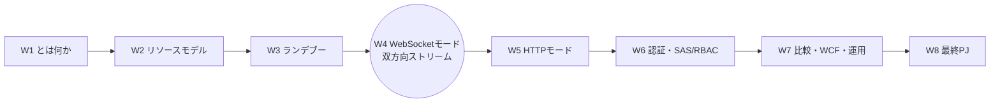
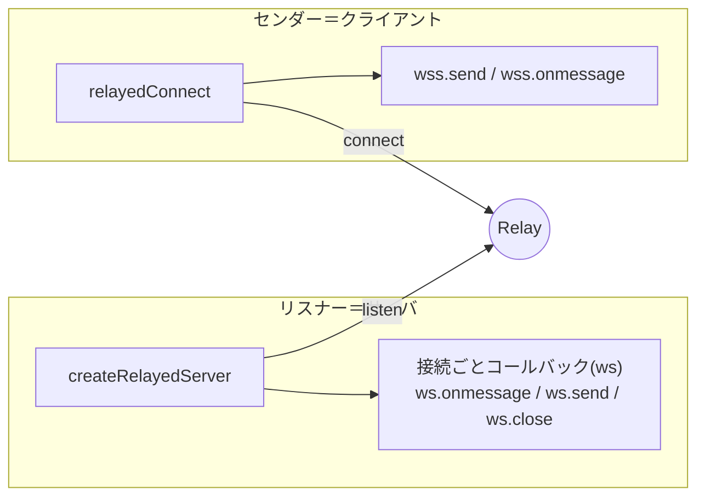
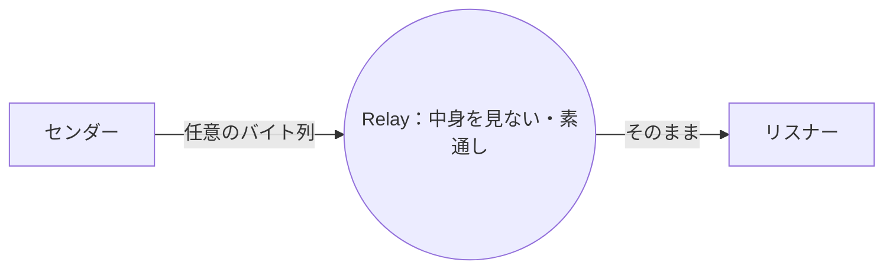
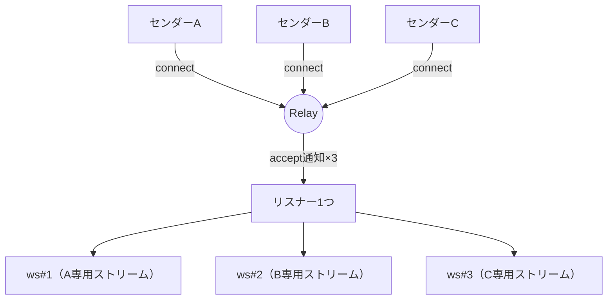
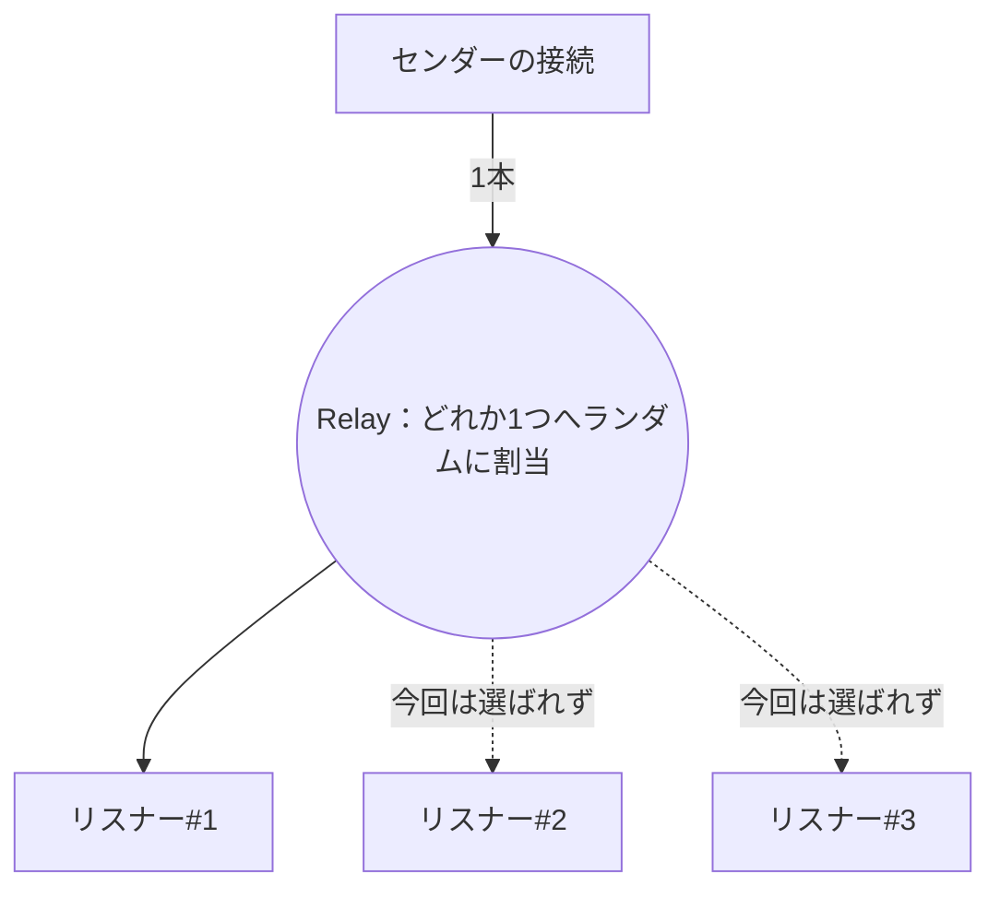
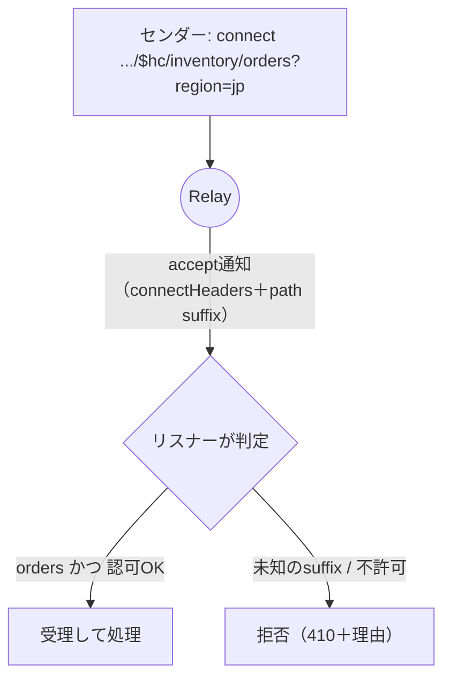

# Week 4 — Hybrid Connections WebSocket モード深掘り：成立した接続の上でデータをどう流すか

> **Phase 2a** | 学習プラン Week 4 / 8
> 学習目標：W3 で成立した「ただの WebSocket」の上で、実際にデータをどうやり取りするかを掴む。**リスナー＝多数の接続を受理するサーバ／センダー＝接続を張るクライアント**というプログラミングモデル、**双方向・バイナリ・メッセージ境界**（text/binary フレーム・FIN・フラグメント）、そして Relay の透明性（**サービスは中身を解釈しない**＝任意プロトコルを載せられる）を理解する。さらに **複数センダー／複数リスナー**が同居したときの挙動（各接続が独立ストリーム・最大 25 リスナーのランダム分散）を、実際に動く Node.js の E2E で体感する。

---

## 0. 今週の位置づけ



W3 は「1 本の接続がどう**成立するか**」だった。W4 は「成立した接続の上で**どう使うか**」。W3 のランデブーで手に入るのは公式いわく **「クリーンな WebSocket」**——特別な前置き不要のただの WebSocket である。今週はその上で流れるデータの形と、多対多になったときの振る舞いを深掘りする。**今週は初めて実コードを E2E で動かす**（トークンは接続文字列を使い簡略化。SAS 署名の自前生成は W6、Python 版フルスクラッチは W8）。

> **初学者向け用語補足：略語・用語の展開**
> - **フルデュプレックス（full-duplex, 全二重）**＝ 電話のように**両方向同時**に話せる通信。対して片方ずつが half-duplex（半二重）、一方向だけが simplex。WebSocket は全二重。
> - **フレーム（frame）**＝ WebSocket がデータを送る最小の単位。1 つのメッセージが 1 つ以上のフレームに分かれる。text フレームと binary フレームがある。
> - **フラグメント（fragment）**＝ 大きなメッセージを複数フレームに分割したときの各断片。最後のフレームに **FIN**（終わりの印）が立つ。
> - **ペイロード（payload）**＝ 運ばれる中身のデータ本体（ヘッダやフレーム制御を除いた部分）。
> - **ストリーム（stream）**＝ 連続的に流れるデータの通り道。1 本の接続＝1 本のストリーム。
> - **コールバック（callback）**＝ 「イベントが起きたら呼んでね」とあらかじめ渡しておく関数。接続受理時・メッセージ受信時などに呼ばれる。

---

## 1. W3 の到達点：手に入るのは「ただの WebSocket」

W3 のランデブーが完了すると、リスナーとセンダーはそれぞれ**普通の WebSocket** を手にする。公式の総括を再掲する。

> センダークライアントはハンドシェイクを終えて**「クリーンな」WebSocket**——リスナーに接続され、追加の前置きや準備を要しない——を手にする。（…）リスナーが accept で得るランデブー WebSocket も同様にクリーンで、**既存のあらゆる WebSocket サーバ実装**に、わずかな抽象化を足すだけで渡せる。
> （出典：[Hybrid Connections protocol guide](https://learn.microsoft.com/en-us/azure/azure-relay/relay-hybrid-connections-protocol)）

つまり W4 以降で扱うのは「Relay 特有の何か」ではなく、**Web の標準技術そのもの**である。だからこそ言語・プラットフォームを選ばない（W1 の「オープン標準」の実利がここに出る）。

---

## 2. プログラミングモデル：リスナー＝サーバ、センダー＝クライアント

役割をコードの世界に落とすと、こうなる。

- **リスナー**＝ 接続を待ち受ける**サーバ**。1 つの Hybrid Connection に来る**複数の接続を受理し、接続ごとに処理する**。
- **センダー**＝ 接続を 1 本張って送受信する**クライアント**。

公式 Node.js クイックスタート（`hyco-ws` パッケージ）の骨格で見ると、対応が明快になる。

```js
// リスナー：リレー経由のサーバを作る。第2引数が「接続1本ごとに呼ばれるコールバック」
var wss = WebSocket.createRelayedServer(
  {
    server: WebSocket.createRelayListenUri(ns, path),          // wss://.../$hc/inventory?...action=listen
    token:  WebSocket.createRelayToken('http://' + ns, keyrule, key)
  },
  function (ws) {                    // ← 接続が受理されるたび、この ws（1本の接続）が渡る
    console.log('connection accepted');
    ws.onmessage = function (event) { console.log(event.data); };  // メッセージ受信
    ws.on('close', function () { console.log('connection closed'); });
  });
```

```js
// センダー：リレー経由で接続し、渡された wss に送る
WebSocket.relayedConnect(
  WebSocket.createRelaySendUri(ns, path),                       // wss://.../$hc/inventory?...action=connect
  WebSocket.createRelayToken('http://' + ns, keyrule, key),
  function (wss) {
    readline.on('line', (input) => { wss.send(input, null); }); // 標準入力の1行を送信
  });
```



> **用語補足：`createRelayListenUri` / `createRelaySendUri` / `createRelayToken` の正体**
> これらは W2〜W3 で見た URL・トークンを**組み立てるヘルパ**にすぎない。`createRelayListenUri(ns, path)` は `wss://<ns>/$hc/<path>?sb-hc-action=listen…` を、`createRelaySendUri` は `…action=connect…` を作る。`createRelayToken(...)` は SAS トークンを作る（**この中身＝HMAC 署名を自前で書くのが W6・W8**）。つまり Node の SDK は「W2〜W3 で紙上トレースした URL 生成を関数にまとめただけ」であり、魔法ではない。

> **キー概念：リスナーの「accept ループ」**
> `createRelayedServer` に渡すコールバックは、**接続が来るたびに繰り返し呼ばれる**。これが W3 で見た「accept 通知 → accept ソケット確立」を SDK が内部で回している姿である。あなたは「接続 1 本ごとに何をするか（`ws` に対する処理）」だけ書けばよい。ローカルの TCP サーバで `accept()` をループするのと同じ発想。

---

## 3. 双方向・バイナリ・メッセージ境界：中身は「素通し」される

### 全二重で、両方向から送れる

成立後の WebSocket は全二重。リスナーからもセンダーからも、いつでも送れる。上の例はセンダー→リスナーだが、リスナー側で `ws.send(...)` すればセンダーの `onmessage` に届く。**リクエスト/レスポンスに縛られない**（HTTP モード〔W5〕との最大の違い）。

### text フレームと binary フレーム

WebSocket のメッセージは **text**（UTF-8 文字列）と **binary**（生バイト列）の 2 種類のフレームで運ばれる。Relay Hybrid Connections は両方を透過する。大きなメッセージは複数フレームに**分割（フラグメント）**され、最後のフレームに **FIN** が立つ。受け手はフラグメントを連結して 1 メッセージに戻す（この分割・FIN の扱いは W3 の request/response で見たのと同じ WebSocket の基本仕様）。

> **用語補足：メッセージ境界（message boundary）は保たれる**
> 生の TCP は「バイトの川」で、送信側の 1 回の write が受信側で 1 回の read になる保証がない（分割・結合が起きる）。WebSocket は**メッセージ指向**——`send("ABC")` は相手の 1 つの `onmessage`（`event.data === "ABC"`）として届く。境界が保たれるので、アプリで区切り文字を発明する手間が減る。

### サービスは中身を解釈しない（透明性）

これが Relay の重要な性質。W3 の引用を再掲：

> ランデブー URL との WebSocket 接続が確立されるやいなや、この WebSocket 上のそれ以降のすべての活動は、**サービスによる介入も解釈もなしに**、センダーとの間で中継される。
> （出典：protocol guide）



つまり **WebSocket の上に、あなたの好きなプロトコルを載せられる**。JSON でも、Protocol Buffers でも、独自バイナリフォーマットでも、Relay は関知しない。Relay は「壁を越える土管」に徹し、土管の中身の意味づけはアプリの自由。これが「双方向・非バッファのソケット通信」（W1 のシナリオ 3）の実体である。

> **用語補足：非バッファ（unbuffered）＝ 貯めない**
> Relay は Service Bus と違い、メッセージを**キューに貯めない**。リスナーが今つながっていなければ、センダーの接続は成立しない（貯めて後で配達、はしない）。**リアルタイムに双方が居合わせて初めて通る**。これは W7 の「Relay vs Service Bus」の決定的な分かれ目。

---

## 4. 複数センダー：1 リスナーに、独立した接続が同時に来る

1 つのリスナーには、**複数のセンダーが同時に接続**できる。各センダーの接続は**それぞれ独立した WebSocket（独立ストリーム）**になり、リスナーのコールバックが接続の数だけ呼ばれる。



§2 のコードでいえば、`createRelayedServer` のコールバックが **A・B・C それぞれで 1 回ずつ、別々の `ws` を持って**呼ばれる。リスナーは各 `ws` を区別して並行に扱える（ローカルの TCP サーバが多数のクライアント接続を同時に捌くのと同じ）。W3 で見たとおり、センダーごとに別々のランデブーソケットが張られ、それらがリスナー側の別々の accept として現れる。

---

## 5. 複数リスナー：最大 25、ランダムに分散

逆に、1 つの Hybrid Connection には**複数のリスナー**をぶら下げられる（W2 で予告）。公式：

> サービスは 1 つの Hybrid Connection に対して**最大 25 の同時リスナー**を許可する。（…）アクティブなリスナーが 2 つ以上ある場合、着信接続はそれらに**ランダム順で分散**され、ベストエフォートで公平な分配が試みられる。
> （出典：protocol guide）



これが効くのは 2 つの場面。

| 目的 | どう効くか |
| --- | --- |
| **スケールアウト（負荷分散）** | 同じ社内サービスを複数インスタンスで起動し、それぞれをリスナーとして登録。着信をランダムに分けて捌く |
| **可用性（フェイルオーバー）** | 1 つのリスナーが落ちても、残りが受理を続ける。単一障害点を避けられる |

> **注意：1 接続は 1 リスナーへ**。センダーの 1 本の接続は、**いずれか 1 つ**のリスナーに割り当てられる（全リスナーへブロードキャストされるわけではない）。「全員に配る」pub/sub 的な配信が要るなら Service Bus / Event Grid の領分（W7）。Relay の複数リスナーは**分散して 1 つが受ける**モデル。

---

## 6. 受理と拒否、そして「振り分け」

W3 で触れたとおり、リスナーは accept 通知に含まれる **`connectHeaders`**（センダーが付けた HTTP ヘッダ）や、**path のサフィックス**を見て、受理するか拒否するかを決められる。

- センダーは connect URL の path を `inventory/orders?region=jp` のように**拡張**できる。公式いわく、この path 拡張は accept 通知の address URI に乗ってリスナーへ渡り、**リスナーが受理可否や処理の振り分けに使える**。
- 拒否する場合は `sb-hc-statusCode` と `sb-hc-statusDescription` を付け、意図的に HTTP 410 で失敗させて理由をセンダーへ返す（W3 §8）。



> **用語補足：ディスパッチ引数（dispatch arguments）**
> path のサフィックスやクエリは、センダーがリスナーへ渡す**振り分けの手がかり**として使える。公式は「HTTP ヘッダを含められない場合に、センダーが受理側リスナーへ**ディスパッチ引数**を渡せるようにする」と述べる。1 つの Hybrid Connection を、サフィックスで論理的に複数の窓口に分けられる、というイメージ。

---

## 7. 生 TCP ソケットとの違い（何がうれしいか）

Relay の WebSocket モードは「壁を越える双方向ソケット」だが、生 TCP とは違う点がある。

| 観点 | 生 TCP ソケット | Relay Hybrid Connections（WebSocket） |
| --- | --- | --- |
| 到達性 | 相手に**インバウンド到達**が必要 | **不要**（両側アウトバウンド・W3） |
| データ単位 | バイトの川（境界なし） | **メッセージ指向**（境界保持・§3） |
| ポート／経路 | 任意ポート・FW 調整が要る | **443/TLS 固定**。既存の HTTPS 経路・プロキシを通りやすい |
| 中身の解釈 | なし（自前） | なし（**素通し**・§3）＝任意プロトコル可 |
| 標準ライブラリ | ソケット API | **標準 WebSocket ライブラリ**で扱える |

> **一言で**：Relay の WebSocket モードは「**443 だけで抜けられて、相手が内側にいても届く、メッセージ指向の双方向ソケット**」。中身は素通しなので、実質「どこでも張れる TCP 的パイプ」として使える。

---

## 8. ハンズオン — Node.js で WebSocket モードの E2E を動かす

W2 で作った名前空間と Hybrid Connection `inventory` を使い、**リスナーとセンダーを実際に通信させる**。今回はトークンを接続文字列（マスターキー）から自動生成するので、SAS 署名を手書きする必要はない（それは W6）。

> **前提**：[Node.js](https://nodejs.org/) が入っていること。作業フォルダで `npm install hyco-ws` を実行してパッケージを入れる。名前空間の `RootManageSharedAccessKey` の **Primary Key** を控えておく（W1 手順 B）。

> **セキュリティ注意**：本ハンズオンは簡略化のため **`RootManageSharedAccessKey`（全権）**を使う。これは学習用。**本番では W2 の `listen-only`／`send-only` に分け、さらに Microsoft Entra ID 認証／マネージド ID を使うのが正道**（公式も接続文字列より Entra ID を推奨）。この最小権限化と SAS の中身は W6 で扱う。

### 手順 A：リスナー `listener.js`

```js
const WebSocket = require('hyco-ws');

const ns      = "{名前空間}.servicebus.windows.net";
const path    = "inventory";
const keyrule = "RootManageSharedAccessKey";
const key     = "{Primary Key}";

var wss = WebSocket.createRelayedServer(
  {
    server: WebSocket.createRelayListenUri(ns, path),
    token:  WebSocket.createRelayToken('http://' + ns, keyrule, key)
  },
  function (ws) {                                   // 接続1本ごと
    console.log('connection accepted');
    ws.onmessage = function (event) { console.log('received:', event.data); };
    ws.on('close', function () { console.log('connection closed'); });
  });

console.log('listening');
wss.on('error', function (err) { console.log('error ' + err); });
```

> **コマンド／コードの読み方**：`require('hyco-ws')`＝Relay 用 WebSocket ライブラリを読み込む、`createRelayedServer`＝リレー経由のサーバを作る（第 2 引数が接続ごとコールバック）、`createRelayListenUri(ns, path)`＝§2 の listen URL を生成、`createRelayToken`＝SAS トークンを生成、`ws.onmessage`＝メッセージ受信時に呼ばれる。

### 手順 B：センダー `sender.js`

```js
const WebSocket = require('hyco-ws');
const readline = require('readline').createInterface({ input: process.stdin, output: process.stdout });

const ns      = "{名前空間}.servicebus.windows.net";
const path    = "inventory";
const keyrule = "RootManageSharedAccessKey";
const key     = "{Primary Key}";

WebSocket.relayedConnect(
  WebSocket.createRelaySendUri(ns, path),
  WebSocket.createRelayToken('http://' + ns, keyrule, key),
  function (wss) {
    console.log('connected. type text and press Enter:');
    readline.on('line', (input) => { wss.send(input, null); });   // 入力1行を送信
    wss.on('close', function () { process.exit(); });
  });
```

### 手順 C：実行して双方向を確かめる

1. 端末 1：`node listener.js` → `listening` と出る（W3 の listen＝コントロールチャネルが張られた状態）。
2. 端末 2：`node sender.js` → `connected` の後、文字を打って Enter。
3. **端末 1（リスナー）に `received: ...` と表示されれば成功**。W3 のランデブーが裏で成立し、素通し中継が起きている。

### 手順 D（発展）：複数センダーと透明性を体感する

- **複数センダー（§4）**：端末 3 でもう 1 つ `node sender.js` を起動。**両方**の入力がリスナーに届き、接続ごとに `connection accepted` が出る（＝独立ストリーム）。
- **複数リスナー（§5・任意）**：`listener.js` を 2 端末で起動してから 1 つのセンダーで送ると、**どちらか一方**のリスナーに届く（ランダム分散）。何度か送ると割り振りが分かれる。
- **透明性（§3）**：センダーで JSON 文字列（例 `{"sku":"A1","qty":3}`）を送ると、リスナーは**中身を解釈されずそのまま**受け取る。Relay は土管に徹している。

### 後片付け

W5 でも `inventory` を使うので**残す**。学習を止めるなら RG ごと削除（W1 手順）。

---

## 9. 自己チェック

1. W3 のランデブー後に手に入るのは「Relay 特有の接続」か「ただの WebSocket」か。なぜそれが言語非依存という利点になるか。
2. **リスナー＝サーバ／センダー＝クライアント**の対応を、`createRelayedServer` の「接続ごとコールバック」を使って説明せよ。これはローカルの何に相当するか。
3. WebSocket の **text／binary フレーム**、**フラグメント／FIN**、**メッセージ境界**を説明せよ。生 TCP と何が違うか。
4. 「Relay はデータを**解釈しない**」とはどういう意味か。その結果として何ができるか（任意◯◯を載せられる）。
5. **非バッファ**とは何か。リスナーが不在のときセンダーの接続はどうなるか。これは Service Bus と何が違うか。
6. 1 リスナーに複数センダーが来たとき、接続はどう表現されるか（独立◯◯）。全員に同じデータが配られるか。
7. 1 Hybrid Connection の**最大リスナー数**は。複数いるとき着信はどう割り振られるか。スケールアウトと可用性にどう効くか。1 本の接続は全リスナーに配られるか。

---

## 10. 次週予告（W5：HTTP リクエストモード）

W4 は「張りっぱなしの双方向 WebSocket」だった。W5 では、Hybrid Connection に**任意で有効化できる HTTP リクエストモード**を扱う。センダーが `https://<ns>/<path>`（`$hc` 無し）へ**ふつうの HTTP リクエスト**を投げ、リスナーが `request`／`response` として応答する仕組み——リクエスト/レスポンス型のセマンティクス、64 kB を境にコントロールチャネルとランデブーを使い分ける挙動、`requiresTransportSecurity`、そして WebSocket モードとの使い分けを掴む。「社内の HTTP サービスを、ポートを開けず外部の HTTP クライアントに見せる」という頻出パターンの実装がここでできるようになる。

---

### 参考（出典）
- [Azure Relay Hybrid Connections - WebSockets in Node（プログラミングモデル・E2E）](https://learn.microsoft.com/en-us/azure/azure-relay/relay-hybrid-connections-node-get-started)
- [Azure Relay Hybrid Connections protocol guide（透明性・25リスナー/ランダム分散・path suffix/ディスパッチ）](https://learn.microsoft.com/en-us/azure/azure-relay/relay-hybrid-connections-protocol)
- [Authenticate with Microsoft Entra ID to access Azure Relay（本番は接続文字列よりEntra ID）](https://learn.microsoft.com/en-us/azure/azure-relay/authenticate-application)
