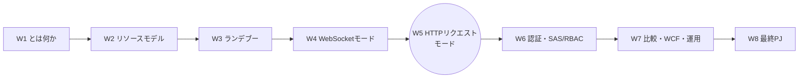
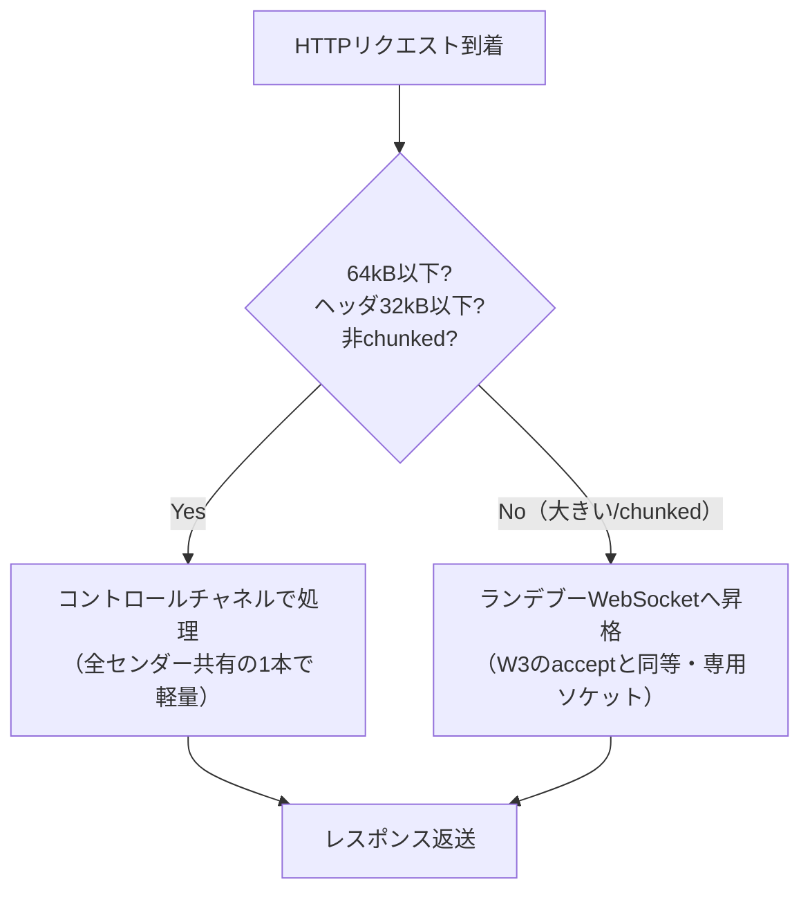
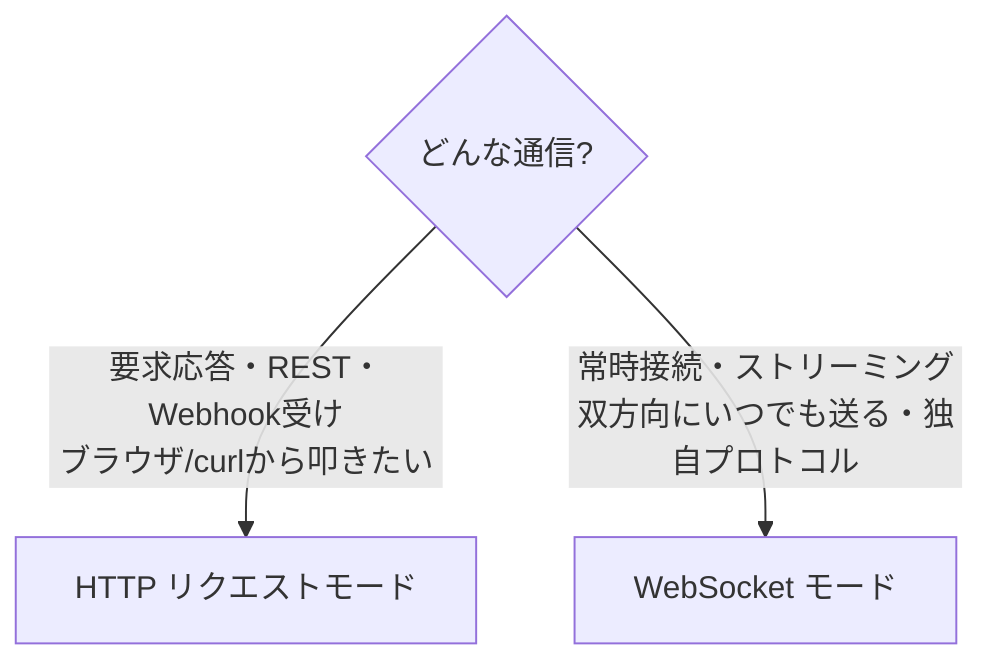

# Week 5 — Hybrid Connections HTTP リクエストモード：社内の HTTP/REST サービスを、ポートを開けず外へ見せる

> **Phase 2b** | 学習プラン Week 5 / 8
> 学習目標：Hybrid Connections のもう 1 つの使い方——**HTTP リクエストモード**を理解する。センダーが `https://<名前空間>/<path>`（`$hc` 無し）へ**ふつうの HTTP リクエスト**を投げ、リスナーが `request`／`response` として応答する仕組みを掴む。リスナー側が「ただの HTTP サーバ」に見える点、64 kB を境に**コントロールチャネルとランデブーを使い分ける**挙動、ヘッダの扱い（認可情報の除去・`Via` 付与）、ステータスコード（502/503/504 の意味）、そして **WebSocket モードとの使い分け**を、動く Node.js の E2E で体感する。

---

## 0. 今週の位置づけ



W4 は「張りっぱなしの双方向 WebSocket」だった。今週（W5）は、同じ Hybrid Connections が持つ **HTTP リクエスト/レスポンス型**の使い方を扱う。「社内の REST API を、外部の HTTP クライアント（ブラウザ・curl・別サービス）から呼びたい」という頻出パターンがこれで実装できる。両モードは同じランデブーの土台（W3）に乗っており、**リスナーの書き方が違うだけ**である。

> **初学者向け用語補足：略語・用語の展開**
> - **HTTP** = HyperText Transfer Protocol＝ Web の基本プロトコル。「リクエストを 1 つ送ると、レスポンスが 1 つ返る」**要求応答型**。
> - **REST**（レスト）= REpresentational State Transfer＝ HTTP を使った API 設計の定番スタイル。`GET /orders/1` のように「メソッド＋パス」でリソースを操作する。
> - **メソッド（method）**＝ HTTP の動詞。`GET`（取得）・`POST`（作成/送信）・`PUT`（更新）・`DELETE`（削除）など。
> - **ヘッダ（header）**＝ リクエスト/レスポンスに付く付帯情報（`Content-Type` など、キー:値の並び）。
> - **ボディ（body）**＝ 本文データ（JSON や HTML など）。
> - **ステータスコード（status code）**＝ 結果を表す 3 桁の数字。`200` OK、`404` Not Found、`50x` サーバ側エラーなど。
> - **プロキシ（proxy, 代理）**＝ クライアントとサーバの間に立って要求を取り次ぐ中継役。Relay は HTTP モードで実質プロキシのように振る舞う。

---

## 1. なぜ HTTP モードがあるのか：要求応答型の世界にそのまま溶け込む

W4 の WebSocket モードは強力だが、世の中の多くのサービスは **HTTP/REST** で話す。社内に `GET /inventory/A1` で在庫を返す REST API があるとき、WebSocket に載せ替えるのは手間だ。HTTP モードは、この API を**HTTP のまま**外へ見せる。

公式（プロトコルガイド）：

> WebSocket 接続に加えて、リスナーはセンダーから **HTTP リクエストフレーム**を受け取ることもできる。**この機能が Hybrid Connection で有効になっている場合**である。
> （出典：[Hybrid Connections protocol guide](https://learn.microsoft.com/en-us/azure/azure-relay/relay-hybrid-connections-protocol)）

WebSocket モードとの根本的な違いはこれだけ：

| 観点 | WebSocket モード（W4） | HTTP リクエストモード（W5） |
| --- | --- | --- |
| 通信の型 | 全二重・張りっぱなし・双方向いつでも | **要求応答**（1 リクエスト→1 レスポンス） |
| センダー | WebSocket クライアント | **ふつうの HTTP クライアント**（ブラウザ・curl・任意の言語） |
| リスナー | 接続ごとコールバック（W4 §2） | **ただの HTTP サーバ**（`(req, res) => …`） |
| 宛先 URL | `wss://<ns>/$hc/<path>` | `https://<ns>/<path>`（**`$hc` 無し**） |
| 用途 | ストリーミング・独自プロトコル・常時接続 | REST 呼び出し・Webhook 受け・単発の要求応答 |

---

## 2. 「有効化」の実際：専用フラグは無い。リスナーが `request` を扱えば通る

ここは誤解しやすい。HTTP モードは **Hybrid Connection リソースに専用のトグルがあるわけではない**（W2 で見たとおり、リソースのプロパティは `requiresClientAuthorization` と `userMetadata` の 2 つだけ）。実体は次のとおり。

- リスナーが **`request` ジェスチャを扱える実装**（Node なら `hyco-https` パッケージ）で登録すれば、その Hybrid Connection は HTTP リクエストを受けられる。
- 逆に、HTTP をサポートするリスナーは `request` に**必ず応答する義務**がある。公式：「HTTP サポート付きで接続するリスナーは `request` ジェスチャを**必ず処理しなければならない**。処理せずタイムアウトを繰り返すリスナーは、将来サービスにブロックされる可能性がある」（出典：protocol guide）。

> **用語補足：`requiresTransportSecurity` は Hybrid Connection には無い**
> WCF Relay（W7）には転送セキュリティの設定があるが、**Hybrid Connections の HTTP モードは常に HTTPS/TLS（443 ポート）**で動くので、そうしたトグルは無い。平文 HTTP で外に出る心配は不要——経路は常に暗号化されている。

センダー側の認可は W2・W4 と同じく `requiresClientAuthorization` に従う。公式クイックスタート：

> Relay 作成時に「Requires Client Authorization」オプションを**無効にしていれば**、**任意のブラウザ**で Hybrid Connections URL にリクエストを送れる。保護されたエンドポイントにアクセスするには、`ServiceBusAuthorization` ヘッダにトークンを作って渡す必要がある。
> （出典：[Hybrid Connections - HTTP requests in Node.js](https://learn.microsoft.com/en-us/azure/azure-relay/relay-hybrid-connections-http-requests-node-get-started)）

---

## 3. センダー側：ただの HTTPS クライアントでよい

HTTP モードのセンダーは、**特別なライブラリを必要としない**。宛先とトークンの置き場所さえ合っていれば、ブラウザでも `curl` でも任意言語の HTTP クライアントでもよい。

- **宛先 URL**：`https://<名前空間>.servicebus.windows.net/<path>`（**`$hc` は付かない**。443 ポート）。
- **トークンの置き場所**（`requiresClientAuthorization=true` のとき）：
  - HTTP ヘッダ `ServiceBusAuthorization`（Relay 専用。推奨）、または
  - HTTP ヘッダ `Authorization`、または
  - クエリ文字列 `?sb-hc-token=<URLエンコード済みトークン>`
- **匿名許可のとき**（`requiresClientAuthorization=false`）：トークン無しで OK。ブラウザで URL を開くだけで届く。

公式 Node センダーの骨格（＝ただの `https.get` に認可ヘッダを足しただけ）：

```js
const https = require('hyco-https');
https.get({
  hostname: ns,                              // {名前空間}.servicebus.windows.net
  path: '/' + path,                          // /inventory （$hc 無し）
  port: 443,
  headers: {
    'ServiceBusAuthorization':
      https.createRelayToken(https.createRelayHttpsUri(ns, path), keyrule, key)
  }
}, (res) => { /* res.statusCode, res.on('data', …) で応答を読む */ });
```

> **用語補足：`sb-hc-token` はクエリに載せてもよいが…**
> W3 で見たとおり Relay はクエリの `sb-hc-token` を受け付けるが、**URL にトークンを載せるとログや履歴に残りやすい**（本教材冒頭の安全方針にも通じる）。HTTP モードでは **`ServiceBusAuthorization` ヘッダに入れるのが定石**。ヘッダなら URL に露出しない。

---

## 4. リスナー側：「ただの HTTP サーバ」に見える

リスナーは、Node の標準 `http.createServer` とほぼ同じ書き味になる。違いは `createServer` の代わりに `createRelayedServer` を使い、リッスン URI とトークンを渡す点だけ。公式クイックスタート曰く「Node.js 初心者チュートリアルにある単純な HTTP サーバの例と大差ない。`createServer` の代わりに `createRelayedServer` を使う点を除けば」。

```js
const https = require('hyco-https');
var uri = https.createRelayListenUri(ns, path);
var server = https.createRelayedServer(
  { server: uri, token: () => https.createRelayToken(uri, keyrule, key) },
  (req, res) => {                                        // ← 普通の (req, res) ハンドラ
    console.log('request accepted: ' + req.method + ' on ' + req.url);
    res.setHeader('Content-Type', 'text/html');
    res.end('<html><body>Relayed Node.js Server!</body></html>');
  });
server.listen();
```

内部では、W3 のコントロールチャネル越しに **`request` メッセージ**（JSON ヘッダ＋バイナリのボディフレーム）が届き、リスナーが返す **`response`** がセンダーへ中継される。SDK がこの JSON ↔ `(req, res)` 変換を隠しているので、アプリは HTTP サーバを書くだけでよい。

> **応答義務と 60 秒**：公式いわく「受信側は**必ず応答しなければならない**。各リクエストには **60 秒以内**に応答する必要があり、さもなければ配送は失敗として報告される」（出典：protocol guide）。長時間かかる処理は 60 秒の壁を意識する。

---

## 5. コントロールチャネル vs ランデブー：64 kB の境界

HTTP モードの巧妙な点は、**小さな要求応答はコントロールチャネルを共有し、大きなものだけランデブー WebSocket に昇格させる**こと。公式：

> リクエスト/レスポンスのフローは**既定でコントロールチャネルを使う**が、必要に応じて別個のランデブー WebSocket に「アップグレード」できる。（…）コントロールチャネル上では、**リクエストとレスポンスのボディは最大 64 kB**、**HTTP ヘッダのメタデータは合計 32 kB** に制限される。いずれかがこの閾値を超えると、リスナーは（Accept と同等の手続きで）**ランデブー WebSocket にアップグレードしなければならない**。
> （出典：protocol guide）



- 誰が決めるか：**リクエストの経路はサービスが決める**（64 kB 超や chunked 転送で大きくなりそうな場合はランデブーへ）。**レスポンスの経路はリスナーが決める**（大きい応答ならランデブーへ昇格）。
- 一度ランデブーが張られると、その**同じセンダーの以降の要求応答はそのソケットを使い回す**（公式）。

> **用語補足：なぜ小さいものはチャネル共有なのか**
> 毎回ランデブー（＝新しい WebSocket 確立）を張るのはコストが高い。小さな REST 呼び出しは、既にあるコントロールチャネルに相乗りさせれば**接続確立のオーバーヘッドが無い**。大きなボディやストリーミングだけ専用ソケットに逃がす、という賢い出し分けである。

> **用語補足：chunked（チャンク転送）**
> `Transfer-Encoding: chunked`＝ ボディ全体のサイズを事前に確定せず、小片（チャンク）に分けて送る HTTP の方式。サイズが読めない＝64 kB を超えうるので、サービスはランデブーに回すことがある。

---

## 6. ヘッダの扱い：認可情報は剥がされ、`Via` が付く

Relay は HTTP モードで**プロキシのように**振る舞い、いくつかヘッダを加工する。

- **認可情報は listener へ転送されない**：`sb-hc-token` クエリ・`ServiceBusAuthorization` ヘッダは**常に剥がされ**、Relay 認可が有効なら評価に使われる。`Authorization` ヘッダは、Relay 認可が有効で他の 2 つが無い場合にのみ評価・除去され、それ以外は**そのままリスナーへ透過**する（＝リスナー側で独自の end-to-end 認可を実装できる）。
- **RFC7230 のホップ由来ヘッダは除去**：`Connection`・`Content-Length`・`Host`・`TE`・`Trailer`・`Transfer-Encoding`・`Upgrade`・`Close` はリスナーへ渡らない（`Via` を除く）。
- **`Via` ヘッダを付与**：Relay は経路情報として名前空間ホスト名を `Via` に加える。これにより、**エラー応答が Relay 発かリスナー発かを判別**できる（`Via` があればリスナー発）。
- **`requestTarget`**：リスナーに渡るパスは、`sb-hc-` 接頭辞のクエリを除いたもの。**`CONNECT` メソッドは使用不可**。

> **用語補足：`requestHeaders` は JSON で届く**
> 公式は「HTTP フレームのヘッダメタデータは、リスナーフレームワークが扱いやすいよう **JSON に変換される**（HTTP ヘッダ解析ライブラリより JSON パーサの方が普及しているため）。HTTP リクエストのボディは**バイナリ WebSocket フレームとして透過的に転送**される」と述べる。つまりリスナーは「JSON のヘッダ＋バイナリのボディ」を受け取り、SDK がそれを `(req, res)` に組み立て直す。

---

## 7. ステータスコード：502/503/504 の読み分け

HTTP モードは HTTP なので、結果はステータスコードで返る。Relay 特有の意味を押さえる。

| コード | 意味 | 誰が返すか |
| --- | --- | --- |
| **200 OK** | 少なくとも 1 つのリスナーが処理した | リスナー（`Via` あり） |
| **202 Accepted** | 少なくとも 1 つのリスナーが受理した | リスナー |
| **401 Unauthorized** | トークンが無い/壊れ/無効 | Relay |
| **403 Forbidden** | そのパス・アクションにトークンが不適 | Relay |
| **404 Not Found** | Hybrid Connection パス無効/URL 不正 | Relay |
| **502 / 503 Bad Gateway** | **アクティブなリスナーが居ない**（どのリスナーにも振れない） | Relay |
| **504 Gateway Timeout** | リスナーに振ったが、**required time（60 秒）内に応答しなかった** | Relay |
| **500 Internal Error** | サービス側障害 | Relay |

> **用語補足：`Via` で「誰のエラーか」を切り分ける**
> 公式いわく「応答が Relay 発かリスナー発かは、**`Via` ヘッダの有無**で識別できる。ヘッダがあれば応答はリスナー発」。502/503/504 のように **`Via` の無いエラーは Relay が返している**（リスナー不在・タイムアウトなど）。障害切り分け（W7）で効く見分け方。

---

## 8. WebSocket モードと HTTP モードの使い分け



| 使いたいこと | 選ぶモード |
| --- | --- |
| 社内 REST API を外部から呼ぶ | **HTTP** |
| ブラウザ/curl/既存 HTTP クライアントで叩く | **HTTP** |
| サーバからいつでもプッシュ（サーバ発の送信）が要る | **WebSocket** |
| 大量のバイナリストリーム・独自プロトコル | **WebSocket** |
| 単発・短命の呼び出しが多い | **HTTP**（小さければチャネル共有で軽い） |

> **どちらも同じ土台**：両モードとも W3 のランデブーに乗っており、**インバウンドポート 0** で成立する点は同じ。1 つの Hybrid Connection にどちらのリスナーを付けるかで決まる。

---

## 9. ハンズオン — Node.js で HTTP モードの E2E を動かす

W2 の名前空間を使う。HTTP モード用に**新しい Hybrid Connection を 1 つ**作ると、W4 の WebSocket 用（`inventory`）と混ざらず分かりやすい。

> **前提**：Node.js。作業フォルダで `npm install hyco-https` を実行。`RootManageSharedAccessKey` の Primary Key を控える。
> **セキュリティ注意**：W4 同様、学習用に全権キーを使う。本番は最小権限＋Entra ID（W6）。

### 手順 A：HTTP 用の Hybrid Connection を作る

- ポータルで名前空間 → Hybrid Connections → **＋ Hybrid Connection** → 名前 `httpsvc` で作成。
- **ブラウザから叩いて試したい場合**は、この HC を作るとき **「Requires Client Authorization」のチェックを外す**（＝匿名許可）。認可付きのまま試すなら、下の `sender.js` を使う。

### 手順 B：リスナー `http_listener.js`

```js
const https = require('hyco-https');
const ns = "{名前空間}.servicebus.windows.net";
const path = "httpsvc";
const keyrule = "RootManageSharedAccessKey";
const key = "{Primary Key}";

var uri = https.createRelayListenUri(ns, path);
var server = https.createRelayedServer(
  { server: uri, token: () => https.createRelayToken(uri, keyrule, key) },
  (req, res) => {
    console.log('request: ' + req.method + ' ' + req.url);
    res.setHeader('Content-Type', 'application/json');
    res.end(JSON.stringify({ ok: true, path: req.url, method: req.method }));
  });
server.listen();
console.log('http listener ready');
server.on('error', (err) => console.log('error: ' + err));
```

> **コードの読み方**：`hyco-https`＝Relay 用 HTTPS ライブラリ、`createRelayedServer(opts, (req,res)=>…)`＝リレー経由の HTTP サーバ（第 2 引数が普通の要求応答ハンドラ）、`res.end(...)`＝レスポンス本文を返して完了。

### 手順 C：センダー（認可あり）`http_sender.js`

```js
const https = require('hyco-https');
const ns = "{名前空間}.servicebus.windows.net";
const path = "httpsvc";
const keyrule = "RootManageSharedAccessKey";
const key = "{Primary Key}";

https.get({
  hostname: ns, path: '/' + path, port: 443,
  headers: { 'ServiceBusAuthorization': https.createRelayToken(https.createRelayHttpsUri(ns, path), keyrule, key) }
}, (res) => {
  console.log('status:', res.statusCode);
  res.setEncoding('utf8');
  res.on('data', (c) => console.log('BODY:', c));
});
```

### 手順 D：実行して要求応答を確かめる

1. 端末 1：`node http_listener.js` → `http listener ready`。
2. 端末 2：`node http_sender.js` → `status: 200` と `BODY: {"ok":true,...}`。リスナー側にも `request: GET /httpsvc` が出る。
3. **匿名許可（手順 A でチェックを外した）なら**、ブラウザで `https://<名前空間>.servicebus.windows.net/httpsvc` を開くだけで JSON が返る。`curl https://<名前空間>.servicebus.windows.net/httpsvc` も同様。**「ポートを 1 つも開けていない社内サーバ」に、ふつうの HTTP でアクセスできている**ことが実感できる。

### 手順 E（発展）：モードの違いを味わう

- リスナーを止めてからセンダーを実行 → **502/503（リスナー不在）**が返る（§7）。
- レスポンス JSON を大きく（64 kB 超に）してみると、内部でランデブーへ昇格する（§5。挙動はログでは見えにくいが、大きくても通ることを確認）。

### 後片付け

W8 でも名前空間を使う。学習を止めるなら RG ごと削除。`httpsvc`・`inventory` は残しておいてよい。

---

## 10. 自己チェック

1. HTTP モードと WebSocket モードの根本的な違いは何か（**要求応答** vs **全二重常時接続**）。センダー・リスナー・宛先 URL がそれぞれどう変わるか。
2. HTTP モードを「有効化」する専用フラグは Hybrid Connection にあるか。実際は何をすれば HTTP が通るのか。
3. センダーは専用ライブラリが要るか。トークンはどこに置くのが定石か。匿名許可のときブラウザで叩けるのはなぜか。
4. リスナーの `(req, res)` ハンドラは、内部で届く何（`request` メッセージ）を SDK が変換したものか。応答の 60 秒制限とは。
5. **64 kB / 32 kB** の境界は何を分けるか。コントロールチャネル処理とランデブー昇格は、それぞれいつ・誰が選ぶか。小さいものをチャネル共有にする利点は。
6. Relay がリクエストから**剥がすヘッダ**、**そのまま透過するヘッダ**は何か。`Via` ヘッダは何の役に立つか。
7. **502/503** と **504** はそれぞれ何を意味するか。エラーが Relay 発かリスナー発かをどう見分けるか。

---

## 11. 次週予告（W6：認証とセキュリティ＝ SAS/RBAC）

W4・W5 では簡略化のため `RootManageSharedAccessKey`（全権）を使ってきた。W6 では、ここまで「与えられるもの」として使ってきた**トークンの中身に踏み込む**。SAS（Shared Access Signature）の **Listen/Send/Manage** 権限、認可ルールと鍵、そして **SAS トークンの署名（HMAC-SHA256・`sr`/`sig`/`se`/`skn`）を自分で組み立てる**——これが W8 の Python 実装（`createRelayToken` に相当するものを自前で書く）の土台になる。さらに Microsoft Entra ID／マネージド ID による認証、「クライアントは Listen だけ／バックエンドは Send」という最小権限の安全パターンを確立する。W4・W5 で全権キーを使ったことの"借り"をここで返す。

---

### 参考（出典）
- [Azure Relay Hybrid Connections - HTTP requests in Node.js（HTTPモード programming model・匿名ブラウザ・ServiceBusAuthorization）](https://learn.microsoft.com/en-us/azure/azure-relay/relay-hybrid-connections-http-requests-node-get-started)
- [Azure Relay Hybrid Connections protocol guide（64kB/32kB・request/response・ヘッダstrip・Via・502/503/504）](https://learn.microsoft.com/en-us/azure/azure-relay/relay-hybrid-connections-protocol)
- [Microsoft.Relay/namespaces/hybridConnections（プロパティは requiresClientAuthorization/userMetadata の2つ）](https://learn.microsoft.com/en-us/azure/templates/microsoft.relay/namespaces/hybridconnections)
