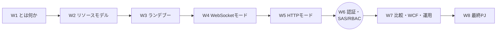
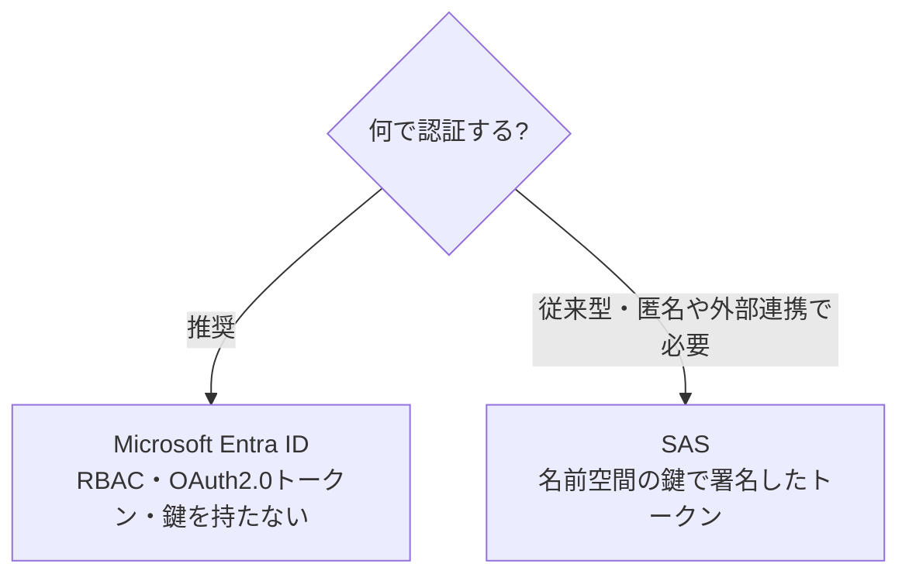
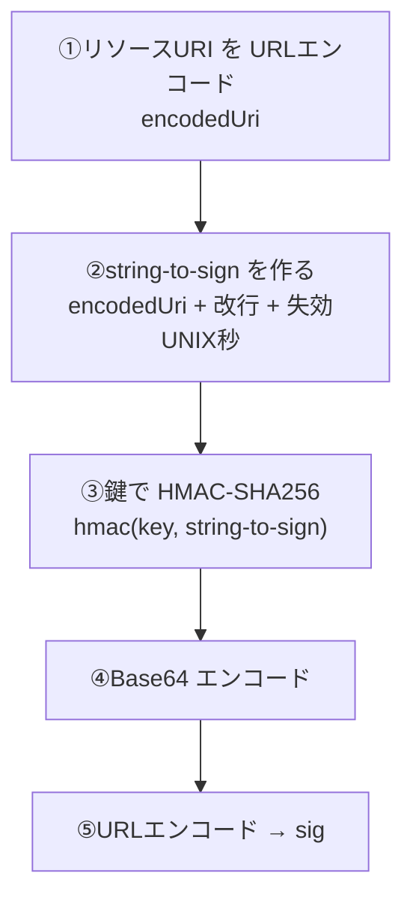
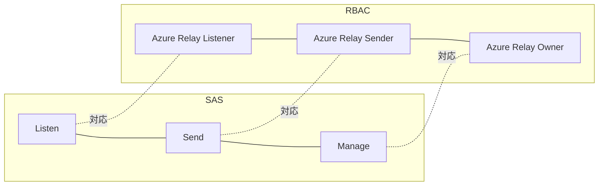
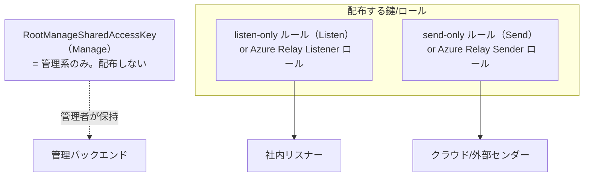

# Week 6 — 認証とセキュリティ：SAS トークンの中身を自分で組み立て、Entra ID/RBAC と最小権限を確立する

> **Phase 3a** | 学習プラン Week 6 / 8
> 学習目標：W4・W5 で「与えられるもの」として使ってきた**トークンの正体**に踏み込む。SAS（Shared Access Signature）の **Listen/Send/Manage** 権限、認可ルールと鍵、そして **SAS トークンの署名（HMAC-SHA256・`sr`/`sig`/`se`/`skn`）を自分で組み立てる**——これが W8 の Python 実装（Node の `createRelayToken` に相当するものを自前で書く）の土台になる。さらに Microsoft Entra ID／マネージド ID による認証（RBAC 3 ロール）、「クライアントは Listen だけ／バックエンドは Send」という最小権限の安全パターンを確立し、W4・W5 で全権キーを使った"借り"を返す。

---

## 0. 今週の位置づけ



W2 で「認可ルールという鍵がある」と枠だけ見た。W4・W5 では簡略化のため `RootManageSharedAccessKey`（全権）を使った。今週（W6）は、その鍵から**トークンがどう作られるか**を分解し、**自前で SAS トークンを署名生成**できるようにする。加えて、より安全な **Entra ID 認証**と**最小権限設計**を確立する。ここが済めば、W8 の Python 実装は「今週書いた署名関数を使うだけ」になる。

> **初学者向け用語補足：略語・用語の展開**
> - **SAS** = Shared Access Signature（Shared=共有 / Access=アクセス / Signature=署名）＝ 「この鍵で・この範囲に・この期限まで許す」を表す署名付きトークン。
> - **HMAC** = Hash-based Message Authentication Code（Hash=ハッシュ / based=基づく / Message=メッセージ / Authentication=認証 / Code=符号）＝ 秘密鍵とメッセージからハッシュを作り、**改ざん検知＋送信者認証**を行う仕組み。
> - **SHA-256** = Secure Hash Algorithm 256-bit＝ 任意長のデータを 256 ビット（32 バイト）の固定長ハッシュに変換する関数。
> - **Base64**（ベースろくじゅうよん）＝ バイナリを 64 種類の文字（A–Z a–z 0–9 + /）で表す符号化。署名バイト列を文字列にするのに使う。
> - **RBAC** = Role-Based Access Control（役割ベースアクセス制御）＝ 「誰に・どのスコープで・どの役割（ロール）を」で権限を与える仕組み。
> - **OAuth 2.0**（オーオース）＝ トークンベースの認可の標準。Entra ID がこのトークンを発行する。
> - **マネージド ID（managed identity）**＝ Azure が自動管理するアプリの ID。鍵やパスワードをコードに持たずに認証できる。
> - **プリンシパル（principal）**＝ 権限を与える相手（ユーザー・グループ・アプリのサービスプリンシパル）。

---

## 1. 認証の 2 系統：Entra ID（推奨）と SAS

公式は明快に 2 つを挙げる。

> Azure Relay リソースへのアクセスを認証・認可する方法は 2 つある。**Microsoft Entra ID** と **Shared Access Signatures（SAS）** である。
> （出典：[Azure Relay authentication and authorization](https://learn.microsoft.com/en-us/azure/azure-relay/relay-authentication-and-authorization)）

そして、どちらを使うべきかも明言している。

> Microsoft Entra ID が返す OAuth 2.0 トークンでユーザー／アプリを認可する方が、SAS より**優れたセキュリティと使いやすさ**を提供する。Entra ID なら**トークンをコードに保存する必要がなく**、潜在的なセキュリティ脆弱性のリスクを負わずに済む。可能な限り Entra ID の使用を推奨する。
> （出典：同上）



本教材では **両方**を扱う。SAS は「トークンの仕組みを理解する＋外部クライアントに配る」ために重要（W8 で自前実装）。Entra ID は「本番の推奨解」として押さえる。

---

## 2. SAS の骨組み：認可ルール＝鍵＋権限

SAS の出発点は **認可ルール（SharedAccessAuthorizationRule）**。公式：

> Relay 名前空間に SAS 用の鍵を構成できる。SAS 認証は、リソースに**関連する権利を持つ暗号鍵**の構成を伴う。クライアントは **SAS トークン**——アクセスするリソース URI と有効期限を、構成した鍵で署名したもの——を提示することでリソースにアクセスする。
> （出典：同上）

認可ルールの構成要素（W2 の復習＋詳細）：

| 要素 | 意味 |
| --- | --- |
| **KeyName**（skn） | ルールを識別する名前（例 `listen-only`・`RootManageSharedAccessKey`） |
| **PrimaryKey** | SAS トークンの署名／検証に使う暗号鍵（主） |
| **SecondaryKey** | 同（副）。無停止のキーローテーション用 |
| **Rights** | **Listen / Send / Manage** の集合 |

- 名前空間には**最大 12 個**の認可ルールを構成できる。名前空間レベルのルールは、その名前空間の全 Relay 接続に効く。
- 名前空間を作ると既定で**全権（Listen+Send+Manage）の 1 ルール**（`RootManageSharedAccessKey`）が構成される。

> **用語補足：3 権限の包含関係**
> **Manage ⊃ Send・Listen**。Manage は Listen と Send を含み、さらにエンティティ・ルールの管理（作成/削除）ができる。だから配布してよいのは Listen 単独 or Send 単独の鍵まで。Manage（＝Root キー）はバックエンドの管理系にのみ置き、リスナー／センダーには渡さない（W2 §5 の最小権限の理由）。

> **用語補足：SecondaryKey で無停止ローテーション**
> 鍵は漏洩に備え定期的に入れ替えたい。Primary と Secondary の 2 本があるので、①新しい鍵を Secondary に生成 → ②クライアントを Secondary へ切替 → ③Primary を再生成、という順で**サービスを止めずに鍵を回せる**。

---

## 3. SAS トークンの中身を分解する（W8 の核心）

いよいよトークンの正体。公式の定義：

> SAS トークンは、アクセスを主張するリソース URI と有効期限からなる**リソース文字列の HMAC-SHA256** を、認可ルールに紐づく暗号鍵で計算して生成される。
> （出典：同上）

最終的なトークンはこの形（W3 の `renewToken` 例で既出）：

```
SharedAccessSignature sr=<エンコード済みリソースURI>&sig=<署名>&se=<失効時刻>&skn=<鍵名>
```

各フィールドの意味：

| フィールド | 読み・語源 | 中身 |
| --- | --- | --- |
| **sr** | Signed Resource | 対象リソース URI（URL エンコード済み）。例 `http%3A%2F%2Fmyrelay.servicebus.windows.net%2Finventory` |
| **sig** | Signature | 署名本体。後述の文字列を HMAC-SHA256 → Base64 → URL エンコード |
| **se** | Signed Expiry | 失効時刻（**UNIX 時間＝1970-01-01 からの秒数**） |
| **skn** | Signed Key Name | 使った認可ルール名（KeyName） |

### 署名（sig）の作り方 — 5 ステップ



「署名される文字列（string-to-sign）」は **`encodedUri + "\n" + 失効UNIX秒`**。この 2 行を鍵で HMAC-SHA256 し、Base64 して URL エンコードしたものが `sig`。**鍵そのものはトークンに載らない**（載るのは鍵で作った署名だけ）ので、鍵を知らない第三者はトークンを偽造できない。

> **用語補足：なぜ「URI＋期限」に署名するのか**
> 署名対象に**リソース URI**が入るので「この接続にだけ有効」なトークンになり、**期限**が入るので「この時刻まで」に限定される。改ざん（URI や期限を書き換え）すれば署名が合わなくなり、サービスに弾かれる。だから**期限付き・対象限定の使い捨て入館証**として安全に配れる。

### 自前実装（Python・W8 で使う relaylib.py の心臓部）

公式 Python get-started の署名関数（W8 でこれを組み込む）：

```python
import base64, hashlib, hmac, math, time, urllib

def hmac_sha256(key, msg):
    return hmac.new(key=key, msg=msg, digestmod=hashlib.sha256).digest()

def createSasToken(serviceNamespace, entityPath, sasKeyName, sasKey):
    uri = "http://" + serviceNamespace + "/" + entityPath
    encodedResourceUri = urllib.parse.quote(uri, safe='')          # ①URLエンコード
    expiryInSeconds = math.floor(time.time()) + 60*60*48            # 失効=今+48時間(UNIX秒)
    plainSignature = encodedResourceUri + "\n" + str(expiryInSeconds)  # ②string-to-sign
    hashBytes = hmac_sha256(sasKey.encode("utf-8"), plainSignature.encode("utf-8"))  # ③HMAC-SHA256
    base64HashValue = base64.b64encode(hashBytes)                  # ④Base64
    return ("SharedAccessSignature sr=" + encodedResourceUri +
            "&sig=" + urllib.parse.quote(base64HashValue) +        # ⑤URLエンコード
            "&se=" + str(expiryInSeconds) + "&skn=" + sasKeyName)
```

> **コードの読み方**：`urllib.parse.quote(uri, safe='')`＝URL エンコード（`safe=''` で `/` も変換）、`time.time()`＝現在の UNIX 秒、`hmac.new(...).digest()`＝HMAC のバイト列、`base64.b64encode`＝Base64 化。これが W4・W5 で使った Node の `createRelayToken` と**同じことを手で書いた**もの。SDK の魔法の正体はこれだけである。

> **注意：署名 URI のスキームは `http://`**
> 上のコードでリソース URI を `http://<ns>/<path>` としているのは Relay/Service Bus SAS の慣習で、接続 URL（`wss://…/$hc/…`）とは別（署名の対象文字列としての正規化 URI）。W4 の Node 例でも `createRelayToken('http://' + ns, ...)` としていたのと一致する。

---

## 4. Entra ID / RBAC：鍵を持たない本番の推奨解

SAS は「鍵を持ち回る」方式なので、鍵の保管・ローテーション・漏洩リスクが付きまとう。**Entra ID** はこれを避け、**RBAC でロールを割り当てる**。公式：

> Azure Relay リソースの Microsoft Entra 統合は、クライアントのリソースアクセスをきめ細かく制御する **Azure RBAC** を提供する。セキュリティプリンシパル（ユーザー・グループ・アプリのサービスプリンシパル）に権限を付与でき、プリンシパルは Entra ID に認証されて **OAuth 2.0 トークン**を受け取る。
> （出典：同上）

### 組み込みロール 3 種

| ロール | 付与される権限 | 誰に |
| --- | --- | --- |
| **Azure Relay Owner** | Relay リソースへの**フルアクセス** | 管理者 |
| **Azure Relay Listener** | **listen ＋ エンティティ読み取り** | 社内リスナー（受け手） |
| **Azure Relay Sender** | **send ＋ エンティティ読み取り** | クラウド／外部センダー（呼ぶ側） |

SAS の Listen/Send/Manage と、RBAC の Listener/Sender/Owner が**きれいに対応**している。



> **用語補足：マネージド ID なら鍵ゼロ**
> Azure 上で動くリスナー／センダー（VM・App Service・Functions・AKS など）に**マネージド ID** を付け、そこへ Azure Relay Listener／Sender ロールを割り当てれば、**コードに鍵も接続文字列も一切書かずに**認証できる。トークンの取得は `DefaultAzureCredential`（Azure SDK）が肩代わりする。公式の「トークンをコードに保存する必要がない」の実体。

> **SAS を使うべき場面はまだある**：Entra ID が使えない外部クライアント（Azure 外・非対応環境）や、**匿名/限定配布のセンダーに期限付きトークンだけ渡したい**ケースでは SAS が有効。とくに Relay は「匿名センダー可」（W2 §4）なので、公開エンドポイント＋期限付き Send トークン配布という SAS ならではの設計もある。

---

## 5. 最小権限の安全パターン（W4・W5 の"借り"を返す）

W4・W5 では `RootManageSharedAccessKey`（Manage 全権）を学習目的で使った。本番では次のように分ける。



原則：

1. **リスナーには Listen だけ、センダーには Send だけ**（Manage は配らない）。
2. 可能なら **SAS より Entra ID／マネージド ID**（鍵を持たない）。
3. SAS を使うなら **エンティティ単位の鍵**（W2 §5、この Hybrid Connection 専用）＋**短い有効期限**＋**トークンは URL でなくヘッダ**（W5 §3）。
4. **鍵は Secondary で無停止ローテーション**（§2）。漏洩時は即再生成。
5. ネットワーク：`*.servicebus.windows.net` への**アウトバウンドのみ**許可すれば動く（インバウンド開放は不要＝W1 の利点）。IP フィルタ／VNet ルールで送信元を絞ることも可能（W7）。

---

## 6. ハンズオン — SAS トークンを手で作り、Listen/Send を検証する

W2 で作った名前空間・`inventory`・`listen-only`／`send-only` ルールを使う。今週は**トークン生成を自分の手で**行い、権限の効き目を確かめる。

### 手順 A：Python で SAS トークンを生成してみる

`sas_demo.py` を作り、§3 の `createSasToken` を貼って実行する（標準ライブラリのみ・依存インストール不要）。

```python
# sas_demo.py … §3の hmac_sha256 と createSasToken を貼る
ns  = "{名前空間}.servicebus.windows.net"
path = "inventory"
print("LISTEN token:", createSasToken(ns, path, "listen-only", "{listen-onlyのPrimary Key}"))
print("SEND   token:", createSasToken(ns, path, "send-only",  "{send-onlyのPrimary Key}"))
```

```bash
python3 sas_demo.py
```

> 出力の `SharedAccessSignature sr=...&sig=...&se=...&skn=listen-only` を眺め、§3 の 4 フィールドが実際に並ぶことを確認する。`se` を UNIX 時間変換すると「今 ＋ 48 時間」になっている。

### 手順 B：権限の非対称を体感する（任意・W4 の Node と組み合わせ）

- W4 のリスナーを **`listen-only` の鍵**で起動 → 待ち受けできる（Listen 権限あり）。
- そのリスナーへ、W4 のセンダーを **`listen-only` の鍵**で connect → **403 Forbidden**（W3 §8）。Send 権限が無いため。→ `send-only` の鍵に替えると通る。

> これが W3 で紙上トレースした「connect には Send が要る」の実地確認。**権限は鍵に埋め込まれ、サービスが URI＋アクションと突き合わせて判定**している。

### 手順 C：CLI で認可ルールを覗く（任意）

```bash
az relay namespace authorization-rule list --resource-group <RG> --namespace-name <ns> -o table
az relay namespace authorization-rule keys list --resource-group <RG> --namespace-name <ns> --name RootManageSharedAccessKey
```

> **コマンドの読み方**：`authorization-rule list`＝認可ルール一覧、`keys list`＝そのルールの Primary/Secondary キーと接続文字列を表示。**この出力（鍵）は秘密**。コミット・共有しない。

### 後片付け

W8 でこの署名関数を `relaylib.py` として使い回す。リソースは残す。

---

## 7. 自己チェック

1. Relay の認証 2 系統は何か。公式が**推奨**するのはどちらで、その理由（コードに◯◯を保存しなくてよい）は。
2. 認可ルールの 4 要素（KeyName/PrimaryKey/SecondaryKey/Rights）を説明せよ。名前空間あたり最大何個作れるか。
3. Listen/Send/Manage の**包含関係**は。配ってよいのはどれで、配ってはいけないのはどれか。
4. SAS トークンの 4 フィールド **`sr`/`sig`/`se`/`skn`** はそれぞれ何か。
5. **署名（sig）**の 5 ステップを言えるか。string-to-sign は何と何を改行でつないだものか。**鍵はトークンに載るか**。
6. なぜ「URI ＋ 期限」に署名すると、改ざんできず・対象と期限が限定されるのか。
7. RBAC の 3 ロール（Owner/Listener/Sender）は SAS の 3 権限とどう対応するか。**マネージド ID** を使うと何が要らなくなるか。
8. 最小権限パターンで、リスナー・センダー・管理系にはそれぞれ何を渡すか。

---

## 8. 次週予告（W7：比較・WCF Relay 俯瞰・運用）

W6 までで Hybrid Connections を「作る・つなぐ・守る」まで通した。W7 では視野を広げ、**Relay を他の選択肢と使い分ける**目を養う——Relay vs VPN/ExpressRoute/Application Proxy/Bastion/Arc/Service Bus/Front Door。あわせて、もう 1 つの機能である **WCF Relay を俯瞰**（リレーバインディング＝NetTcp/Http 等・.NET 依存・なぜ Hybrid Connections が後継か）。そして**運用**——メトリクス／監視、クォータ（25 リスナー・5000 接続等）、料金（**Hybrid Connections はリスナー時間のみ課金／メッセージ課金は WCF だけ**）、障害切り分け（`Via` ヘッダ・relay-exceptions）を押さえ、W8 の実装前に"本番で運用する"視点を固める。

---

### 参考（出典）
- [Azure Relay authentication and authorization（Entra ID/SAS・3ロール・認可ルール・HMAC-SHA256）](https://learn.microsoft.com/en-us/azure/azure-relay/relay-authentication-and-authorization)
- [Azure Relay Hybrid Connections - WebSocket requests in Python（relaylib.py の SAS 生成）](https://learn.microsoft.com/en-us/azure/azure-relay/relay-hybrid-connections-python-get-started)
- [Service Bus authentication with shared access signatures（SAS 署名の各言語実装）](https://learn.microsoft.com/en-us/azure/service-bus-messaging/service-bus-sas)
- [Authenticate a managed identity to access Azure Relay（マネージド ID）](https://learn.microsoft.com/en-us/azure/azure-relay/authenticate-managed-identity)
