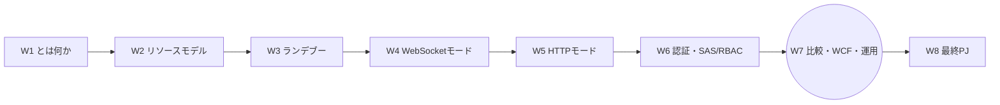
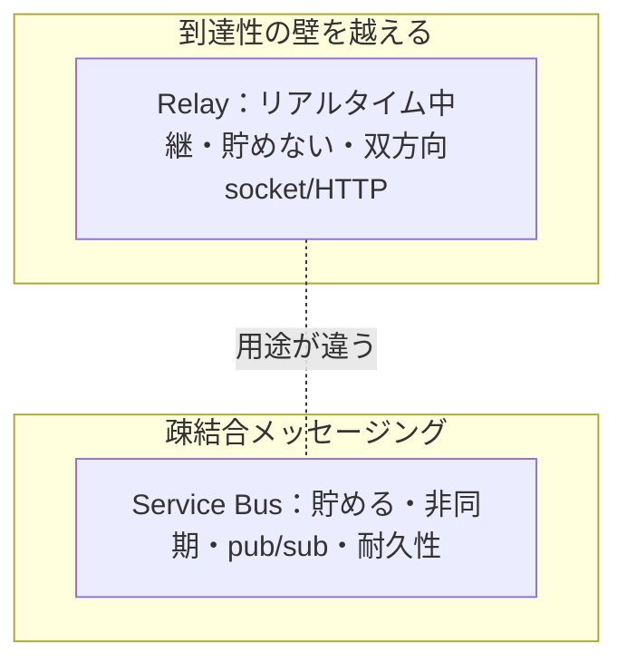
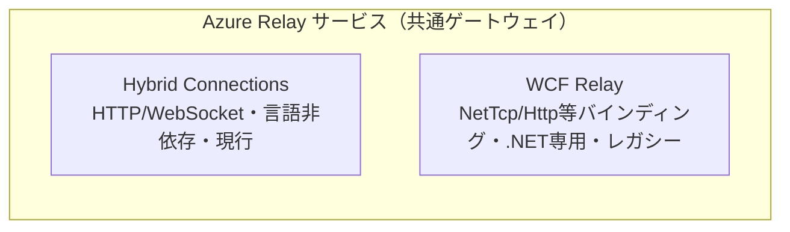
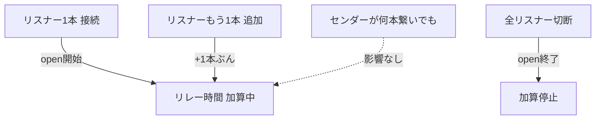

# Week 7 — 比較・WCF Relay 俯瞰・運用：いつ Relay を選ぶか、そして本番で回す視点

> **Phase 3b** | 学習プラン Week 7 / 8
> 学習目標：Relay を**他の選択肢と使い分ける**目を養う（Relay vs VPN/ExpressRoute/Application Proxy/Bastion/Arc/Service Bus/Front Door）。もう 1 つの機能である **WCF Relay を俯瞰**（リレーバインディング・.NET 依存・なぜ Hybrid Connections が後継か）。そして**運用**——メトリクス／監視、クォータ（25 リスナー・5000 接続等）、料金（**Hybrid Connections はリスナー時間のみ課金／メッセージ課金は WCF だけ**）、障害切り分け（`Via` ヘッダ・relay-exceptions・ファイアウォール許可）を押さえ、W8 の実装前に"本番で運用する"視点を固める。

---

## 0. 今週の位置づけ



W1〜W6 で Hybrid Connections を「作る・つなぐ・守る」まで通した。今週（W7）は一段引いて、**選定・レガシー・運用**という"周辺だが実務で効く"3 点を固める。W8 の実装に入る前に、「そもそも Relay を選ぶべきか」「本番でどう監視・課金・切り分けるか」を持っておく。

> **初学者向け用語補足：略語・用語の展開**
> - **VPN** = Virtual Private Network、**ExpressRoute**（エクスプレスルート）＝ Azure への物理専用線（W1 既出）。
> - **Application Proxy**（アプリケーションプロキシ）＝ Microsoft Entra ID の機能。社内 Web アプリを Entra 認証付きで外部公開。
> - **Bastion**（バスティオン、「城の稜堡」）＝ ブラウザから VM へ安全に RDP/SSH する Azure サービス。
> - **Arc**（アーク）＝ Azure 外のサーバ等を Azure の管理下に載せる。
> - **Front Door / Application Gateway**＝ HTTP(S) のグローバル／リージョン負荷分散・WAF。
> - **WCF** = Windows Communication Foundation（.NET の通信基盤・W1 既出）。
> - **バインディング（binding）**＝ WCF で「どのプロトコル・どの暗号化・どの信頼性で通信するか」の設定の束。
> - **メトリクス（metrics）**＝ 監視用の数値指標（接続数・メッセージ数・エラー数など）。

---

## 1. Relay を「いつ選ぶか」：似た目的のサービスとの使い分け

「境界を越える／外から届ける」系は多い。W1 で軽く触れた線引きを、選定表として仕上げる。

| サービス | 本質 | 粒度 | Relay を選ぶ／選ばない目安 |
| --- | --- | --- | --- |
| **Azure Relay** | 社内サービスを**ポート開放せず**中継で公開。両側アウトバウンド | **1 台の 1 サービス（エンドポイント）** | 個別サービスを軽量に外へ。双方向ソケット／HTTP を素通しで |
| **VPN (S2S)** | ネットワーク同士を地続きに | ネットワーク全体 | 多数の資産をまとめて相互接続。ただし侵襲的・重い |
| **ExpressRoute** | Azure への物理専用線 | ネットワーク全体・高信頼 | 大規模・低遅延・コンプラ要件。高コスト |
| **Entra Application Proxy** | 社内 **Web アプリ**を Entra 認証付き公開 | Web アプリ（HTTP） | 「社内 Web を SSO 付きでユーザーに」なら App Proxy。任意 TCP 的双方向なら Relay |
| **Azure Bastion** | ブラウザから VM へ RDP/SSH | VM への管理アクセス | 用途が VM 運用。アプリ間通信は Relay |
| **Azure Arc** | Azure 外資産を Azure 管理下に | 管理面の拡張 | 「管理対象に載せる」。アプリの中継は Relay（Arc と併用可） |
| **Service Bus** | メッセージを**貯めて**非同期に配る（キュー/トピック） | メッセージ | 疎結合・バッファ・pub/sub。リアルタイム素通しは Relay |
| **Front Door / App Gateway** | 公開 HTTP(S) の負荷分散・WAF | HTTP エンドポイント | 既に公開済みの Web の入口最適化。非公開を出すのは Relay |

### とくに紛らわしい 2 つ



- **Relay vs Service Bus**：どちらも Service Bus 一族だが、**Relay は貯めない（非バッファ・W4 §3）／Service Bus は貯める（キュー）**。相手が今いなければ Relay は繋がらない、Service Bus は後で配る。**リアルタイム対話＝Relay、非同期の確実配送＝Service Bus**。
- **Relay vs App Proxy**：どちらも「社内を外へ」だが、**App Proxy は Web アプリ＋Entra ユーザー認証に特化**、**Relay はアプリ間の任意双方向通信（WebSocket 素通し含む）**。人間がブラウザで使う社内 Web なら App Proxy、プログラム同士なら Relay。

---

## 2. WCF Relay 俯瞰：もう 1 つの機能（レガシー・.NET 専用）

Azure Relay の**2 機能**のうち、本教材が扱ってこなかった **WCF Relay** をここで俯瞰する（W1 で「レガシー」と位置づけたもの）。手を動かすのは Hybrid Connections のままでよいが、**既存資産として遭遇する**ことがあるため要点を押さえる。

公式（FAQ）：

> 以前 Service Bus Relay と呼ばれていたサービスは、今は **Azure Relay** と呼ばれる。（…）Hybrid Connections 機能は Azure BizTalk Services から移植された更新版である。**WCF Relay と Hybrid Connections はどちらも引き続きサポートされる。**
> （出典：[Azure Relay FAQ](https://learn.microsoft.com/en-us/azure/azure-relay/relay-faq)）

### WCF Relay の中身：リレーバインディング

WCF Relay は、WCF の「バインディング」を差し替えることで、社内 WCF サービスをクラウド経由で公開する。主なリレーバインディング：

| バインディング | 特徴 | 課金上の扱い（後述 §4） |
| --- | --- | --- |
| **NetTcpRelayBinding** | TCP ベース・高効率・双方向。WCF Relay の主力 | データを**ストリーム**として扱い、5 分ごとの総量 ÷ 64 KB でメッセージ数換算 |
| **NetOnewayRelayBinding** | 一方向（fire-and-forget） | メッセージ単位・**最大 64 KB**（超過は拒否） |
| **NetEventRelayBinding** | 複数リスナーへのイベント配信（マルチキャスト） | 同上・最大 64 KB |
| **HttpRelayTransportBindingElement** | HTTP ベース | メッセージサイズ無制限 |



### なぜ Hybrid Connections が後継なのか（W1 比較表の再掲）

| 観点 | WCF Relay | Hybrid Connections |
| --- | --- | --- |
| WCF | ○ | — |
| .NET Core | — | ○ |
| .NET Framework | ○ | ○ |
| JavaScript/Node.js | — | ○ |
| 標準ベースのオープンプロトコル | — | ○ |
| RPC プログラミングモデル | ○ | ○ |

> **一言で**：WCF Relay は**.NET/WCF に縛られる**。Hybrid Connections は **HTTP/WebSocket というオープン標準**なので任意言語・任意プラットフォームで動く（W8 は Python）。**新規は Hybrid Connections、既存の WCF 資産の延命に WCF Relay**、という住み分け。両者は同じ名前空間・共通ゲートウェイに同居する（W1 §4）。

---

## 3. 運用①：監視とメトリクス、クォータ

### メトリクスで見る

Relay 名前空間は Azure Monitor にメトリクスを出す（接続数・メッセージ数・エラーなど）。監視の勘所は「**リスナーが張れているか（＝リレーが open か）**」「エラー率」「接続数がクォータに迫っていないか」。

> **用語補足：リレーが "open" とは**
> 公式いわく「リレーは**少なくとも 1 つのリスナーが接続していると open** とみなされる」。リスナーが 0 になると、そのリレーは閉じ、センダーは繋がらない（W5 の 502/503）。監視では「open か／リスナー数」を要注視。

### クォータ（本番設計の上限）

公式 FAQ の主な値：

| クォータ | スコープ | 値 |
| --- | --- | --- |
| Relay 名前空間 / サブスクリプション | サブスクリプション | **1000** |
| **同時リスナー / 1 エンティティ** | Hybrid Connection or WCF Relay | **25**（超過は拒否・例外） |
| 同時リレー接続 / 名前空間全体 | 名前空間 | **5,000** |
| リレーエンドポイント / 名前空間 | 名前空間 | **10,000** |
| VNet・IP フィルタルール数 | 名前空間 | **128** |
| 名前空間名の長さ | — | **6〜50 文字** |

（集約使用上限として、サブスクリプション横断で **50 億メッセージ／200 万リレー時間** の月次目安があり、超過見込みならサポートに相談できる。）

> **設計上の含意**：1 つの Hybrid Connection のリスナーは **最大 25**（W2・W4 の負荷分散はこの範囲）。1 名前空間で同時 5,000 接続・エンドポイント 10,000 まで。スケールが要るなら**名前空間を分ける**。

---

## 4. 運用②：料金モデル（Hybrid Connections と WCF で違う）

ここは誤解しやすい最重要ポイント。公式 FAQ：

> リレーは、**メッセージ数**（操作数ではない）と**リレー時間**に基づいて課金される。
> （…）**メッセージは Hybrid Connections のコストではない**（WCF リレーにのみ適用される）。
> （出典：[Azure Relay FAQ](https://learn.microsoft.com/en-us/azure/azure-relay/relay-faq)）

| 課金要素 | Hybrid Connections | WCF Relay |
| --- | --- | --- |
| **リレー時間（listener hours）** | ○ 課金 | ○ 課金 |
| **メッセージ** | **✗ 課金されない** | ○ 課金 |

### リレー時間（listener hours）の数え方

> リレーは、**少なくとも 1 つのリスナーが接続している間** open とみなされる。open なリレーにリスナーを追加すると、**追加のリレー時間**が発生する。リレーに接続する**センダーの数はリレー時間の計算に影響しない**。
> （出典：同上）



- **課金されるのはリスナー側の接続時間**。センダーが何本繋ごうと時間課金には効かない。
- Hybrid Connections は**メッセージ量に依存しない**ので、「大量にデータを流しても、繋いでいる時間で決まる」。常時接続を多数張る設計はリスナー本数×時間で効いてくる。
- WCF Relay だけは加えて**メッセージ課金**（NetTcp はストリームを 5 分ごと総量 ÷ 64 KB で換算、他は 64 KB＝1 メッセージ等）。

> **用語補足：正確な単価は料金ページ**
> 具体的な金額は [Service Bus の料金詳細](https://azure.microsoft.com/pricing/details/service-bus/) の「Hybrid Connections and WCF Relays」表に集約される（本教材では**課金構造**を押さえ、単価はページ参照とする）。加えて、プロビジョニング先データセンター外への**下り（egress）データ転送**は別途課金。

---

## 5. 運用③：障害切り分けとネットワーク

### よくある切り分け

| 症状 | 見るべきところ |
| --- | --- |
| センダーが 502/503 | **リスナーが open か**（0 本になっていないか）。W5 §7 |
| センダーが 504 | リスナーが 60 秒以内に応答したか。処理が長すぎないか |
| 401/403 | トークンの**権限・期限・対象 URI**（W6）。Send/Listen 取り違え・失効 |
| エラーが誰発か不明 | HTTP モードは **`Via` ヘッダ**の有無で判別（あればリスナー発・W5 §6） |
| 接続そのものが張れない | **アウトバウンド 443／`*.servicebus.windows.net`** が許可されているか |

> **用語補足：ファイアウォール許可リスト**
> 公式いわく、Relay クライアントは **FQDN** で接続する。DNS 許可リストに対応する FW では **`*.servicebus.windows.net`** を、あるいは特定名前空間なら `your-namespace.servicebus.windows.net` を許可する（後者の場合は名前空間のゲートウェイも許可が要る）。**必要なのはアウトバウンド許可だけ**——インバウンド開放は最後まで不要（W1 の核心の再確認）。

> **用語補足：例外の調べ方**
> Relay API が投げる代表的な例外と対処は公式 [Relay exceptions](https://learn.microsoft.com/en-us/azure/azure-relay/relay-exceptions) にまとまる。タイムアウト・認可失敗・エンドポイント未登録などはここを引く。

### ネットワークで送信元を絞る

名前空間は **IP フィルタ／VNet サービスエンドポイント**（最大 128 ルール）で、接続元を限定できる。ゼロトラスト寄りに締めたいときの手段（W6 §5 の 5 番と対）。

---

## 6. ハンズオン — 監視・クォータ・料金を"自分の名前空間"で確認する

新規リソースは作らない。W2 以降の名前空間で、運用視点を実地確認する。

### 手順 A：メトリクスを見る

1. ポータルで Relay 名前空間 → **「メトリクス（Metrics）」**。
2. 利用可能なメトリクス（接続数・メッセージ・エラー系）を 1 つ選んでグラフ表示。W4/W5 のハンズオンでリスナーを起動している間だけ接続数が立つことを確認する。

### 手順 B：クォータと料金構造を確認する

1. 名前空間の **「プロパティ」／「スケール」** 系ブレードで SKU が Standard であることを確認（W1）。
2. §3 のクォータ（25 リスナー・5,000 接続）を、自分の用途と照らす。「この HC に何リスナー張る設計か？」を言語化。
3. 料金の考え方を再確認：**Hybrid Connections はリスナー時間課金・メッセージ無料**。W4 で複数リスナーを張るとその本数×時間で課金される、という因果を説明できるか。

### 手順 C（任意）：ファイアウォール観点

- 自分の環境から `nslookup <名前空間>.servicebus.windows.net` を引き、FQDN で解決されることを確認（許可リスト設計の材料）。

```bash
nslookup <名前空間>.servicebus.windows.net
```

> **コマンドの読み方**：`nslookup`＝DNS 名前解決を問い合わせるツール。返る IP／CNAME を見て「`*.servicebus.windows.net` を許可すればよい」ことを納得する。

### 後片付け

W8 で名前空間を使う。残す。

---

## 7. 自己チェック

1. Relay と **Service Bus** の決定的な違いは何か（貯める／貯めない）。相手が今いないとき、それぞれどうなるか。
2. Relay と **Application Proxy** の使い分けは。人間がブラウザで使う社内 Web はどちらか。
3. VPN/ExpressRoute と Relay の**粒度**の違いを言えるか。
4. **WCF Relay** とは何か。主なリレーバインディング（NetTcp/NetOneway/Http 等）を挙げ、なぜ **Hybrid Connections が後継**とされるか（.NET 依存 vs オープン標準）。両者は同居できるか。
5. リレーが **"open"** とはどういう状態か。監視で最も見るべきは何か。
6. **同時リスナー数の上限**は。名前空間あたりの同時接続・エンドポイント上限は。スケールしたいときの手は。
7. **料金**：Hybrid Connections で課金されるのは何か。**メッセージは課金されるか**。センダーの本数はリレー時間に影響するか。WCF Relay は何が追加で課金されるか。
8. 502/503・504・401/403 をそれぞれどう切り分けるか。HTTP モードでエラーの発信元をどう判別するか。接続には**インバウンド開放が要るか**。

---

## 8. 次週予告（W8：最終 PJ ＝ Bicep + Python E2E）

いよいよ総仕上げ。W2 のリソースモデル（名前空間＋Hybrid Connection＋認可ルール）を **Bicep** で宣言的に構築し、W6 の SAS 署名を組み込んだ **Python の `relaylib.py`／`listener.py`／`sender.py`** で、W3 のランデブーを実際に成立させて双方向通信する。全権キーは使わず、**Listen 専用／Send 専用**の認可ルールを Bicep で分離（W6 の最小権限）。接続情報は環境変数に置き、`python -m py_compile` と `az bicep build` で検証する。W1〜W7 の理解が 1 つの動く成果物に結実する。

---

### 参考（出典）
- [Azure Relay FAQ（料金モデル・クォータ・WCF/HC の関係・ファイアウォール許可）](https://learn.microsoft.com/en-us/azure/azure-relay/relay-faq)
- [What is Azure Relay?（2 機能・HC vs WCF 比較表）](https://learn.microsoft.com/en-us/azure/azure-relay/relay-what-is-it)
- [Service Bus pricing details（Hybrid Connections and WCF Relays 単価表）](https://azure.microsoft.com/en-us/pricing/details/service-bus/)
- [Relay exceptions（例外と対処）](https://learn.microsoft.com/en-us/azure/azure-relay/relay-exceptions)
