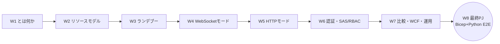
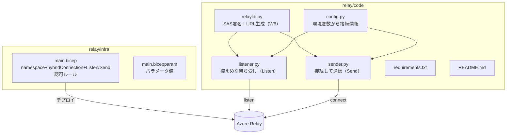
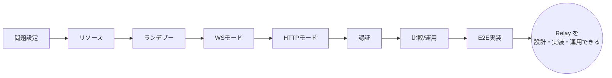

# Week 8 — 最終プロジェクト：Bicep で構築し、Python 自前実装で E2E 通信する

> **Phase 4（総仕上げ）** | 学習プラン Week 8 / 8
> 学習目標：W1〜W7 の理解を 1 つの動く成果物に結実させる。**Bicep** で名前空間＋Hybrid Connection＋**Listen 専用／Send 専用の認可ルール**（W6 の最小権限）を宣言的に構築し、**Python** で `relaylib.py`（W6 の SAS 署名）／`listener.py`／`sender.py` を自前実装（Node の `createRelayToken` に頼らない）して、W3 のランデブーを実際に成立させ双方向通信する。接続情報は環境変数に置き、`python -m py_compile` と `az bicep build` で検証する。

---

## 0. 今週の位置づけ



これまでの各週が、最終 PJ のどの部品になるかを対応づける。

| 週 | 最終 PJ での結実 |
| --- | --- |
| W2 リソースモデル | **Bicep**：`namespaces` → `hybridConnections` → `authorizationRules` の階層 |
| W3 ランデブー | **listener/sender** が listen/connect で実際に出会う |
| W4 WebSocket モード | `websockets` ライブラリで双方向にメッセージを流す |
| W6 認証・最小権限 | **`relaylib.py` の SAS 自前署名**＋Bicep で **Listen 専用/Send 専用**ルール分離 |
| W7 運用 | 環境変数で鍵を秘匿、検証（py_compile/bicep build）、後片付け |

成果物は `relay/infra/`（Bicep）と `relay/code/`（Python）に置く。

---

## 1. 成果物の全体像



---

## 2. Bicep：リソースを宣言的に構築する（W2＋W6）

`relay/infra/main.bicep`。W2 の階層に、W6 の**最小権限**（Listen 専用・Send 専用の認可ルール）を加える。

```bicep
// 名前空間 → Hybrid Connection → Listen専用/Send専用 認可ルール
@description('Relay 名前空間名（6〜50文字・グローバル一意）')
param namespaceName string
@description('Hybrid Connection 名（＝path）')
param hybridConnectionName string = 'inventory'
param location string = resourceGroup().location

resource ns 'Microsoft.Relay/namespaces@2024-01-01' = {
  name: namespaceName
  location: location
  sku: { name: 'Standard', tier: 'Standard' }
  properties: {}
}

resource hc 'Microsoft.Relay/namespaces/hybridConnections@2024-01-01' = {
  parent: ns
  name: hybridConnectionName
  properties: {
    requiresClientAuthorization: true       // センダーにも Send トークンを要求（W2 §4）
    userMetadata: 'inventory listener endpoint'
  }
}

// この Hybrid Connection 専用の Listen だけの鍵（社内リスナーへ）
resource listenRule 'Microsoft.Relay/namespaces/hybridConnections/authorizationRules@2024-01-01' = {
  parent: hc
  name: 'listen-only'
  properties: { rights: [ 'Listen' ] }
}

// この Hybrid Connection 専用の Send だけの鍵（外部センダーへ）
resource sendRule 'Microsoft.Relay/namespaces/hybridConnections/authorizationRules@2024-01-01' = {
  parent: hc
  name: 'send-only'
  properties: { rights: [ 'Send' ] }
}

output namespaceHost string = '${ns.name}.servicebus.windows.net'
output hybridConnectionName string = hc.name
```

> **コードの読み方**：`param`＝デプロイ時に渡す値、`resource X '型@API版' = {…}`＝リソース宣言、`parent:`＝子リソースの親、`rights: ['Listen']`＝この鍵の権限（W6 の Listen/Send/Manage）、`output`＝デプロイ後に返す値。**全権 Root キーは配らず、用途別の最小権限鍵を IaC で定義**している点が W6 の実践。

`relay/infra/main.bicepparam`：

```bicep
using './main.bicep'
param namespaceName = 'relay-learn-REPLACE'   // グローバル一意な名前に置換
param hybridConnectionName = 'inventory'
```

> **用語補足：IaC（Infrastructure as Code）**
> インフラをコード（Bicep）で宣言し、`az deployment` で再現可能に構築する方式。手作業のポータル操作と違い、**同じ環境を何度でも同一に作れる**（冪等）。W2 でポータルから作ったものを、ここでコード化している。

---

## 3. Python：SAS 署名を自前実装（W6 の結実）

`relay/code/relaylib.py`。W6 §3 の署名関数に、listen/connect の URL 生成を加える。**標準ライブラリのみ**（外部依存なし）。

```python
"""Azure Relay Hybrid Connections 用ヘルパ：SASトークンとWebSocket URL生成。"""
import base64, hashlib, hmac, math, time, urllib.parse


def hmac_sha256(key: bytes, msg: bytes) -> bytes:
    return hmac.new(key=key, msg=msg, digestmod=hashlib.sha256).digest()


def create_sas_token(service_namespace: str, entity_path: str,
                     sas_key_name: str, sas_key: str,
                     valid_seconds: int = 60 * 60 * 48) -> str:
    """リソースURI＋失効時刻を鍵でHMAC-SHA256署名したSASトークンを返す（W6 §3）。"""
    uri = "http://" + service_namespace + "/" + entity_path
    encoded_uri = urllib.parse.quote(uri, safe="")
    expiry = math.floor(time.time()) + valid_seconds
    string_to_sign = encoded_uri + "\n" + str(expiry)          # ②
    signature = hmac_sha256(sas_key.encode("utf-8"),
                            string_to_sign.encode("utf-8"))     # ③
    sig = urllib.parse.quote(base64.b64encode(signature))      # ④⑤
    return ("SharedAccessSignature sr=" + encoded_uri +
            "&sig=" + sig + "&se=" + str(expiry) + "&skn=" + sas_key_name)


def create_listen_url(service_namespace: str, entity_path: str, token: str) -> str:
    return ("wss://" + service_namespace + "/$hc/" + entity_path +
            "?sb-hc-action=listen&sb-hc-token=" + urllib.parse.quote(token))


def create_send_url(service_namespace: str, entity_path: str, token: str) -> str:
    return ("wss://" + service_namespace + "/$hc/" + entity_path +
            "?sb-hc-action=connect&sb-hc-token=" + urllib.parse.quote(token))
```

> これが W4・W5 で使った Node の `createRelayToken`／`createRelayListenUri`／`createRelaySendUri` の**自前版**。「SDK の中で何が起きていたか」を完全に手の内に収めた状態。

`relay/code/config.py`。**鍵をコードに書かず環境変数から**（W6・W7 の秘匿）。

```python
"""接続情報を環境変数から読む（鍵をコード/リポジトリに置かない）。"""
import os


def load():
    ns = os.environ["RELAY_NAMESPACE"]           # 例 relay-learn-xxx （.servicebus.windows.net は付けない）
    return {
        "namespace": ns if ns.endswith(".servicebus.windows.net")
                     else ns + ".servicebus.windows.net",
        "path":     os.environ.get("RELAY_PATH", "inventory"),
        "key_name": os.environ["RELAY_KEY_NAME"],   # listen-only / send-only
        "key":      os.environ["RELAY_KEY"],        # 対応する Primary Key
    }
```

---

## 4. Python：リスナーとセンダー（W3 のランデブー成立）

`relay/code/listener.py`。W6 の Listen 鍵で待ち受ける。

```python
"""Azure Relay Hybrid Connections リスナー（Listen権限）。"""
import asyncio, logging
import websockets
import relaylib
from config import load


async def main():
    logging.basicConfig(level=logging.INFO)
    cfg = load()
    token = relaylib.create_sas_token(cfg["namespace"], cfg["path"], cfg["key_name"], cfg["key"])
    url = relaylib.create_listen_url(cfg["namespace"], cfg["path"], token)
    async with websockets.connect(url) as ws:               # listen＝コントロールチャネル（W3）
        logging.info("listening on %s / %s", cfg["namespace"], cfg["path"])
        while True:
            message = await ws.recv()
            logging.info("received: %s", message)


if __name__ == "__main__":
    try:
        asyncio.run(main())
    except KeyboardInterrupt:
        pass
```

`relay/code/sender.py`。W6 の Send 鍵で接続して送る。

```python
"""Azure Relay Hybrid Connections センダー（Send権限）。"""
import asyncio, json, logging, sys
import websockets
import relaylib
from config import load


async def main(text: str):
    logging.basicConfig(level=logging.INFO)
    cfg = load()
    token = relaylib.create_sas_token(cfg["namespace"], cfg["path"], cfg["key_name"], cfg["key"])
    url = relaylib.create_send_url(cfg["namespace"], cfg["path"], token)
    async with websockets.connect(url) as ws:               # connect（W3）
        await ws.send(json.dumps({"message": text}))
        logging.info("sent: %s", text)


if __name__ == "__main__":
    msg = sys.argv[1] if len(sys.argv) > 1 else "Hello from Azure Relay!"
    asyncio.run(main(msg))
```

`relay/code/requirements.txt`：

```
websockets>=12.0
```

> **なぜ依存は `websockets` だけか**：`relaylib.py` は標準ライブラリのみ（W6 §3）。listener/sender が使う WebSocket クライアントだけ外部パッケージ。W3 で見たとおり、ランデブー成立後は**ただの WebSocket**なので標準的な WebSocket ライブラリで足りる。

> **この listener は最小形（学習用）である**：公式 Python get-started に倣い、リスナーはコントロールチャネルで `recv()` する最小構成。実運用の完全なリスナーは、W3 で学んだ **accept 通知を受けてランデブーソケットを開く**ハンドシェイクまで扱う（.NET/Node の公式 SDK＝`hyco-ws` がこれを内部処理）。本 PJ は「自前 SAS＋標準 WebSocket でどこまでできるか」を体得するのが狙いで、堅牢なリスナーは公式 SDK に委ねるのが実務判断（W7 の選定眼）。

---

## 5. 検証と実行手順（README の骨子）

`relay/code/README.md` に手順をまとめる。要点：

### 静的検証（Azure 不要）

```bash
python -m py_compile relay/code/*.py     # Python 構文チェック
az bicep build --file relay/infra/main.bicep   # Bicep 検証（ARM 生成）
```

### デプロイ（要 Azure）

```bash
az group create -n rg-relay-learn -l japaneast
az deployment group create -g rg-relay-learn \
  --template-file relay/infra/main.bicep \
  --parameters relay/infra/main.bicepparam
```

### 鍵を環境変数へ（Listen 用・Send 用でシェルを分ける）

```bash
# リスナー用シェル
export RELAY_NAMESPACE=relay-learn-xxx
export RELAY_PATH=inventory
export RELAY_KEY_NAME=listen-only
export RELAY_KEY=$(az relay hyco authorization-rule keys list \
  -g rg-relay-learn --namespace-name relay-learn-xxx \
  --hybrid-connection-name inventory --name listen-only --query primaryKey -o tsv)
```

> **コマンドの読み方**：`az relay hyco authorization-rule keys list … --query primaryKey -o tsv`＝W6 の Listen 専用ルールの主キーだけを取り出し、環境変数に入れる。**鍵は端末の環境変数に置き、ファイルにもコミットにも残さない**（W7 の秘匿）。センダー用シェルでは `RELAY_KEY_NAME=send-only` と Send 鍵を使う。

### 実行

```bash
pip install -r relay/code/requirements.txt
python relay/code/listener.py     # 端末1（Listen鍵の環境変数を設定済み）
python relay/code/sender.py "在庫A1を3個出荷"   # 端末2（Send鍵）
```

端末 1（リスナー）に `received: {"message": "在庫A1を3個出荷"}` が出れば **E2E 成功**。W3 のランデブーが、W6 の自前 SAS で成立している。

### 後片付け

```bash
az group delete -n rg-relay-learn --yes --no-wait
```

---

## 6. 自己チェック（総合）

1. Bicep の 3 階層（`namespaces`／`hybridConnections`／`authorizationRules`）はそれぞれ W2 の何に当たるか。なぜ **Listen 専用／Send 専用**に分けたか（W6）。
2. `relaylib.create_sas_token` は W6 の署名 5 ステップのどれをどの行で行っているか。**鍵は生成物（トークン）に含まれるか**。
3. `listener.py` の `websockets.connect(listen_url)` は、W3 のどの一手（listen＝◯◯チャネル）に当たるか。`sender.py` の connect は。
4. なぜ外部依存は `websockets` だけで済むのか（W3・W4 のどの性質から）。
5. 鍵を `config.py` で**環境変数**から読むのはなぜか。リポジトリに置くと何が問題か。
6. この最小リスナーが「学習用」である理由は。完全なリスナーが追加で扱うべき W3 の手続きは何か。実運用ではどうするのが賢いか（W7）。
7. 静的検証（py_compile／bicep build）と E2E 実行の違いは。Azure 無しでどこまで確認できるか。

---

## 7. 修了 — Azure Relay 全 8 週の到達点



ここまでで、あなたは Azure Relay を——
- **なぜ使うか**（ポート開放せず社内サービスを外へ・W1）
- **どう構成するか**（名前空間＋Hybrid Connection・W2）
- **なぜ動くか**（インバウンド 0 のランデブー・W3）
- **どう使うか**（WebSocket／HTTP モード・W4/W5）
- **どう守るか**（SAS 自前署名／Entra ID・最小権限・W6）
- **いつ選び・どう運用するか**（比較・WCF・料金/クォータ/切り分け・W7）
- **どう作るか**（Bicep＋Python E2E・W8）

——を一気通貫で説明・実装できる。お疲れさま。次に学ぶなら、本番強度のリスナー（accept ハンドシェイクの完全実装 or 公式 SDK）、Entra ID／マネージド ID 認証の実装、Service Bus との組み合わせ設計が自然な発展先である。

---

### 参考（出典）
- [Azure Relay Hybrid Connections - WebSocket requests in Python（relaylib.py・listener/sender）](https://learn.microsoft.com/en-us/azure/azure-relay/relay-hybrid-connections-python-get-started)
- [Microsoft.Relay/namespaces/hybridConnections（Bicep：型・プロパティ）](https://learn.microsoft.com/en-us/azure/templates/microsoft.relay/namespaces/hybridconnections)
- [Microsoft.Relay/namespaces/hybridConnections/authorizationRules（認可ルール Bicep）](https://learn.microsoft.com/en-us/azure/templates/microsoft.relay/namespaces/hybridconnections/authorizationrules)
- [Azure Relay authentication and authorization（SAS/Entra ID）](https://learn.microsoft.com/en-us/azure/azure-relay/relay-authentication-and-authorization)
