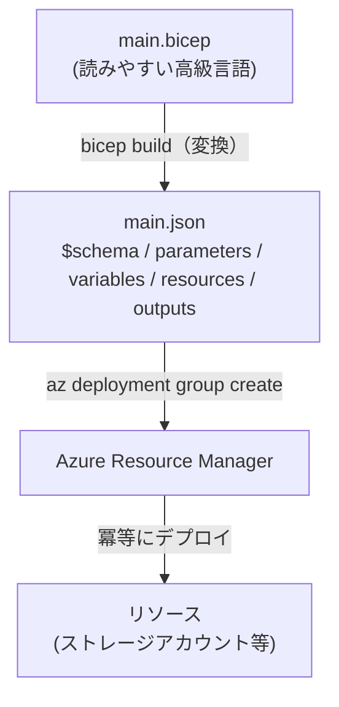

# Week 3 — ARM JSON テンプレートの構造：4 大セクションを読み書きする

> **Phase 1b** | 学習プラン Week 3 / 9
> 学習目標：ARM テンプレート（JSON）のトップレベル構造と 4 大セクション（`parameters` / `variables` / `resources` / `outputs`）を読み書きでき、テンプレート関数と `dependsOn` の役割を説明でき、「Bicep は結局この JSON にコンパイルされる」ことを `bicep build` で自分の目で確認できる

---

## 0. 今週の位置づけ

Week 1-2 で「ARM とは何か（単一の管理レイヤー）」「テンプレートをどの階層にデプロイできるか（スコープ）」を押さえた。ここまでは**"入れ物" と "宛先" の話**だった。今週からは Phase 1b——**その入れ物に入れる "中身"、つまりテンプレートそのものの書き方**に入る。

1. **Week 1-2**：ARM の正体とデプロイスコープ（済み）
2. **Week 3**：ARM JSON テンプレートの構造（今日はここ）
3. **Week 4**：Bicep（同じことを、読みやすい文法で書く）
4. **Week 5**：デプロイの挙動（モード・what-if・状態管理）
5. **Week 6 以降**：ガバナンス・セキュリティ・CI/CD・最終プロジェクト

> **なぜ Bicep があるのに、わざわざ生の JSON から始めるのか**：実務では Week 4 以降で学ぶ **Bicep** を書くのが普通で、生 JSON を手書きする機会はほぼない。それでも今週 JSON をやるのは、**Bicep は "この JSON に変換（コンパイル）される" 薄い皮**にすぎないから（§6 で実際に変換して確認する）。土台の JSON の構造を一度理解しておくと、Bicep で書いたものが裏で何になるか・エラーメッセージが何を指しているかが読めるようになる。**JSON は "アセンブリ言語"、Bicep は "高級言語"** のような関係。

> **本教材が扱わない範囲**：テンプレート関数は数十種類あるが、今週は代表的な数個だけを扱う（全量はリファレンス送り）。`copy`（ループ）や条件デプロイ・入れ子テンプレートの応用は Week 4-5 で必要に応じて触れる。`languageVersion 2.0`（シンボリック名など新機能）も今回は深入りしない。

---

## 1. テンプレートは「1 個の JSON オブジェクト」

ARM テンプレートは、拡張子こそ `.json` だが、中身は**決まったトップレベルのキーを持つ 1 個の JSON オブジェクト**。まず最小形を見る。

```json
{
  "$schema": "https://schema.management.azure.com/schemas/2019-04-01/deploymentTemplate.json#",
  "contentVersion": "1.0.0.0",
  "resources": []
}
```

これだけで「何もデプロイしない、正しいテンプレート」として成立する（`resources` が空なので冪等に "何もしない"）。

> **初学者向け用語補足：JSON（ジェイソン）のおさらい**
> **JSON（JavaScript Object Notation）**＝データを「キー: 値」の集まりで表す、人間にも読めるテキスト形式。`{ }` はオブジェクト（キーと値の集まり）、`[ ]` は配列（値の並び）、値には文字列 `"..."`・数値・真偽値・オブジェクト・配列が入る。ARM テンプレートは「一番外側が 1 個の `{ }`、その中に `$schema` や `resources` などの決まったキーが並ぶ」構造をしている。

---

## 2. トップレベルの全体構造

トップレベルに書けるキーは決まっている。Microsoft Learn の定義（[Template structure and syntax](https://learn.microsoft.com/en-us/azure/azure-resource-manager/templates/syntax)）を表にすると次の通り。

| キー | 必須 | 役割 |
|---|---|---|
| `$schema` | **必須** | このテンプレートが従う言語バージョン（スキーマ）の場所。スコープごとに URL が異なる |
| `contentVersion` | **必須** | テンプレート自体のバージョン（例 `1.0.0.0`）。任意の値でよく、変更管理の目印 |
| `parameters` | 任意 | デプロイ時に外から渡す入力値 |
| `variables` | 任意 | テンプレート内で使い回す中間値（式の簡略化） |
| `functions` | 任意 | ユーザー定義関数 |
| `resources` | **必須** | 実際にデプロイ・更新するリソースの定義。ここが本体 |
| `outputs` | 任意 | デプロイ後に返す値 |

**必須は 3 つだけ**（`$schema` / `contentVersion` / `resources`）。残りは必要なときに足す。

> **初学者向け用語補足：スキーマ（`$schema`）とは／なぜスコープで URL が変わるか**
> **スキーマ**＝「この JSON はこういうキー・型で書くべき」という**設計図・検証ルール**。エディタ（VS Code など）はこの URL を見て入力補完や文法チェックをしてくれる。Week 2 で「スコープごとにテンプレートのスキーマが違う」と触れたのはこれ。スコープによって書けるリソースが違う（RG スコープは通常リソース、サブスクスコープは RG や Policy…）ため、スキーマも別物になる。
>
> | スコープ | `$schema` の末尾 |
> |---|---|
> | リソースグループ | `deploymentTemplate.json#` |
> | サブスクリプション | `subscriptionDeploymentTemplate.json#` |
> | 管理グループ | `managementGroupDeploymentTemplate.json#` |
> | テナント | `tenantDeploymentTemplate.json#` |

---

## 3. 4 大セクションを 1 つずつ

実務で日常的に触るのは `parameters` / `variables` / `resources` / `outputs` の 4 つ。ストレージアカウントを 1 つ作るテンプレートを題材に、順に見ていく。

### 3-1. `parameters`：外から渡す入力値

「デプロイのたびに変えたい値」を外出しする。環境（dev/prod）ごとに名前やサイズを変えたい、といったときに使う。

```json
"parameters": {
  "storageAccountName": {
    "type": "string",
    "minLength": 3,
    "maxLength": 24,
    "metadata": { "description": "3〜24文字の一意なストレージ名" }
  },
  "skuName": {
    "type": "string",
    "defaultValue": "Standard_LRS",
    "allowedValues": [ "Standard_LRS", "Standard_GRS" ]
  }
}
```

- `type`：`string` / `int` / `bool` / `object` / `array` / `securestring` / `secureObject`
- `defaultValue`：省略時の既定値（あれば、その parameter はデプロイ時に指定しなくてよい）
- `allowedValues`：許可する値のホワイトリスト（外れるとデプロイ前に弾かれる）
- `minLength`/`maxLength`/`minValue`/`maxValue`：値の制約
- `metadata.description`：Portal でデプロイするときに説明として表示される

> **初学者向け用語補足：`securestring` はなぜ別扱いか**
> パスワードやトークンなど秘密の値は `securestring`（文字列）・`secureObject`（オブジェクト）で受け取る。これらは**デプロイ履歴やログに値が残らない**。通常の `string` で秘密を渡すと Activity Log（Week 1）等に平文で残りうるので、秘密は必ず secure 系を使う（Week 7 で Key Vault 参照と合わせて再登場）。

### 3-2. `variables`：テンプレート内で使い回す中間値

複雑な式や繰り返し使う値に名前を付けて、`resources` をすっきりさせる。**外から渡せない**点が parameters との違い。

```json
"variables": {
  "storageSku": { "name": "[parameters('skuName')]" },
  "tags": { "env": "learn", "week": "3" }
}
```

- `[ ... ]` で囲まれた部分は**式（expression）**として評価される（後述 §4）。`parameters('skuName')` は「skuName という parameter の値」を意味する。

> **初学者向け用語補足：parameters と variables の違いを「関数の引数 vs ローカル変数」で捉える**
> テンプレートを **1 つの関数（レシピ）** だと思うと、両者の役割はきれいに分かれる。
>
> | | parameters（パラメータ） | variables（変数） |
> |---|---|---|
> | 誰が値を決めるか | **テンプレートの外側**（デプロイする人／CI/CD） | **テンプレートの中身**（作者が固定で書く） |
> | 関数でいうと | **引数**（呼ぶ時に渡す） | **関数内のローカル変数・定数** |
> | デプロイのたびに変えられるか | **変えられる**（`--parameters` で渡す） | 変えられない（テンプレートを書き換えない限り固定） |
> | 主な目的 | 環境ごと・実行ごとに**変えたい値**を外出しする | 式を**使い回して読みやすく**／命名規則を 1 箇所に集約 |
>
> **たとえ（料理のレシピ）**：parameters＝作る人が持ち込む材料（「何人前？」「甘口／辛口？」＝作るたびに変えられる）。variables＝レシピ内で決め打ちの下ごしらえ（「ソースは醤油2:みりん1」＝作者が固定、作る人は変えない）。
>
> **一緒に使う例**：
>
> ```json
> "parameters": {
>   "env": { "type": "string", "allowedValues": [ "dev", "prod" ] }   // 外から渡す
> },
> "variables": {
>   "storageName": "[format('st{0}001', parameters('env'))]",          // paramを元に内部で組み立て
>   "tags": { "env": "[parameters('env')]", "managedBy": "arm-template" }
> }
> ```
>
> ①デプロイ時に `env=prod` を**外から渡す** → ②内部で variable `storageName` が `stprod001` に**決まる**（作者が決めた命名規則 `st{env}001` に従う）→ ③作る人は `storageName` を直接いじれない（渡す口が無い）。**命名規則を守らせたいから、あえて variable に閉じ込めている**。
>
> ```bash
> # env だけ外から渡せる。storageName は渡せない
> az deployment group create -g rg-arm-learn --template-file main.json --parameters env=prod
> ```
>
> **どちらを使うかの判断**：外の人に選ばせたい／環境ごとに変えたい → **parameter**（環境名・リージョン・SKU・名前・パスワード）。parameter や固定値から"導出"される／外から勝手に変えられたくない → **variable**（命名規則で組み立てた名前・共通 tags・繰り返す長い式）。
>
> **もう 1 つの違い（制約とチェック）**：`defaultValue`・`allowedValues`・`minLength`/`maxValue`・`metadata.description` を持てるのは **parameter だけ**。これは「**外から来る値は信用せず、入口でチェックする**」ため。variable は作者が書く内部値なのでガードは不要＝持てない。つまり **parameter＝外部インターフェース（引数）／variable＝内部実装（ローカル変数）**。

### 3-3. `resources`：本体。実際に作るリソース

テンプレートの心臓部。1 リソース＝ 1 オブジェクトで、最低限 `type` / `apiVersion` / `name` が要る。

```json
"resources": [
  {
    "type": "Microsoft.Storage/storageAccounts",
    "apiVersion": "2025-06-01",
    "name": "[parameters('storageAccountName')]",
    "location": "[resourceGroup().location]",
    "sku": "[variables('storageSku')]",
    "kind": "StorageV2",
    "tags": "[variables('tags')]",
    "properties": { "accessTier": "Hot" }
  }
]
```

| プロパティ | 役割 |
|---|---|
| `type` | `リソースプロバイダー/リソース種別`（Week 1 の `Microsoft.Storage` を思い出す） |
| `apiVersion` | このリソースを作る REST API のバージョン |
| `name` | リソース名 |
| `location` | リージョン。ここでは `resourceGroup().location`＝「デプロイ先 RG と同じ場所」 |
| `sku` / `kind` / `properties` | リソース固有の設定。中身は各リソースの REST API の body と同じ |

> **初学者向け用語補足：`apiVersion` はなぜ必須なのか**
> Azure の各リソースは REST API（Week 1）で作られ、その API は日付つきでバージョン管理されている（例 `2025-06-01`）。`apiVersion` を明示することで、「**将来 API が変わってもこのテンプレートの挙動は固定される**」。Microsoft Learn も「動く限り同じ API バージョンを使い続け、新機能が要るときだけ上げよ」と推奨している。新規作成時はそのリソースの最新版を選ぶのが基本。

### 3-4. `outputs`：デプロイ後に返す値

作った後に知りたい値（生成された ID、接続先など）を返す。CI/CD で次のステップに渡す・確認する、といった用途。

```json
"outputs": {
  "storageId": {
    "type": "string",
    "value": "[resourceId('Microsoft.Storage/storageAccounts', parameters('storageAccountName'))]"
  }
}
```

デプロイ完了後、CLI の出力や `az deployment group show` でこの値を取得できる。

---

## 4. テンプレート関数：`[ ... ]` の中身

値を固定文字列ではなく**動的に組み立てる**ために、テンプレート関数を使う。`[ ]` で囲むと「これは式なので評価して」という合図。代表的なものだけ挙げる。

| 関数 | 何をするか | 例 |
|---|---|---|
| `parameters('x')` | parameter `x` の値を取り出す | `[parameters('skuName')]` |
| `variables('x')` | variable `x` の値を取り出す | `[variables('tags')]` |
| `resourceGroup()` | デプロイ先 RG の情報（`.location`・`.id` など） | `[resourceGroup().location]` |
| `concat(a, b, …)` | 文字列（や配列）を連結する | `[concat('st', parameters('env'))]` |
| `format('{0}-{1}', a, b)` | 書式に値を差し込む（concat の読みやすい版） | `[format('st{0}', parameters('env'))]` |
| `uniqueString(seed)` | seed から決定的な短いハッシュ文字列を作る | `[uniqueString(resourceGroup().id)]` |
| `resourceId(type, name)` | リソースの完全な ID（Week 1 の "住所"）を組み立てる | `[resourceId('Microsoft.Storage/storageAccounts', 'st1')]` |

> **初学者向け用語補足：`uniqueString` が "重複しない名前" を作る仕組み**
> ストレージアカウント名は **Azure 全体で一意**でなければならない（`xxx.blob.core.windows.net` という URL になるため）。そこで `uniqueString(resourceGroup().id)` のように「RG の ID」を種（seed）にハッシュを作ると、**同じ RG なら毎回同じ**（＝冪等：Week 1）だが、**別の RG／別の人とは重複しにくい**短い文字列が得られる。`[format('toylaunch{0}', uniqueString(resourceGroup().id))]` のように接頭辞と組み合わせて使うのが定番。

> **初学者向け用語補足：テンプレート関数名の読み方**
> 読みにくい関数名の読み・由来をまとめる。
>
> | 表記 | 読み | 由来・意味 |
> |---|---|---|
> | `concat` | **コンキャット** | **concatenate（コンカチネート）＝連結する** の略。文字列・配列をつなげる |
> | `format` | フォーマット | 書式（フォーマット）に値を差し込む |
> | `uniqueString` | ユニークストリング | unique（一意）な string（文字列）を作る |
> | `resourceId` | リソースアイディー | リソースの ID（住所）を組み立てる |
> | `resourceGroup` | リソースグループ | デプロイ先 RG の情報を返す |
>
> **`concat` と `format` の違い**：どちらも「文字列を組み立てる」関数。`concat('a', 'b', 'c')`＝`abc`（つなげるだけ）。`format('{0}-{1}', 'a', 'b')`＝`a-b`（`{0}` `{1}` の位置に第 2・第 3 引数を差し込む）。値が増えるほど `format` の方が読みやすい。Bicep（Week 4）では文字列補間 `'${x}'` でさらに簡単に書ける。

---

## 5. `dependsOn`：デプロイの順序

複数リソースを書くと「A ができてから B」という順序が要ることがある（例：VNet → その中の Subnet）。ARM の基本方針は Microsoft Learn の言葉で明快だ。

> Resource Manager evaluates the dependencies between resources and deploys them in the correct order. When resources aren't dependent on each other, they're deployed in parallel.
> （ARM はリソース間の依存関係を評価し、正しい順序でデプロイする。互いに依存しないリソースは並列にデプロイされる）

つまり **ARM は可能な限り並列で速くデプロイし、依存があるところだけ順序を守る**。その "依存があるところ" を明示するのが `dependsOn`。

```json
{
  "type": "Microsoft.Storage/storageAccounts",
  "apiVersion": "2025-06-01",
  "name": "[parameters('storageAccountName')]",
  "location": "[resourceGroup().location]",
  "dependsOn": [
    "[resourceId('Microsoft.Network/virtualNetworks', 'vnet-learn')]"
  ]
}
```

> **初学者向け用語補足：`dependsOn` は「少ないほど良い」**
> Microsoft Learn は「不要な `dependsOn` は避けよ（デプロイを遅くし、循環依存を生む）」と注意している。手書き JSON では順序を自分で管理する必要があるが、**Bicep（Week 4）では、あるリソースが別リソースを参照した瞬間に依存が自動で張られる**ため、`dependsOn` を手書きする場面が激減する。これも「JSON＝手動 / Bicep＝自動」の一例。

---

## 6. Bicep は実はこの JSON にコンパイルされる

ここまで書いてきた JSON は、実は **Bicep で書いたものが裏で生成する成果物**そのもの。Microsoft Learn は Bicep をこう定義している。

> Bicep is a transparent abstraction over a Resource Manager JSON template that doesn't lose the capabilities of a JSON template. During deployment, the Bicep CLI converts a Bicep file into a Resource Manager JSON template.
> （Bicep は ARM JSON テンプレートの上に乗った "透明な抽象化" で、JSON の能力を一切失わない。デプロイ時に Bicep CLI が Bicep ファイルを ARM JSON テンプレートに変換する）

同じ「ストレージアカウントを作る」を Bicep で書くとこうなる（§3 の JSON と見比べる）。

```bicep
param storageAccountName string
param skuName string = 'Standard_LRS'

resource sa 'Microsoft.Storage/storageAccounts@2025-06-01' = {
  name: storageAccountName
  location: resourceGroup().location
  sku: { name: skuName }
  kind: 'StorageV2'
  properties: { accessTier: 'Hot' }
}

output storageId string = sa.id
```

> **初学者向け用語補足：この Bicep には "名前" が 2 種類ある——`name` は「すぐ外側のオブジェクトの名前」**
> 上の例には `name` が 2 回出てくるが、**別々のものの名前**を指している。`name` は「**そのすぐ外側のオブジェクトの名前**」を表すキーで、どの階層にいるかで意味が変わる。
>
> ```
> resource sa (ストレージアカウント)
> ├─ name: storageAccountName   ← ★A ストレージ自身の名前
> ├─ location: ...
> ├─ sku:                        ← 「sku」という入れ子オブジェクト
> │    └─ name: skuName          ← ★B その sku の名前
> └─ ...
> ```
>
> | | 書き方 | 値の出どころ | 何の名前になるか |
> |---|---|---|---|
> | ★A | `name: storageAccountName` | パラメータ `storageAccountName`（既定値なし→デプロイ時に渡す） | ストレージ自身の名前（例 `stlearn001`） |
> | ★B | `sku: { name: skuName }` | パラメータ `skuName`（既定値 `Standard_LRS`） | SKU の名前（例 `Standard_LRS`） |
>
> **出どころはどちらもパラメータで同じ**。違うのは「何を名づけているか」だけ。役所の申請フォームで、一番上の「名前」欄＝申請者本人の名前（★A）、中の「料金プラン」枠の中の「名前」欄＝プラン名（★B）——同じ "名前" でも枠が違えば対象が違う、というのと同じ。
>
> なお `sku` を `sku: 'Standard_LRS'` と直接書かず `{ name: ... }` とオブジェクトで書くのは、SKU が本来 `name` 以外に `tier`・`capacity` 等も持てる**オブジェクト**として定義されているため（§3-3 の resources 構造表）。★A はリソース直下のトップレベル項目、★B は `sku` オブジェクトの中の項目——そもそも階層が違う。
>
> ちなみに `resource sa` の **`sa` は "シンボリック名"**（テンプレート内で参照するあだ名）で、これは Azure 上には現れない。Azure に出る名前は ★A の `name` の値だけ。`sa.id`（`output` 行）はこのあだ名でリソースの ID を参照している。

`[ ]` もなく、`parameters(...)` も要らず、`sa.id` で ID を参照できる——これが「読みやすい高級言語」側の姿。そしてこれを次のコマンドに通すと、**§3 で手書きした JSON とほぼ同じもの**が出てくる。

```bash
bicep build main.bicep      # main.bicep → main.json を生成
```

> **コマンドの読み方：`bicep build`**
> `bicep`＝Bicep CLI（コマンドラインツール）、`build`＝「ビルド＝ソース（.bicep）から成果物（.json）を生成する」。プログラミングでソースコードを実行形式にコンパイルするのと同じ発想。逆方向（既存 JSON → Bicep）は `bicep decompile` で行える。生成された `main.json` を開くと、`$schema`・`parameters`・`resources`・`outputs` という**今週学んだ構造そのもの**が現れる。

つまり今週の JSON は「Bicep の裏側」を先に見ておく回。Week 4 では逆に、この Bicep 側を主役にして書き方を深掘りする。

---

## 7. まとめ



### 重要な用語まとめ

| 用語 | 一言説明 |
|---|---|
| `$schema` | テンプレートが従うスキーマ（設計図）の場所。スコープごとに URL が違う |
| `parameters` | デプロイ時に外から渡す入力値（`defaultValue`・`allowedValues` で制御） |
| `variables` | テンプレート内で使い回す中間値。外からは渡せない |
| `resources` | 本体。`type`/`apiVersion`/`name` が最低限必要 |
| `outputs` | デプロイ後に返す値 |
| テンプレート関数 | `[ ]` 内で値を動的に組み立てる（`resourceId`・`uniqueString`・`concat`・`format` 等） |
| `dependsOn` | デプロイ順序の明示。ARM は既定で並列、依存箇所だけ順序を守る |
| `bicep build` | Bicep を ARM JSON に変換するコマンド。Bicep は JSON の透明な抽象化 |

---

## ハンズオン チェックリスト

- [ ] §3 を参考に、ストレージアカウントを 1 つ作るテンプレート `main.json` を手書きした（`$schema`・`contentVersion`・`parameters`・`resources`・`outputs`）
- [ ] Week 1 で作った RG に対して `az deployment group create --resource-group rg-arm-learn --template-file main.json --parameters storageAccountName=<一意な名前>` でデプロイした
- [ ] `az deployment group show -g rg-arm-learn -n main --query properties.outputs` で `outputs` の値（storageId）を確認した
- [ ] Bicep CLI があれば、§6 の `main.bicep` を書いて `bicep build main.bicep` を実行し、生成された `main.json` の構造が今週学んだ 4 大セクションと一致することを目で確認した
- [ ] 学習用リソースは残してよい。不要なら作成したストレージアカウントを削除

---

## 自己チェック

週末にドキュメントを閉じて答えてみる。

1. **ARM テンプレートのトップレベルで必須のキーは何か（3 つ）？**
   - キーワード：`$schema`・`contentVersion`・`resources`
2. **`parameters` と `variables` の違いは？**
   - キーワード：parameters は外から渡せる（defaultValue/allowedValues）、variables は内部専用で外から渡せない
3. **`apiVersion` を明示する意味は？**
   - キーワード：API のバージョン固定、将来 API が変わっても挙動が変わらない
4. **`dependsOn` を書かなかったとき、ARM はどうデプロイするか？**
   - キーワード：依存が無ければ並列、依存があるところだけ順序を守る（不要な dependsOn は避ける）
5. **「Bicep は JSON の透明な抽象化」とはどういう意味か？**
   - キーワード：Bicep は最終的に ARM JSON にコンパイルされる、JSON の能力を失わない、bicep build で変換

---

## 次週の予告（Week 4）

今週見た「Bicep 側」を主役にして、本格的に書けるようにする：

- 変数・パラメータ・出力を**どこにでも書ける**柔軟な構文、`[ ]` 不要の式
- **シンボリック名**による参照と `dependsOn` の自動化
- `module`（モジュール）による分割・再利用
- `for`（ループ）・条件（`if`）・デコレーター（`@description` 等）・`existing`（既存リソース参照）
- `.bicepparam` パラメータファイル
