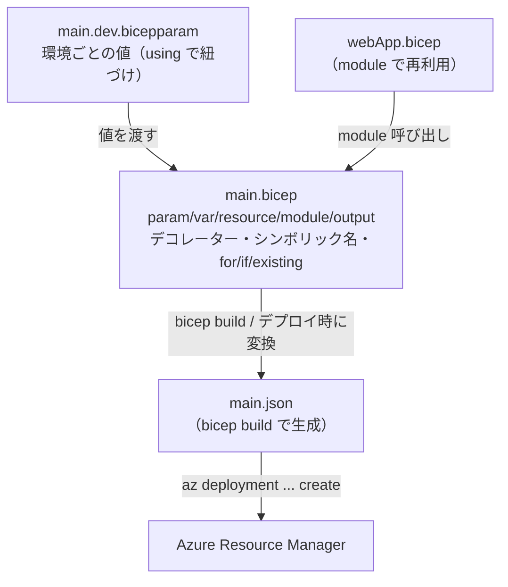

# Week 4 — Bicep：ARM テンプレートを「読める言語」で書く

> **Phase 1b** | 学習プラン Week 4 / 9
> 学習目標：Bicep の骨格（`param`/`var`/`resource`/`module`/`output`）を読み書きでき、シンボリック名による依存の自動化・デコレーター・`module`・`for`/`if`・`existing`・`.bicepparam` の役割を説明でき、「Week 3 の JSON と同じことを、はるかに短く安全に書ける」ことを実感する

---

## 0. 今週の位置づけ

Week 3 で ARM JSON テンプレートの構造（4 大セクション）を学び、最後に「Bicep は結局この JSON にコンパイルされる透明な抽象化」であることを `bicep build` で確認した。今週はその **Bicep を主役**にして、実務で実際に書く道具を一通り揃える。

1. **Week 1-2**：ARM の正体とデプロイスコープ（済み）
2. **Week 3**：ARM JSON テンプレートの構造（済み）
3. **Week 4**：Bicep（今日はここ）
4. **Week 5**：デプロイの挙動（モード・what-if・状態管理）
5. **Week 6 以降**：ガバナンス・セキュリティ・CI/CD・最終プロジェクト

> **今週の見方**：新しい概念を覚えるというより、**Week 3 で JSON を使って苦労して書いたこと（`[ ]` 式・`parameters(...)`・手書きの `dependsOn`・`resourceId(...)`）が、Bicep だとどう "楽になるか"** を対応づけて見ていくのが軸。JSON の知識が土台にあるからこそ、Bicep の "省略の便利さ" が分かる。

> **本教材が扱わない範囲**：ユーザー定義型（`type`）・ユーザー定義関数（`func`）・`import`／`export` によるコード共有は、入門段階では深入りしない（存在だけ触れる）。Bicep の全機能網羅ではなく、実務で頻出するものに絞る。

---

## 1. Bicep の設計思想：宣言型で「順不同」

Bicep は Microsoft Learn の言葉で「**declarative language（宣言型言語）**」であり、次の重要な性質を持つ。

> Bicep is a declarative language, which means the elements can appear in any order. Unlike imperative languages, the order of elements doesn't affect how deployment is processed.
> （Bicep は宣言型言語であり、要素はどんな順序で書いてもよい。命令型言語と違い、要素の並び順はデプロイ処理に影響しない）

Week 3 の JSON では `parameters`・`variables`・`resources`・`outputs` を**決まったセクションに分けて**書く必要があった。Bicep では **`param`・`var`・`resource`・`output` をファイルのどこに書いてもよい**（宣言型なので順序に意味がない）。「最終的にどうあってほしいか」を書く、という Week 1 の宣言型・冪等性の思想がそのまま言語仕様になっている。

---

## 2. Bicep ファイルの骨格

Week 3 の JSON（ストレージ 1 個）を Bicep で書くとこうなる。

```bicep
// targetScope = 'resourceGroup'  ← 既定なので RG デプロイでは省略可

@description('3〜11文字のストレージ名の接頭辞')
@minLength(3)
@maxLength(11)
param storagePrefix string

param storageSKU string = 'Standard_LRS'
param location string = resourceGroup().location

var uniqueStorageName = '${storagePrefix}${uniqueString(resourceGroup().id)}'

resource stg 'Microsoft.Storage/storageAccounts@2025-06-01' = {
  name: uniqueStorageName
  location: location
  sku: { name: storageSKU }
  kind: 'StorageV2'
  properties: { supportsHttpsTrafficOnly: true }
}

output storageId string = stg.id
```

JSON との違いが一目で分かる。

| Week 3 の JSON | Week 4 の Bicep |
|---|---|
| `"[parameters('storageSKU')]"` | `storageSKU`（そのまま書く。`[ ]` も `parameters()` も不要） |
| `"$schema"`・`"contentVersion"` を毎回書く | 不要（Bicep が生成時に補う） |
| `variables` セクションにまとめる | `var` を好きな場所に書ける |
| 手書きの `resourceId(...)` | シンボリック名 `stg.id`（§4） |

> **初学者向け用語補足：`targetScope`（ターゲットスコープ）＝ Week 2 のスコープの宣言**
> Bicep ファイル先頭の `targetScope` は「このファイルをどのデプロイスコープ（Week 2）に向けるか」の宣言。既定は `resourceGroup` なので RG デプロイでは省略できる。サブスク／管理グループ／テナントに向けるときは `targetScope = 'subscription'` などと明記する。Week 2 の `az deployment sub/mg/tenant create` と対になる考え方。

---

## 3. パラメータとデコレーター

Bicep のパラメータは `param 名前 型 = 既定値` で書く。Week 3 の JSON では `allowedValues` や `minLength` を JSON のキーとして書いたが、Bicep では **デコレーター**（`@` で始まる注釈）で付ける。

```bicep
@description('ストレージ名の接頭辞')     // Portal などに説明として表示
@minLength(3)
@maxLength(11)
param storagePrefix string

@allowed([ 'Standard_LRS', 'Standard_GRS', 'Standard_ZRS' ])
param storageSKU string = 'Standard_LRS'

@secure()                               // 値を履歴・ログに残さない
param adminPassword string
```

| デコレーター | 役割（Week 3 JSON の対応物） |
|---|---|
| `@description('...')` | `metadata.description` |
| `@allowed([...])` | `allowedValues` |
| `@minLength()` / `@maxLength()` | `minLength` / `maxLength` |
| `@minValue()` / `@maxValue()` | `minValue` / `maxValue` |
| `@secure()` | `type: 'securestring'` / `secureObject`（Week 3 §3-1 の secure 系） |

> **初学者向け用語補足：デコレーター（decorator）とは**
> **デコレーター（decorator＝装飾子）**＝宣言（param など）の直前に `@` を付けて足す「注釈・制約」。「この param は 3〜11 文字」「この値は秘密」といった**付帯情報を、値そのものとは分けて宣言する**書き方。Python など他言語の `@decorator` と同じ発想。Week 3 では制約を JSON のキーとして書いたが、Bicep ではデコレーターに分離することで param 本体が読みやすくなる。`param`・`var`・`resource`・`module`・`output` などに付けられる。

---

## 4. シンボリック名と「依存の自動化」

Week 3 で最も面倒だったのが `dependsOn` の手書きと `resourceId(...)` での参照。Bicep はここを**自動化**する。Microsoft Learn（bicep/overview）はこう述べている。

> Bicep automatically manages dependencies between resources. You can avoid setting `dependsOn` when the symbolic name of a resource is used in another resource declaration.
> （Bicep はリソース間の依存を自動管理する。あるリソースのシンボリック名を別のリソース宣言の中で使えば、`dependsOn` を書かなくてよい）

仕組みはこう。各リソースには **シンボリック名**（`resource stg '...'` の `stg`）という "テンプレート内のあだ名"（Week 3 §6 で既出）がある。別のリソースがこの `stg.id` や `stg.name` を参照した瞬間、**「stg が先に要る」と Bicep が理解して依存を自動で張る**。

```bicep
resource plan 'Microsoft.Web/serverfarms@2024-04-01' = {
  name: 'plan-learn'
  location: location
  sku: { name: 'S1' }
}

resource site 'Microsoft.Web/sites@2024-04-01' = {
  name: 'app-learn'
  location: location
  properties: {
    serverFarmId: plan.id     // ← plan を参照 → 依存が自動で張られる（dependsOn 不要）
  }
}
```

Week 3 の JSON なら `"dependsOn": ["[resourceId('Microsoft.Web/serverfarms', 'plan-learn')]"]` を手書きする必要があった箇所。Bicep では `plan.id` と書くだけで順序が保証される。

> **初学者向け用語補足：シンボリック名とは——「テンプレート内だけのあだ名」**
> シンボリック名＝`resource`（や `module`）キーワードの**直後に書く識別子**。上の例の `plan` や `site`、`resource stg '...'` の `stg` がそれ。これは **Bicep ファイルの中だけで使うあだ名**で、Azure 上には一切現れない。
>
> リソースには名前が 2 つあることを混同しないのが肝（Week 3 §6 とも接続）：
>
> | | 例 | どこで使う | Azure に現れるか |
> |---|---|---|---|
> | **シンボリック名** | `stg` | Bicep ファイルの中だけ（参照用のあだ名） | 現れない |
> | **リソース名**（`name:`） | `stlearn001` | 実際の Azure リソースの名前（URL・リソース ID になる） | 現れる |
>
> **何の役に立つか**：別のリソースから **`あだ名.プロパティ`** でその情報を参照できる。
> 1. **ID 等の参照が簡単**：`plan.id`・`plan.name`・`plan.properties.xxx` とドットでたどれる（JSON の長い `resourceId(...)` が不要に）
> 2. **依存が自動で張られる**：`plan.id` を参照した瞬間 Bicep が「plan が先」と理解し、`dependsOn` を書かずに順序が保証される
>
> **たとえ（出席番号）**：`name:`（`stlearn001`）＝本人の実名で外の世界（Azure）で通用する名前。シンボリック名（`stg`）＝「出席番号 3 番」のような**その教室の中だけの呼び名**。教室を出れば（テンプレートの外に出れば）その呼び名は意味を失う。

---

## 5. 文字列補間と変数

Week 3 の `concat` / `format` に相当するのが、Bicep の**文字列補間（string interpolation）**。`'${式}'` で文字列に値を差し込める。

```bicep
// JSON:  "[format('{0}{1}', parameters('storagePrefix'), uniqueString(resourceGroup().id))]"
var uniqueStorageName = '${storagePrefix}${uniqueString(resourceGroup().id)}'
```

`var` はどこにでも書け、複雑な式に名前を付けて `resources` を読みやすく保つ役割（Week 3 §3-2 の variables と同じ考え方。parameter との住み分けも同じ）。

> **初学者向け用語補足：文字列補間（ほかん / interpolation）**
> **補間**＝文字列の中に `${...}` を埋め込み、その部分を式の結果で置き換えること。`'${storagePrefix}dev'` で「storagePrefix の値 ＋ `dev`」という文字列になる。`concat`/`format` を関数呼び出しで書くより直感的で、多くのモダンな言語（JavaScript のテンプレートリテラル等）と同じ書き味。

---

## 6. module：Bicep ファイルの再利用

`module` は、別の Bicep ファイルを「部品」として呼び出す仕組み。Microsoft Learn は「modules enable you to reuse code from a Bicep file in other Bicep files」と説明している。

```bicep
// main.bicep から webApp.bicep を部品として呼ぶ
module webModule './webApp.bicep' = {
  name: 'webDeploy'          // この入れ子デプロイの名前
  params: {                  // 呼び出し先の param に値を渡す
    skuName: 'S1'
    location: location
  }
}

output siteUrl string = webModule.outputs.url   // モジュールの output を受け取る
```

- `module 名前 'パス' = { ... }` で別ファイルを呼び出す
- `params` で相手のパラメータに値を渡す
- `webModule.outputs.xxx` で相手の `output` を受け取れる（モジュールもシンボリック名を持つ）

> **初学者向け用語補足：module は Week 2 の「入れ子デプロイ」の正体**
> Week 2 §4 で見た「テンプレートの中に別スコープ宛ての小さいテンプレートを埋め込む（`Microsoft.Resources/deployments`）」——あれの Bicep 版が `module`。`bicep build` すると module は JSON の入れ子デプロイに変換される。だから module に `scope:` を付ければ、別の RG やサブスクに向けてデプロイもできる（Week 9 の最終プロジェクトでマルチスコープを組むときの主役）。

---

## 7. for と if：ループと条件デプロイ

### 7-1. `for`（ループ）：同じものを複数作る

Week 3 では触れなかった「N 個作る」を Bicep は `for` 式で書ける。

```bicep
param storageCount int = 3

resource sas 'Microsoft.Storage/storageAccounts@2025-06-01' = [for i in range(0, storageCount): {
  name: 'st${i}${uniqueString(resourceGroup().id)}'
  location: location
  sku: { name: 'Standard_LRS' }
  kind: 'StorageV2'
}]
```

`[for i in range(0, storageCount): { ... }]` で、`storageCount` 個のストレージを宣言的に作る。配列・オブジェクト・整数インデックスに対して回せる。

### 7-2. `if`（条件）：ある時だけ作る

```bicep
param deployZone bool

resource dnsZone 'Microsoft.Network/dnsZones@2023-07-01-preview' = if (deployZone) {
  name: 'myZone'
  location: 'global'
}
```

`= if (条件)` で、条件が真のときだけそのリソースをデプロイする。環境ごとに「本番だけ作る」といった出し分けに使う。

---

## 8. existing：既存リソースを「参照だけ」する

新規に作るのではなく、**すでにある**リソースの ID やプロパティを読みたいことがある（例：既存 Key Vault の参照）。そのとき `existing` キーワードを使う。

```bicep
resource stg 'Microsoft.Storage/storageAccounts@2025-06-01' existing = {
  name: 'examplestorage'      // 既存リソースの名前だけ指定
}

output blobEndpoint string = stg.properties.primaryEndpoints.blob
```

Microsoft Learn は「The resource doesn't deploy again when the `existing` keyword references it.（`existing` で参照してもそのリソースは再デプロイされない）」と明記している。**"作らずに読むだけ"** の宣言。別スコープの既存リソースを読むときは `scope: resourceGroup(別のRG)` を足す。

> **初学者向け用語補足：`existing` は「見る」、通常宣言は「作る／あるべき状態にする」**
> 通常の `resource x '...' = { ... }` は「このリソースをこの状態にする（無ければ作る）」。`existing` を付けると「**もう在るはずのリソースを名前で探して、その情報を読むだけ**」に変わる。もし存在しなければ `NotFound` エラーになる。Week 7 で Key Vault の秘密を参照するときにも再登場する。

---

## 9. .bicepparam：パラメータを別ファイルに分ける

環境（dev/prod）ごとに値を変えたいとき、パラメータを **`.bicepparam` ファイル**に外出しできる。

```bicep
// main.dev.bicepparam
using './main.bicep'          // どの Bicep ファイル向けかを宣言

param storagePrefix = 'devst'
param storageSKU = 'Standard_LRS'
```

デプロイは `--parameters` にこのファイルを渡すだけ（`using` があるので `--template-file` すら省ける）。

```bash
az deployment group create \
  --resource-group rg-arm-learn \
  --parameters main.dev.bicepparam
```

> **初学者向け用語補足：`using` 文と「環境ごとに 1 ファイル」**
> `.bicepparam` の先頭 `using './main.bicep'` は「**このパラメータ束はどのテンプレート向けか**」を結びつける宣言。dev 用・prod 用にファイルを分ける（`main.dev.bicepparam` / `main.prod.bicepparam`）と、テンプレート本体は 1 つのまま値だけ差し替えられる。CI/CD（Week 8）でステージごとに渡すファイルを変える、という使い方の土台。**値は平文で保存されるので、秘密は書かず Key Vault 参照を使う**（Week 7）。

---

## 10. まとめ



### 重要な用語まとめ

| 用語 | 一言説明 |
|---|---|
| `targetScope` | このファイルのデプロイスコープ宣言（既定 `resourceGroup`。Week 2 と対応） |
| デコレーター（`@...`） | param 等に付ける制約・注釈（`@description`/`@allowed`/`@secure` 等） |
| シンボリック名 | リソースの "あだ名"。`stg.id` 参照で `dependsOn` が自動で張られる |
| 文字列補間 `'${x}'` | JSON の `concat`/`format` に相当。文字列に値を差し込む |
| `module` | 別 Bicep ファイルを部品として呼ぶ。Week 2 の入れ子デプロイの正体 |
| `for` / `if` | ループ（複数作成）／条件デプロイ（ある時だけ作る） |
| `existing` | 既存リソースを再デプロイせず参照だけする |
| `.bicepparam` | パラメータ値を外出しするファイル（`using` で本体に紐づけ） |

---

## ハンズオン チェックリスト

- [ ] §2 の Bicep を `main.bicep` として書き、`bicep build main.bicep` で生成された `main.json` が Week 3 の 4 大セクション構造になっていることを確認した
- [ ] `main.dev.bicepparam` を作り、`az deployment group create -g rg-arm-learn --parameters main.dev.bicepparam` でデプロイした
- [ ] `@allowed` に無い値を渡すとデプロイ前に弾かれることを確認した
- [ ] 2 つのリソース（例：App Service Plan → Web App）を書き、`plan.id` 参照だけで `dependsOn` 無しに正しい順序でデプロイされることを確認した
- [ ] `for` で複数リソース、`if` で条件デプロイを 1 つずつ試した
- [ ] 不要になった学習用リソースは削除（`az group delete` は最終週にまとめて案内）

---

## 自己チェック

週末にドキュメントを閉じて答えてみる。

1. **Bicep で `dependsOn` を手書きしなくてよくなるのはなぜか？**
   - キーワード：シンボリック名を別リソースで参照すると依存が自動で張られる
2. **デコレーターとは何か。例を 2 つ挙げよ。**
   - キーワード：param 等に付ける制約・注釈、`@description`・`@allowed`・`@minLength`・`@secure`
3. **`module` は Week 2 の何に対応するか？**
   - キーワード：入れ子デプロイ（Microsoft.Resources/deployments）、別ファイルの再利用、scope で別スコープにも
4. **`existing` を付けた宣言は、付けない宣言と何が違うか？**
   - キーワード：再デプロイせず参照だけ、既存リソースのプロパティ/IDを読む、無ければ NotFound
5. **`.bicepparam` の `using` 文の役割は？**
   - キーワード：どの Bicep 本体向けのパラメータ束かを紐づける、環境ごとにファイルを分ける

---

## 次週の予告（Week 5）

テンプレートが書けるようになったので、次は**デプロイという操作そのものの挙動**を掘る：

- **Incremental（増分）と Complete（完全）モード**の違い——Complete はテンプレートに無いリソースを削除する
- **what-if**：デプロイ前に「何が変わるか」を差分プレビューする
- デプロイ履歴とロールバック
- **Deployment Stacks** / **Template Specs**：まとまり単位の管理と再利用
