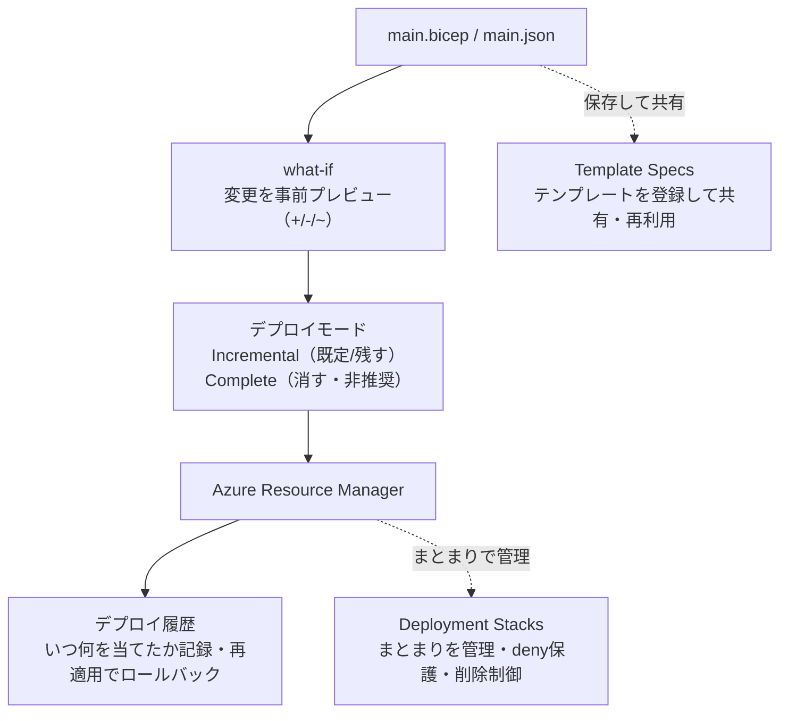

# Week 5 — デプロイのメカニクス：モード・what-if・状態管理

> **Phase 1c** | 学習プラン Week 5 / 9
> 学習目標：Incremental と Complete の 2 つのデプロイモードの違い（特に Complete は削除する）を説明でき、what-if で変更を事前プレビューでき、デプロイ履歴・Deployment Stacks・Template Specs という「まとまり単位で管理・再利用する」仕組みの役割を区別できる

---

## 0. 今週の位置づけ

Week 3-4 で「テンプレートを書く」力がついた。今週は Phase 1c——**書いたテンプレートを "どう当てるか"、当てた結果の状態をどう管理するか**という、デプロイという操作そのものの挙動を扱う。

1. **Week 1-2**：ARM の正体とデプロイスコープ（済み）
2. **Week 3-4**：IaC の書き方（JSON → Bicep）（済み）
3. **Week 5**：デプロイの挙動（今日はここ）
4. **Week 6-7**：ガバナンスとセキュリティ
5. **Week 8-9**：CI/CD と最終プロジェクト

> **今週の実務的な重要度**：ここは「事故を防ぐ」回。特に **Complete モードによる意図しない削除**と、それを避けるための **what-if** は、本番運用で最も痛い失敗を防ぐ知識。「テンプレートは書けるが、当て方を知らずにリソースを消してしまった」を防ぐ。

> **本教材が扱わない範囲**：Deployment Stacks / Template Specs は「存在と使いどころ」を押さえる程度に留め、全機能（deny設定の全パラメータ、linked template の詳細など）は扱わない。

---

## 1. デプロイモード：Incremental と Complete

Week 1 で「テンプレートは冪等」と学んだが、既に RG にあって**テンプレートに書かれていない**リソースをどう扱うかには 2 つのモードがある。Microsoft Learn の定義そのものが的確だ。

> The difference between these two modes is how Resource Manager handles existing resources in the resource group that aren't in the template.
> （2 つのモードの違いは、"テンプレートに無いが RG に既にある" リソースを ARM がどう扱うか）

| モード | テンプレートに無い既存リソースを | 既定 |
|---|---|---|
| **Incremental（増分）** | **そのまま残す**（追加のみ） | ✅ 既定 |
| **Complete（完全）** | **削除する** | |

### 具体例（公式ドキュメントのシナリオ）

- **RG の現状**：Resource A, B, C
- **テンプレートの内容**：Resource A, B, D

| モード | デプロイ後の RG |
|---|---|
| Incremental | A, B, **C**, D（C は残る、D が増える） |
| Complete | A, B, D（**C は削除される**） |

```bash
# モードは --mode で指定（省略時は Incremental）
az deployment group create --mode Complete -g rg-arm-learn --template-file main.json
```

> **初学者向け用語補足：モード名の読み方と、Complete の "危うさ"**
> **Incremental（インクリメンタル）＝増分**、**Complete（コンプリート）＝完全**。Complete は「テンプレート＝ RG のあるべき全体像」とみなし、**そこに無いものを消す**。IaC 的には理想だが、**テンプレートに書き忘れた本番リソースが消える**事故に直結する。だから既定は安全な Incremental で、Complete を使う前には必ず後述の **what-if** で削除対象を確認する。
>
> なお Microsoft は **Complete モードを段階的に非推奨（deprecated）**にし、削除を伴う管理は **Deployment Stacks（§4）** に寄せる方針を明言している。「削除も込みで宣言的に管理したい」なら、今後は Complete ではなく Deployment Stacks が正解。

### Incremental の落とし穴：プロパティは「部分更新」ではない

初学者が最も誤解する点。Microsoft Learn が明確に警告している。

> A common misunderstanding is to think properties that aren't specified in the template are left unchanged. ... Properties that aren't included in the template are reset to the default values.
> （"テンプレートに書かなかったプロパティは変更されずに残る" という誤解が多い。書かなかったプロパティは既定値にリセットされる）

つまり Incremental でも、**リソース単位では常に "テンプレートの内容が最終状態"**。あるリソースを再デプロイするなら、変えたいプロパティだけでなく**そのリソースの非既定値を全部書く**必要がある。「Incremental＝プロパティも部分的に足すだけ」ではない——**リソースを消さないだけで、書いたリソースの中身は全上書き**。

---

## 2. what-if：デプロイ前に「何が変わるか」を見る

Complete の危うさへの最大の防御が **what-if**。Microsoft Learn はこう述べる。

> The what-if operation doesn't make any changes to existing resources. Instead, it predicts the changes if the specified template is deployed.
> （what-if は既存リソースを一切変更しない。テンプレートをデプロイしたら何が変わるかを予測するだけ）

出力は記号で変更を色分けする。

| 記号 | 意味 |
|---|---|
| `+` | Create（作成） |
| `-` | Delete（削除） |
| `~` | Modify（変更） |

```bash
# 変更をプレビューだけする
az deployment group what-if -g rg-arm-learn --template-file main.json

# プレビューを見せて「実行しますか？」と確認してからデプロイする（おすすめ）
az deployment group create -g rg-arm-learn --template-file main.json --confirm-with-what-if
```

変更タイプは全 7 種（`Create`・`Delete`・`Modify`・`Ignore`・`NoChange`・`NoEffect`・`Deploy`）。特に **Complete モード＋what-if で `-`（Delete）が出ていないか**を確認するのが、事故防止の型。

> **初学者向け用語補足：what-if は「差分プレビュー」**
> Git の `diff` や、インストーラーの「この変更を適用します」確認画面に近い。**実際には何も変えず、"当てたらこうなる" を先に見る**。`--confirm-with-what-if`（短縮形 `-c`）を付けると、差分を見た上で Y/N で実行を選べる。Week 8 の CI/CD では、この what-if を PR（プルリクエスト）上で自動表示して、マージ前にレビューする使い方をする。
>
> 注意：what-if には "ノイズ"（実際には変わらないのに変更と表示される項目）がある。`reference` 関数を含む値や、デプロイ時に自動設定される既定値が、削除・変更として誤表示されることがある——公式も認めている既知の挙動。

---

## 3. デプロイ履歴：ARM は「いつ・何を当てたか」を覚えている

Week 1 で「ARM への操作は Activity Log に残る」と学んだ。加えて、ARM は**デプロイそのものの履歴**を RG ごとに保持している。

```bash
az deployment group list -g rg-arm-learn -o table   # このRGへの過去デプロイ一覧
az deployment group show -g rg-arm-learn -n main     # 特定デプロイの詳細（outputs含む）
```

- 各デプロイには名前・タイムスタンプ・状態（成功/失敗）・使ったテンプレート/パラメータが記録される
- **ロールバックの基本形は "前に成功したテンプレートをもう一度当てる"**。テンプレートは冪等（Week 1）なので、既知の良い状態のテンプレートを再デプロイすれば、その状態に戻せる——これが IaC における「状態管理」の考え方。手作業で 1 つずつ戻すのではなく、**"正しい最終状態" を表すファイルを再適用する**。

---

## 4. Deployment Stacks：リソース群を「1 つの塊」として管理する

ここまでは「1 回のデプロイ」の話。**Deployment Stacks（デプロイメントスタック）**は、複数リソースを**1 つの管理単位（ライフサイクル）**として束ねる新しい仕組み。Microsoft Learn の定義：

> An Azure deployment stack is a resource that enables you to manage a group of Azure resources as a single, cohesive unit.
> （デプロイメントスタックは、Azure リソース群を 1 つのまとまった単位として管理できるリソース）

リソース種別は `Microsoft.Resources/deploymentStacks`。ポイントは 2 つ。

> **初学者向け用語補足：「1 つの塊として管理」とは——撃ちっぱなしのデプロイに "管理の器" を足す**
> ピンと来にくいのは、**これまでのデプロイが "撃ちっぱなし" だったから**。`az deployment group create` は 1 回ごとの**イベント**で、実行したら終わり——**「今どのリソースが一緒の一式なのか」を ARM は覚えていない**。デプロイ履歴（§3）は "いつ何をやったか" の記録であって、"この 5 個はアプリ A の構成部品" という**生きた管理単位ではない**。
>
> これが困る例：
> 1. アプリ A を「ストレージ＋App＋DB」の 3 つでデプロイ（Incremental）
> 2. DB が要らなくなり、テンプレートから DB を消して再デプロイ
> 3. → **DB は消えず残る**（Incremental は削除しない＝§1）。消し忘れると "誰の持ち物か分からない孤児リソース" が溜まる
> 4. Complete モードなら消せるが、**RG 全体**の "テンプレートに無いもの" を消すので危険（他アプリを巻き込む）
>
> **Deployment Stacks はこれを解決する "管理の器"**。リソース群を束ねて追跡し続ける、それ自体が 1 個のリソース。作った後もずっと残り「この一式は私（スタック）が管理している」という台帳を持つ。おかげで 3 つが "まとめて" できる：
>
> | | 普通のデプロイ | Deployment Stack |
> |---|---|---|
> | ① 把握 | どれが一式か記録されない | 管理下のリソース一覧をいつでも見られる |
> | ② 片付け | 1 個ずつ手で消す／Complete は RG 全体を巻き込む | **この一式だけ**まとめて削除（`actionOnUnmanage`） |
> | ③ 保護 | 誰でも消せる | 勝手な変更・削除を拒否ロック（`denySettings`） |
>
> 上の「DB を消したい」例はこう解決する：テンプレートから DB を消してスタックを**更新**→ スタックが「DB はもう管理対象外」と気づき、`actionOnUnmanage` に従って **その DB だけ** detach か delete する。**RG 全体でなくスタックの持ち分だけ**が対象なので、他アプリを巻き込まずに済む。
>
> **たとえ（備品台帳＋施錠）**：普通のデプロイ＝業者が家具を運び込んで帰る（どれが搬入分か誰も管理しない）。Deployment Stack＝「この一式は "プロジェクト A の備品" です」という**台帳**を作り部屋に**鍵**をかける——①今どれが備品か一覧でき、②終了時に一括撤収でき、③鍵で勝手な持ち出し・改変を防げる。つまり "撃ちっぱなし" に**ライフサイクル（作成〜更新〜削除）を通した継続管理**を足したもの。

**① actionOnUnmanage：スタックから外れたリソースをどうするか**
テンプレートからリソースを削除して再適用すると、そのリソースは "管理外" になる。そのとき何をするかを選べる。

| 値 | 挙動 |
|---|---|
| `detachAll` | 管理から外すだけ（リソースは残す）＝既定的に安全 |
| `deleteResources` | リソースを削除（RG は残す） |
| `deleteAll` | リソースも RG も削除 |

これが「Complete モードの削除」の後継。**"消す" を明示的・制御可能にした**もの。

**② denySettings：管理下のリソースを勝手に変更・削除させない**
スタックが管理するリソースに**拒否ロック**をかけられる。

| 値 | 禁止する操作 |
|---|---|
| `none` | 制限なし |
| `denyDelete` | 削除を禁止 |
| `denyWriteAndDelete` | 変更と削除を禁止 |

```bash
az stack group create \
  --name appStack --resource-group rg-arm-learn \
  --template-file main.bicep \
  --action-on-unmanage detachAll \
  --deny-settings-mode denyDelete
```

> **初学者向け用語補足：denySettings は「コントロールプレーンだけ」効く**
> deny 設定は Week 1 の**コントロールプレーン操作（リソースの作成・変更・削除）**にだけ効く。**データプレーン操作（Blob へのデータ書き込み、Key Vault の秘密の読み書きなど）には効かない**。「ストレージアカウントを消させない」はできるが「Blob の中身を守る」ものではない、という区別。Week 1・Week 2 のコントロール/データプレーンの二層構造がここでも効いている。

---

## 5. Template Specs：テンプレートを「Azure に登録して共有」する

**Template Specs（テンプレートスペック）**は、テンプレートそのものを**Azure 上のリソースとして保存し、組織内で共有・再利用**する仕組み。Microsoft Learn の定義：

> A template spec is a resource type for storing an Azure Resource Manager template (ARM template) in Azure for later deployment. ... you can use Azure role-based access control (Azure RBAC) to share the template spec.
> （テンプレートスペックは ARM テンプレートを Azure に保存して後でデプロイするためのリソース種別。RBAC で共有できる）

リソース種別は `Microsoft.Resources/templateSpecs`。特徴：

- **RBAC で共有**：GitHub 公開や SAS トークン管理をせずに、「読み取り権限だけ渡せばデプロイできる（テンプレートは書き換えさせない）」
- **バージョニング**：`1.0a` などのバージョンを付けて履歴管理できる
- **リソース ID でデプロイ**：ファイルパスの代わりに、登録済みスペックの ID を指定して当てる

```bash
# テンプレートを Azure に登録
az ts create --name storageSpec --version 1.0a \
  --resource-group templateSpecRG --location japaneast \
  --template-file ./main.json

# 登録済みスペックを ID 指定でデプロイ
az deployment group create --resource-group demoRG --template-spec <スペックのリソースID>
```

> **初学者向け用語補足：Deployment Stacks と Template Specs は "別物"**
> 名前が似ていて混同しやすいが、目的が違う。
>
> | | Template Specs | Deployment Stacks |
> |---|---|---|
> | 何を管理するか | **テンプレート（設計図）そのもの** | **デプロイ済みリソース群（実体）** |
> | 主目的 | 組織内で**共有・再利用・バージョン管理** | **ライフサイクル管理・削除の制御・保護（deny）** |
> | たとえ | 図書館に置く "共通の設計図" | 現場を束ねる "工事管理台帳＋施錠" |
>
> 「みんなで同じ設計図を使いたい」→ Template Specs。「作った一式をまとめて守り、まとめて片付けたい」→ Deployment Stacks。

---

## 6. まとめ



### 重要な用語まとめ

| 用語 | 一言説明 |
|---|---|
| Incremental モード | 既定。テンプレートに無い既存リソースは残す（追加のみ） |
| Complete モード | テンプレートに無い既存リソースを削除する（非推奨→Deployment Stacksへ） |
| プロパティのリセット | Incremental でも、書かなかったプロパティは既定値に戻る（部分更新ではない） |
| what-if | デプロイせず変更を予測プレビュー（`+`作成/`-`削除/`~`変更）。`--confirm-with-what-if` |
| デプロイ履歴 | RG ごとに過去デプロイを記録。既知の良いテンプレート再適用がロールバックの基本 |
| Deployment Stacks | リソース群を 1 単位で管理。`actionOnUnmanage`（削除制御）・`denySettings`（保護） |
| Template Specs | テンプレートを Azure に登録し RBAC で共有・バージョン管理・ID でデプロイ |

---

## ハンズオン チェックリスト

- [ ] Week 3/4 のテンプレートを `az deployment group what-if` に通し、`+`/`~` の差分表示を読んだ
- [ ] 一度デプロイ済みの状態で同じテンプレートをもう一度 what-if し、`NoChange` になる（冪等）ことを確認した
- [ ] `--confirm-with-what-if` を付けてデプロイし、確認プロンプトで内容を見てから実行した
- [ ] `az deployment group list -g rg-arm-learn -o table` でデプロイ履歴が記録されていることを確認した
- [ ] （任意）`az stack group create` で Deployment Stack を作り、`denySettingsMode=denyDelete` で保護されたリソースの削除がブロックされることを確認した
- [ ] **Complete モードは学習用 RG 以外では試さない**（本番リソース削除の危険があるため）

---

## 自己チェック

週末にドキュメントを閉じて答えてみる。

1. **Incremental と Complete の違いを一言で？**
   - キーワード：テンプレートに無い既存リソースを、Incremental は残す／Complete は削除する
2. **「Incremental だから書かなかったプロパティは維持される」——正しいか？**
   - キーワード：誤り、書かなかったプロパティは既定値にリセット、リソースの中身は全上書き
3. **Complete モードを使う前に必ずやるべきことは？**
   - キーワード：what-if で削除（`-`）対象を確認、`--confirm-with-what-if`
4. **ロールバックの基本的な考え方は？**
   - キーワード：既知の良いテンプレートを再適用、冪等なので目的の状態に戻せる
5. **Deployment Stacks と Template Specs の違いは？**
   - キーワード：Stacks＝デプロイ済みリソース群のライフサイクル管理・保護・削除制御、Specs＝テンプレートの共有・再利用・バージョン管理

---

## 次週の予告（Week 6）

デプロイの仕組みが分かったので、次は「**誰が・何を・どこまで変更してよいか**」を制御するガバナンス基礎に入る：

- **RBAC**（ロールベースアクセス制御）の割り当てスコープ（Week 2 のスコープ階層と再接続）
- **Azure Policy**（定義・イニシアチブ・割り当て）の概念——「何を強制/禁止するか」
- **タグ**と**ロック**（今週の denySettings とロックの関係も整理）
