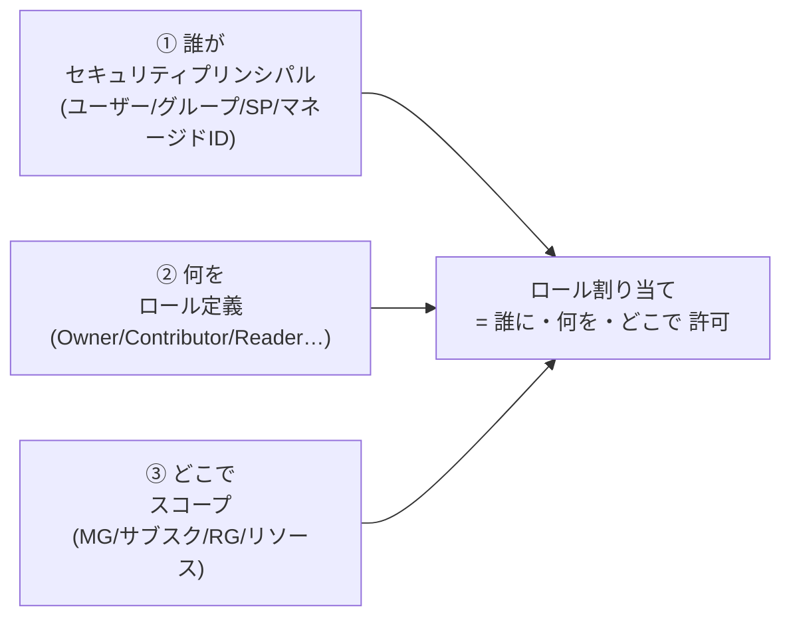
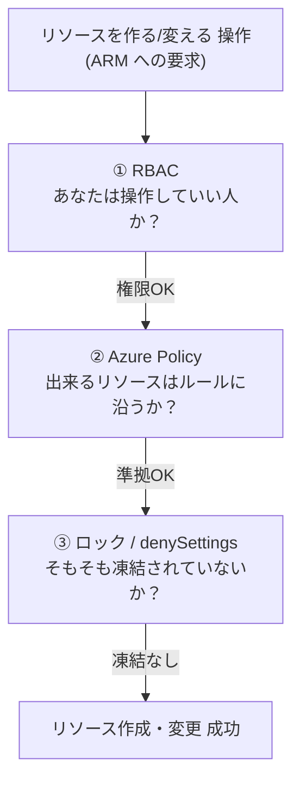

# Week 6 — ガバナンス基礎：誰が・何を・どこまで許すか

> **Phase 2a** | 学習プラン Week 6 / 9
> 学習目標：RBAC（誰が何の操作をできるか）・Azure Policy（リソースがどんな状態を許されるか）・タグ・ロックという 4 つのガバナンス手段の役割と違いを説明でき、それぞれが Week 2 のスコープ階層・Week 1 のコントロール/データプレーンとどう繋がるかを理解する

---

## 0. 今週の位置づけ

Week 1-5 で「ARM の正体 → テンプレートの書き方 → デプロイの当て方」まで来た。ここまでは**「どう作るか」**の話。今週からは Phase 2——**「誰に・何を・どこまで許すか」というガバナンス（統治）**に入る。テンプレートが書けても、「本番リソースを誰でも消せる」「禁止リージョンに作れてしまう」状態では運用に乗らない。

1. **Week 1-5**：ARM・スコープ・IaC・デプロイ（済み）
2. **Week 6**：ガバナンス基礎（今日はここ）
3. **Week 7**：デプロイの認証・セキュリティ（誰が ARM を呼ぶか）
4. **Week 8-9**：CI/CD と最終プロジェクト

> **本教材が扱わない範囲**（Week 1 から一貫）：Policy・RBAC の**設計論の全量**（どんなロール体系を作るべきか、ランディングゾーン設計）は扱わない。今週は「4 つの手段が**それぞれ何をするもので、どう違うか**」を掴むことに集中する。個々の Policy の書き方の詳細もリファレンス送り。

---

## 1. なぜ 4 つも仕組みがあるのか

「アクセス制御」と一口に言っても、守りたいものは実は種類が違う。Azure はそれを 4 つの別々の仕組みで担う。

| 手段 | 一言でいう守り | 例 |
|---|---|---|
| **RBAC** | **誰が**何の操作をできるか | 「田中さんは RG-A の閲覧だけ」 |
| **Azure Policy** | リソースが**どんな状態**を許されるか | 「japaneast 以外にはリソースを作らせない」 |
| **タグ** | リソースの**整理・分類**（＋Policy で強制） | 「全リソースに `env` タグを必須にする」 |
| **ロック** | **全員に対して**削除・変更を凍結 | 「本番 RG は誰であっても削除不可」 |

この 4 つは**重ねて使う**もの。順に見ていく。

---

## 2. RBAC：誰が何の操作をできるか

**RBAC（Role-Based Access Control＝ロールベースアクセス制御）**は、Week 2 §3-4 で「Owner」として一度登場した。Microsoft Learn は「Azure RBAC は **ARM の上に構築された認可システム**」と定義する。つまり **RBAC も ARM 経由の操作（コントロールプレーン）を守る仕組み**。

### 2-1. ロール割り当ての 3 要素

Microsoft Learn いわく「A role assignment consists of three elements: security principal, role definition, and scope.（ロール割り当ては 3 要素——セキュリティプリンシパル・ロール定義・スコープ——から成る）」。



- **① セキュリティプリンシパル**：権限を与える相手（人・グループ・サービスプリンシパル・マネージド ID）
- **② ロール定義**：許可する操作の集まり。代表的な組み込みロール——

| ロール | できること |
|---|---|
| **Owner** | 全操作＋他人への権限付与 |
| **Contributor（共同作成者）** | 全リソースの作成・変更・削除（ただし**権限付与はできない**） |
| **Reader（閲覧者）** | 読み取りのみ |
| **User Access Administrator** | 権限（ロール割り当て）の管理のみ（Week 2 §3-4 のアクセスの昇格で出た役） |

- **③ スコープ**：効かせる範囲。**Week 2 の 4 スコープ（管理グループ / サブスク / RG / リソース）と同じ階層**で、**上位に割り当てると下位すべてに継承**される（Week 2 の Policy/RBAC 継承の話がここに繋がる）。

### 2-2. RBAC は「足し算」＋「拒否が勝つ」

> Azure RBAC is an additive model, so your effective permissions are the sum of your role assignments.
> （RBAC は加算モデル。実効権限は割り当ての合計）

複数のロールを持つと**権限は足し算**される（サブスクで Contributor ＋ RG で Reader なら、実質サブスク全体で Contributor）。ただし例外があり、**deny assignment（拒否割り当て）があれば、許可より拒否が優先される**——これが Week 5 の **Deployment Stacks の denySettings**（拒否割り当てを作る仕組み）の効き方の正体。

> **初学者向け用語補足：セキュリティプリンシパル（principal）とは**
> **プリンシパル**＝「認証・認可の対象となる主体（誰）」。人間のユーザーだけでなく、**サービスプリンシパル（アプリ/自動化用の ID）**や**マネージド ID（Azure リソース自身が持つ ID）**も含む。Week 7 で「誰が ARM を呼ぶか（人間かアプリか）」を扱うとき、この "人間以外のプリンシパル" が主役になる。

---

## 3. Azure Policy：リソースがどんな状態を許されるか

**Azure Policy** は RBAC とは別物。Microsoft Learn は「Azure Policy はリソースのプロパティを**ビジネスルールと突き合わせて評価**する」と説明する。RBAC が「操作の可否」なら、Policy は「**出来上がるリソースの状態の可否**」。

### 3-1. 3 つの登場人物：定義・イニシアチブ・割り当て

| 用語 | 何か |
|---|---|
| **ポリシー定義（policy definition）** | 1 個のルール＋その **effect（効果）**。例「ストレージの SKU は Standard_LRS のみ許可（Deny）」 |
| **イニシアチブ（initiative / policySet）** | 複数のポリシー定義を **1 つの目標にまとめた束**。例「セキュリティ基準一式」 |
| **割り当て（assignment）** | 定義またはイニシアチブを**あるスコープに適用**すること。配下に継承（一部除外も可） |

### 3-2. effect（効果）：ルールに反したとき何をするか

| effect | 挙動 |
|---|---|
| `Deny` | 非準拠なリソースの作成・変更を**拒否**する |
| `Audit` | 拒否せず**記録だけ**する（違反を可視化） |
| `Append` / `Modify` | リソースに**プロパティを足す/書き換える**（例：タグを自動付与） |
| `DeployIfNotExists` | 関連リソースが無ければ**自動で足す**（例：診断ログ設定を自動デプロイ） |

> 公式の推奨：**いきなり `Deny` ではなく `Audit` から始める**。まず「どれだけ違反があるか」を可視化し、影響を見てから強制に切り替える。

### 3-3. RBAC と Policy の決定的な違い

Microsoft Learn の対比が明快。

> Azure Policy ensures that resource state is compliant to your business rules **without concern for who made the change or who has permission**. ... Even if an individual has access to perform an action, if the result is a non-compliant resource, Azure Policy still blocks the create or update.
> （Policy は "誰が変更したか・権限を持つか" に関係なくリソースの状態が準拠しているかを保証する。たとえ権限があっても、結果が非準拠なら Policy は作成/更新をブロックする）

> **初学者向け用語補足：RBAC と Policy は「別の質問」に答えている**
> - **RBAC**＝「**あなたはこの操作をしていい人？**」（誰の権限か）
> - **Policy**＝「**その結果できるリソースは、ルールに沿っている？**」（何が出来るか）
>
> 例：あなたが Contributor（作成権限あり）でも、Policy が「japaneast 以外禁止」なら、`westus` にストレージを作る操作は**権限はあるのに Policy に弾かれる**。逆に Policy 的に OK でも RBAC が無ければ操作自体できない。**両方を通って初めてリソースが作られる**——RBAC と Policy は "AND" の関係。

---

## 4. タグ：リソースを整理する付箋

**タグ（tag）**は、リソースに付ける `キー: 値` のラベル（例：`env: prod`、`costCenter: 1234`）。それ自体は権限とは無関係で、**整理・検索・コスト集計**のための付箋。

- Week 3-4 のテンプレートでも `tags: { ... }` として書いた
- 実務では **Policy と組み合わせて "タグを強制"** する（「`env` タグが無いリソースは拒否」「無ければ既定値を自動付与（Modify）」）——タグ単体は緩いルールなので、一貫性は Policy で担保する

---

## 5. ロック：全員に効く「削除・変更の凍結」

**ロック（lock）**は、RBAC とは根本的に違う守り方。Microsoft Learn いわく「The lock overrides any user permissions.（ロックは**あらゆるユーザー権限を上書きする**）」。つまり Owner であっても、ロックがかかっていれば消せない。

| ロックレベル（CLI 名 / Portal 名） | 禁止すること |
|---|---|
| **CanNotDelete**（Portal：Delete） | 読み取り・変更はできるが、**削除できない** |
| **ReadOnly**（Portal：Read-only） | 読み取りだけ。**変更も削除もできない**（実質 Reader 相当に全員を制限） |

```bash
az lock create --name lockProd --lock-type CanNotDelete --resource-group rg-prod
```

- リソース種別は `Microsoft.Authorization/locks`。RG やリソースに付け、**下位に継承**（最も厳しいロックが優先）
- 作成・削除できるのは **Owner** と **User Access Administrator**（§2 の権限管理役）
- **管理グループにはロックを付けられない**（サブスク・RG・リソースが対象）

> **初学者向け用語補足：ロックも "コントロールプレーンだけ" に効く（Week 1・Week 5 と同じ）**
> Microsoft Learn は明記する——「**Locks only apply to control plane operations and not to data plane operations.**」。つまり**ストレージアカウントに ReadOnly ロックをかけても、Blob の中身（データプレーン）は読み書きできる**。守れるのは「リソースそのものの削除・設定変更（`management.azure.com` 経由）」だけ。これは Week 5 の Deployment Stacks の **denySettings と全く同じ性質**——Week 1 のコントロール/データプレーンの二層構造が、ガバナンスの効き方をずっと規定している。

---

## 6. 4 つの守り方の整理

同じ「守る」でも、効く軸が違う。混同しないよう一枚に並べる。

| 手段 | 何を制御 | 誰に効く | 面 | 典型例 |
|---|---|---|---|---|
| **RBAC** | 操作の可否（できる/できない） | 割り当てた相手だけ | コントロールプレーン | 「この人は Reader」 |
| **Azure Policy** | リソースの状態の可否 | 全員（権限に関係なく） | コントロールプレーン | 「禁止リージョンには作らせない」 |
| **ロック** | 削除・変更の凍結 | 全員（Owner も） | コントロールプレーン | 「本番 RG は削除不可」 |
| **Deployment Stacks の denySettings**（Week 5） | 管理下リソースの変更・削除の凍結 | 全員（除外指定可） | コントロールプレーン | 「スタック管理下は denyDelete」 |



### 重要な用語まとめ

| 用語 | 一言説明 |
|---|---|
| RBAC | 「誰が何の操作をできるか」。3 要素＝プリンシパル・ロール定義・スコープ。ARM 上の認可、加算モデル、拒否が優先 |
| 組み込みロール | Owner（全＋権限付与）/ Contributor（全操作、権限付与不可）/ Reader（読取）/ User Access Administrator（権限管理） |
| Azure Policy | 「リソースがどんな状態を許されるか」。権限に関係なく状態を強制 |
| ポリシー定義 / イニシアチブ / 割り当て | ルール1個＋effect / 定義の束 / スコープへの適用 |
| effect | Deny（拒否）/ Audit（記録）/ Append・Modify（改変）/ DeployIfNotExists（自動補完） |
| タグ | 整理・分類の付箋（`キー:値`）。一貫性は Policy で強制 |
| ロック | CanNotDelete / ReadOnly。全ユーザー（Owner 含む）に効く。コントロールプレーンのみ |

---

## ハンズオン チェックリスト

- [ ] `az role assignment list --resource-group rg-arm-learn -o table` で、自分の RG に効いているロール割り当てを確認した
- [ ] 組み込みロール Owner / Contributor / Reader / User Access Administrator の違いを、見ずに説明できる
- [ ] `az policy assignment list` で（あれば）割り当て済み Policy を確認した／Portal で「Allowed locations」組み込み Policy の中身を眺めた
- [ ] 学習用リソースに `env=learn` タグを付け、`az resource list --tag env=learn` で絞り込めることを確認した
- [ ] `az lock create --lock-type CanNotDelete` を学習用リソースに付け、削除しようとしてブロックされることを確認 → `az lock delete` で解除した
- [ ] RBAC・Policy・ロックが「それぞれ別の軸で守っている」ことを §6 の表で説明できる

---

## 自己チェック

週末にドキュメントを閉じて答えてみる。

1. **ロール割り当ての 3 要素は？**
   - キーワード：セキュリティプリンシパル・ロール定義・スコープ
2. **RBAC と Azure Policy は何が違うか？**
   - キーワード：RBAC＝誰が操作できるか、Policy＝リソースの状態がルールに沿うか、権限があっても非準拠なら Policy が弾く（AND）
3. **ポリシー定義・イニシアチブ・割り当ての関係は？**
   - キーワード：定義＝1ルール＋effect、イニシアチブ＝定義の束、割り当て＝スコープへ適用・配下に継承
4. **ロックが RBAC と決定的に違う点は？**
   - キーワード：全ユーザー（Owner含む）に一律で効く、権限を上書きする、CanNotDelete/ReadOnly
5. **ロックや denySettings が「効かない」操作は？**
   - キーワード：データプレーン操作（Blobの中身など）、効くのはコントロールプレーンだけ

---

## 次週の予告（Week 7）

「誰が許されるか」の RBAC を踏まえ、次は**その "誰" が人間とは限らない**——自動化・CI/CD からの認証を扱う：

- 誰が ARM を呼ぶか：ユーザー / サービスプリンシパル / マネージド ID の違い
- `deploymentScripts`：デプロイの中で任意スクリプトを走らせる
- CI/CD 用サービスプリンシパルの**最小権限**設計（今週の RBAC を実践に）
- **Key Vault 参照**でパラメータに秘密を安全に渡す（Week 3 の `securestring`・Week 4 の `.bicepparam` 注意と接続）
