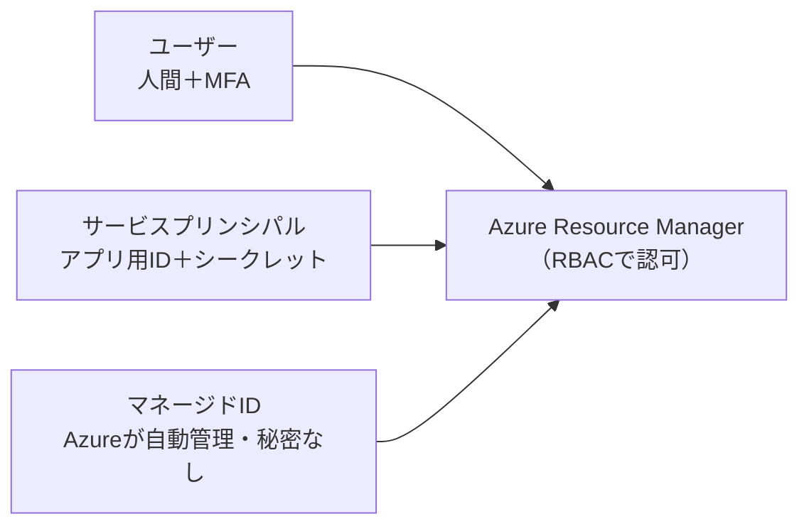
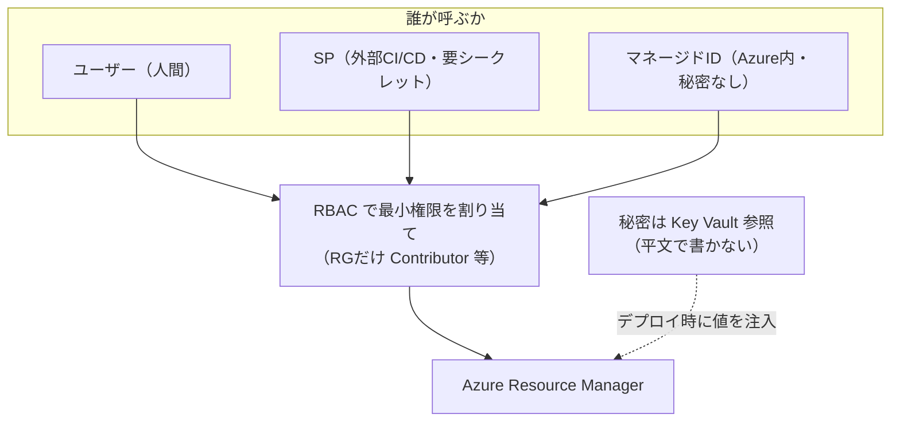

# Week 7 — デプロイの認証・セキュリティ：誰が ARM を呼ぶのか

> **Phase 2b** | 学習プラン Week 7 / 9
> 学習目標：ARM を呼ぶ主体（ユーザー / サービスプリンシパル / マネージド ID）の違いを説明でき、CI/CD 用の資格情報をどう安全に扱うか（最小権限・マネージド ID・Key Vault 参照）の勘所を掴み、秘密をテンプレートに平文で書かない方法を身につける

---

## 0. 今週の位置づけ

Week 6 の RBAC で「**誰が**何をできるか」を学んだ。そこで前提にしていた "誰" は暗黙に人間だった。しかし実務でリソースを作るのは、多くの場合**人間ではなく自動化（CI/CD パイプラインやアプリ）**。今週はその「**人間以外の "誰"**」に焦点を当て、認証と秘密の扱いを固める。

1. **Week 1-5**：ARM・IaC・デプロイ（済み）
2. **Week 6**：ガバナンス基礎（RBAC・Policy・ロック）（済み）
3. **Week 7**：デプロイの認証・セキュリティ（今日はここ）
4. **Week 8-9**：CI/CD と最終プロジェクト

> **本教材が扱わない範囲**：Entra ID のアプリ登録の詳細手順、証明書ベース認証、Key Vault の全機能（証明書・キー管理）は扱わない。「デプロイを安全に走らせるために最低限知るべき認証の枠組み」に絞る。OIDC 連携の具体設定は Week 8（CI/CD）で扱う。

---

## 1. 誰が ARM を呼ぶのか：3 種類のプリンシパル

Week 6 §2 で「セキュリティプリンシパル＝認証・認可の対象（誰）」と学んだ。ARM を呼ぶプリンシパルは大きく 3 種類。

| プリンシパル | 何者か | 資格情報の管理 | 典型的な用途 |
|---|---|---|---|
| **ユーザー** | 人間（Entra ID のアカウント） | パスワード＋MFA | 手作業・学習・検証 |
| **サービスプリンシパル（SP）** | アプリ/自動化用の ID | **シークレットや証明書を自分で管理** | 外部 CI/CD（GitHub Actions 等） |
| **マネージド ID** | Azure リソース自身が持つ ID | **Azure が自動管理（秘密を持たない）** | Azure 内の自動化（VM/Functions からのデプロイ等） |



ポイントは、**どのプリンシパルも Week 6 の RBAC で権限を割り当てる**という点。相手が人間でもアプリでも、「このプリンシパルに、このスコープで、このロール」という仕組みは同じ。

> **初学者向け用語補足：サービスプリンシパル（Service Principal）とは**
> **サービスプリンシパル（SP）**＝「アプリケーションや自動化のための、人間ではないログイン ID」。人間がパスワードでログインするのと同じように、SP は**シークレット（パスワード相当）や証明書**を使って ARM に認証する。GitHub Actions から Azure にデプロイするときの "接続用アカウント" がこれ。問題は——**そのシークレットを誰かが管理し、漏らさないよう保管し、定期的に更新（ローテーション）しなければならない**こと。この管理の手間と漏洩リスクをゼロにするのが、次のマネージド ID。

---

## 2. マネージド ID：秘密を持たない ID

**マネージド ID（Managed Identity）**は、SP の「シークレット管理が面倒で危険」という弱点を解決する。Microsoft Learn の定義：

> Managed identities eliminate the need for developers to manage these credentials. Applications can use managed identities to obtain Microsoft Entra tokens without having to manage any credentials.
> （マネージド ID は資格情報の管理を不要にする。アプリは資格情報を一切管理せずに Entra のトークンを取得できる）

正体は「**Azure が自動でライフサイクル管理してくれる、特別なサービスプリンシパル**」。シークレットが**そもそも存在しない**（コードにも設定にも秘密が出てこない）ので、漏洩も更新も気にしなくてよい。

### 2 種類のマネージド ID

| 種類 | ライフサイクル | 共有 |
|---|---|---|
| **システム割り当て（system-assigned）** | リソースと一心同体。**リソースを消すと ID も消える** | 不可（1 リソース専用） |
| **ユーザー割り当て（user-assigned）** | **独立したリソース**として単独で存在 | **複数リソースで共有可** |

- 「この VM だけが使う ID」ならシステム割り当て
- 「複数のリソースで同じ権限を使い回したい」「リソースを作り直しても権限を保ちたい」ならユーザー割り当て（Microsoft 推奨）

> **初学者向け用語補足：SP とマネージド ID の使い分け**
> - **Azure の "外" から呼ぶ**（GitHub Actions、オンプレの CI サーバーなど）→ Azure 内にホストされていないので、マネージド ID は使えない。**SP**（または後述の OIDC 連携）を使う。
> - **Azure の "中" から呼ぶ**（VM・Functions・deploymentScripts など）→ **マネージド ID** を使う。秘密が要らず一番安全。
>
> 原則：**「Azure の中で完結するなら、まずマネージド ID を検討する」**。

---

## 3. CI/CD の最小権限：Week 6 の RBAC を実戦投入する

CI/CD が使う SP／ID に、どこまでの権限を与えるか。ここで Week 6 の RBAC が実践になる。原則は**最小権限（least privilege）**。

- ❌ 悪い例：CI/CD の SP に**サブスクリプションの Owner** を与える → その SP のシークレットが漏れたら、サブスク全体を乗っ取られる
- ✅ 良い例：**デプロイ先の RG に対してだけ Contributor**（作成・変更はできるが権限付与はできない）を与える → 事故の影響範囲がその RG に限定される

```bash
# CI/CD 用 SP に、特定 RG だけの Contributor を与える（スコープを絞る）
az role assignment create \
  --assignee <SPのID> \
  --role Contributor \
  --scope /subscriptions/<sub>/resourceGroups/rg-app-prod
```

> **初学者向け用語補足：最小権限の原則（least privilege）**
> 「**その仕事に必要な最小限の権限だけを与える**」というセキュリティの基本原則。理由は "被害の局所化"——資格情報は必ずいつか漏れうる前提で、漏れたときに**何ができてしまうか**を最小にしておく。Week 6 の「スコープを絞る（RG だけ）」「弱いロールを選ぶ（Owner でなく Contributor）」が、まさにこの原則の実装。

Week 8 では、この SP のシークレットすら持たずに GitHub Actions から認証する **OIDC 連携**（federated credential）を扱う——「外部 CI からでも秘密なしで認証する」現代的なやり方。今週はまず「最小権限で SP を切る」という土台を押さえる。

---

## 4. Key Vault 参照：秘密をテンプレートに書かずに渡す

パスワードや接続文字列などの秘密を、テンプレートやパラメータファイルに**平文で書いてはいけない**（Week 3 §3-1 の `securestring`、Week 4 §9 の `.bicepparam` 平文警告で触れた点）。解決策が **Key Vault 参照**。

Microsoft Learn いわく「The value is never exposed because you only reference its key vault ID.（Key Vault の ID を参照するだけなので、値そのものは決して露出しない）」。

パラメータファイル側で、**値の代わりに「どの Key Vault のどの秘密か」を参照**として書く。

```json
{
  "$schema": "https://schema.management.azure.com/schemas/2019-04-01/deploymentParameters.json#",
  "contentVersion": "1.0.0.0",
  "parameters": {
    "adminPassword": {
      "reference": {
        "keyVault": {
          "id": "/subscriptions/<sub>/resourceGroups/<rg>/providers/Microsoft.KeyVault/vaults/<vault名>"
        },
        "secretName": "ExamplePassword"
      }
    }
  }
}
```

こうすると、デプロイ時に ARM が Key Vault から値を取り出してテンプレートの `securestring` パラメータに渡す。**値はパイプラインのログにもデプロイ履歴にも残らない**。

要件は 2 つ：

- Key Vault 側で **`enabledForTemplateDeployment` を true**（テンプレートデプロイからの参照を許可）
- デプロイする人/SP が **`Microsoft.KeyVault/vaults/deploy/action` 権限**を持つ（Owner/Contributor に含まれる。これも RBAC）

> **初学者向け用語補足：なぜ "参照" だと安全なのか**
> パラメータファイルに書くのは**秘密の値そのものではなく、"金庫（Key Vault）の住所と、中の書類名"** だけ。値を読むのは**デプロイの瞬間に ARM だけ**で、しかも「その人に取り出す権限があるか（`deploy/action`）」を ARM がチェックする。だから **ファイルが Git に入っても・ログに出ても、秘密は漏れない**。Week 6 の「RBAC で権限を絞る」と「Key Vault で秘密を金庫に入れる」の合わせ技。

---

## 5. deploymentScripts：デプロイの中で任意の処理を走らせる

宣言的なテンプレートだけでは表現できない「手続き的な処理」（例：証明書を生成する、外部 API を叩いて値を取る、デプロイ後に初期データを投入する）を、**デプロイの一部として実行**する仕組みが `deploymentScripts`（`Microsoft.Resources/deploymentScripts`）。

- テンプレート内に Azure CLI か PowerShell のスクリプトを埋め込み、ARM がそれを実行する
- 実行には**ユーザー割り当てマネージド ID が必要**（§2）——スクリプトが Azure を操作するための認可主体になる
- 舞台裏で一時的なコンテナとストレージが使われる

> **初学者向け用語補足：deploymentScripts は "最後の手段"**
> 宣言型（Week 1）の良さは冪等性と予測可能性。スクリプトは手続き的で、その良さを一部手放す。だから **"テンプレートの標準機能で表現できないときだけ" 使う逃げ道**と捉える。使うにしても、スクリプトが Azure を触るための認証は**マネージド ID**で行う——ここでも「秘密を持たない ID」が効いてくる。

---

## 6. まとめ



### 重要な用語まとめ

| 用語 | 一言説明 |
|---|---|
| ユーザー | 人間のプリンシパル。手作業・検証向け（＋MFA） |
| サービスプリンシパル（SP） | アプリ/自動化用の ID。シークレットを自分で管理。外部 CI/CD 向け |
| マネージド ID | Azure が自動管理する特別な SP。秘密を持たない。Azure 内の自動化向け |
| system / user-assigned | リソース一心同体 / 独立リソースで複数共有可（推奨） |
| 最小権限（least privilege） | 必要最小限の権限だけ与える。スコープを絞り・弱いロールを選ぶ |
| Key Vault 参照 | パラメータに秘密の値でなく "金庫の住所と書類名" を書く。履歴/ログに残らない |
| deploymentScripts | デプロイ内で CLI/PowerShell を実行。マネージド ID が必要。最後の手段 |

---

## ハンズオン チェックリスト

- [ ] ユーザー / サービスプリンシパル / マネージド ID の 3 つの違いと使い分けを、見ずに説明できる
- [ ] `az role assignment create --assignee <id> --role Contributor --scope <RGのID>` の形で「スコープを絞った」割り当てを書ける
- [ ] 「CI/CD の SP にサブスク Owner を与えるのがなぜ危険か」を最小権限の観点で説明できる
- [ ] （任意）Key Vault を作り `--enabled-for-template-deployment true` を付け、パラメータファイルの `reference.keyVault` 構文で秘密を参照するデプロイを試した
- [ ] 「秘密を平文でテンプレート/パラメータに書かない」理由と代替（securestring＋Key Vault 参照）を説明できる

---

## 自己チェック

週末にドキュメントを閉じて答えてみる。

1. **サービスプリンシパルとマネージド ID の一番の違いは？**
   - キーワード：SP はシークレットを自分で管理、マネージド ID は Azure が自動管理・秘密を持たない
2. **Azure の "外" の CI/CD と "中" の自動化で、それぞれどの主体を使うか？**
   - キーワード：外＝SP（or OIDC）、中＝マネージド ID
3. **CI/CD の SP に与える権限の原則は？**
   - キーワード：最小権限、スコープを RG に絞る、Owner でなく Contributor、被害の局所化
4. **Key Vault 参照が安全なのはなぜか？**
   - キーワード：パラメータには値でなく参照（金庫の住所＋書類名）、デプロイ時に ARM だけが取得、履歴/ログに残らない、deploy/action 権限をチェック
5. **deploymentScripts はいつ使うべきか？**
   - キーワード：宣言型で表現できない手続き的処理だけ、最後の手段、実行にマネージド ID が必要

---

## 次週の予告（Week 8）

認証の枠組みが分かったので、いよいよ**自動デプロイのパイプライン**を組む：

- **GitHub Actions ＋ OIDC 連携**：SP のシークレットすら持たずに Azure に認証する（今週の SP を一歩進める）
- environments・承認ゲート（本番デプロイの前に人の承認を挟む）
- **PR での what-if**（Week 5）自動表示——マージ前に変更をレビュー
- Activity Log（Week 1）とデプロイエラーコードの読み方
