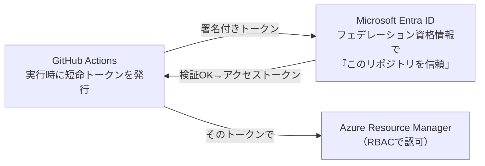
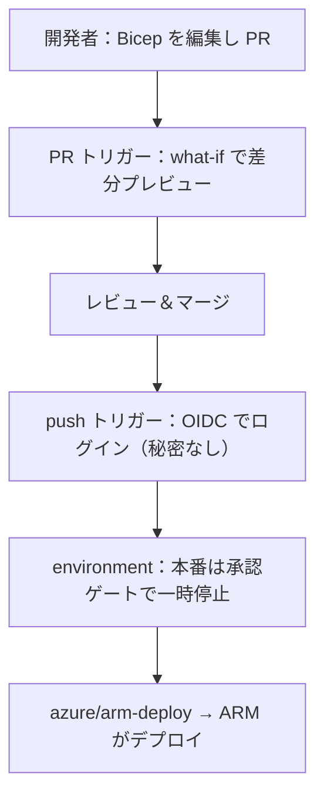

# Week 8 — CI/CD：GitHub Actions で自動デプロイする

> **Phase 3a** | 学習プラン Week 8 / 9
> 学習目標：Git への push をトリガーに Bicep を自動デプロイする GitHub Actions ワークフローを読み書きでき、OIDC 連携で「シークレットを持たずに」Azure に認証する仕組み・承認ゲート・PR での what-if・エラーの読み方を説明できる

---

## 0. 今週の位置づけ

Week 7 で「誰が ARM を呼ぶか（SP・マネージド ID）」「最小権限」「秘密の扱い」を学んだ。今週はそれを**実際のパイプライン**に組み上げる。手作業の `az deployment group create` を卒業し、**Git にコミット → 自動でデプロイ**という現代的な運用に乗せる。

1. **Week 1-5**：ARM・IaC・デプロイ（済み）
2. **Week 6-7**：ガバナンスと認証（済み）
3. **Week 8**：CI/CD（今日はここ）
4. **Week 9**：最終プロジェクト（全部を統合）

> **本教材が扱わない範囲**：GitHub Actions の一般機能全般（マトリクスビルド、再利用ワークフロー等）や、Azure DevOps Pipelines は扱わない。「Bicep を安全に自動デプロイする最小構成」に絞る。OIDC の Entra 側設定手順の細部はリファレンス送り（考え方を押さえる）。

---

## 1. なぜ CI/CD なのか

これまでは自分の手元で `az deployment group create` を打っていた。これには問題がある。

| 手動デプロイの問題 | CI/CD で解決 |
|---|---|
| 「誰かのローカルからしか当てられない」属人化 | リポジトリの誰でも（承認付きで）同じ手順で |
| 当てる前のレビューが仕組み化されない | PR ＋ what-if でマージ前に必ず確認 |
| 手元に強い権限（＋秘密）を置く必要 | 権限は CI に集約、秘密は持たない（OIDC） |
| 「どのコミットが本番に出ているか」が曖昧 | Git の履歴＝デプロイの履歴 |

CI/CD（継続的インテグレーション / 継続的デリバリー）の芯は、**「Git を唯一の真実とし、そこへの変更をトリガーに自動で当てる」**こと。IaC（Week 3-4）と組み合わさって初めて「インフラも Git で管理」が完成する。

> **初学者向け用語補足：CI/CD と GitHub Actions**
> **CI（Continuous Integration＝継続的インテグレーション）**＝変更を頻繁にマージし自動で検証すること。**CD（Continuous Delivery/Deployment＝継続的デリバリー/デプロイ）**＝検証を通った変更を自動で環境へ届けること。**GitHub Actions**＝GitHub 上でこれを動かす仕組みで、`.github/workflows/*.yml` に「どのイベントで何をするか」を書くと、GitHub が用意する実行環境（ランナー）でそれが走る。

---

## 2. OIDC 連携：シークレットを持たずに認証する

Week 7 で「外部 CI/CD は SP を使うが、そのシークレットの管理・漏洩が弱点」と学んだ。その弱点を消すのが **OIDC 連携（ワークロード ID フェデレーション）**。

考え方：GitHub Actions の実行時に GitHub が発行する**短命の署名付きトークン**を、Entra ID が「この GitHub リポジトリからのものだ」と検証して受け入れる。**保存された長期シークレットは一切要らない**。



事前準備（Entra 側）：

1. Entra アプリ（＝SP）または**ユーザー割り当てマネージド ID**を作る
2. それに **フェデレーション資格情報（federated credential）** を設定し、「特定の GitHub リポジトリ/ブランチからのトークンを信頼する」と登録
3. その SP に **最小権限**（Week 7）でロールを割り当てる（例：デプロイ先 RG の Contributor）

GitHub 側に保存するのは秘密ではなく、**Client ID / Tenant ID / Subscription ID という "識別子" だけ**（漏れても単体では悪用できない）。

> **初学者向け用語補足：OIDC / フェデレーション（federation）とは**
> **OIDC（OpenID Connect）**＝トークンで身元を証明する標準的な認証プロトコル。**フェデレーション（federation＝連携）**＝「別々の信頼ドメイン（GitHub と Entra）が、事前の取り決めに基づいて相手のトークンを信頼し合う」こと。パスポート（GitHub 発行）を、相手国（Entra）が「この発行国は信頼できる」と受け入れて入国させるイメージ。**パスワード（＝コピーできる秘密）を渡さず、その場限りの署名付き証明を検証する**ので、保存された秘密が漏れる事故が原理的に起きない。Week 7 の SP シークレット問題への最終回答。

---

## 3. ワークフローの骨格

`.github/workflows/deploy.yml` に、OIDC でログインして Bicep を当てる最小構成を書く。

```yaml
on: [push]                        # main への push で起動
name: Deploy Bicep
permissions:
  id-token: write                 # ★OIDC トークン発行に必須
  contents: read
jobs:
  deploy:
    runs-on: ubuntu-latest
    steps:
      - uses: actions/checkout@v4

      - uses: azure/login@v2       # OIDC でログイン（秘密なし）
        with:
          client-id: ${{ secrets.AZURE_CLIENT_ID }}
          tenant-id: ${{ secrets.AZURE_TENANT_ID }}
          subscription-id: ${{ secrets.AZURE_SUBSCRIPTION_ID }}

      - uses: azure/arm-deploy@v2  # Bicep をデプロイ
        with:
          resourceGroupName: rg-app-prod
          template: ./main.bicep
          parameters: storagePrefix=app
```

- **`permissions: id-token: write`** が OIDC の肝——これが無いと GitHub がトークンを発行できずログインが失敗する
- `azure/login@v2` に渡す 3 つの値は**識別子だけ**（シークレットではない）。GitHub Secrets に置くのは慣習（値を workflow に直書きしないため）
- `azure/arm-deploy` は裏で `az deployment group create` 相当を実行する（Bicep も JSON も可）

> **コマンドの読み方：ワークフローの構造**
> `on`＝いつ動くか（トリガー。`push`・`pull_request` など）、`jobs`＝実行する仕事のまとまり、`steps`＝各仕事の手順、`uses`＝既製の "アクション"（部品）を呼ぶ、`with`＝そのアクションへの引数、`${{ secrets.X }}`＝GitHub に保存した値の参照。YAML なのでインデント（字下げ）が構造を表す。

---

## 4. environments と承認ゲート

「本番へのデプロイは、人の承認を挟んでから」を仕組みにするのが **environment（環境）** と**承認ゲート**。

- GitHub の **environment**（例：`production`）を作り、**required reviewers（必須レビュアー）**を設定する
- その environment を使うジョブは、**指定レビュアーが承認するまで止まる**
- environment ごとに秘密や変数を分けられる（Week 4 の `.bicepparam` を dev/prod で切り替える発想と対）

```yaml
jobs:
  deploy-prod:
    runs-on: ubuntu-latest
    environment: production        # ★このジョブは production 環境を使う → 承認待ちになる
    steps:
      - uses: azure/login@v2
        with: { ... }
      - uses: azure/arm-deploy@v2
        with: { ... }
```

> **初学者向け用語補足：承認ゲート（approval gate）**
> 「自動だが、重要な一歩の前で**人間の Go サインを必須にする**」仕組み。全自動は速いが、本番の破壊的変更（Week 5 の Complete/削除など）を無人で流すのは怖い。承認ゲートは「dev までは全自動、prod だけ人が承認」といった**速さと安全のバランス**を取る。Microsoft Learn も「environment が承認を要求する場合、レビュアーが承認するまでジョブは environment の秘密にアクセスできない」と述べている。

---

## 5. PR での what-if：マージ前に変更を見る

Week 5 の **what-if**（差分プレビュー）を、**PR（プルリクエスト）をトリガーに自動実行**すると、レビュー段階で「この変更を当てると何が変わるか」を全員が見られる。

```yaml
on:
  pull_request:                    # PR が作られた/更新されたら
    branches: [ main ]
jobs:
  preview:
    runs-on: ubuntu-latest
    steps:
      - uses: actions/checkout@v4
      - uses: azure/login@v2
        with: { ... }
      - run: |
          az deployment group what-if \
            --resource-group rg-app-prod \
            --template-file main.bicep
```

これで「**PR＝コードレビュー＋インフラ変更のプレビュー**」になり、`-`（削除）が出ていないかをマージ前に確認できる。Week 5 で学んだ「Complete モードの事故防止の型」を、パイプラインに埋め込んだ形。

---

## 6. エラーとログの読み方

自動化すると、失敗時に「どこを見るか」が重要になる。3 つの層で追う。

| 層 | どこを見る | 何が分かる |
|---|---|---|
| **GitHub 側** | Actions のワークフロー実行ログ | どのステップで落ちたか（ログイン失敗 / デプロイ失敗） |
| **ARM のデプロイ履歴**（Week 5） | `az deployment group show` / Portal のデプロイ | どのリソースで・どんなエラーコードか |
| **Activity Log**（Week 1） | 対象 RG の Activity Log | ARM への操作として何が起きたか・Caller は誰か |

よくあるエラーの入口：

- **ログイン失敗** → `permissions: id-token: write` の欠落、フェデレーション資格情報のリポジトリ/ブランチ設定ミス
- **`AuthorizationFailed`** → SP のロール不足（Week 6/7 の RBAC を見直す）
- **`InvalidTemplate` 等** → テンプレートの構文（Week 3-4）。ローカルで `bicep build` / what-if して切り分け

> Week 1 で「すべての操作は Activity Log に残る」と学んだのが、ここで効く。自動デプロイでも**最終的に叩いているのは ARM**なので、詰まったら Activity Log まで降りれば「誰が・何を・なぜ失敗したか」に必ず辿り着ける。

---

## 7. まとめ



### 重要な用語まとめ

| 用語 | 一言説明 |
|---|---|
| CI/CD | Git への変更をトリガーに自動で検証・デプロイ。IaC と組んで「インフラも Git 管理」 |
| GitHub Actions | `.github/workflows/*.yml` で自動化。on/jobs/steps/uses/with で構成 |
| OIDC 連携 | 短命トークンで認証。保存シークレット不要。SP シークレット問題の解決 |
| `id-token: write` | OIDC トークン発行に必須の permissions |
| フェデレーション資格情報 | 「この GitHub リポジトリを信頼」と Entra に登録する設定 |
| environment / 承認ゲート | 本番デプロイ前に必須レビュアーの承認を挟む |
| PR での what-if | マージ前に変更を差分プレビュー（Week 5） |

---

## ハンズオン チェックリスト

- [ ] `.github/workflows/deploy.yml` を書き、`on: push` で main への push が引き金になる構造を理解した
- [ ] `permissions: id-token: write` が OIDC ログインに必須である理由を説明できる
- [ ] `azure/login@v2` に渡す 3 値（client-id/tenant-id/subscription-id）が**秘密ではなく識別子**だと説明できる
- [ ] `pull_request` トリガーで `az deployment group what-if` を走らせ、PR 上で差分が見えるようにした
- [ ] `environment: production` を付けたジョブが承認待ちで止まることを確認した
- [ ] デプロイが失敗したとき、GitHub ログ → デプロイ履歴 → Activity Log の順で切り分けられる

---

## 自己チェック

週末にドキュメントを閉じて答えてみる。

1. **OIDC 連携が SP のシークレット方式より安全なのはなぜか？**
   - キーワード：短命トークン、保存された長期秘密がない、フェデレーションで信頼、漏洩事故が原理的に起きない
2. **ワークフローに `permissions: id-token: write` が必要なのはなぜか？**
   - キーワード：GitHub が OIDC トークンを発行するため、無いとログイン失敗
3. **GitHub Secrets に置く client-id/tenant-id/subscription-id は秘密か？**
   - キーワード：秘密ではなく識別子、単体では悪用できない、直書きを避けるため secrets に置くだけ
4. **承認ゲート（environment ＋ required reviewers）は何のためか？**
   - キーワード：本番の破壊的変更を無人で流さない、人の Go サイン、速さと安全のバランス
5. **自動デプロイが失敗したとき、どの順で調べるか？**
   - キーワード：GitHub のワークフローログ → ARM のデプロイ履歴/エラーコード → Activity Log

---

## 次週の予告（Week 9・最終プロジェクト）

いよいよ全 9 週の総仕上げ。これまでの全要素を 1 本のパイプラインに統合する：

- **管理グループ（Policy）→ サブスクリプション（RG＋RBAC）→ リソースグループ（実リソース）** のマルチスコープ Bicep（Week 2 の入れ子デプロイ／Week 4 の module）
- それを **GitHub Actions ＋ OIDC**（Week 8）で **PR の what-if → 承認 → デプロイ** まで E2E 実行
- Week 1〜8 の概念が「どこで効いているか」を自分で説明できる状態を目指す
