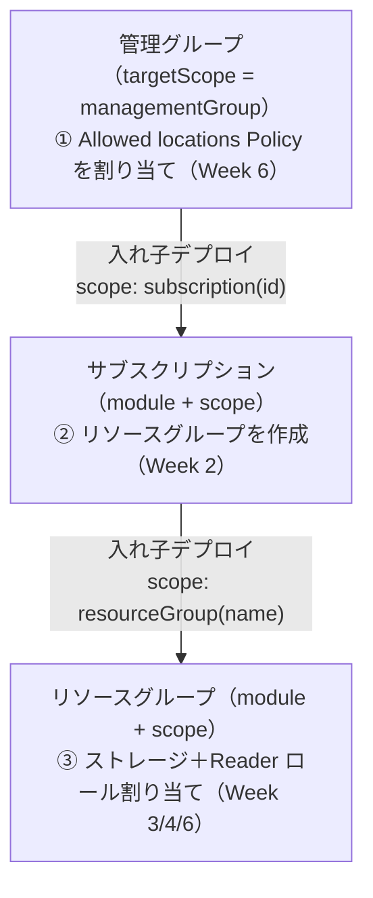
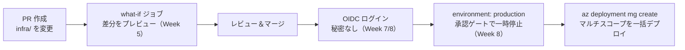
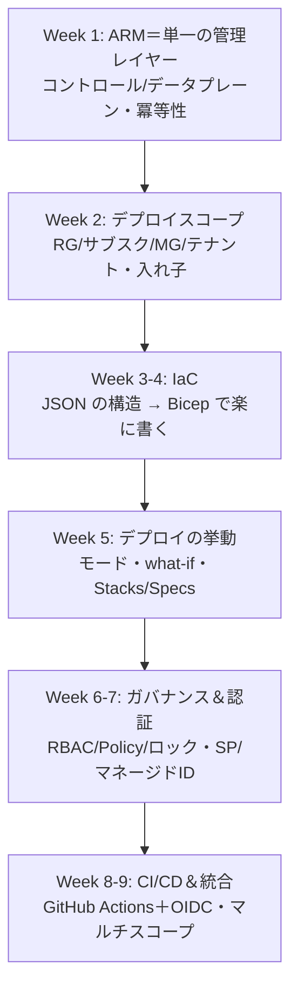

# Week 9 — 最終プロジェクト：マルチスコープ Bicep を OIDC で E2E デプロイ

> **Phase 3b（最終回）** | 学習プラン Week 9 / 9
> 学習目標：管理グループ（Policy）→ サブスクリプション（RG）→ リソースグループ（実リソース＋RBAC）を **1 本の Bicep** で束ね、GitHub Actions ＋ OIDC で **PR の what-if → 承認 → デプロイ** まで E2E 実行する。全 9 週の概念が「どこで効いているか」を自分の言葉で説明できる状態に到達する

---

## 0. 今週の位置づけ

最終回。今週は新しい概念を足すのではなく、**Week 1〜8 の全要素を 1 つの動く成果物に統合**する。

1. **Week 1-5**：ARM・スコープ・IaC・デプロイの挙動
2. **Week 6-7**：ガバナンス・認証
3. **Week 8**：CI/CD
4. **Week 9**：全部を 1 本に統合（今日）

実装ファイルは [`resource-manager/infra/`](../infra/) に置いた。ここまでプレースホルダだった `infra/` が、最終回で初めて中身を持つ。

---

## 1. 何を作るか：3 スコープを縦断する 1 本のデプロイ

作るのは「**管理グループから始まり、配下のサブスクに RG を作り、その中に実リソースを置く**」という、Week 2 §4 で予告したマルチスコープの一括デプロイ。



これは Week 2 §4 の「スコープをまたぐ入れ子デプロイ」そのもの。禁止遷移（Week 2 §4-4）に触れないよう、**上位（MG）から下位（サブスク→RG）へ**という正しい向きで下っている。

---

## 2. ファイル構成

```text
resource-manager/infra/
├── main.bicep                       … 管理グループスコープ。Policy割当＋サブスクへの入れ子
├── modules/
│   ├── subscription.bicep           … サブスクスコープ。RG作成＋RGへの入れ子
│   └── resourceGroup.bicep          … RGスコープ。ストレージ＋RBAC
├── main.bicepparam                  … パラメータ（環境ごとに差し替える値）
└── deploy.github-actions.sample.yml … CI/CDワークフローの見本（.github/workflowsにコピーして使う）
```

各週の要素がどこに現れるかを対応させる。

| 週 | 概念 | 実装での現れ方 |
|---|---|---|
| Week 1 | ARM・冪等性 | 何度流しても同じ状態（再実行で確認できる） |
| Week 2 | デプロイスコープ・入れ子 | `targetScope='managementGroup'`／`module ... scope: subscription()/resourceGroup()` |
| Week 3 | テンプレート関数 | `uniqueString`・`guid`・`subscriptionResourceId`・`tenantResourceId` |
| Week 4 | Bicep | `param`＋デコレーター・シンボリック名・`module`・`if`・`.bicepparam` |
| Week 5 | what-if | PR で `az deployment mg what-if` |
| Week 6 | ガバナンス | MG に Policy 割り当て・RG に RBAC（Reader） |
| Week 7 | 認証 | OIDC の SP に最小権限（MG/サブスクへのロール） |
| Week 8 | CI/CD | GitHub Actions ＋ OIDC ＋ 承認ゲート |

---

## 3. main.bicep の要点

[`infra/main.bicep`](../infra/main.bicep) を読み解く（全文はファイル参照）。

```bicep
targetScope = 'managementGroup'          // ① Week 2/4：管理グループスコープで開始

// Week 6：組み込み Policy「Allowed locations」を MG に割り当て
resource allowedLocationsAssignment 'Microsoft.Authorization/policyAssignments@2024-04-01' = {
  name: 'capstone-allowed-locations'
  properties: {
    policyDefinitionId: tenantResourceId('Microsoft.Authorization/policyDefinitions', allowedLocationsPolicyId)
    parameters: { listOfAllowedLocations: { value: allowedLocations } }
  }
}

// Week 2/4：サブスクへ入れ子（scope を切り替える）
module subScope 'modules/subscription.bicep' = {
  name: 'deploy-to-subscription'
  scope: subscription(subscriptionId)
  params: { rgName: rgName, location: location, storagePrefix: storagePrefix, readerPrincipalId: readerPrincipalId }
}
```

- **組み込みポリシー定義はテナントレベル**なので `tenantResourceId(...)` で参照する（Week 6 で触れた「組み込みは tenant、カスタムは MG の拡張」の実装）
- `module ... scope: subscription(subscriptionId)` が Week 2 §4 の「`subscriptionId` を指定してサブスクへ潜る」の Bicep 版

`subscription.bicep` では RG を作り、さらに `scope: resourceGroup(rg.name)` で RG へ潜る。`resourceGroup.bicep` でストレージと Reader ロールを作る（`readerPrincipalId` が空なら `if` でスキップ＝Week 4）。

---

## 4. ローカルで一度当ててみる（CI に載せる前に）

いきなり CI ではなく、まず手元で流れを確認する。

```bash
# ① 差分プレビュー（Week 5）。-（削除）が出ないことを確認
az deployment mg what-if \
  --management-group-id <あなたのMG-ID> \
  --location japaneast \
  --template-file resource-manager/infra/main.bicep \
  --parameters resource-manager/infra/main.bicepparam

# ② 問題なければ実デプロイ
az deployment mg create \
  --management-group-id <あなたのMG-ID> \
  --location japaneast \
  --template-file resource-manager/infra/main.bicep \
  --parameters resource-manager/infra/main.bicepparam
```

> **注意（権限）**：管理グループスコープのデプロイと Policy 割り当てには相応の権限が要る（Week 2 §3-4・Week 6）。学習用サブスクで MG 権限が無い場合は、`main.bicep` の Policy 割り当て部分を外し、`az deployment sub create`（サブスクスコープ）から始める縮小版に読み替えてもよい。狙いは「スコープをまたぐ入れ子」を体感すること。

---

## 5. CI/CD に載せる（Week 7/8 の統合）

[`infra/deploy.github-actions.sample.yml`](../infra/deploy.github-actions.sample.yml) を `.github/workflows/` にコピーすると、次の流れになる。



事前準備（Week 7/8 の復習）：

1. Entra アプリ or ユーザー割り当てマネージド ID を作り、**フェデレーション資格情報**で対象リポジトリを信頼させる
2. その SP に**最小権限**で MG／サブスクへのロールを割り当て（Policy 割り当てには権限が要る）
3. GitHub Secrets に `AZURE_CLIENT_ID` / `AZURE_TENANT_ID` / `AZURE_SUBSCRIPTION_ID`（＝識別子。秘密ではない）、Variables に `MANAGEMENT_GROUP_ID`
4. environment `production` に required reviewers を設定（承認ゲート）

---

## 6. うまくいかないときの切り分け（Week 8 §6 の実践）

| 症状 | 見るところ | よくある原因 |
|---|---|---|
| GitHub でログイン失敗 | Actions ログ | `permissions: id-token: write` 欠落／フェデレーション資格情報のリポジトリ・ブランチ不一致 |
| `AuthorizationFailed` | ARM デプロイ履歴・Activity Log | SP のロール不足（MG/サブスク/Policy 権限）＝Week 6/7 を見直す |
| Policy で拒否される | what-if・エラー詳細 | `location` が `allowedLocations` 外＝Policy が正しく効いている証拠でもある |
| `InvalidTemplate` | ローカルの `bicep build`／what-if | Bicep 構文（Week 3/4）。ローカルで切り分ける |

Week 1 で学んだ通り、**最終的に叩いているのは ARM**。詰まったら Activity Log まで降りれば「誰が・何を・なぜ」に必ず辿り着ける。

---

## 7. ハンズオン チェックリスト

- [ ] `infra/` の 3 つの Bicep を読み、どの `module`／`scope` がどのスコープに対応するか説明できた
- [ ] ローカルで `az deployment mg what-if` を実行し、作成される Policy・RG・ストレージの差分を確認した
- [ ] 実デプロイし、①MG に Policy が割り当たった ②サブスクに RG ができた ③RG にストレージができた、を Portal で確認した
- [ ] `allowedLocations` 外のリージョンを `location` に入れると Policy に拒否されることを確認した（ガバナンスが効いている証明）
- [ ] （任意）ワークフローを `.github/workflows/` に置き、PR で what-if・push で承認付きデプロイが走ることを確認した
- [ ] 各週の概念が実装のどこに現れているか（§2 の表）を自分の言葉で辿れた

---

## 8. 修了にあたって（全 9 週の振り返り）

9 週で「ARM とは何か」から「マルチスコープを CI/CD で E2E デプロイ」まで到達した。全体を 1 枚で捉え直す。



各週を一言で：

| 週 | 掴んだこと |
|---|---|
| 1 | すべての操作は最終的に ARM（`management.azure.com`）を叩く。宣言型・冪等 |
| 2 | テンプレートは 4 つの階層に当てられる。入れ子で縦断できる |
| 3 | テンプレートの正体は JSON の 4 大セクション。Bicep はこれにコンパイルされる |
| 4 | Bicep は同じことを短く安全に。シンボリック名で依存は自動、`module` で再利用 |
| 5 | 当て方に Incremental/Complete がある。what-if で事故を防ぐ |
| 6 | 守り方は RBAC（誰が）・Policy（状態）・ロック（凍結）で軸が違う |
| 7 | ARM を呼ぶ主体は人間とは限らない。最小権限・マネージド ID・Key Vault 参照 |
| 8 | Git を真実源に自動デプロイ。OIDC で秘密を持たず、承認ゲートで安全に |
| 9 | 全部を 1 本に統合し、E2E で動かす |

### 一貫して効いていた 2 本の柱

- **コントロールプレーン/データプレーンの二層**（Week 1）は、ロックや denySettings が「コントロールプレーンだけに効く」という形で最後まで効いていた
- **スコープ階層と継承**（Week 2）は、RBAC・Policy の割り当て、マルチスコープデプロイまで一貫して土台だった

### 学習用リソースの後片付け（重要）

放置すると課金が続く。学習で作ったものは削除しておく。

```bash
# 作った RG を削除（中のストレージ等もまとめて消える）
az group delete --name rg-arm-capstone --yes --no-wait

# 管理グループに割り当てた Policy を外す
az policy assignment delete --name capstone-allowed-locations \
  --scope /providers/Microsoft.Management/managementGroups/<あなたのMG-ID>

# Week 1 で作った学習用 RG も不要なら
az group delete --name rg-arm-learn --yes --no-wait
```

> Deployment Stacks（Week 5）で作っていれば、`az stack ... delete --action-on-unmanage deleteAll` で一式まとめて片付けられる——「作ったものを 1 単位で管理・撤収」という Week 5 の利点がここで活きる。

---

## おわりに

ARM は Azure を触るすべての道が通る一点。ここを主役に据えて追いかけたことで、Portal のクリック 1 つ・CLI のコマンド 1 本・CI の 1 デプロイが、内部で何を・どのスコープに・どんな権限で・どう記録しながら行っているかを、一本の線で説明できるようになったはず。あとは実際の要件に合わせて、この骨格に肉付けしていく番。おつかれさまでした。
