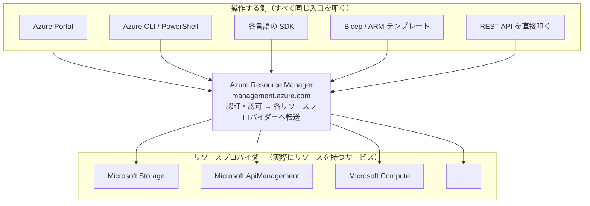
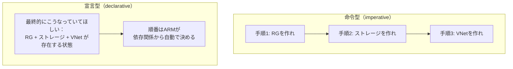
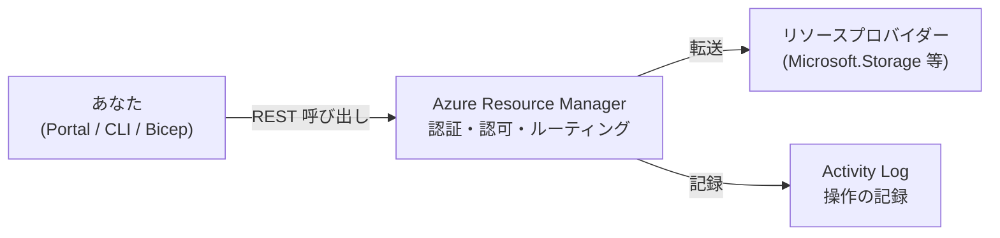

# Week 1 — ARM とは何か：すべての操作の裏側にある単一の REST API

> **Phase 1a** | 学習プラン Week 1 / 9
> 学習目標：Azure Resource Manager（ARM）が「なぜ存在するのか」「Portal/CLI/Bicep などすべての操作が最終的に何を叩いているのか」を自分の言葉で説明でき、ARM への呼び出しを Activity Log で実際に確認できる

---

## 0. 今週の位置づけ

この学習プランは全 9 週で、**ARM というコントロールプレーン**を主役に据え、次の順で深掘りする。

1. **Week 1-2**：ARM の正体とデプロイスコープ（今日はここ）
2. **Week 3-4**：IaC の書き方（ARM JSON テンプレート → Bicep）
3. **Week 5**：デプロイの挙動（モード・what-if・状態管理）
4. **Week 6-7**：ガバナンスとセキュリティ（RBAC・Policy・デプロイの認証）
5. **Week 8-9**：CI/CD と最終プロジェクト（マルチスコープ Bicep を GitHub Actions で E2E 実行）

ARM 自体は初登場ではない。[api-management/notes/week1.md](../../api-management/notes/week1.md) §4 では「Management plane（管理プレーン）＝ ARM 経由で API・ポリシー・プロダクトを構成」として、[storage/notes/week3.md](../../storage/notes/week3.md) §1 では「管理プレーン（コントロールプレーン）＝ Azure Resource Manager（`management.azure.com`）」として、どちらも**脇役として一瞬だけ**登場していた。今回はこの「脇役」を主役に据えて、正体を最初から最後まで追いかける。

> **本教材が扱わない範囲**：Azure Policy・RBAC・管理グループの実務全量（Entra ID のロール設計やランディングゾーン設計そのもの）は扱わない。Week 6 で「ARM のデプロイとどう関係するか」に必要な範囲だけを扱う。ガバナンスそのものを深く学びたい場合は、それ専用の教材が必要になる。

---

## 1. なぜ「裏口からリソースを触る」と困るのか

Azure を操作する経路は 1 つではない。Portal、Azure CLI、PowerShell、各言語の SDK、REST API を直接叩く方法、そして Bicep/ARM テンプレートによるデプロイ——これだけの経路がある。

もしこれらの経路が**それぞれ勝手に**リソースを操作していたら、何が起きるか。

| 経路がバラバラだと | 何が起きるか |
|---|---|
| Portal から変更した設定が CLI から見えない | ツールごとに「見える世界」が食い違う |
| 誰が・いつ・何を変更したか統一的に追えない | 監査ができない |
| 経路ごとに認証・権限チェックの実装がバラバラ | セキュリティホールが生まれやすい |
| 新機能が Portal だけ、CLI だけに先に来る | ツール間で機能差が生まれる |

つまり「**入口が複数あるのに、それぞれが独自に処理する**」と、一貫性・監査可能性・セキュリティのすべてが崩れる。これは Week 1 でこれまで繰り返し見てきた構図——APIM が「バックエンドへの直接呼び出しの乱立」を防ぐために単一のゲートウェイを置いたのと、根っこは同じ問題。

> **初学者向け用語補足：REST API とは**
> **REST（Representational State Transfer）API**＝ HTTP（Web で使われる通信規約）の上に乗った、決まった作法でやり取りする API の設計スタイル。`GET`（取得）・`PUT`（作成/更新）・`DELETE`（削除）のような HTTP メソッドと URL の組み合わせで「何を・どうしたいか」を表す。Portal のボタンも、CLI のコマンドも、SDK の関数呼び出しも、最終的には裏側でこの REST API 呼び出しに変換されている。

---

## 2. ARM の正体：すべての道が通る単一の管理レイヤー

Azure はこの問題を、**すべての操作を 1 つの管理レイヤーに集約する**ことで解決した。それが **Azure Resource Manager（ARM）**。



Microsoft Learn の定義はシンプルにこう言い切っている——

> Azure Resource Manager is the deployment and management service for Azure. ... When you send a request through any of the Azure APIs, tools, or SDKs, Resource Manager receives the request. It authenticates and authorizes the request before forwarding it to the appropriate Azure service.
> （ARM は Azure のデプロイと管理を担うサービス。どの API・ツール・SDK 経由のリクエストも ARM が受け取り、認証・認可してから適切な Azure サービスへ転送する）

つまり **Portal のボタンをクリックしても、`az group create` を打っても、Bicep をデプロイしても、最終的に叩いているのは同じ 1 つの REST API（ARM）**。これが「一貫した管理レイヤー（consistent management layer）」と呼ばれる理由で、Portal にある機能は原則すべて CLI/SDK/REST からも同じように使える（逆も同様）。

> **初学者向け用語補足：コントロールプレーン / データプレーンのおさらい**
> これまでの教材で繰り返し出てきた区別を、ここで正式に固定する。
>
> | 面 | 何をする | 代表エンドポイント |
> |---|---|---|
> | **コントロールプレーン（管理プレーン）** | リソースそのものを**作る・消す・設定変更する** | `management.azure.com`（＝ ARM） |
> | **データプレーン** | リソースの**中身のデータ**を読み書きする | `<acct>.blob.core.windows.net` など、サービスごとに別 |
>
> APIM の「Gateway＝データプレーン／Management plane＝ ARM 経由の管理プレーン」も、Storage の「Blob 操作＝データプレーン／アカウント設定＝ ARM 経由の管理プレーン」も、**同じ二層構造の繰り返し**だった。この教材は「管理プレーン」側、つまり ARM そのものを主役として掘り下げる。

---

## 3. リソースプロバイダーとリソース ID

### 3-1. リソースプロバイダー（Resource Provider）

ARM 自身はストレージも仮想マシンも「持って」いない。実際にリソースを保持し操作するのは、サービスごとの**リソースプロバイダー**。

| リソースプロバイダー | 提供するリソース |
|---|---|
| `Microsoft.Storage` | ストレージアカウント |
| `Microsoft.ApiManagement` | APIM インスタンス |
| `Microsoft.Compute` | 仮想マシン |
| `Microsoft.Cache` | Azure Cache for Redis / Managed Redis |
| `Microsoft.EventGrid` | Event Grid トピック・サブスクリプション |

ARM は「交通整理役（受付・認証・転送）」で、実際の仕事は各プロバイダーに委譲する。Microsoft Learn の用語定義でも「resource provider - A service that supplies Azure resources.（リソースプロバイダー＝ Azure リソースを供給するサービス）」とされている。

> **初学者向け用語補足：リソースプロバイダーの実体を「市役所の窓口」でイメージする**
> 「リソースプロバイダー」という言葉だけだと実体が掴みにくい。**市役所の総合受付と各専門部署**に例えると整理しやすい。
>
> - **ARM＝市役所1階の総合受付**：申請を受け取り、本人確認（認証・認可）をした上で**該当する専門部署に取り次ぐだけ**。総合受付自体は住民票の印刷機も水道管の設備も持っていない。
> - **リソースプロバイダー＝各専門部署（戸籍課・上下水道局など）**：それぞれ**自分たち専用の実務システムと現場設備**を持ち、実際に住民票を発行したり水道管を敷設したりする**実務の実体**。
>
> **1. どこに存在するのか**：`Microsoft.Storage` や `Microsoft.Compute` は、Microsoft内の各サービスチームが運用している「裏方の管理システム」。ARM とは別の場所（別チーム・別システム）で、Azure のデータセンター内に実際に存在する。サブスクリプションごとに必要な**プロバイダー登録（`az provider register`）**は、「この部署の窓口を開けておいてください」という手続きに相当する。
>
> ```mermaid
> flowchart LR
>     U["あなた<br/>(Portal/CLI/Bicep)"]
>     ARM["ARM<br/>総合受付<br/>(本人確認だけ)"]
>     RP["Microsoft.Storage<br/>＝ストレージ課<br/>(実務システム)"]
>     INFRA["Azureのストレージ基盤<br/>＝現場設備"]
>
>     U -->|"申請:ストレージ作って"| ARM
>     ARM -->|"確認OK→取次ぎ"| RP
>     RP -->|"実際に確保・設定"| INFRA
> ```
>
> **2. 依頼すると何がどこにできるか**：できあがる「モノ」（実データ・実容量）は**ストレージ課(リソースプロバイダー)配下の現場設備側**にできる。ARM自身はそれを保管せず、「このリソースが存在する」という**台帳（インベントリ）の記録**だけを持つ——これが Activity Log やリソース ID として見えているもの。
>
> **3. 誰の指示で動くか**：①あなたが ARM（総合受付）に申請 → ②ARM が本人確認・権限チェック → ③確認済みの依頼を REST 呼び出しとして `Microsoft.Storage` に転送 → ④ストレージ課が自分たちの実務システムで実際に容量確保・設定 → ⑤結果が ARM 経由で返り、ARM の台帳にも記録される。**指示元は常に ARM** であり、リソースプロバイダーは単独で勝手に何かを作ることはない。

### 3-2. リソース ID：すべてのリソースの「住所」

ARM 配下のあらゆるリソースは、次の形式の一意な ID を持つ。

```text
/subscriptions/{サブスクリプションID}
  /resourceGroups/{リソースグループ名}
  /providers/{リソースプロバイダー}/{リソース種別}/{リソース名}
```

具体例（ストレージアカウント）：

```text
/subscriptions/xxxxxxxx-xxxx-xxxx-xxxx-xxxxxxxxxxxx
  /resourceGroups/rg-learn
  /providers/Microsoft.Storage/storageAccounts/mystorageaccount
```

これは Microsoft Learn のテンプレート解説にある実例とも対応する。ARM はテンプレート内のリソース定義を、最終的に次のような REST 呼び出しに変換して各プロバイダーに送る。

```http
PUT https://management.azure.com/subscriptions/{subscriptionId}/resourceGroups/{resourceGroupName}
    /providers/Microsoft.Storage/storageAccounts/mystorageaccount?api-version=2025-06-01
```

> **初学者向け用語補足：なぜ「住所」が必要か**
> リソースグループの中に同じ名前のリソースが複数あってはいけないし、Azure 全体で「このリソースを指せ」と一意に参照できる必要がある。リソース ID は郵便住所のように「サブスクリプション（国）→ リソースグループ（住所）→ プロバイダー/種別/名前（部屋番号）」と階層的に一意な場所を表す。RBAC の割り当てや、テンプレートの `dependsOn`（Week 3）も、内部的にはこのリソース ID で対象を指す。

---

## 4. 宣言型・冪等性という考え方

### 4-1. 命令型 vs 宣言型

これまで「アプリからリソースを作る」というと、多くの人は「手順を書いたスクリプト」を思い浮かべる。ARM の中心的な考え方はそれとは違う。



| | 命令型 | 宣言型 |
|---|---|---|
| 書くもの | 「何をどの順でやるか」という手順 | 「最終的にどうあってほしいか」という状態 |
| 順序管理 | 自分で `dependsOn` 相当を考えて並べる | ARM が依存関係を見て自動的に並べ替え、可能なら並列実行 |
| 例 | シェルスクリプトで `az vm create` を順番に呼ぶ | ARM テンプレート／Bicep ファイル 1 本 |

ARM テンプレートも Bicep も**宣言型構文（declarative syntax）**——Microsoft Learn の定義では「Syntax that lets you state, "Here's what I intend to create," without having to write the sequence of programming commands to create it.（"これを作りたい" と状態を書くだけで、作る手順そのものは書かなくてよい構文）」とされる。

### 4-2. 冪等性（idempotency）

宣言型であることの実利は**冪等性**にある。Microsoft Learn は明確にこう述べている。

> Templates are idempotent, which means you can deploy the same template many times and get the same resource types in the same state.
> （テンプレートは冪等。同じテンプレートを何度デプロイしても、同じ状態の同じリソースが得られる）

つまり「もう存在するリソースに向けて同じテンプレートをもう一度流しても、エラーにもならないし、二重に作られることもない」。この性質のおかげで、テンプレートは「一度きりの構築手順書」ではなく「常に目指す最終状態を表す 1 つの真実」として何度でも安全に再実行できる。

> **初学者向け用語補足：冪等性（べきとうせい）とは**
> 数学・工学の用語で「同じ操作を 1 回行っても複数回行っても結果が変わらない」性質のこと。エレベーターの「3階」ボタンが好例——すでに 3 階にいるときにもう一度押しても、何も起きない（すでに目的の状態だから）。ARM テンプレートの再デプロイも同じで、「目指す状態」に既になっていれば何も変更されない。

---

## 5. 最初の成功体験：ARM への呼び出しを「見る」

今週は難しい構築はまだしない。**「自分の操作が本当に ARM への REST 呼び出しになっている」ことを目で確認する**のがゴール。

1. [Azure Portal](https://portal.azure.com) にサインインし、リソースグループを 1 つ作成する（例：`rg-arm-learn`）
2. 作成後、そのリソースグループの左メニューから **アクティビティ ログ（Activity Log）** を開く
3. 直近の「リソース グループの作成」イベントを開き、詳細（JSON タブ）を確認する
   - `Operation name` に `Microsoft.Resources/subscriptions/resourcegroups/write` のような ARM 操作名が入っている
   - `Caller`（誰が）、`Event initiated by`（どのクライアントから）といった情報も記録されている
4. （余力があれば）Azure CLI で `az group create -n rg-arm-learn2 -l japaneast --debug` を実行し、出力に含まれる HTTPS リクエスト（`management.azure.com` 宛て）を探す

> Portal でクリックした操作も、CLI で打ったコマンドも、Activity Log 上では**同じ ARM 操作として記録される**——これが「すべての道は ARM に通ず」の実感。

---

## 6. Week 1 全体の整理



### 重要な用語まとめ

| 用語 | 一言説明 |
|---|---|
| Azure Resource Manager（ARM） | すべての操作が最終的に叩く単一の管理 REST API |
| コントロールプレーン（管理プレーン） | リソース自体の作成・削除・設定変更を担う面（`management.azure.com`） |
| データプレーン | リソースの中身のデータを読み書きする面（サービスごとに別エンドポイント） |
| リソースプロバイダー | `Microsoft.Storage` など、実際にリソースを供給するサービス |
| リソース ID | サブスクリプション/リソースグループ/プロバイダー/種別/名前からなる一意の住所 |
| 宣言型（declarative） | 「最終的にどうあってほしいか」を書き、手順自体は書かない構文 |
| 冪等性（idempotency） | 同じ操作を何度行っても同じ結果になる性質。テンプレートの再デプロイが安全な理由 |
| Activity Log | ARM への操作がすべて記録される監査ログ |

---

## ハンズオン チェックリスト

- [ ] Portal でリソースグループを 1 つ作成した
- [ ] Activity Log でその作成イベントを開き、`Operation name` と `Caller` を確認した
- [ ] リソース ID の形式（`/subscriptions/.../resourceGroups/.../providers/...`）を自分で分解して読めた
- [ ] （余力があれば）`az group create --debug` で ARM への HTTPS リクエストの片鱗を確認した
- [ ] 学習用リソースグループは残しておいてよい（Week 2 以降でも使う）。不要なら `az group delete -n rg-arm-learn` で削除

---

## 自己チェック

週末にドキュメントを閉じて答えてみる。

1. **「すべての道は ARM に通ず」とはどういう意味か？**
   - キーワード：Portal/CLI/SDK/Bicep/REST がすべて同じ management.azure.com を叩く、一貫した管理レイヤー
2. **コントロールプレーンとデータプレーンの違いを、ARM と Storage の例で説明できるか？**
   - キーワード：ARM＝リソース自体の作成/削除、データプレーン＝中身の読み書き、別エンドポイント
3. **リソースプロバイダーと ARM の役割の違いは？**
   - キーワード：ARM＝受付・認証・転送、プロバイダー＝実際にリソースを持つサービス
4. **冪等性がなぜ「安心して再デプロイできる」ことに繋がるのか？**
   - キーワード：同じテンプレートを何度流しても同じ状態、既に目的の状態なら変更なし
5. **宣言型と命令型の違いを一言で言うと？**
   - キーワード：宣言型＝最終状態を書く、命令型＝手順を書く

---

## 次週の予告（Week 2）

ARM に対してテンプレートをデプロイできる「単位」——**デプロイスコープ**を学ぶ：

- リソースグループ / サブスクリプション / 管理グループ / テナントの 4 つのスコープ
- スコープの階層関係（管理グループがサブスクリプションを束ねる）
- スコープごとに「何が書けるか」の違い（RG スコープ＝リソース、サブスコープ＝ RG 自体や Policy、MG スコープ＝ガバナンス）
- `az deployment group/sub/mg/tenant` コマンドの対応関係
