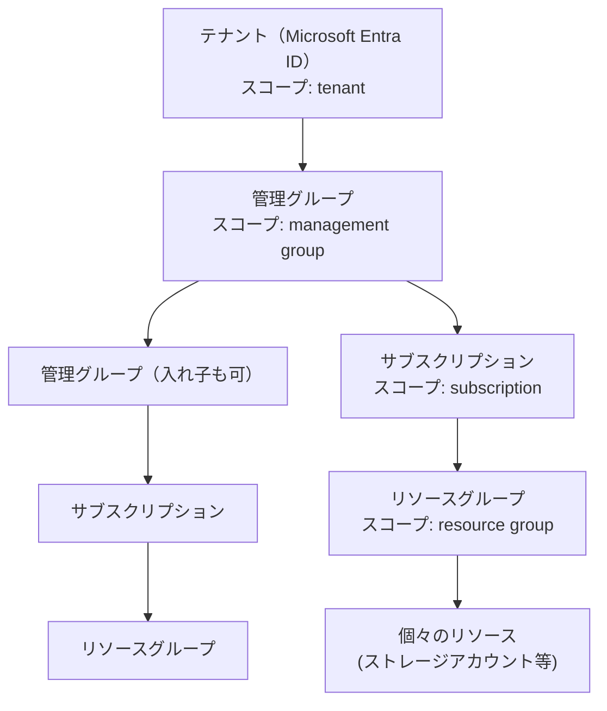
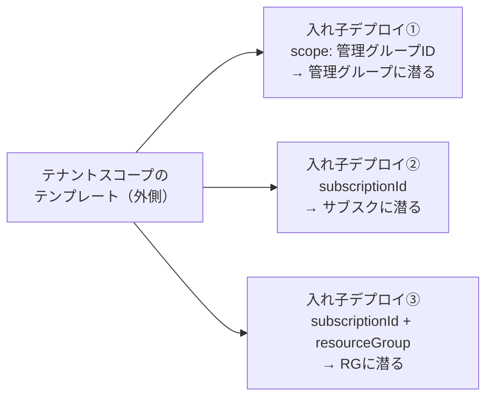
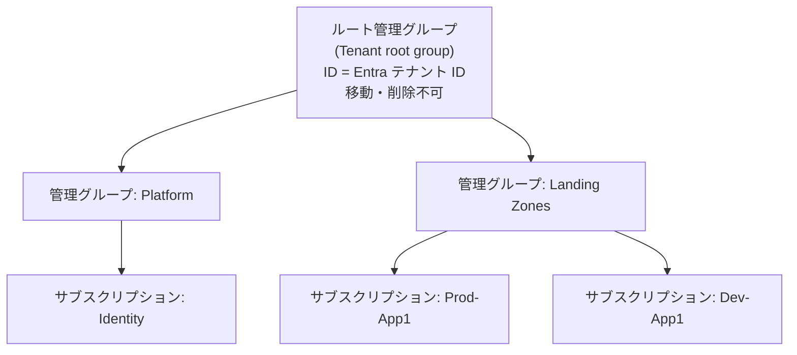
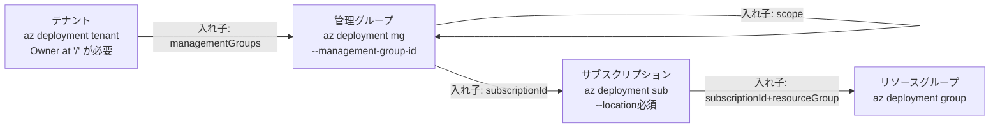

# Week 2 — デプロイスコープ：ARM テンプレートを「どの階層に」流すか

> **Phase 1a** | 学習プラン Week 2 / 9
> 学習目標：ARM テンプレート（Bicep）が「リソースグループ」だけでなく「サブスクリプション」「管理グループ」「テナント」にもデプロイできることを理解し、4 つのスコープの階層関係・できること・対応する CLI コマンドを自分の言葉で説明できる

---

## 0. 今週の位置づけ

Week 1 で「ARM はすべての操作が最終的に叩く単一の管理レイヤーであり、宣言型テンプレートは冪等にデプロイできる」ことを確認した。今週はその一歩先——**そのテンプレートを、そもそもどの階層に向けてデプロイできるのか**を扱う。

1. **Week 1**：ARM の正体（済み）
2. **Week 2**：デプロイスコープ（今日はここ）
3. **Week 3-4**：IaC の書き方（ARM JSON テンプレート → Bicep）
4. **Week 5**：デプロイの挙動（モード・what-if・状態管理）
5. **Week 6-7**：ガバナンスとセキュリティ
6. **Week 8-9**：CI/CD と最終プロジェクト

> **本教材が扱わない範囲**：Week 1 と同様、Azure Policy・RBAC の設計そのもの（どんなポリシーを作るべきか、ロールをどう割り当てるべきか）は扱わない。今週はあくまで「**どの階層にデプロイできるか、という入れ物の話**」に絞る。ガバナンスの中身は Week 6 で最小限だけ扱う。

---

## 1. なぜ「リソースグループへのデプロイ」だけでは足りないのか

Week 1 のハンズオンでは、Portal でリソースグループを 1 つ作った。ARM テンプレートのデプロイも、多くの入門記事では「リソースグループの中にリソースを作る」例しか出てこない。

しかし、実務では次のような要求が出てくる。

| やりたいこと | リソースグループの中だけで完結するか |
|---|---|
| リソースグループ自体を新しく作りたい | ✗（RG の中に RG は作れない） |
| サブスクリプション全体に共通のタグ・ロックポリシーを適用したい | ✗ |
| 複数のサブスクリプションをまたいで同じ Policy を一括適用したい | ✗ |
| 新しいサブスクリプションそのものを払い出したい | ✗ |
| 組織全体（Microsoft Entra テナント全体）にロールを割り当てたい | ✗ |

つまり「**テンプレートがデプロイの対象にできる階層は、リソースグループより上にもある**」。ARM はこれを 4 段階の**デプロイスコープ（deployment scope）**として提供している。

---

## 2. 4 つのデプロイスコープと階層構造



上位のスコープほど「組織全体に効く広い操作」を、下位のスコープほど「実際のリソースそのもの」を扱う。

| スコープ | CLI コマンド | 主に置けるもの |
|---|---|---|
| リソースグループ | `az deployment group create` | 通常のリソース（ストレージアカウント、VM など） |
| サブスクリプション | `az deployment sub create` | リソースグループ自体、サブスクリプション単位の Policy/RBAC/ロック |
| 管理グループ | `az deployment mg create` | 管理グループ自体、複数サブスクリプションを束ねる Policy/RBAC |
| テナント | `az deployment tenant create` | 管理グループ・サブスクリプションの作成、テナント全体のロール割り当て |

> **初学者向け用語補足：「スコープ」は何の範囲か**
> ここでの「スコープ」は 2 つの意味を同時に持つので混同しやすい。
> 1. **デプロイ先の階層**（今週のテーマ）：テンプレートをどの階層に対して実行するか
> 2. **RBAC/Policy の適用範囲**：ロールやポリシーがどの階層以下に効くか
>
> 実は 2 つはつながっている——**上位スコープにデプロイしたテンプレートの中でこそ、上位スコープ向けの RBAC/Policy 割り当てができる**（例：サブスクリプション全体に効く Policy は、サブスクリプションスコープのデプロイでしか作れない）。

---

## 3. スコープごとの詳細

> **初学者向け用語補足：`az deployment <スコープ> create` の読み方**
> 4 つのコマンドはすべて「**テンプレートを、指定したスコープに向けてデプロイする**」もの。コマンド名の `group` / `sub` / `mg` / `tenant` は「**どのスコープにデプロイするか**」を表しているだけで、「グループを作る」「サブスクを作る」という動詞ではない。
>
> | コマンド | 意味 | 主に指定するもの |
> |---|---|---|
> | `az deployment group create` | リソースグループ**スコープ**にデプロイ | `--resource-group`（**既存の** RG 名） |
> | `az deployment sub create` | サブスクリプション**スコープ**にデプロイ | `--location`（履歴の保存先） |
> | `az deployment mg create` | 管理グループ**スコープ**にデプロイ | `--management-group-id` ＋ `--location` |
> | `az deployment tenant create` | テナント**スコープ**にデプロイ | `--location` |
>
> **特に紛らわしい点：`az deployment group create` はリソースグループを "作る" コマンドではない。** すでに存在するリソースグループの「中に」テンプレートのリソース（ストレージアカウント等）を作るコマンド。リソースグループ**自体**を新しく作りたいときは、1 つ上の**サブスクリプションスコープ**（`az deployment sub create`）で行う（§1 の表・§3-2 参照）。なお Azure ではリソースグループを入れ子にできない（RG の中に RG は作れない）。

### 3-1. リソースグループスコープ（これまで通り）

```bash
az deployment group create \
  --resource-group rg-arm-learn \
  --template-file main.json
```

- このコマンドは `rg-arm-learn` という**既存のリソースグループの中に**、`main.json` に書かれたリソースを作る。リソースグループ自体はこのコマンドでは作られない
- コマンドに `--location` が無いのは「不要」だからではなく「**すでに決まっている**」から——`--resource-group rg-arm-learn` を渡した時点で、ARM はそのRGが作成時から持っている location を調べ、デプロイ履歴のメタデータをそこに保存する
- 対象は通常のリソース種別すべて（`Microsoft.Storage/storageAccounts` など）

> **初学者向け用語補足：なぜ RG スコープだけ `--location` が要らないのか**
> デプロイ履歴のメタデータを保存する「場所」は、実は**4 スコープすべてで必要**。違うのは、その場所を**あなたが指定するか / すでに決まっているか**だけ。
>
> | スコープ | 場所属性を持つか | `--location` |
> |---|---|---|
> | リソースグループ | 持つ（作成時に指定済み） | **不要**（RG 自身の location を流用） |
> | サブスクリプション | 持たない（リージョンをまたぐ論理単位） | **必須** |
> | 管理グループ | 持たない | **必須** |
> | テナント | 持たない | **必須** |
>
> リソースグループは「**住所を持つ建物**」——履歴という荷物はその住所に届くので、改めて住所を言わなくていい。サブスク／管理グループ／テナントは「**複数の街にまたがる組織**」で、それ自体はどこか 1 住所には居ない——だから毎回 `--location` で「どの書庫に記録するか」を教える必要がある。
>
> なお、RG の location は「**中身のリソースの場所**」とは無関係。`japaneast` で作った RG の中に `westus` のストレージアカウントを作ることもできる。RG の location はあくまで「その RG というコンテナ自身のメタデータ（デプロイ履歴を含む）の置き場所」でしかない。

### 3-2. サブスクリプションスコープ

```bash
az deployment sub create \
  --location japaneast \
  --template-file main.json
```

- サブスクリプションには「場所」の概念がないため、**`--location` は必須**——これは実際のリソースが作られる場所ではなく、「デプロイの記録（デプロイ履歴のメタデータ）をどこに保存するか」を指定するもの
- できること：リソースグループ自体の作成、サブスクリプション単位の Policy 割り当て、RBAC 割り当て、ロールの割り当てなど
- テンプレートのスキーマは `.../subscriptionDeploymentTemplate.json#` を使う（リソースグループ用とは別）

### 3-3. 管理グループスコープ

```bash
az deployment mg create \
  --name demoMGDeployment \
  --location japaneast \
  --management-group-id mg-platform \
  --template-uri "https://.../azuredeploy.json"
```

- `--management-group-id` で対象の管理グループを指定
- できること：管理グループ自体の作成、**複数サブスクリプションをまたいだ**ガバナンス（Policy・RBAC）の一括適用
- 「複数サブスクリプションに同じ設定をコピペする」代わりに、管理グループスコープで 1 回デプロイすれば配下全部に効く、というのがこのスコープの存在意義

### 3-4. テナントスコープ（最上位）

```bash
az deployment tenant create \
  --name demoTenantDeployment \
  --location japaneast \
  --template-uri "https://.../azuredeploy.json"
```

- できること：管理グループの作成、サブスクリプションの作成（`Microsoft.Subscription/aliases`）、テナント全体へのロール割り当て、課金関連の設定
- **権限のハードル**が他のスコープより高い。Microsoft Learn は次のように明記している。

> The Global Administrator for the Microsoft Entra ID doesn't automatically have permission to assign roles. To enable template deployments at the tenant scope, the Global Administrator must elevate account access...
> （Microsoft Entra ID のグローバル管理者は、自動的にはロール割り当ての権限を持たない。テナントスコープでデプロイを可能にするには、グローバル管理者が「アクセスの昇格」を行う必要がある）

> **初学者向け用語補足：「グローバル管理者」と「Owner」は別の権限体系／「アクセスの昇格」とは何か**
> Azure の権限は、実は**まったく別系統の 2 つの世界**に分かれている。ここが分かると、この一節はほどける。
>
> | | Microsoft Entra ID の世界 | Azure リソースの世界 |
> |---|---|---|
> | 何を管理するか | **人・組織**（ユーザー、グループ、アプリ登録、ライセンス） | **リソース**（サブスク、RG、VM、ストレージ…） |
> | 最上位ロール | **グローバル管理者** | **Owner** |
> | 権限体系 | Entra ロール | RBAC |
> | 例えると | 会社の**人事部**（社員名簿・社員証を管理） | ビルの**各部屋の鍵**（どこに入れるか） |
>
> この 2 つは**意図的に切り離されている**。人事部長（グローバル管理者）だからといって、自動的にサーバー室の鍵（Azure リソースへの権限）を持っているわけではない。「社員を管理する人」と「インフラを操作できる人」の責任を分けるための設計。
>
> **問題**：テナントスコープのデプロイには、ルートスコープ `/`（Azure 階層の頂点）の Owner 権限が要る。ところが**初期状態ではグローバル管理者ですらこれを持っていない**（人事部長でもビル全体のマスターキーは持っていない）。
>
> **「アクセスの昇格（Elevate access）」＝ 2 つの世界に橋を架ける操作**。グローバル管理者だけが押せる Entra ID の 1 回限りのスイッチで、押すと次の 2 段階が可能になる：
>
> 1. **昇格 ON** → グローバル管理者が自分自身に、ルート `/` の「User Access Administrator（＝鍵を配る権限）」を付与する。ここで初めて「人事部の世界」と「Azure リソースの世界のてっぺん」が繋がる
> 2. **鍵を配れるようになったので**、`/` スコープの Owner をデプロイ実行者（自分自身や CI/CD のサービスプリンシパル）に割り当てる：
>
> ```bash
> az role assignment create --assignee "<ユーザーID>" --scope "/" --role "Owner"
> ```
>
> つまりこの一節は「**Entra の最上位ロール（人の管理）と Azure の最上位ロール（モノの管理）は別物で、テナントデプロイには後者が要る。両者は初期状態で繋がっていないので、"昇格" という明示的な橋渡し操作が必要**」という意味。

---

## 4. スコープをまたぐ「入れ子デプロイ」

### 4-1. なぜ「入れ子」が必要か

§2〜3 で見た通り、**1 回のデプロイは 1 つのスコープに対して**行われる。`az deployment sub create` なら「サブスクリプションスコープ」の 1 発だ。

ところが、サブスクリプションスコープでできるのは「**RG を作る**」「Policy を割り当てる」まで。**ストレージアカウントのような普通のリソースは、RG の "中" にしか作れない**（＝リソースグループスコープの仕事）。すると、こういう「またぎ」をしたくなる。

> 1 回のデプロイで、**RG を新規作成し、さらにそのRGの中にストレージアカウントも作りたい**

これは「サブスクスコープ（RG 作成）」と「RG スコープ（ストレージ作成）」の **2 スコープにまたがる**作業。これを 1 本のテンプレートで実現する仕組みが**入れ子デプロイ（nested deployment）**——「**テンプレートの中に、別スコープ宛ての小さいテンプレートを埋め込む**」というもの。

### 4-2. 具体例：テンプレートの中にテンプレートを入れる

外側をサブスクリプションスコープにして、①RG を作り、②その RG の中にストレージを作る例。

```json
{
  "$schema": ".../subscriptionDeploymentTemplate.json#",  // 外側はサブスクスコープ
  "resources": [
    {
      "type": "Microsoft.Resources/resourceGroups",   // ① まずRGを作る（サブスクスコープの仕事）
      "apiVersion": "2021-04-01",
      "name": "rg-app",
      "location": "japaneast"
    },
    {
      "type": "Microsoft.Resources/deployments",   // ② ここが「入れ子デプロイ」
      "apiVersion": "2021-04-01",
      "name": "deployStorage",
      "resourceGroup": "rg-app",   // ★ここで「rg-app スコープ」に潜る指定
      "dependsOn": [ "rg-app" ],   // ①のRGが出来てから実行
      "properties": {
        "mode": "Incremental",
        "template": {
          "$schema": ".../deploymentTemplate.json#",   // 内側はRGスコープ用スキーマ
          "resources": [
            { "type": "Microsoft.Storage/storageAccounts", "name": "..." }
            //  ↑ このストレージは rg-app の中に作られる
          ]
        }
      }
    }
  ]
}
```

ポイントは **`Microsoft.Resources/deployments` という "デプロイそのものを表すリソース"** を、外側テンプレートの中に 1 個のリソースとして書くこと。これが「テンプレートの中に別スコープ向けの小さいテンプレートを埋め込む」＝入れ子デプロイの正体。

- **外側**：サブスクリプションスコープで動き、`rg-app` を作る
- **内側（入れ子）**：`resourceGroup: "rg-app"` と書くことで **RG スコープに切り替わり**、`rg-app` の中にストレージを作る

### 4-3. 「どのスコープに潜るか」の指定方法

§4-2 の内側の `Microsoft.Resources/deployments` に、次のプロパティを書くことで「潜る先のスコープ」を指定する。

| 潜りたい先 | 内側に書くプロパティ | 意味 |
|---|---|---|
| 管理グループ | `scope`（対象 MG のリソース ID） | 「この MG を対象にデプロイして」 |
| サブスクリプション | `subscriptionId` | 「このサブスクを対象にデプロイして」 |
| リソースグループ | `subscriptionId` + `resourceGroup` | 「このサブスクの、この RG を対象にデプロイして」 |

RG だけ 2 つ要るのは、「RG はサブスクの中にある」から——**どのサブスクの、どのRGか**まで指定しないと場所が一意に決まらないため。



このように **1 本のテナントスコープのテンプレートが、複数の入れ子デプロイを持ち、それぞれ違うスコープに潜れる**。最上位（テナント）から一気に「管理グループを作り、その配下サブスクに Policy を割り当て、さらにその中の RG にリソースを作る」——という**縦断的な一括デプロイ**が、この入れ子の積み重ねで実現できる（Week 9 の最終プロジェクトで実際に構築する）。

> **初学者向け用語補足：入れ子デプロイを「工事許可の同封」でイメージする**
> - **デプロイ**＝「この階に工事に入ります」という 1 件の工事許可。1 件につき 1 フロア分。
> - **入れ子デプロイ**＝その工事書類の中に「**ついでに下の階の工事許可もここに同封しておきます**」と別フロア用の許可証を挟み込むこと。
> - `scope` / `subscriptionId` / `resourceGroup`＝同封した許可証に書く「**どの階の、どの部屋か**」という宛先ラベル。

### スコープ遷移には禁止パターンがある

Microsoft Learn は次の制約を明記している。

> The only prohibited scope transitions occur from Resource Group to Management Group, or from Subscription to Management Group.
> （唯一禁止されているスコープ遷移は、リソースグループ→管理グループ、およびサブスクリプション→管理グループへの遷移）

言い換えると、**下位スコープのデプロイから、それより上位の管理グループへ向けて入れ子デプロイすることはできない**。管理グループへの入れ子デプロイができるのは、テナントスコープ・管理グループスコープのテンプレートからだけ。これは「階層の下から上へガバナンスを勝手に変更できてしまう」ことを防ぐための制約と理解すると腑に落ちる。

---

## 5. 管理グループの基礎：階層とルート

管理グループはサブスクリプションをまとめる「フォルダ」のようなもので、次の特徴を持つ（Microsoft Learn の management groups overview より）。

- すべての管理グループ階層は、単一の**ルート管理グループ（"Tenant root group"）**の下に集約される
- ルート管理グループの ID は、その **Microsoft Entra テナント ID と同じ**——移動も削除もできない特別な管理グループ
- 1 テナントあたり最大 **10,000 個**の管理グループを作成できる
- 階層の深さは最大 **6 階層**（ルートと、末端のサブスクリプションレベルは階層数にカウントしない）
- 各管理グループ・各サブスクリプションが持てる**親は 1 つだけ**（複数の親にぶら下がることはできない）



管理グループに割り当てた **RBAC（誰が何をできるか）と Azure Policy（何を強制するか）は、配下のすべての管理グループ・サブスクリプション・リソースグループ・リソースに継承される**。これが「複数サブスクリプションに同じ設定を 1 回で効かせたい」というニーズ（§3-3）に対する土台になっている。

> **初学者向け用語補足：継承は「上書き」ではなく「積み上げ」**
> 管理グループの Policy/RBAC は、下位スコープの設定を消すのではなく、**上から下へ追加で効いてくる**。例えば管理グループレベルで「特定リージョン以外へのリソース作成を禁止する Policy」を割り当てると、配下のどのサブスクリプション・リソースグループでも、たとえ下位で緩い設定をしようとしてもその Policy はブロックとして効き続ける。

---

## 6. ハンズオン：実際にコマンドを叩いてスコープの違いを体感する

1. Week 1 で作ったリソースグループ（`rg-arm-learn`）に対して、`az deployment group create` で空のテンプレート（`resources: []` のみ）を 1 回デプロイしてみる
2. 同じテンプレートを `az deployment sub create --location japaneast` で試すとどうなるか観察する（スキーマ不一致でエラーになるはず——これが「スコープごとにテンプレートのスキーマが違う」ことの体感）
3. `az account management-group list` を実行し、自分のテナントにどんな管理グループが存在するか（ルート管理グループを含む）を確認する
4. （権限があれば）`az account management-group show --name <ルート管理グループID>` でルート管理グループの ID が Entra テナント ID と一致することを確認する

---

## 7. Week 2 全体の整理



### 重要な用語まとめ

| 用語 | 一言説明 |
|---|---|
| デプロイスコープ | テンプレートのデプロイ先となる階層（RG / サブスクリプション / 管理グループ / テナント） |
| `az deployment group/sub/mg/tenant create` | スコープごとに異なる ARM デプロイ CLI コマンド |
| デプロイの location | 実リソースの場所ではなく、デプロイ履歴データの保存場所（RG スコープ以外は明示指定が必要） |
| 入れ子デプロイ（nested deployment） | 上位スコープのテンプレートから下位スコープへリソースを作る仕組み。`scope`/`subscriptionId`/`resourceGroup` で指定 |
| 禁止されたスコープ遷移 | リソースグループ→管理グループ、サブスクリプション→管理グループへの入れ子デプロイはできない |
| ルート管理グループ（Tenant root group） | 管理グループ階層の頂点。ID = Entra テナント ID。移動・削除不可 |
| RBAC/Policy の継承 | 上位スコープの設定が配下すべてに積み上がって効く |

---

## ハンズオン チェックリスト

- [ ] `az deployment group create` でリソースグループスコープへのデプロイを実行した
- [ ] `az deployment sub create --location <region>` を試し、`--location` が必須である理由を説明できる
- [ ] `az account management-group list` でテナント内の管理グループ一覧（ルート管理グループ含む）を確認した
- [ ] 「リソースグループ→管理グループへの入れ子デプロイが禁止されている」理由を自分の言葉で説明できる
- [ ] 4 つの `az deployment` コマンドとスコープの対応を、見ずに書き出せる

---

## 自己チェック

週末にドキュメントを閉じて答えてみる。

1. **4 つのデプロイスコープを、上位から順に言えるか？**
   - キーワード：テナント → 管理グループ → サブスクリプション → リソースグループ
2. **サブスクリプションスコープのデプロイで `--location` が必須なのはなぜか？**
   - キーワード：サブスクリプション自体は場所を持たない、デプロイ履歴データの保存場所を指定するため
3. **管理グループスコープへの入れ子デプロイができないのはどのスコープからか？**
   - キーワード：リソースグループから、サブスクリプションから（の 2 つが禁止）
4. **テナントスコープでロール割り当てを行うために、グローバル管理者が最初にしなければならないことは？**
   - キーワード：アクセスの昇格（Elevate access）でルートスコープ（`/`）の Owner を自分に割り当てる
5. **管理グループに割り当てた Policy/RBAC は、配下にどう作用するか？**
   - キーワード：上書きではなく継承・積み上げ、配下のサブスクリプション/RG/リソースすべてに効く

---

## 次週の予告（Week 3）

いよいよ ARM テンプレートの中身——**JSON テンプレートの構文**を扱う：

- `parameters` / `variables` / `resources` / `outputs` の 4 大セクション
- テンプレート関数（`concat`・`uniqueString`・`resourceId` など）
- `dependsOn` による依存関係の明示
- 「Bicep は実はこの JSON にコンパイルされている」ことを `bicep build` で確認する
