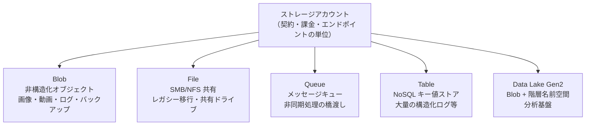
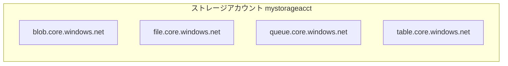
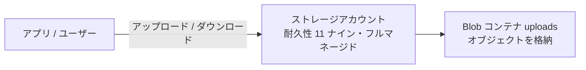

# Week 1 — なぜクラウドストレージか（設計思想）と最初の成功体験

> **Phase 1a** | 学習プラン Week 1 / 10
> 学習目標：Azure Storage が「なぜ存在するのか」「自前でファイルを保存するのと何が違うのか」を自分の言葉で説明でき、実際にストレージアカウントを作って Blob を 1 つ上げ下げできる

---

## 0. 今週の位置づけ

この学習プランは **Blob Storage を主軸**に深掘りし、Queue / Table / File / Data Lake は「いつ使うか」の判断軸として俯瞰する。Week 1 は 2 つのことをやる。

1. **思想**：なぜクラウドストレージが必要か、Storage が Azure の中でどんな立ち位置か
2. **手を動かす**：アカウントを作って Blob を 1 つアップロード／ダウンロードする（**数分で成功体験**）

> APIM の Developer ティアは作成に 30〜45 分かかったが、**Storage アカウントは数秒〜数十秒で作れる**。この身軽さが Storage の大きな魅力。だから Week 1 から実物を触る。

---

## 1. なぜ「自前で保存」では困るのか

アプリが画像・動画・ログ・バックアップ・添付ファイルといった**非構造化データ**を持つと、「どこに置くか」という問題が必ず出る。素朴な選択肢は 2 つ。

| 素朴な置き場 | 何が起きるか |
|---|---|
| **アプリサーバのローカルディスク** | サーバが死ぬとデータも消える。台数を増やすとファイルが各サーバに散らばる。ディスクが満杯になるとアプリごと止まる |
| **リレーショナル DB に BLOB 列で保存** | DB が肥大化し、バックアップ・レプリケーションが重くなる。DB は「検索・整合性」が仕事で「大きなバイナリ置き場」には向かない |

つまり「大きなデータ・たくさんのデータ・落としてはいけないデータ」を、アプリや DB の片手間で持つと破綻する。

> **初学者向け用語補足：リレーショナル DB と「バイナリ」**
> - **リレーショナルデータベース（RDB）**：データを**表（テーブル＝行と列）**で持ち、表どうしを ID で**関連づけ（relation）**できる DB。MySQL・PostgreSQL・SQL Server など。「田中さんの注文は？」のような**検索や整合性チェック**が得意。
>
> ```text
>   ユーザー表                       注文表
>   ┌────┬────────┐         ┌───────┬─────────┬──────────┐
>   │ id │ name   │         │ 注文id │ user_id │ 商品     │
>   ├────┼────────┤         ├───────┼─────────┼──────────┤
>   │ 1  │ 田中   │ ←─────→ │ 100   │ 1       │ コーヒー │
>   │ 2  │ 佐藤   │         │ 101   │ 2       │ 紅茶     │
>   └────┴────────┘         └───────┴─────────┴──────────┘
>          user_id で「どのユーザーの注文か」を関連づけ（リレーション）
> ```
>
> - **BLOB 列**：その表の 1 列に、画像・動画などの大きなバイナリを**丸ごと**入れるための列の型（Binary Large OBject）。名前は同じだが Azure の「Blob Storage」とは別物（こちらは"DB の列の型"）。
> - **バイナリデータ**：物理的にはすべてのデータが 0/1 だが、実務では「**文字として直接読める 0/1＝テキスト**（`.txt` `.csv` `.json`）」と「**文字としては読めず専用ソフトが解釈する 0/1＝バイナリ**（`.jpg` `.mp4` `.zip`）」を対比して使う。Week 1 で言う「大きなバイナリ」＝**サイズが大きく文字として読めない形式のファイル**＝まさに Blob Storage が得意とする対象。

> **重要な概念の区別：RDB と Blob は役割分担する**
> RDB に巨大なバイナリを詰めると、**レプリケーション（複製）が重くなる**。レプリケーションとは「DB の複製を別サーバに作り常に同期し続ける」仕組みで、障害対策や読み取り分散に使う。中に画像・動画が入っていると、その巨大データも**丸ごと複製先へ転送し続ける**ことになり、転送量と保存量が爆発して同期が遅延する（バックアップも同様に肥大化）。
> だから定石は次の分担：**DB には「実体を指す URL や ID（軽いテキスト）」だけを置き、実体は Blob に置く**。DB は軽いまま検索・整合性に専念でき、複製・バックアップも速い。
>
> ```mermaid
> flowchart LR
>     DB["RDB<br/>注文情報＋画像URL（軽い）"]
>     BLOB["Blob Storage<br/>画像の実体（重い）"]
>     DB -->|"URL で参照"| BLOB
> ```

### 自前でストレージ基盤を作るとどれだけ大変か

仮に自前でファイルサーバ群を組むと、以下を**全部自分で**面倒みることになる。

| 要件 | 自前だと | 内容 |
|---|---|---|
| 耐久性 | ディスク多重化・定期バックアップを自作 | 1 本のディスク故障でデータを失わない仕組み |
| スケール | サーバ増設・分散・名前管理を自作 | 容量が増えても性能が落ちない設計 |
| 地理冗長 | 別データセンターへの複製を自作 | リージョン障害でも生き残る仕組み |
| 可用性 | 冗長化・フェイルオーバーを自作 | 一部が壊れても止まらない |
| 運用 | パッチ・監視・容量管理を 24/365 | 人手とコスト |

> **初学者向け用語補足：ディスクと「1 本の故障」**
> - **ディスク**：データを実際に記録しておく**物理的な部品（記憶倉庫）**。電源を切っても消えない。HDD（円盤が回り磁気で記録）と SSD（半導体チップに記録）がある。Blob のデータも最終的にはデータセンターの大量のディスク上に乗っている。
> - **メモリとの違い**：メモリ（RAM）は作業中だけ使う机で**電源を切ると消える**。ディスクは保管庫で**電源を切っても残る**。
> - **「1 本のディスクが故障」**：ディスクは物理部品なので**必ずいつか壊れる**。壊れると、そのディスクに入っていたデータが**丸ごと読めなくなる＝失われる**。1 冊のノートが破れて読めなくなるイメージ。
>
> ```mermaid
> flowchart LR
>     A["正常なディスク<br/>データが読める"]
>     A -->|"経年劣化・衝撃・寿命"| B["故障したディスク<br/>★ データが読めない＝喪失"]
> ```
>
> **だから「多重化」する**：同じデータを複数のディスク（実際は別マシン）に同時に書いておけば、1 本壊れても他に残る。自前ではこの多重化・故障検知・交換を全部運用しないといけない。**Azure Storage はこれを内部で自動化**し、標準（LRS）でも最低 3 つに複製しているので、ディスクが 1 本壊れても利用者は気づかない。これが §2 の「耐久性 11 ナイン」の正体。この発想をリージョン規模まで広げたのが Week 6 の冗長性（LRS / ZRS / GRS …）。
>
> ```mermaid
> flowchart LR
>     D["保存したいデータ"]
>     D --> D1["ディスク1"]
>     D --> D2["ディスク2"]
>     D --> D3["ディスク3"]
> ```

これらを**フルマネージドなサービスとして肩代わり**するのが Azure Storage。利用者は「データを置く・取り出す」に集中できる。

> **初学者向け用語補足：フルマネージド**
> サーバの調達・冗長化・パッチ適用・容量管理・障害対応といった**運用を Azure 側がすべて受け持つ**こと。利用者はインフラを意識せず「データを置く／取り出す」だけに集中できる。
> なお、名前の似た **Azure「マネージドディスク（Managed Disks）」は別物**。あちらは VM のディスクを管理する専用機能で、その実体は Storage の Page Blob（後述）。混同しないこと。

> **イメージ**：自前ストレージ＝自宅に倉庫を建てて警備も補修も自分でやる。Azure Storage＝預けるだけで耐火・警備・複製・無限増床を運営側がやってくれる貸し倉庫。

---

## 2. Azure Storage が提供する「耐久性」という核心価値

Azure Storage の最大の売りは **耐久性（durability）**。標準構成（LRS）でも **イレブンナイン＝99.999999999%（年間）** の耐久性を design 目標として掲げる。

> **初学者向け用語補足**
> - **耐久性（durability）**：預けたデータが**失われない**度合い。「11 ナイン」とは、100 億個のオブジェクトを預けても 1 年間で 1 個失うかどうか、という桁感。
> - **可用性（availability）**：預けたデータに**いつでもアクセスできる**度合い。耐久性（消えない）と可用性（読める）は別物。
>
> Storage は内部で同一リージョン内に最低 3 つの複製を持つことでこの耐久性を実現している（詳細な冗長性オプションは Week 6）。

---

## 3. Storage は Azure の「土台」である

Storage を学ぶ重要な理由：**Azure の多くのサービスが裏で Storage を使っている**。Storage は単体サービスであると同時に、エコシステムの基盤。

> **初学者向け用語補足：エコシステムとは**
> もとは「生態系（生き物どうしが支え合う仕組み）」の意味。IT では **複数のサービスや製品が互いに連携・依存して成り立っている全体の集まり**を指す比喩。ここでの「Azure エコシステム」＝ **Azure の数百のサービス群と、それらが連携して動く仕組み全体**。
> Storage が「基盤（土台）」と呼ばれるのは、下表のとおり Functions・VM・Backup・AKS・Terraform など**多くのサービスが内部で Storage に依存している**から。ビルに例えるなら各サービスが各フロアの部屋、**Storage は全フロアを支える地下の基礎**。森に例えるなら Storage は「土」で、多くの生き物（サービス）がそこに根を張って生きている。だから最初に Storage を学ぶ価値が高い。
>
> ```mermaid
> flowchart TD
>     subgraph ECO["Azure エコシステム（サービス群が連携する全体）"]
>         FUNC["Functions"]
>         VM["仮想マシン"]
>         AKS["AKS / コンテナ"]
>         BACKUP["Backup"]
>         STG["Storage（★ 土台）"]
>     end
>     FUNC -->|"状態・ログを置く"| STG
>     VM -->|"ディスクの実体"| STG
>     AKS -->|"ログ・永続ボリューム"| STG
>     BACKUP -->|"保存先"| STG
> ```

| サービス | 裏で Storage をこう使う |
|---|---|
| **Azure Functions** | 関数の状態・トリガー管理・ログに Storage アカウントが必須 |
| **仮想マシン (VM)** | OS/データディスクの実体は Page Blob（マネージドディスクの下層） |
| **Azure Backup / Site Recovery** | バックアップデータの保存先 |
| **Terraform / Bicep の状態管理** | `tfstate` などを Blob コンテナに置くのが定番 |
| **コンテナ (AKS) のログ・永続ボリューム** | Blob / File をマウント |
| **診断・アクティビティログ** | 長期保管先として Blob |

> **ポイント**：「Storage を理解する」ことは「Azure 全体の土台を理解する」ことに近い。だから最初に学ぶ価値が高い。

---

## 4. Azure Storage の 4+1 サービス（俯瞰）

1 つのストレージアカウントの中に、用途の違う複数のデータサービスが同居している。**今週は深入りせず「どれを何に使うか」の地図だけ**頭に入れる。



| サービス | 一言で | こういう時に選ぶ | 本講座での扱い |
|---|---|---|---|
| **Blob** | 巨大なオブジェクト置き場 | 画像・動画・バックアップ・ログ・任意のファイル | **主軸（深掘り）** |
| **File** | クラウドのファイル共有 | 既存アプリの共有ドライブをそのままクラウドへ | 俯瞰 |
| **Queue** | 単純なメッセージキュー | 処理を非同期に分離したい（注文受付→後処理） | 俯瞰 |
| **Table** | 安価な NoSQL | 大量の構造化ログ・設定。高機能が要れば Cosmos DB | 俯瞰（判断軸） |
| **Data Lake Gen2** | 分析向け Blob | ビッグデータ分析（Synapse/Databricks） | 俯瞰（Week 9） |

> **重要な概念の区別**
> - **Blob と File はどちらもファイルを置けるが目的が違う**。File は「既存アプリが SMB でマウントして使う共有ドライブ」、Blob は「アプリが API/SDK で読み書きするオブジェクト」。新規クラウドアプリなら基本 Blob。
> - **Table と Cosmos DB**：Table は安くてシンプル。グローバル分散・低レイテンシ・複数の整合性レベルが要るなら Cosmos DB。迷ったら「まず要件、足りなければ Cosmos」。

> **重要な概念の区別：非構造化（Blob）と構造化（Table）**
> 「構造化／非構造化」は、データの**中身に決まった形（スキーマ＝列・型）があるか**で分かれる。
> - **非構造化＝Blob**：中身に決まった形がない（画像・動画・PDF・ログ本文）。**Storage は中身を解釈せず、ただのバイト列として丸ごと保管・返却**する。何でも置けるが「中身の何か」で検索はできない。
> - **構造化（半構造化）＝Table**：1 件が `PartitionKey` + `RowKey` + 任意の列という**決まった形**を持ち、**キーで検索・絞り込みできる NoSQL**。RDB のような複雑な結合や強整合はない。
>
> ```text
> 【Table（構造化）】列が決まっていて1件ずつ意味が分かる
> ┌──────────────┬──────────┬──────┬────────┐
> │ PartitionKey │ RowKey   │ name │ amount │
> ├──────────────┼──────────┼──────┼────────┤
> │ 2026-06      │ order100 │ 田中 │ 1200   │ ← 「amount だけ集計」等ができる
> └──────────────┴──────────┴──────┴────────┘
>
> 【Blob（非構造化）】中身は解釈しない。1個の塊として置くだけ
>    cat.jpg → 11111111 11011000 ...（Storage には「ただのバイト列」）
> ```
>
> | 観点 | Blob（非構造化） | Table（構造化／半構造化 NoSQL） |
> |---|---|---|
> | 単位 | オブジェクト（1 ファイル） | エンティティ（1 レコード） |
> | 中身の形 | 任意・決まりなし | キー + 任意の列 |
> | Storage は中身を | 見ない（バイト列） | 列として認識・キーで引ける |
> | 得意 | 大きなものを丸ごと出し入れ | 小さな多数を検索 |
> | 用途 | 画像・動画・ログ"本文" | センサー値・設定・ログ"インデックス" |
>
> **併用パターン**：画像の**実体は Blob**、撮影日・タグ・Blob の URL など**メタ情報は Table（や RDB）**。§1 の「DB は軽い参照、実体は Blob」と同じ役割分担。

> **初学者向け用語補足：SMB と NFS（File の共有プロトコル）**
> §4 の表で File を「SMB/NFS 共有」と書いた。どちらも**ネットワーク越しにファイルを共有するための約束事（プロトコル）**で、これを使うと**リモートのストレージを、あたかも自分の PC のドライブ（フォルダ）であるかのようにマウント**して読み書きできる。
> - **SMB（Server Message Block）**：主に **Windows** で使われるファイル共有プロトコル。Windows の「ネットワークドライブ（`\\server\share`）」がこれ。Azure Files を `Z:` ドライブとして割り当てる、といった使い方ができる。
> - **NFS（Network File System）**：主に **Linux / Unix** で使われるファイル共有プロトコル。Linux サーバが共有フォルダを `/mnt/share` のようにマウントして使う。
>
> **Blob との違い**：Blob は SDK/REST で「オブジェクトを丸ごと出し入れ」する（マウントしない）。File は SMB/NFS で「ドライブとしてマウントし、普通のファイル操作（開く・一部だけ書き換える）」ができる。**既存アプリを書き換えずにそのままクラウドへ移したい**ときは File、**新規にクラウド前提で作る**なら Blob、が基本の判断。

---

## 5. ストレージアカウントとは何の単位か

すべての出発点が**ストレージアカウント**。これは「契約・課金・エンドポイント・既定設定」の単位。



- アカウントごとに**グローバルで一意な名前**を持ち、サービスごとに固有のエンドポイント URL が生える
- 冗長性・暗号化・ネットワーク制限・既定アクセス層などは**アカウント単位**で設定する

### アカウントの種類（実務ではほぼ一択）

| 種類 | 用途 |
|---|---|
| **Standard 汎用 v2（StorageV2）** | **既定の選択。Blob/File/Queue/Table 全部使え、アクセス層も使える**。迷ったらこれ |
| Premium BlockBlob | 超低レイテンシ・高トランザクションが必要な Blob 専用 |
| Premium FileShares | 高性能ファイル共有 |
| Premium PageBlobs | 高性能 Page Blob |

> **ポイント**：本講座は基本 **Standard 汎用 v2**。新規で `StorageV1` や旧 `Blob` 専用アカウントを選ぶ理由はほぼない。

> **初学者向け用語補足：混同しやすい性能用語（レイテンシ・トランザクション・スループット）**
> 上表の Premium は「超低レイテンシ・高トランザクション」を売りにするが、これらは**別々の軸**で、片方が良くても他方が良いとは限らない。
>
> | 用語 | 測るもの | たとえ | 単位例 |
> |---|---|---|---|
> | **レイテンシ（遅延）** | 1 回の要求に応答が返るまでの**時間** | 料金所を 1 台が通過する時間 | ミリ秒 (ms) |
> | **トランザクション / IOPS** | 1 秒あたりに処理できる**要求の件数** | 1 秒に何台さばけるか | 件/秒、IOPS |
> | **スループット / 帯域** | 1 秒あたりに流せる**データ量** | 1 秒に何トン運べるか | MB/秒 |
> | **容量** | 保存できる**総量** | 倉庫の広さ | GB、TB |
>
> - **レイテンシ ≠ スループット**：レイテンシは「1 件が速いか」、スループットは「まとめて大量に流せるか」。トラック便は 1 回（レイテンシ）は遅いが大量（スループット）に運べる。バイク便は逆。
> - **トランザクション**：ここでは DB の処理単位ではなく、**Storage への 1 回の操作要求（読み/書き/一覧）**のこと。「高トランザクション」＝秒間に大量の要求をさばける。ディスク文脈の **IOPS（Input/Output Operations Per Second）**とほぼ同義。Storage は操作回数でも課金されるため（Week 7）、トランザクション数は**性能とコストの両方**に関わる。
> - **なぜ Premium が速いか**：Standard に対し **Premium は SSD ベース**で、1 件の応答が速く（低レイテンシ）秒間に多くさばける（高トランザクション）。「小さなオブジェクトに高頻度・低遅延でアクセス」する用途で価値が出る。ただし高価なので、**効く指標（レイテンシ／トランザクション／スループットのどれがボトルネックか）が Premium の得意分野と一致するときだけ**選ぶ。詳細は Week 7。

---

## 6. ハンズオン：最初の成功体験

ここからは手を動かす。**アカウントを作って Blob を 1 つ上げて落とす**だけ。所要数分。

### Portal で

```text
1. ポータルで「ストレージ アカウント」→「作成」
2. リソースグループ・名前（グローバル一意・小文字英数字）・リージョン（Japan East 等）を指定
3. パフォーマンス：Standard / 冗長性：LRS（学習用は最安）
4. 作成（数十秒で完了）
5. 作成後 →「コンテナー」→「+ コンテナー」で uploads を作成
6. uploads を開き「アップロード」で手元のファイルを 1 つ上げる
7. アップロードした Blob を選び「ダウンロード」で取り出せることを確認
```

### CLI でも同じことができる

```bash
# 変数
RG=rg-storage-week1
ACCT=stweek1$RANDOM          # グローバル一意にするため乱数を付与
LOC=japaneast

# リソースグループとアカウント作成
az group create -n $RG -l $LOC
az storage account create \
  -n $ACCT -g $RG -l $LOC \
  --sku Standard_LRS --kind StorageV2

# コンテナ作成（ログインユーザーの Entra ID 認証でデータ操作）
az storage container create \
  --account-name $ACCT -n uploads --auth-mode login

# ファイルをアップロード
echo "hello storage" > hello.txt
az storage blob upload \
  --account-name $ACCT -c uploads -f hello.txt -n hello.txt --auth-mode login

# 一覧してダウンロード
az storage blob list --account-name $ACCT -c uploads --auth-mode login -o table
az storage blob download \
  --account-name $ACCT -c uploads -n hello.txt -f downloaded.txt --auth-mode login
cat downloaded.txt   # hello storage
```

> **初学者向け用語補足**
> - **`--auth-mode login`**：自分の Azure ログイン（Entra ID）でデータを操作する指定。アクセスキーを使わない安全なやり方（詳細は Week 4）。実行には自分に「Storage Blob Data Contributor」ロールが要る場合がある。
> - **コンテナ（container）**：Blob を入れる「フォルダのような入れ物」。アカウント直下に作る（詳細は Week 2）。

---

## 7. Week 1 全体の整理



| 用語 | 一言説明 |
|---|---|
| クラウドストレージ（フルマネージド） | 耐久性・スケール・冗長・運用を Azure が肩代わりするデータ置き場 |
| 耐久性 / 可用性 | 消えない度合い / 読める度合い（別物） |
| ストレージアカウント | 契約・課金・エンドポイント・既定設定の単位 |
| 汎用 v2（StorageV2） | 既定で選ぶアカウント種類 |
| Blob / File / Queue / Table / Data Lake | 用途別のデータサービス。本講座は Blob 主軸 |

---

## ハンズオン チェックリスト

- [ ] Standard 汎用 v2 / LRS のストレージアカウントを作成した
- [ ] コンテナ `uploads` を作成した
- [ ] ファイルを 1 つアップロードし、ダウンロードして中身が一致することを確認した
- [ ] Portal で各エンドポイント（blob / file / queue / table）の URL を確認しメモした
- [ ] CLI（`az storage blob upload/list/download`）でも上げ下げを試した

---

## 自己チェック

週末にドキュメントを閉じて答えてみる。

1. **なぜアプリのローカルディスクや DB にバイナリを置くと破綻するのか？**
   - キーワード：耐久性・スケール・DB の肥大化
2. **「耐久性」と「可用性」の違いを説明できるか？**
   - キーワード：消えない / 読める
3. **「Storage は Azure の土台」とはどういう意味か、例を 2 つ挙げられるか？**
   - キーワード：Functions・VM ディスク・Terraform state
4. **Blob と File、Table と Cosmos DB の使い分けの軸は？**
   - キーワード：オブジェクト vs 共有ドライブ、安価シンプル vs グローバル分散

---

## 次週の予告（Week 2）

Blob のオブジェクトモデルとエンドポイント構造を深掘りする：

- **アカウント → コンテナ → Blob** の階層と命名・URL 構造
- **Block / Append / Page Blob** が「なぜ 3 種あるのか」を本質から
- **Block Blob の分割アップロード → commit** の仕組み（大容量・再開可能の正体）
- Queue / Table / File の構造を俯瞰
