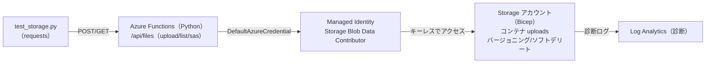

# Week 10 — 実装：Bicep + Python Function + E2E テスト

> **実装フェーズ** | 学習プラン Week 10 / 10
> 学習目標：Week 1〜9 の概念を **Bicep で IaC 化**し、Python の Azure Function を介して Blob を**アップロード/一覧/SAS 発行**し、Managed Identity（キーレス）で動かして E2E に検証する

---

## 0. 総仕上げの位置づけ

これまでポータルや概念で触れた要素を、**実際に動くもの**として組み上げる。手を動かして「点」を「線」にする週。

| これまで学んだ概念 | 今週どこで使うか |
|---|---|
| オブジェクトモデル（Week 2） | Bicep の storageAccount → blobServices → container |
| アクセス（Week 3） | Python SDK（`azure-storage-blob`）で upload/list/download |
| 認証・認可（Week 4） | **Managed Identity ＋ データロール ＋ DefaultAzureCredential**／**User Delegation SAS** 発行 |
| セキュリティ（Week 5） | HTTPS 強制・最小 TLS1.2・公開アクセス無効を Bicep で |
| データ保護（Week 6） | バージョニング・ソフトデリートを Bicep で有効化 |
| 監視（Week 8） | Log Analytics ＋ 診断設定を Bicep で接続 |

---

## 1. 構築する全体像



> **キーレスが主役**：アプリにアクセスキーや接続文字列を持たせず、**Managed Identity ＋ データロール**で Blob を操作する（Week 4）。SAS が要る場面でも、キーではなく **User Delegation SAS**（Entra ID 署名）を発行する。

---

## 2. 成果物（ディレクトリ）

```
storage/
├── infra/
│   ├── main.bicep            Storage + Blob サービス + コンテナ + 診断
│   └── main.bicepparam       パラメータ（storageAccountName を自分の値に）
└── code/
    ├── function_app/
    │   ├── function_app.py    Files API（Python v2・upload/list/download/sas）
    │   ├── host.json
    │   └── requirements.txt
    └── test_storage.py        E2E テスト（アップロード→一覧→ダウンロード一致→SAS）
```

---

## 3. 実装ステップ

### ① Storage 一式を Bicep でデプロイ

```bash
az group create -n rg-storage-week10 -l japaneast
az deployment group create \
  --resource-group rg-storage-week10 \
  --template-file infra/main.bicep \
  --parameters infra/main.bicepparam
```

出力 `storageAccountName` と `blobEndpoint` を控える。

### ② Function App を作成し、Managed Identity を有効化

```bash
# Functions 用のアカウント等は省略。既存 or 新規の Function App を用意し、
# システム割り当て Managed Identity を有効化する
az functionapp identity assign \
  -g rg-storage-week10 -n <your-func-app>
```

### ③ Function の Managed Identity に「データロール」を付与（Week 4 の核心）

```bash
FUNC_PRINCIPAL=$(az functionapp identity show -g rg-storage-week10 -n <your-func-app> --query principalId -o tsv)
STG_ID=$(az storage account show -g rg-storage-week10 -n <storageAccountName> --query id -o tsv)

# 管理ロールではなく「データ向けロール」を割り当てる（Week 4）
az role assignment create \
  --assignee $FUNC_PRINCIPAL \
  --role "Storage Blob Data Contributor" \
  --scope $STG_ID
```

> ⚠ ここで **Contributor ではなく `Storage Blob Data Contributor`** を付けるのが肝（Week 4：管理ロールとデータロールは別物）。

### ④ 環境変数を設定して Functions をデプロイ

```bash
az functionapp config appsettings set -g rg-storage-week10 -n <your-func-app> \
  --settings STORAGE_ACCOUNT_URL="https://<storageAccountName>.blob.core.windows.net" \
             UPLOAD_CONTAINER="uploads"

cd code/function_app
func azure functionapp publish <your-func-app>
```

ローカル確認なら `func start`（その際は自分の `az login` の ID が `DefaultAzureCredential` で使われる）。

### ⑤ E2E テスト

```bash
export FUNC_BASE_URL="https://<your-func-app>.azurewebsites.net/api"
export FUNC_KEY="<function key（必要なら）>"
python code/test_storage.py
```

---

## 4. ポイント解説

### Bicep（セキュリティ・データ保護を宣言的に）

`main.bicep` では Week 5・6 の設定を**コードで**有効化する。

```bicep
resource sa 'Microsoft.Storage/storageAccounts@2023-01-01' = {
  name: storageAccountName
  // ...
  properties: {
    supportsHttpsTrafficOnly: true       // Week 5：HTTPS 強制
    minimumTlsVersion: 'TLS1_2'          // Week 5：最小 TLS
    allowBlobPublicAccess: false         // Week 5：匿名公開を禁止
  }
}

resource blobSvc 'Microsoft.Storage/storageAccounts/blobServices@2023-01-01' = {
  parent: sa
  name: 'default'
  properties: {
    isVersioningEnabled: true                                  // Week 6：バージョニング
    deleteRetentionPolicy: { enabled: true, days: 7 }          // Week 6：ソフトデリート（Blob）
    containerDeleteRetentionPolicy: { enabled: true, days: 7 } // Week 6：ソフトデリート（コンテナ）
  }
}
```

### Function（キーレス＋User Delegation SAS）

`function_app.py` は **DefaultAzureCredential** で Blob を操作し、SAS は **User Delegation SAS**（キー不使用）で発行する。

```python
cred = DefaultAzureCredential()
service = BlobServiceClient(account_url, credential=cred)
# User Delegation Key を取得 → それで SAS 署名（Week 4：キーレス・最長7日・revoke 可能）
udk = service.get_user_delegation_key(start, expiry)
sas = generate_blob_sas(..., user_delegation_key=udk, permission=BlobSasPermissions(read=True), expiry=expiry)
```

> **Week 4 の回収**：アクセスキーを一切使わない。データ操作は Managed Identity、一時共有は User Delegation SAS（短期・読み取りのみ）。

---

## 5. Week 10（と全体）の整理

| 学んだこと | 実装での現れ |
|---|---|
| Blob のオブジェクトモデル | container `uploads` に Blob を upload/list/download |
| データ/管理プレーン | SDK＝データ、Bicep＝管理 |
| 認証・認可 | Managed Identity ＋ Storage Blob Data Contributor、User Delegation SAS |
| セキュリティ | HTTPS/TLS1.2/公開禁止を Bicep で |
| データ保護 | バージョニング・ソフトデリートを Bicep で |
| 監視 | Log Analytics ＋ 診断設定 |

---

## ハンズオン チェックリスト

- [ ] `az bicep build --file infra/main.bicep` がエラーなく通った
- [ ] Bicep をデプロイし、`uploads` コンテナ・バージョニング・ソフトデリートが有効なことをポータルで確認した
- [ ] Function の Managed Identity に **Storage Blob Data Contributor** を付与した（Contributor ではない）
- [ ] `POST /api/files` でアップロード → `GET /api/files` の一覧に出ることを確認した
- [ ] `GET /api/files/{name}` でダウンロードし、アップロード内容と一致した
- [ ] SAS 発行エンドポイントが **User Delegation SAS**（`skoid` 等を含む URL）を返すことを確認した
- [ ] `python code/test_storage.py` が全アサーションを通った

---

## 自己チェック（コースの総まとめ）

1. **なぜアプリにアクセスキーを持たせず Managed Identity を使うのか？**（Week 4）
2. **Bicep で有効化した「セキュリティ」「データ保護」設定をそれぞれ説明できるか？**（Week 5・6）
3. **SAS を発行するなら、なぜ User Delegation SAS が良いのか？**（Week 4）
4. **この構成で「誰が何をしたか」を後から追うにはどうするか？**（Week 8：診断ログ）
5. **コストを下げたいとき、この uploads に何を設定するか？**（Week 7：アクセス層・ライフサイクル）

---

## おわりに

Week 1 の「なぜクラウドストレージか」から始め、オブジェクトモデル・アクセス・認証・セキュリティ・冗長性とデータ保護・コストとパフォーマンス・並行制御と監視・エコシステム統合を経て、最後に Bicep + Python + E2E で**動くもの**に落とした。

ここで作った「キーレス・データ保護込み・監視付き」の構成は、実務の Blob 利用の**最小の良い型**。あとは要件に応じて、アクセス層（Week 7）・冗長性（Week 6）・ネットワーク制限（Week 5）・イベント駆動（Week 9）を足していけばよい。
