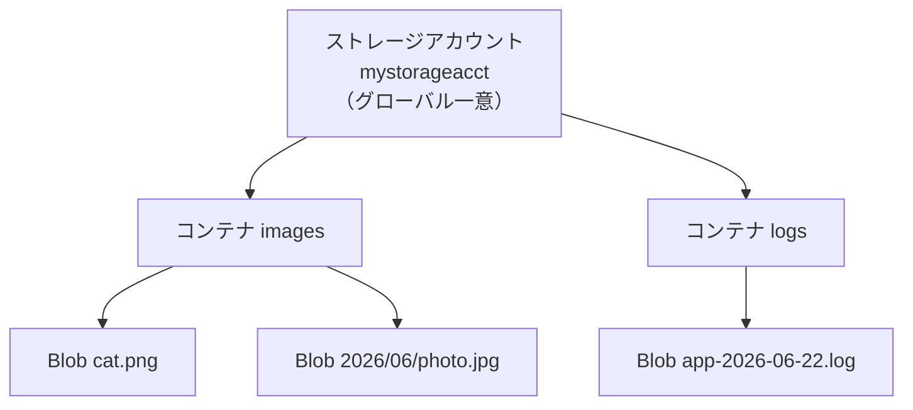
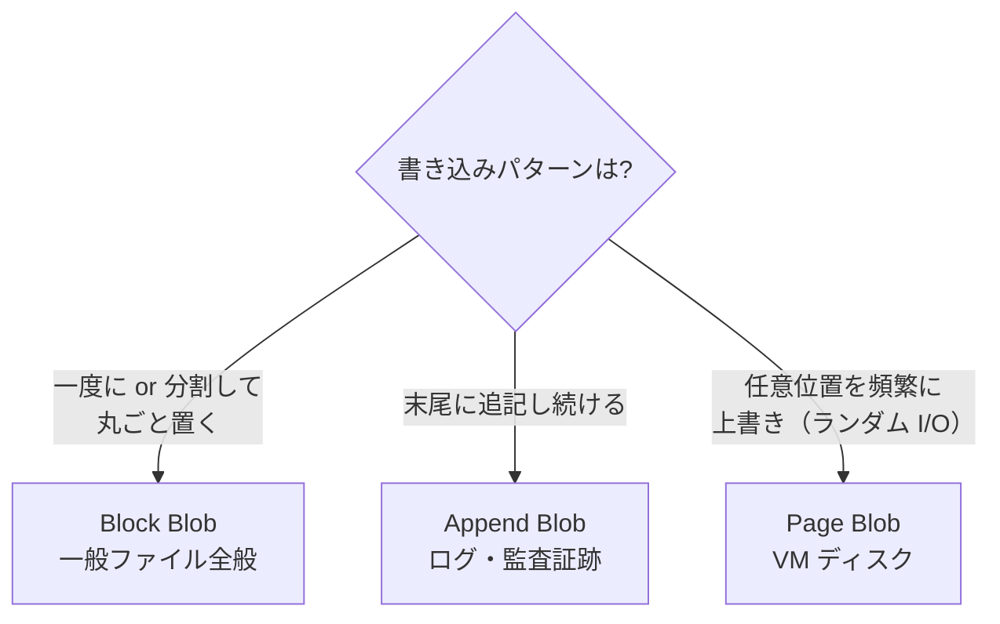
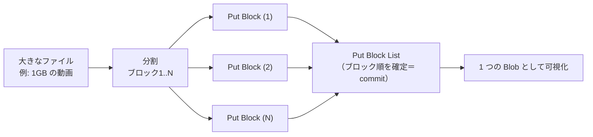
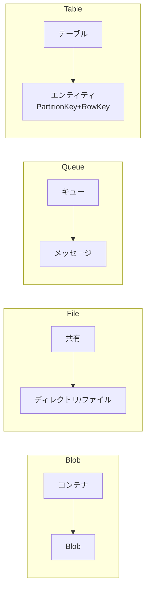

# Week 2 — オブジェクトモデルとエンドポイント

> **Phase 1a** | 学習プラン Week 2 / 10
> 学習目標：アカウント→コンテナ→Blob の階層と URL 構造を説明でき、Block / Append / Page Blob が「なぜ 3 種あるのか」を用途から語れる。Block Blob の分割アップロード→commit の仕組みを理解する

---

## 0. 今週の位置づけ

Week 1 で「Storage が何のためにあるか」を掴んだ。今週はその**中身の構造**＝オブジェクトモデルを学ぶ。APIM で「API / Operation / Product / Subscription」を学んだのと同じ位置づけ。Storage を操作する全ての回（アクセス・認証・冗長性）は、この構造の上に乗る。

---

## 1. 3 階層のオブジェクトモデル

Blob Storage は **アカウント → コンテナ → Blob** の 3 階層。これだけ。シンプルさが Blob の強み。



| 階層 | 役割 | 似ているもの |
|---|---|---|
| **アカウント** | 契約・課金・エンドポイント・既定設定の単位 | 貸し倉庫の契約 |
| **コンテナ** | Blob をまとめる入れ物。アクセス制御の単位にもなる | 倉庫の中の区画 |
| **Blob** | 実体のオブジェクト（ファイル）。本体＋メタデータ＋プロパティ | 区画に置く荷物 |

> **重要な概念の区別：コンテナは「浅い」**
> コンテナの下にサブコンテナは作れない（階層は固定 3 段）。「フォルダ」のように見える `2026/06/photo.jpg` は、実は **`/` を含んだ 1 つの Blob 名**にすぎない。本物のディレクトリではない（＝仮想ディレクトリ）。本物の階層が欲しければ Data Lake Gen2 の階層名前空間を使う（Week 9）。

---

## 2. エンドポイントと URL 構造

すべての Blob は **URL で一意に表せる**。これが Blob の基本。

```text
https://<アカウント名>.blob.core.windows.net/<コンテナ名>/<Blob名>

例：https://mystorageacct.blob.core.windows.net/images/2026/06/photo.jpg
        └ アカウント ┘                      └コンテナ┘└─── Blob 名 ───┘
```

| 部分 | 意味 |
|---|---|
| `mystorageacct` | グローバル一意なアカウント名 |
| `.blob.core.windows.net` | Blob サービスのエンドポイント（サービスごとに `file`/`queue`/`table` と変わる） |
| `images` | コンテナ名 |
| `2026/06/photo.jpg` | Blob 名（`/` 含みで仮想ディレクトリに見える） |

> **ポイント**：URL を見ただけで「どのアカウントの・どのコンテナの・どの Blob か」が分かる。後の SAS（Week 4）は、この URL に「期限付きの通行証」をクエリ文字列として足したもの。

### 命名規則の要点

| 対象 | ルール（要点） |
|---|---|
| アカウント名 | 3〜24 文字・小文字英数字のみ・**グローバル一意** |
| コンテナ名 | 3〜63 文字・小文字英数字とハイフン・先頭は英数字 |
| Blob 名 | 大文字小文字を区別・最大 1024 文字・`/` でフォルダ風に見せられる |

---

## 3. Blob は 3 種類：なぜ分かれているのか

ここが今週の核。Blob には **Block / Append / Page** の 3 タイプがあり、**書き込みのパターンが根本的に違う**から分かれている。「サイズ」ではなく「どう書くか」で選ぶ。



| タイプ | 書き込みモデル | 代表用途 | 本講座での扱い |
|---|---|---|---|
| **Block Blob** | データを**ブロック**に分けて並列アップロード→まとめて確定 | 画像・動画・バックアップ・**ほぼ全ての一般ファイル** | **主役** |
| **Append Blob** | **末尾追記専用**。途中の上書き不可 | ログ・監査・イベント追記 | 概念理解 |
| **Page Blob** | 512 バイト境界の**ページ単位でランダム読み書き** | Azure VM の OS/データディスク | 俯瞰（VM が自動で使う） |

> **ポイント**：迷ったら Block Blob。Append は「ログのように足すだけ」のとき、Page は基本「VM ディスクの下層で勝手に使われる」もので、アプリ開発者が直接作る機会はまれ。**深掘りすべきは Block Blob**。

### Append と Page の違いを正確に：「順次」と「ランダム」

Append と Page はどちらも「1 つのオブジェクトを書き換えていく」が、書き換え方が違う。鍵は **「順次（sequential）」と「ランダム（random）」** という言葉。

| 用語 | 意味 |
|---|---|
| **順次（sequential）I/O** | 先頭から順番に読み書きする（テープのように） |
| **ランダム（random）I/O** | **任意のオフセット（位置）にジャンプして読み書きできる**（「でたらめ」ではなく「任意位置アクセス」の意） |

- **Append Blob＝末尾追記のみ**：既存部分は**変更も部分削除もできない**。ひたすら末尾に足すだけ。だから「過去のログは書き換えず新しい行を足す」ログ・監査にぴったり。

```text
Append Blob（追記専用）
[既存データ...........] ← 触らない（変更不可）
                     ↑ 新データはここに足すだけ → [既存][追記1][追記2]...
```

- **Page Blob＝任意位置をピンポイント上書き**：「全体を書き換える」のではなく、**任意の一部分（512 バイトのページ単位）だけを狙って上書き**できる。中間を直したいとき、その部分だけ更新でき、ファイル全体を読み直して書き戻す必要がない。

```text
Page Blob（ランダム I/O）
[ページ0][ページ1][ページ2][ページ3]...
              ↑ ここ(ページ1)だけ 512 バイト単位で上書き、他は触らない
```

> **なぜ Page Blob が VM ディスクに向くか**
> OS はディスクのあちこち（任意の位置）を**部分的に・頻繁に**書き換える（ファイルの一部更新・メタ情報更新など）。この「全体ではなく任意の一部を高速に上書きする」アクセスパターンが Page Blob のランダム I/O と一致する。だから Azure VM の OS/データディスクの実体は Page Blob（Week 1 の Managed Disks の下層）。
> - **ページ単位**：512 バイトの「ページ」の集まりで、書き込みは 512 バイト境界で行う。
> - **サイズ固定**：作成時に最大サイズを宣言する（ディスク容量を決めるイメージ）。

| タイプ | 既存部分の書き換え | アクセスパターン | 用途 |
|---|---|---|---|
| **Block** | 基本は丸ごと置き換え（分割 commit） | まとめて置く | 一般ファイル |
| **Append** | **不可**（末尾追記のみ） | 順次（末尾に足す） | ログ・監査 |
| **Page** | **可（任意位置をピンポイント）** | ランダム I/O | VM ディスク |

---

## 4. Block Blob の本質：分割アップロード → commit

「大きなファイルをどうやって確実に・速く・再開可能にアップロードするか」を解くのが Block Blob の仕組み。これを理解すると Blob の挙動が腑に落ちる。



仕組み：

1. ファイルを**ブロック**に分割（各ブロックに ID を付ける）
2. 各ブロックを **`Put Block`** でアップロード（**並列実行できる＝速い**）
3. 全ブロックが揃ったら **`Put Block List`** でブロックの順序を指定して**確定（commit）**

ここから導かれる重要な性質：

| 性質 | なぜそうなるか |
|---|---|
| **大容量に対応** | 分割するので 1 リクエストのサイズ上限に縛られない（単一 Block Blob は最大約 190 TiB） |
| **高速** | ブロックを並列アップロードできる |
| **再開可能** | 途中で失敗しても、成功済みブロックは「未コミットブロック」として残り、続きから送れる |
| **commit するまで見えない** | `Put Block List` を呼ぶまで、アップ済みブロックは Blob として現れない（中途半端な状態を見せない＝アトミック） |

> **イメージ**：本を 1 ページずつ（順不同で並行に）届け、最後に「この順で綴じてくれ」と目次（Block List）を渡す。綴じる（commit）までは本として棚に並ばない。
>
> SDK（`upload_blob`）はこの分割・並列・commit を**自動でやってくれる**。仕組みを知っていると、大容量アップロードのチューニングや失敗時の挙動が理解できる。

### ブロックの 2 つの状態と、commit 後の姿

ブロックには 2 つの状態がある。

| 状態 | 意味 |
|---|---|
| **未コミットブロック（uncommitted）** | `Put Block` で上げたが、まだ Block List に含めて確定していない |
| **コミット済みブロック（committed）** | `Put Block List` でリストに含め、Blob の一部として確定した |

`Put Block List` を実行すると、**リストに含めたブロックはコミット済みになり、その Blob の中身を構成する**。利用者から見れば、ここで **1 つの完結した Blob オブジェクト**になる（URL でアクセスでき、`Content-Length` も 1 つの値で返る）。内部的にはコミット済みブロックの並びが Blob を構成しているが、普段は「1 つのオブジェクト」と捉えてよい。

### 未コミットブロックはいつ発生するか

**正常にアップロードが完了すれば未コミットブロックは残らない**。さらに小さいファイルは SDK がブロックを使わず 1 回の `Put Blob` で丸ごと上げるため、ブロック自体が登場しない。未コミットブロックは**アップロードが途中で完結しなかったとき**の副産物。

| 発生タイミング | 何が起きているか |
|---|---|
| アップロードが中断・失敗 | `Put Block` 後、`Put Block List` を呼ぶ前にネットワーク切断・クラッシュ |
| commit を呼ばずに放棄 | ブロックを上げたが commit しなかった |
| 一部だけ commit | 上げたうち一部だけを Block List に含めた。残りは未コミット |

放置された未コミットブロックは**約 1 週間後に自動破棄（ガベージコレクション）**される。これは欠陥ではなく**再開可能アップロードのための一時状態**——中断しても上げ済みブロックは残っているので、再開時は足りない分だけ上げ直して commit すればよい（全部を送り直さなくてよい）。

### `Put Block List` は誰が実行するか

- **クライアント側（アップロードする側）**が発行する操作。サーバ（Storage）が勝手にやるのではなく、こちらから「このリストで確定して」と指示する。→ その意味で「ユーザー側で実行するもの」。
- ただし**通常は SDK が自動で呼ぶ**。`upload_blob` を 1 回呼べば、SDK が「小さければ `Put Blob`／大きければブロック分割→並列 `Put Block`→`Put Block List`」を自動判断・実行する。`Put Block` / `Put Block List` を手書きするのは、独自の再開処理・複数マシン分担など細かい制御が要るときだけ。

### ダウンロードはアップロードのブロックと無関係

**ダウンロードはアップロード時のブロック境界とは無関係**。素朴には 1 回の `GET` で丸ごと取得でき、高速化したい場合は **HTTP の Range リクエスト（バイト範囲指定）**で、クライアント（SDK）が好きなバイト範囲を並列に取りに行く。区切りは DL 側が決めるバイト範囲であり、元のブロックとは一致しない。

| | アップロード | ダウンロード |
|---|---|---|
| 分割の単位 | **ブロック**（Put Block）＋ commit | **バイト範囲**（Range リクエスト） |
| 区切りの決め手 | アップ側が決めたブロック | DL 側（SDK）が決めた範囲 |
| 関係 | — | **独立。元のブロック境界は関係ない** |

---

## 5. Blob の付随情報：プロパティとメタデータ

Blob は本体（バイト列）だけでなく付随情報を持つ。

| 種類 | 例 | 用途 |
|---|---|---|
| **システムプロパティ** | `Content-Type`・`Content-Length`・`ETag`・`Last-Modified` | HTTP 配信や並行制御（ETag は Week 8）に使う |
| **ユーザー定義メタデータ** | `x-ms-meta-uploadedby: yoyo` など任意のキー値 | アプリ独自のタグ付け |

> **ポイント**：`Content-Type` を正しく付けると、ブラウザが Blob を直接表示できる（画像なら表示、`application/octet-stream` ならダウンロード）。静的 Web サイトホスティング（Week 9）でも効いてくる。

---

## 6. 他サービスのオブジェクトモデル（俯瞰）

Blob 以外も「アカウント直下に入れ物、その中に要素」という相似形。**構造だけ**押さえる。

| サービス | 入れ物 | 要素 |
|---|---|---|
| **Blob** | コンテナ | Blob |
| **File** | 共有（share） | ディレクトリ／ファイル（**本物の階層あり**・SMB マウント可） |
| **Queue** | キュー | メッセージ（最大 64KB・可視性タイムアウトで再処理制御） |
| **Table** | テーブル | エンティティ（`PartitionKey` + `RowKey` で一意） |



> **判断軸の再確認**：File は「本物のディレクトリ階層 + SMB/NFS マウント」が要るとき。Queue は「処理を非同期に切り離す」とき。Table は「PartitionKey/RowKey で引ければ十分な安価 NoSQL」のとき。

---

## 7. Week 2 全体の整理

| 用語 | 一言説明 |
|---|---|
| コンテナ | Blob をまとめる入れ物（階層は 3 段固定・サブコンテナ不可） |
| 仮想ディレクトリ | `/` を含む Blob 名がフォルダのように見えるだけ |
| Block Blob | ブロック分割→commit する一般用途の主役 |
| Append Blob | 末尾追記専用（ログ） |
| Page Blob | ページ単位ランダム I/O（VM ディスク） |
| Put Block / Put Block List | ブロックを送る / 順序を確定して commit する |
| ETag | バージョンを表す識別子（並行制御に使う・Week 8） |
| メタデータ | Blob に付ける任意のキー値 |

---

## ハンズオン チェックリスト

- [ ] コンテナ `images` を作り、`2026/06/photo.jpg` という名前で Blob を上げ、Portal 上で「フォルダ」に見えることを確認した
- [ ] その Blob の URL を組み立て、ブラウザ/CLI でアクセスできるか確認した（公開設定 or SAS は Week 4）
- [ ] `az storage blob upload` で `--content-type image/jpeg` を付け、プロパティを確認した
- [ ] `az storage blob metadata update` で任意メタデータを付与し、`metadata show` で読めた
- [ ] 大きめのファイル（数百 MB）を SDK/CLI で上げ、分割アップロードされる様子を体感した

---

## 自己チェック

1. **コンテナの下にサブコンテナは作れるか？「フォルダ」に見えるものの正体は？**
   - キーワード：3 段固定・仮想ディレクトリ・Blob 名の `/`
2. **Block / Append / Page を「書き込みパターン」で説明できるか？**
   - キーワード：分割 commit / 末尾追記 / ランダム I/O
3. **Block Blob が大容量・高速・再開可能なのはなぜか？**
   - キーワード：Put Block 並列・Put Block List で commit・未コミットブロック
4. **commit（Put Block List）前のブロックは Blob として見えるか？**
   - キーワード：見えない・アトミック

---

## 次週の予告（Week 3）

データへのアクセス手段を学ぶ：

- **データプレーン vs 管理プレーン**の分離（操作する API の層が違う）
- REST API・各言語 SDK・AzCopy・Storage Explorer・az CLI
- メタデータ・プロパティ・一覧（ページング）の扱い
- **整合性モデル**（read-after-write は強整合・list は結合整合）
