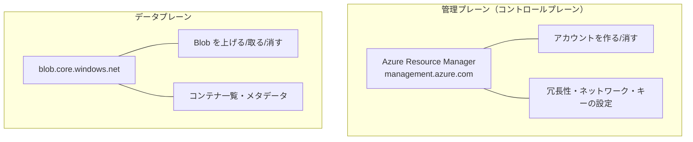
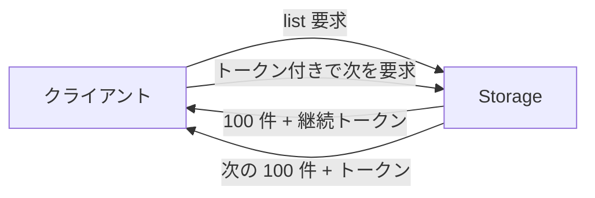
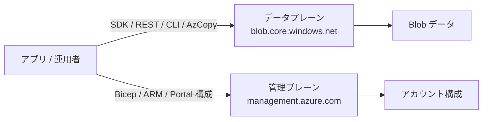

# Week 3 — データへのアクセス：SDK・REST・ツールと整合性

> **Phase 1b** | 学習プラン Week 3 / 10
> 学習目標：データプレーンと管理プレーンの違いを説明でき、Blob に SDK / REST / CLI / ツールでアクセスできる。一覧のページングと Blob の整合性モデルを理解する

---

## 0. 今週の位置づけ

Week 2 で「構造（何があるか）」を学んだ。今週は「どう触るか」。APIM で「Gateway＝データプレーン／Management＝管理プレーン」を学んだのと**同じ二面性**が Storage にもある。この区別は Week 4 の認証（どの操作にどの権限が要るか）に直結する。

---

## 1. データプレーン vs 管理プレーン

Storage への操作は **2 つの面（プレーン）**に分かれる。叩く API も、必要な権限も違う。



| 観点 | 管理プレーン | データプレーン |
|---|---|---|
| 何をする | アカウントそのものの作成・構成 | アカウント**の中のデータ**を読み書き |
| エンドポイント | `management.azure.com`（ARM） | `<acct>.blob.core.windows.net` 等 |
| 叩く道具 | Bicep / ARM / `az resource` / Portal の構成画面 | SDK / REST / AzCopy / `az storage blob` |
| 認証 | Azure RBAC（例：Contributor） | アクセスキー・SAS・**データ向け RBAC**（Week 4） |

> **重要な概念の区別（事故の温床）**
> 「アカウントの管理権限（Contributor）」を持っていても、**Blob のデータを読む権限（Storage Blob Data Reader）は別**。管理ロールではデータが読めないことがある。逆にデータロールだけでは冗長性設定は変えられない。**この 2 層の分離が Week 4 の認可設計の前提**になる。

---

## 2. アクセスする 5 つの道具

同じデータプレーンに、目的別の入口がある。

> **初学者向け用語補足：SDK とは**
> **SDK（Software Development Kit）**＝「あるサービスを自分のプログラムから簡単に使うための**道具一式（ライブラリ）**」。本来 Storage を操作するには REST API（HTTP リクエスト）を自分で組み立てる必要がある——URL を作り、認証署名を計算し、ヘッダを付け、レスポンスを解析し…と手間が多い。SDK はこれらを**自分の言語の関数呼び出し 1 行に包んだ既製の部品**。
>
> ```text
> REST を自分で組む：PUT https://...blob.core.windows.net/uploads/photo.jpg
>                    Authorization: （複雑な署名を自分で計算）/ x-ms-blob-type: BlockBlob ...
> SDK を使う：       container.upload_blob(name="photo.jpg", data=f)   ← これだけ
> ```
>
> **イメージ**：REST ＝「生の材料と調理法」、SDK ＝「チンするだけの冷凍食品」。やることは同じ（Blob を上げる）だが、SDK は面倒な手順（署名・分割アップロード・リトライ・結果のオブジェクト変換）を中で全部やってくれる。Week 2 の「大容量の分割→commit」も SDK が裏で自動処理する典型。
>
> | SDK が肩代わりすること | 例 |
> |---|---|
> | HTTP の組み立て | URL・ヘッダ・メソッドを自動生成 |
> | 認証署名・トークン付与 | キーや Entra ID トークン（Week 4） |
> | 大容量の分割・並列・commit | `Put Block` / `Put Block List`（Week 2） |
> | リトライ | 一時的失敗時に自動再試行 |
>
> **ライブラリとの関係**：ほぼ同義だが、SDK は「ライブラリ＋ツール＋ドキュメントを特定サービス向けにまとめた一式」。Python では `pip install azure-storage-blob` で入る `azure-storage-blob` がそれ。各言語版がある（.NET / Java / JS / Go / Python …）。Week 10 の実装ではこの SDK を使う。

| 道具 | こういう時 |
|---|---|
| **言語 SDK**（Python/.NET/Java/JS 等） | アプリに組み込む。本講座の実装（Week 10）は Python SDK |
| **REST API** | SDK が無い言語・低レベル制御・仕組みの理解 |
| **az CLI**（`az storage blob ...`） | スクリプト・自動化・手元の確認 |
| **AzCopy** | **大量／大容量の高速コピー・同期**（移行に強い） |
| **Storage Explorer**（GUI） | 目で見て操作・デバッグ |

> **ポイント**：「アプリ＝SDK」「移行・一括＝AzCopy」「確認＝CLI / Explorer」。用途で使い分ける。AzCopy は並列・再開・同期に最適化され、TB 級の移行で威力を発揮する。

### Python SDK の最小例（Week 10 で本格化）

```python
from azure.identity import DefaultAzureCredential
from azure.storage.blob import BlobServiceClient

# キーではなく Entra ID 認証（推奨・Week 4）
account_url = "https://mystorageacct.blob.core.windows.net"
service = BlobServiceClient(account_url, credential=DefaultAzureCredential())

container = service.get_container_client("uploads")
# アップロード（SDK が分割・並列・commit を自動処理）
with open("photo.jpg", "rb") as f:
    container.upload_blob(name="photo.jpg", data=f, overwrite=True)

# ダウンロード
data = container.download_blob("photo.jpg").readall()
```

---

## 3. REST の基本：HTTP がそのまま操作になる

Blob は HTTP/REST がネイティブ。動詞と URL がそのまま操作になる。

| 操作 | HTTP |
|---|---|
| アップロード（Block Blob） | `PUT https://acct.blob.core.windows.net/uploads/photo.jpg` |
| ダウンロード | `GET .../uploads/photo.jpg` |
| 存在確認・プロパティ | `HEAD .../uploads/photo.jpg` |
| 削除 | `DELETE .../uploads/photo.jpg` |
| 一覧 | `GET .../uploads?restype=container&comp=list` |

> **ポイント**：SDK も AzCopy も Portal も、最終的にはこの REST を叩いている。SAS（Week 4）は、この URL に署名済みクエリを付けて「認証済みリクエスト」に仕立てる仕掛け。だから REST の形を知っておくと全部が繋がる。

---

## 4. 一覧とページング

「コンテナ内の Blob 一覧」は件数が膨大になりうるので、**1 回で全部は返らない**。サーバは一定件数＋**継続トークン（continuation token）**を返し、クライアントはそれを使って続きを取る。



> **ポイント**：SDK のイテレータ（`for blob in container.list_blobs()`）は裏で継続トークンを自動処理する。自前で REST を叩く・大量データを扱うときは、**トークンが空になるまでループ**することを忘れない。`name_starts_with="2026/06/"` のような**プレフィックス絞り込み**で「仮想ディレクトリ」単位の列挙ができる。

> **初学者向け用語補足：イテレータとは**
> **イテレータ（iterator）**＝**たくさんの要素を「1 個ずつ順番に取り出す」ための仕組み**。`for blob in container.list_blobs():` の `for ... in ...` で、結果から 1 個ずつ順に取り出す役目を担う。
> **イメージ**：行列の案内係。全員を一度に呼ばず「次の人どうぞ」と 1 人ずつ呼び出す。
>
> なぜページングで重要か——イテレータが**継続トークンの処理を裏に隠してくれる**：①最初の 100 件を取得 → ②`for` に 1 個ずつ渡す → ③手持ちが尽きたら継続トークンで次の 100 件を自動取得 → ④トークンが空になるまで繰り返す。だから「100 万個 Blob があっても `for blob in container.list_blobs():` と書くだけ」でページングを意識せずに済む。
>
> | 方式 | 動き | メモリ |
> |---|---|---|
> | 全部を一度にリスト化 | 全件をメモリに読んでから処理 | 大量に消費（あふれる危険） |
> | イテレータで 1 個ずつ | 必要な分だけ取り出し、次へ流す | 少なくて済む |
>
> **遅延評価（lazy）**：イテレータは「呼ばれて初めて次を取りに行く」。`list_blobs()` を呼んだ瞬間に全件取得するのではなく、`for` が手持ちを使い切ったときに初めて次のページを取りに行く。この「必要になるまで取りに行かない」性質が、継続トークンでの逐次取得と相性が良い。

---

## 5. 整合性モデル（深掘り）

「書いた直後に読んだら、ちゃんと最新が返るのか？」— 分散ストレージで最重要の問いだが、教材で抜けがち。Blob はここが**強い**。

| 操作 | 整合性 | 意味 |
|---|---|---|
| **単一 Blob の書き込み後の読み取り** | **強整合（read-after-write / strong）** | アップロード成功の応答を受けた後の読み取りは**必ず最新**が返る |
| **コンテナの一覧（list）** | 結果整合に近い | 作成直後の Blob が一覧に出るまでわずかに遅れる場合がある |

> **重要な概念の区別**
> - **「読み取り」は強整合**：`upload_blob` が成功応答を返したら、その直後の `download_blob` は確実に新しい内容を返す。アプリ設計で「書いたのに古いものが読めた」を心配しなくてよい。
> - **「一覧」はタイミングに注意**：たった今作った Blob が `list_blobs` に**まだ現れない**ことがありうる。「アップロード成功＝直接 GET は確実」だが「一覧に出る＝即時とは限らない」。
> - 地理冗長（RA-GRS）の**セカンダリ読み取り**は、プライマリへの非同期複製の遅延ぶん**古い**ことがある（Week 6）。

> **ポイント**：「直接 Blob 名で GET」と「一覧してから取る」は整合性の強さが違う。アップロード直後に確実に処理したいなら、**一覧に頼らず Blob 名で直接アクセス**する設計にする。

---

## 6. Week 3 全体の整理



| 用語 | 一言説明 |
|---|---|
| データプレーン | アカウント内のデータを読み書きする面 |
| 管理プレーン | アカウントそのものを作成・構成する面 |
| AzCopy | 大量・大容量の高速コピー／同期ツール |
| 継続トークン | 一覧を分割取得するためのしおり |
| 強整合（read-after-write） | 書き込み成功後の読み取りは必ず最新 |
| 結合整合 | 一覧などで反映に遅延がありうる |

---

## ハンズオン チェックリスト

- [ ] `az storage blob upload/list/download` を一通り実行した
- [ ] Python SDK で `upload_blob` / `download_blob` を実行した（`DefaultAzureCredential`）
- [ ] `name_starts_with` でプレフィックス絞り込みの一覧を取得した
- [ ] AzCopy でローカルフォルダをコンテナへ同期（`azcopy sync`）してみた
- [ ] Storage Explorer で同じ Blob を GUI から確認した
- [ ] アップロード直後に同じ Blob 名で GET して最新が返ることを確認した（強整合の体感）

---

## 自己チェック

1. **データプレーンと管理プレーンの違いと、それぞれの認証の違いは？**
   - キーワード：データ読み書き / アカウント構成、データ向け RBAC / Contributor
2. **SDK・AzCopy・CLI・Explorer をどう使い分けるか？**
   - キーワード：アプリ / 移行一括 / 確認自動化 / GUI
3. **一覧が 1 回で全部返らないのはなぜで、どう続きを取るか？**
   - キーワード：継続トークン・ループ
4. **「書いた直後の読み取り」と「一覧への反映」で整合性はどう違うか？**
   - キーワード：強整合 / 反映遅延・直接 GET 推奨

---

## 次週の予告（Week 4）

Storage で**最も重要かつ最も誤りやすい**認証・認可：

- 4 つのアクセス方式：アクセスキー / SAS / Entra ID + RBAC / 匿名公開
- **SAS の 3 種**と「SAS は失効できない」リスク
- なぜ **User Delegation SAS / Managed Identity** が推奨か
- データ向け RBAC ロールは管理ロールと別物
