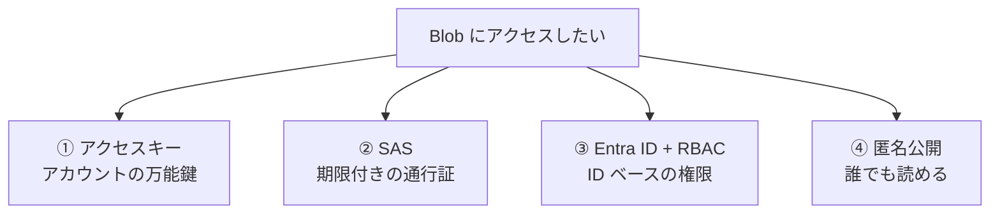
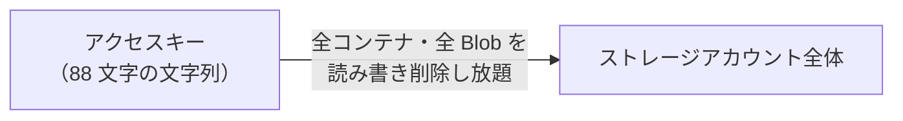
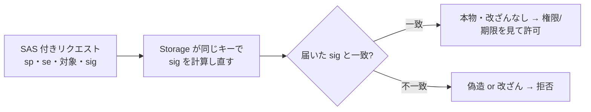
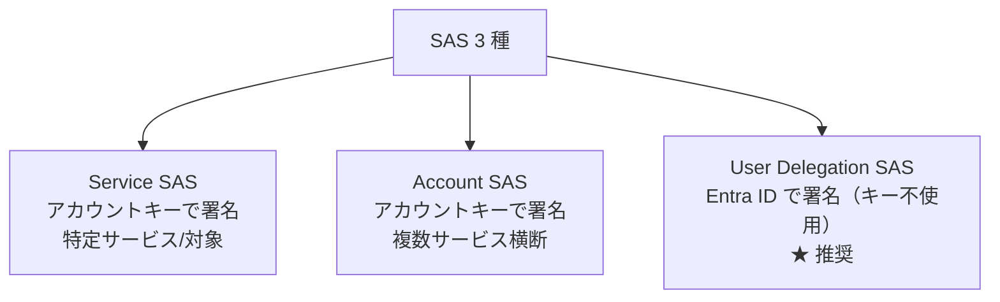
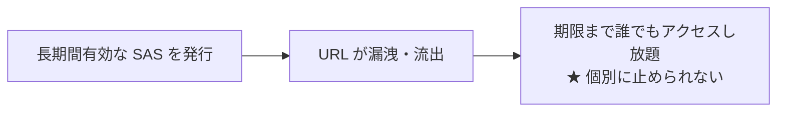
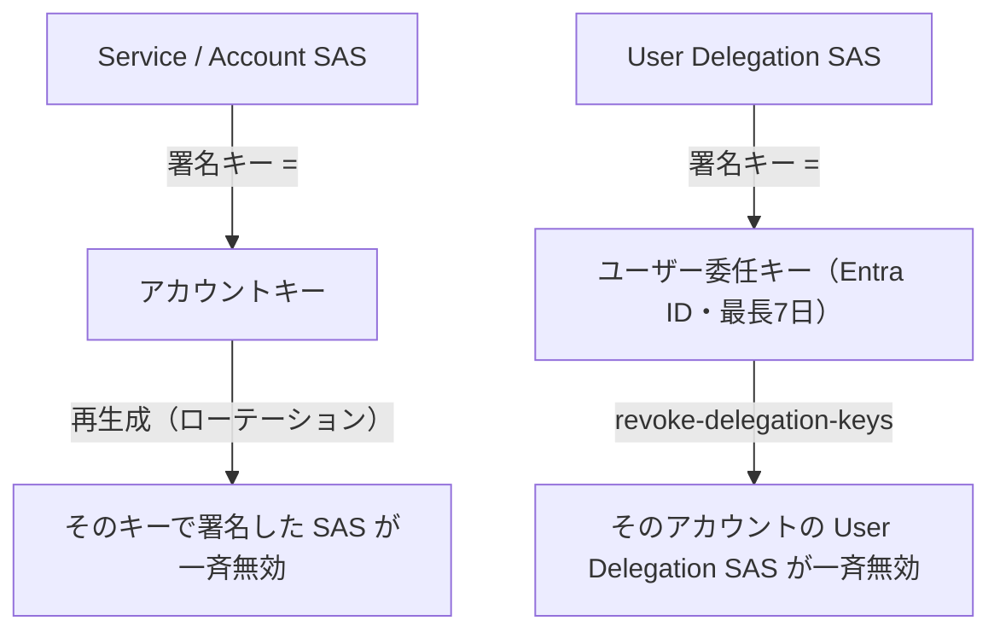
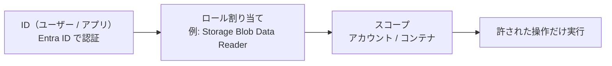
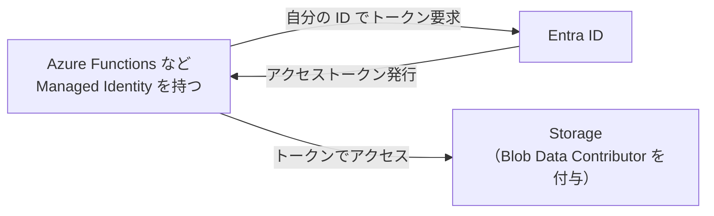
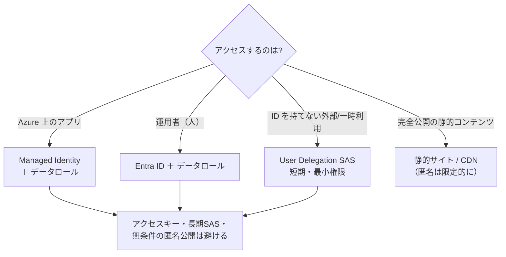

# Week 4 — 認証・認可：Storage で最も重要で最も誤りやすい領域

> **Phase 1b** | 学習プラン Week 4 / 10
> 学習目標：Storage の 4 つのアクセス方式を区別でき、それぞれの長所・リスクを説明できる。SAS の 3 種と「SAS は失効できない」リスク、なぜ Entra ID + Managed Identity が推奨かを理解し、データ向け RBAC ロールが管理ロールと別物であることを説明できる

---

## 0. 今週の位置づけ

Week 3 で「データプレーン（データの読み書き）と管理プレーン（アカウントの構成）は別」と学んだ。今週はその**データプレーンに誰がどうアクセスを許されるか**＝認証・認可を深掘りする。

**Storage の事故の大半はここで起きる**——アクセスキーの漏洩、期限の長すぎる SAS の流出、コンテナの匿名公開し忘れ。だから本講座では認証を独立した最重要週として扱う。

> **初学者向け用語補足：認証と認可**
> - **認証（Authentication）**：「あなたは誰か」を確かめること（本人確認）。
> - **認可（Authorization）**：「あなたに何を許すか」を決めること（権限付与）。
> 例：ビルの入口で身分証を見せる＝認証、その人が入れる部屋が決まっている＝認可。Storage でも「誰か」を確かめ、「その人に許された操作」だけを通す。

---

## 1. 4 つのアクセス方式（全体像）

Storage のデータにアクセスする方法は大きく 4 つ。**どれを使うかが安全性を左右する**。



| 方式 | 一言で | 安全性 | 主な用途 |
|---|---|---|---|
| **① アクセスキー** | アカウント全体を操作できる**万能の共有鍵** | ⚠ 低（漏れたら全権限） | 緊急・限定的な管理操作 |
| **② SAS（Shared Access Signature）** | **期限・権限を絞った通行証**（URL に署名を付与） | △〜○（作り方次第） | 一時的な共有・クライアント直アクセス |
| **③ Entra ID + RBAC** | **ID（人・アプリ）に役割（ロール）で権限**を与える | ◎ 推奨 | アプリ・運用者の通常アクセス |
| **④ 匿名公開** | 認証なしで誰でも読める | ✗ 既定で無効化推奨 | 公開静的コンテンツのみ |

> **結論を先に**：通常は **③ Entra ID + RBAC（＋アプリは Managed Identity）**を第一選択にする。SAS は「ID を渡せない相手に一時的に渡す」とき限定。アクセスキーと匿名公開は原則避ける。以下、なぜそうなるかを 1 つずつ見る。

---

## 2. ① アクセスキー：強力ゆえに危険

ストレージアカウントには **2 つのアクセスキー（key1 / key2）**が自動で付く。これは**アカウント全体を何でも操作できる万能の鍵**。



| 特徴 | 内容 |
|---|---|
| 権限 | **アカウント内のすべて**（全コンテナ・全 Blob・全サービス）を操作可能 |
| 粒度 | 絞れない（「この Blob だけ読める」等ができない・オール・オア・ナッシング） |
| 本人 | **誰が使ったか分からない**（鍵を知っていれば誰でも同じ） |
| 失効 | キーを**ローテーション（再生成）**すると即無効。ただし正規利用も巻き込む |

> ⚠ **なぜ危険か**：キーが 1 つ漏れただけで、攻撃者は**アカウント内の全データを読み・書き・消せる**。しかも「誰が使ったか」の区別がつかない。GitHub にうっかりコミット、設定ファイルに直書き、ログに出力——これらで漏れる事故が後を絶たない。

> **初学者向け用語補足：なぜキーが 2 つ（key1 / key2）あるのか**
> **無停止でキーをローテーション（交換）するため**。①今 key1 を使用中 → ②アプリを key2 に切り替え → ③古い key1 を再生成（無効化）。2 つあることで「使用中の鍵を生かしたまま、もう一方を更新」でき、サービスを止めずに鍵を回せる。

> **ポイント**：キーを使うとしても**コードに直書きしない**。どうしても必要なら **Key Vault に保管**して参照する（Week 5）。だが現代の推奨は「そもそもキーを使わず ③ Entra ID にする」こと。アカウント設定で**キー認証自体を無効化**することもできる。

---

## 3. ② SAS：期限付きの通行証

**SAS（Shared Access Signature／共有アクセス署名）**は、「**この範囲・この権限・この期限でだけアクセスを許す**」通行証を、URL のクエリ文字列として発行する仕組み。アクセスキーの「オール・オア・ナッシング」を細かく絞れる。

```text
https://acct.blob.core.windows.net/uploads/photo.jpg
   ?sv=2023-11-03&sp=r&se=2026-06-23T10:00:00Z&sig=xxxx
    └ バージョン  └権限(r=読) └有効期限      └署名
```

| 絞れる項目 | 例 |
|---|---|
| **権限** | 読み (r) / 書き (w) / 削除 (d) / 一覧 (l) など |
| **期限** | 開始〜終了の日時 |
| **対象範囲** | アカウント全体／特定コンテナ／特定 Blob |
| **送信元 IP・プロトコル** | 特定 IP のみ・HTTPS のみ |

### そもそも「署名（sig）」と「署名するキー」とは

SAS の末尾にある `sig=...` が**署名**。これを理解すると「なぜ偽造できないか」「なぜステートレスか」「なぜキーで失効方法が変わるか」が一気につながる。

**署名（signature）の目的は 2 つ**：①**真正性**（正しい鍵を持つ人が作ったと証明）②**完全性**（中身が 1 文字でも変わったら検知）。

> **イメージ**：封筒に押す**ロウ印（封蝋）**。①その印鑑を持つ人しか押せない（真正性）、②封を開けたら印が壊れて分かる（改ざん検知）。SAS の `sig` がこのロウ印。

**「署名するキー」とは、`sig` を作る／照合するための秘密の文字列（共有秘密）**。Storage の SAS は「共通鍵（対称鍵）方式」で、署名する側と検証する側（Storage）が**同じ秘密のキー**を持つ。署名は、SAS のパラメータ（権限・期限・対象…）を文字列に並べ、キーで **HMAC** 計算して作る。

```text
StringToSign = "r"（権限） + "2026-06-23T10Z"（期限） + "/uploads/photo"（対象） + ...
   ↓ この文字列を「キー」で HMAC 計算
sig = HMAC( キー, StringToSign )   ← 例: "x9Kf3...=="
```

> **初学者向け用語補足：ハッシュ と HMAC**
> - **ハッシュ**：任意の文字列を固定長の「指紋」に変える一方向計算。入力が少し変わると指紋が全く変わり、指紋から元へは戻せない。
> - **HMAC（Hash-based Message Authentication Code）**：ハッシュに**秘密のキーを混ぜた**もの。「キーを知る人だけが作れる指紋」。SAS の `sig` はこれ。同じキー＋同じ入力なら必ず同じ `sig` になり、キーを知らないと正しい `sig` を作れない。

**Storage はどう検証するか**（＝ステートレス・改ざん検知の正体）：



- **ステートレス**：Storage は「発行記録」を持たない。届いたものをその場で計算照合するだけで本物か分かる。
- **改ざん不可**：攻撃者が期限 `se` を勝手に延ばすと StringToSign が変わり `sig` が合わなくなる。作り直すにはキーが要るが秘密なので作れない → 改ざんは即バレる。
- **だから「どのキーで署名したか」が失効方法を決める**（後述）。

### SAS は 3 種類ある



| 種類 | 署名に使うもの | 特徴 | 推奨度 |
|---|---|---|---|
| **Service SAS** | **アカウントキー** | 特定サービス（Blob 等）内の対象に限定 | △ |
| **Account SAS** | **アカウントキー** | 複数サービスを横断、最も広い | △（広すぎ注意） |
| **User Delegation SAS** | **Entra ID の資格情報**（キー不使用） | ID ベースで署名・監査が効く | **◎ 推奨** |

> **なぜ User Delegation SAS が推奨か**
> Service / Account SAS は**アカウントキーで署名**するため、「キーに依存し続ける」「キーをローテーションすると発行済み SAS も全部無効になる」問題がある。**User Delegation SAS は Entra ID 由来の「ユーザー委任キー」で署名**するのでアカウントキーを使わず、誰が発行したか監査でき、最長 7 日で自然失効するため、より安全。SAS を使うなら User Delegation SAS を選ぶ。

### Service SAS と Account SAS を URL で見分ける

両者とも**アカウントキーで署名**するが、カバー範囲が違う（Service＝1 サービス内の特定対象、Account＝複数サービス横断＋アカウントレベル）。**決め手は `ss`/`srt`（Account だけ）と `sr`（Service）**。

```text
【Account SAS】ss と srt を持つ
 ?sv=2023-11-03&ss=bfqt&srt=sco&sp=rwdlac&se=...&sig=...
            ↑ signed services    ↑ signed resource types
              (b=Blob f=File q=Queue t=Table)  (s=service c=container o=object)

【Service SAS】sr を持ち、ss/srt は無い（si を持てる）
 ?sv=2023-11-03&sr=b&sp=r&se=...&si=mypolicy&sig=...
            ↑ signed resource(b=blob c=container)  ↑(任意)Stored Access Policy 名
```

| URL に含まれるパラメータ | SAS の種類 |
|---|---|
| **`ss=` と `srt=`** がある | **Account SAS** |
| **`sr=`** があり `ss`/`srt` が無い | **Service SAS** |
| `si=`（Stored Access Policy 参照）がある | **Service SAS**（Account は紐づけ不可） |
| **`skoid=` `sktid=` `skt=` `ske=` `skv=`** がある | **User Delegation SAS** |

> **覚え方**：`ss`＝"Several Services" → 横断的な **Account SAS**。`sr`＝"Single Resource" → 限定的な **Service SAS**。まず **`ss` があるか**を見るのが一番速い。`sk*`（signed key 系）が並んでいれば **User Delegation SAS**。

### ⚠ SAS 最大の落とし穴：「発行後は失効できない」

これが Storage で最も誤りやすい点。**一度発行した SAS（Service/Account SAS）は、期限が来るまで個別に取り消せない**。



- SAS の URL が漏れても、**その 1 枚だけを無効化する手段がない**
- 唯一の強制失効手段は「**署名に使ったアカウントキーをローテーションする**」こと。だが、それをすると**同じキーで署名した他の SAS も全部一斉に無効**になり、正規利用も巻き込む

> ⚠ **だから守るべき原則**：
> 1. **有効期限は短く**（数分〜数時間。「念のため 1 年」は厳禁）
> 2. **権限は最小に**（読みだけでよければ書きを付けない）
> 3. **HTTPS 限定・可能なら IP 限定**
> 4. 取り消せる仕組みが要るなら、**Stored Access Policy**（コンテナにポリシーを置き、後から失効・変更できる）を使う
> 5. そもそも **User Delegation SAS**（Entra ID 署名）を使い、キー依存を断つ

> **初学者向け用語補足：Stored Access Policy**
> コンテナ側に「権限・期限のテンプレート（名前付きポリシー）」を保存し、SAS をそれに**紐づけて**発行する仕組み。後からポリシー側を書き換えれば、紐づく SAS をまとめて**失効・期限変更できる**。「発行した SAS を後から取り消したい」ニーズに応える唯一の標準手段（Service SAS のみ。Account SAS は紐づけ不可）。

### SAS の種類別・強制失効の方法（正確に）

「どのキーで署名したか」で失効方法が決まる。ここは誤解しやすいので正確に整理する。



| SAS の種類 | 署名キー | 確実な強制失効 | 最大有効期間 |
|---|---|---|---|
| **Service SAS** | アカウントキー | キーのローテーション／**Stored Access Policy** で個別失効 | 無制限（危険） |
| **Account SAS** | アカウントキー | キーのローテーション（Stored Access Policy 不可） | 無制限（危険） |
| **User Delegation SAS** | ユーザー委任キー | **`revoke-delegation-keys`**（委任キー失効） | **最長 7 日**（安全） |

> ⚠ **誤解しやすい点：User Delegation SAS は「RBAC を外しても失効しない」**
> User Delegation SAS の検証は、**リクエストごとに署名 ID の"現在の RBAC"を引き直してはいない**。Storage が見るのは「ユーザー委任キーで `sig` が照合できるか・委任キーがまだ有効か・トークン内の権限」だけ（前述のステートレス検証）。RBAC がチェックされるのは**委任キーを払い出す瞬間だけ**。
> - したがって、署名 ID の **RBAC ロールを外しても、すでに発行済みの User Delegation SAS は失効しない**。RBAC 剥奪で効くのは「**今後その ID が新しい委任キー／SAS を作れなくなる**」ことだけ。
> - 既存の User Delegation SAS を確実に止めるには **`az storage account revoke-delegation-keys`**（委任キーを失効）を使う。これでそのアカウントの全 User Delegation SAS が一斉無効になる。
> - 救いは、User Delegation SAS は**最長 7 日で必ず自然失効**すること（アカウントキー署名の SAS は何年でも有効にできてしまうのと対照的）。漏洩しても被害が構造的に長期化しない。
>
> **補足**：RBAC の割り当て変更は反映に数分かかることがあるが、それは「委任キーを払い出せるか」の話であって、**既存 SAS の有効性とは別問題**。混同しない。

---

## 4. ③ Entra ID + RBAC：推奨される本命

**Entra ID（旧 Azure AD）**で「誰（人・アプリ）か」を認証し、**RBAC（Role-Based Access Control／ロールベースアクセス制御）**で「何を許すか」をロールとして与える。**鍵も通行証も配らない**のが本質的な安全性。



| 特徴 | 内容 |
|---|---|
| 認証 | Entra ID（人もアプリも ID を持つ） |
| 認可 | ロールを ID に割り当て。**最小権限**で渡せる |
| 監査 | **誰が何をしたか記録できる**（キー/SAS では困難） |
| 鍵の配布 | **不要**（漏れる鍵がそもそもない） |
| 失効 | ロール割り当てを外せば即時に権限を失う |

### データ向けロールは管理ロールと「別物」（最重要の落とし穴）

Week 3 の「データプレーン vs 管理プレーン」がここで効く。**Blob のデータを読むには、管理ロール（Contributor 等）ではなく、データ向けロールが要る**。

| ロール | 種類 | できること |
|---|---|---|
| **Owner / Contributor** | 管理（コントロール）プレーン | アカウントの作成・構成・キー取得。**だが Blob データの読み書きは（既定では）できない** |
| **Storage Blob Data Reader** | データプレーン | Blob の**読み取り・一覧** |
| **Storage Blob Data Contributor** | データプレーン | Blob の**読み書き・削除** |
| **Storage Blob Data Owner** | データプレーン | 上記＋ POSIX ACL 等の管理（Data Lake） |

> ⚠ **混同しやすいポイント**：「私はサブスクリプションの Contributor だから Blob も読めるはず」→ **読めないことがある**。Contributor は"アカウントを管理する"権限であって、"中のデータを読む"権限ではない。データを触るには **`Storage Blob Data *`** ロールを別途割り当てる。
> （ただし Contributor はキーを取得できてしまうため、キー経由でデータに到達できる——これも「キー認証を無効化すべき」理由の一つ。）

> **初学者向け用語補足：スコープ**
> ロールを割り当てる**範囲**。サブスクリプション／リソースグループ／ストレージアカウント／**個別コンテナ**まで段階的に絞れる。「このアプリには uploads コンテナだけ Data Contributor」のように**最小権限**で渡すのが定石。

---

## 5. アプリからのアクセス：Managed Identity

アプリ（Functions・VM・App Service 等）が Storage にアクセスするとき、**キーや接続文字列を持たせない**のが現代の正解。それを実現するのが **Managed Identity（マネージド ID）**。



- **Managed Identity** ＝ Azure が**アプリに自動で発行・管理してくれる ID**。パスワードもキーも開発者が扱わない（Azure が裏でトークンを回す）。
- そのアプリの ID に **`Storage Blob Data Contributor` などのデータロール**を割り当てれば、アプリはキーなしで Blob を操作できる。
- コードは **`DefaultAzureCredential`**（Week 3 で登場）を使うだけ。ローカル開発では開発者の Entra ID、本番では Managed Identity、と**同じコードで自動的に切り替わる**。

```python
from azure.identity import DefaultAzureCredential
from azure.storage.blob import BlobServiceClient

# キーも接続文字列も書かない。ID ベースで認証
service = BlobServiceClient(
    "https://mystorageacct.blob.core.windows.net",
    credential=DefaultAzureCredential(),
)
```

> **ポイント**：これが Week 10 実装で採る方式。「アプリにキーを持たせない → 漏れる鍵がない」が最も堅い。**Managed Identity ＋ データロール ＋ `DefaultAzureCredential`** の 3 点セットを覚える。

---

## 6. ④ 匿名公開：原則無効化

コンテナを「匿名アクセス可」にすると、**認証なしで誰でも Blob を読める**。便利だが事故の温床。

| レベル | 意味 |
|---|---|
| **無効（private）** | 認証必須（**既定・推奨**） |
| Blob 単位の匿名読み取り | その Blob だけ匿名で読める |
| コンテナ単位の匿名読み取り | コンテナ内を匿名で一覧・読み取り |

> ⚠ **落とし穴**：「社内ツール用に一時的に公開」→ 公開のまま放置 → 機密ファイルが**インターネット全体に露出**。匿名公開コンテナはクローラに拾われ検索に出ることもある。
> 近年は**アカウント設定で匿名アクセス自体をブロック**できる（`allowBlobPublicAccess = false`）。**静的 Web サイト公開などの明確な用途以外は無効**にしておく。公開配信が要るなら CDN/Front Door + SAS や静的サイト機能（Week 9）を使う。

---

## 7. 意思決定フロー：結局どれを使うか



| 相手 | 推奨方式 |
|---|---|
| Azure 上のアプリ | **Managed Identity + データロール** |
| 運用者・開発者（人） | **Entra ID + データロール**（`az login` / `DefaultAzureCredential`） |
| ID を渡せない外部・一時的なクライアント直アクセス | **User Delegation SAS**（短期・最小権限） |
| 公開静的コンテンツ | 静的サイト / CDN（匿名は用途限定で） |

---

## 8. Week 4 全体の整理

| 用語 | 一言説明 |
|---|---|
| 認証 / 認可 | 誰か確認する / 何を許すか決める |
| アクセスキー | アカウント全権の万能鍵（漏洩＝全滅・原則避ける） |
| SAS | 期限・権限を絞った通行証。**発行後は個別失効できない**（短期・最小に） |
| SAS 3 種 | Service / Account（キー署名）／**User Delegation（Entra ID 署名・推奨）** |
| Stored Access Policy | 後から SAS をまとめて失効・変更できる仕組み |
| RBAC | ID にロールで権限を与える方式（推奨） |
| データ向けロール | `Storage Blob Data Reader/Contributor/Owner`。**管理ロールと別物** |
| Managed Identity | アプリにキーなしで ID を与える仕組み |
| 匿名公開 | 認証なしで読める。原則無効化 |

---

## ハンズオン チェックリスト

- [ ] 自分のアカウントに `Storage Blob Data Reader` ロールを割り当て、`az login` + `--auth-mode login` で Blob を読めることを確認した
- [ ] 逆に、データロールを外すとアクセスできなくなることを確認した（管理権限だけでは読めない体感）
- [ ] `az storage blob generate-sas` で**5 分だけ有効・読みのみ**の SAS URL を発行し、ブラウザでアクセスできることを確認した
- [ ] その SAS の期限が切れた後はアクセスできなくなることを確認した
- [ ] User Delegation SAS（`--auth-mode login --as-user`）を発行してみた
- [ ] アカウントの「キー認証を無効化」「匿名アクセスをブロック」設定の場所を確認した
- [ ] キーのローテーション（再生成）画面を確認した（key1/key2 の意味を理解）

---

## 自己チェック

1. **4 つのアクセス方式を、安全性の順に説明できるか？**
   - キーワード：RBAC/Managed Identity ＞ User Delegation SAS ＞ キー署名 SAS ＞ キー・匿名
2. **「SAS は失効できない」とはどういう意味で、どう対処するか？**
   - キーワード：個別取り消し不可・短期化・Stored Access Policy・User Delegation
3. **Contributor を持っているのに Blob が読めないのはなぜか？**
   - キーワード：管理ロール ≠ データロール・`Storage Blob Data *`
4. **アプリに Storage アクセスさせるとき、なぜキーを持たせないのか？どうするか？**
   - キーワード：漏れる鍵をなくす・Managed Identity・DefaultAzureCredential
5. **匿名公開の何が危険で、どう防ぐか？**
   - キーワード：放置で露出・`allowBlobPublicAccess=false`

---

## 次週の予告（Week 5）

「誰がアクセスできるか（認証）」の次は「**守りのセキュリティ**」：

- 保存時暗号化（SSE）・カスタマーマネージドキー（CMK）・暗号化スコープ
- ネットワーク制限：ファイアウォール・Private Endpoint・サービスエンドポイント
- HTTPS 強制・最小 TLS・公開アクセス無効
- **多層防御**（認証で"誰"を、ネットワークで"どこから"を絞る）
