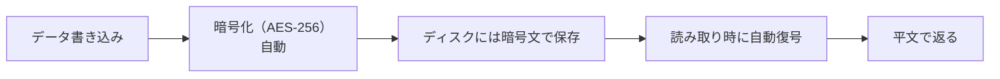
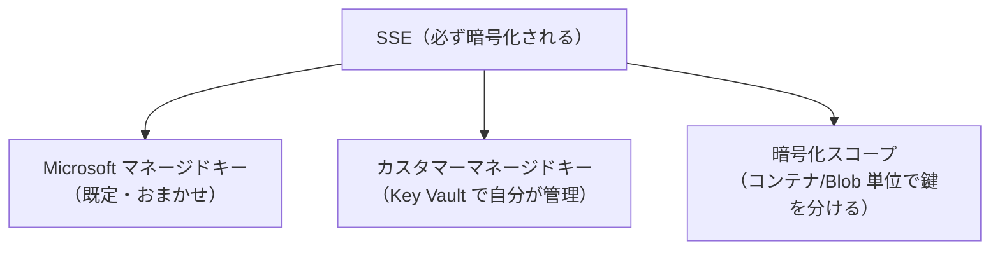
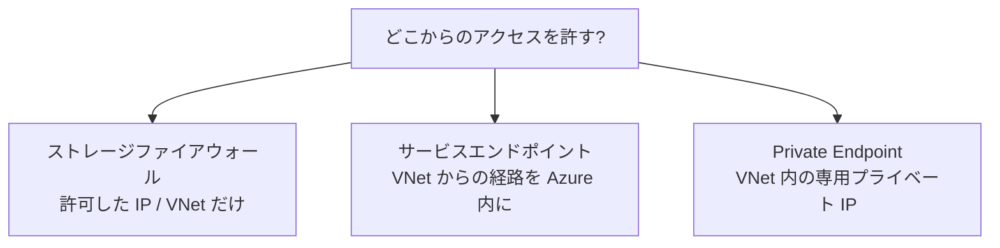
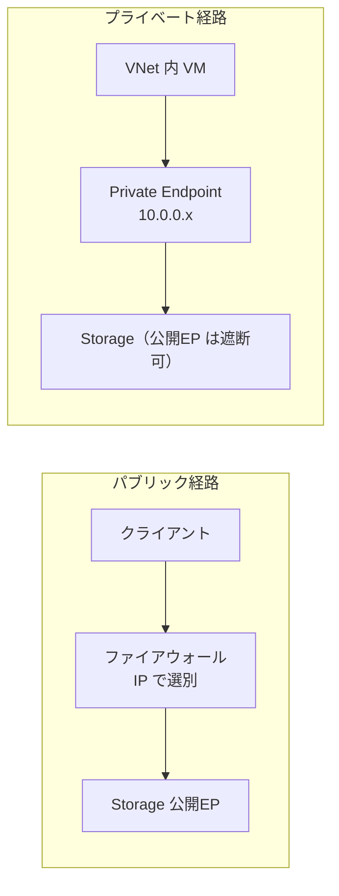
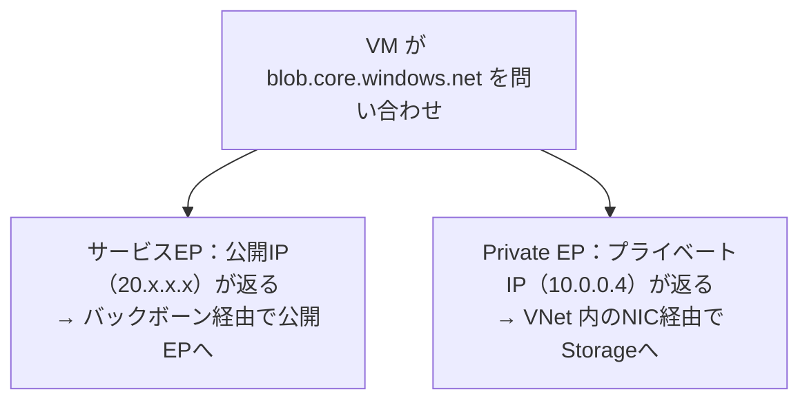
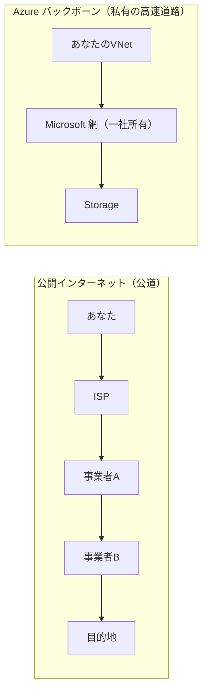
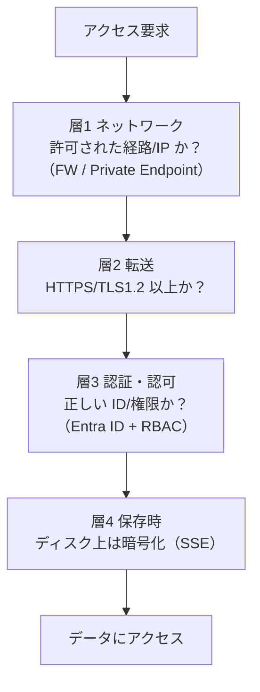

# Week 5 — 守りのセキュリティ：暗号化とネットワーク

> **Phase 1b** | 学習プラン Week 5 / 10
> 学習目標：保存時暗号化（SSE）とその鍵管理（MMK / CMK / 暗号化スコープ）を説明でき、ネットワーク制限（ファイアウォール・サービスエンドポイント・Private Endpoint）の違いを使い分けられる。「認証（誰）」と「ネットワーク（どこから）」を組み合わせた多層防御を設計できる

---

## 0. 今週の位置づけ

Week 4 は「**誰が**アクセスできるか（認証・認可）」だった。今週は守りをもう一段足す。

- **暗号化**：万一データが盗まれても**中身を読めなくする**
- **ネットワーク**：そもそも**どこからアクセスできるか**を絞る
- **転送の保護**：通信経路を暗号化し盗聴を防ぐ

これらは認証の代わりではなく、**重ねる（多層防御）**もの。「認証で誰を、ネットワークでどこからを、暗号化で万一の漏洩を」——役割が違う守りを層にする。

> **初学者向け用語補足：多層防御（defense in depth）**
> 1 つの対策に頼らず、複数の独立した防御を重ねる考え方。1 枚の壁が破られても次の壁で止める。城の堀・石垣・門・天守のように、層ごとに別の攻撃を防ぐ。

---

## 1. 保存時暗号化（SSE）：既定で全部暗号化

**SSE（Storage Service Encryption／保存時暗号化）**により、Storage に書かれたデータは**ディスクに記録される時点で自動的に暗号化**される。**既定で有効・無効化できない・追加料金なし**。



| 特徴 | 内容 |
|---|---|
| 対象 | すべての Blob/File/Queue/Table（既定・常時 ON） |
| 方式 | **AES-256**（強力な共通鍵暗号） |
| 透過性 | アプリは意識しない（書く時に暗号化、読む時に復号が自動） |
| 料金 | 無料 |

> **初学者向け用語補足：保存時 と 転送時**
> - **保存時暗号化（at rest）**：ディスクに**保存されている間**の暗号化。盗まれたディスクから読まれるのを防ぐ。＝ SSE。
> - **転送時暗号化（in transit）**：ネットワークを**流れている間**の暗号化。盗聴を防ぐ。＝ HTTPS/TLS（§4）。
> この 2 つは別物で、両方必要。「金庫にしまう（保存時）」と「現金輸送車で運ぶ（転送時）」の違い。

> **ポイント**：SSE は「**自分では何もしなくても暗号化されている**」。試験や設計で問われるのは SSE の有無ではなく、次の「**暗号鍵を誰が管理するか**」。

### 補足：暗号化とは何をしているのか

**暗号化（encryption）＝データを、鍵がないと読めない別の形に変換すること**。元の読めるデータ（**平文**）を規則に従って攪拌（かくはん＝かき混ぜて元のパターンを消すこと）して**暗号文**にし、正しい鍵を持つ人だけが元に戻せる（**復号**）。

```text
平文 "hello" ─[暗号化]→ 暗号文 "X9#kP2@vL..." ─[復号]→ "hello"
                              ↑ 同じ鍵がないと戻せない
```

> **イメージ**：南京錠のかかった箱。暗号化＝中身を箱に入れ鍵をかける、復号＝正しい鍵で開ける。鍵を持たない人には中身は意味不明な塊。

攪拌の中身は、ざっくり 2 つの操作を鍵に応じて何ラウンドも繰り返している。

| 操作 | やっていること |
|---|---|
| **置換（substitution）** | ある値を別の値に置き換える（A→Q…） |
| **転置（permutation）** | 並び順を入れ替える（シャッフル） |

Storage の SSE はこれを**透過的に**自動実行する：書き込む瞬間に暗号化してディスクに記録（ディスク上は暗号文）、読み出す瞬間に復号して平文を返す。アプリは平文を渡し平文を受け取るだけ。だから物理メディアが盗まれても鍵がなければ読めない。

### 補足：鍵とアルゴリズムの関係（ここが暗号の核心）

**大前提：AES のアルゴリズム（どう置換・転置するか）は世界中に公開されている。秘密なのは鍵だけ。**

> **重要な原則（ケルクホフスの原理）**：暗号の安全性は「アルゴリズムの秘密」ではなく「**鍵の秘密**」だけに依存すべき。仕組みがバレても鍵さえ秘密なら安全、という設計思想。だから鍵は**この暗号で唯一の秘密**。

**鍵は「置換・転置を"どうやるか"を決める設定値（パラメータ）」**。動作の枠組み（公開）は決まっているが、具体的にどう攪拌するかは鍵が決める。一番簡単なシーザー暗号で見ると分かる：

```text
アルゴリズム（公開）：「各文字を N 文字ずらす」
鍵（秘密）：N = 3
暗号化： "CAT" → "FDW"（3つずらす）   復号： 3つ戻す → "CAT"
```

- 「ずらす」動作は誰でも知っている。だが「**何文字ずらすか（N=3）＝鍵**」を知らないと戻せない。
- 鍵を変えれば（N=5）まったく違う暗号文になる。**動作の枠組みは固定、そのパラメータを鍵が決める**——これが「鍵と動作の関わり」。
- AES-256 はこの超強力版で、256 ビットの鍵が各ラウンド（14 回）の置換・転置・混合を細かく制御する。鍵がないと「各ラウンドで何をどうしたか」が分からず逆順に戻せない。

### 補足：鍵は 0/1 の並び（3 ビットの鍵を例に）

**ビット（bit）＝0 か 1 が 1 個**。「3 ビットの鍵」とは 0/1 が 3 個並んだもの。並びは 2³＝8 通り。

| 3 ビットの鍵（2進） | `000` | `001` | `010` | `011` | `100` | `101` | `110` | `111` |
|---|---|---|---|---|---|---|---|---|
| 10進 | 0 | 1 | 2 | 3 | 4 | 5 | 6 | 7 |

候補が 8 個しかないので総当たり一瞬で破れる。実際の AES-256 の鍵は **256 個の 0/1**で、そのまま書くと長いので **16 進数**（4 ビット＝1 文字 → 256÷4＝64 文字、例 `3a7f9c…`）や Base64 で短く表示する。Week 4 のアクセスキーが長い文字列なのもこのため。

### 補足：鍵 `101` は実際どう動くか（XOR の例）

鍵が動作にどう関わるかを、暗号の最も基本的な操作 **XOR（排他的論理和）** で見る。XOR は **2 ビットが違えば 1・同じなら 0**。重要な性質は「**1 と XOR＝反転、0 と XOR＝そのまま**」。

```text
0 XOR 1 = 1（反転）   1 XOR 1 = 0（反転）   ← 鍵ビットが1なら反転
0 XOR 0 = 0（そのまま） 1 XOR 0 = 1（そのまま） ← 鍵ビットが0なら変えない
```

だから鍵 `101` は「**1桁目=反転・2桁目=そのまま・3桁目=反転**」という操作の指示を表す。平文 `110` を暗号化：

```text
平文：  1 1 0
鍵：    1 0 1   （反転・そのまま・反転）
       ───────  XOR
暗号文：0 1 1     （1⊕1=0, 1⊕0=1, 0⊕1=1）
```

復号は**同じ鍵でもう一度 XOR**すれば戻る（`0⊕1=1, 1⊕0=1, 1⊕1=0` → `110`）。鍵 `101` を知らなければどこを反転すれば戻るか分からない。鍵が `011` なら反転する場所が変わり暗号文も変わる＝**鍵＝動作を決めるパラメータ**。AES でも鍵を混ぜる工程（AddRoundKey）はこの XOR。

### 補足：ブロックとラウンド（「何ラウンドも重ねる」の意味）

「256 ビット」は**鍵の長さ**であって、データを区切る単位ではない。混同しやすいので整理する。

| もの | サイズ | 役割 |
|---|---|---|
| **データブロック** | **128 ビット**（固定） | 平文をこの単位に区切って処理 |
| **鍵** | 256 ビット（AES-256） | 秘密の材料。データ単位とは無関係 |

- 平文は**先頭から 128 ビットずつのブロック**に区切り、各ブロックを暗号化する（256 ではなく 128）。
- **「ラウンドを重ねる」＝同じ 1 ブロックに攪拌手順を 14 回繰り返す**こと（区切り直しではない）。パン生地を何度もこねるイメージ。AES-256 は 14 ラウンド。
- **ラウンド数（14）も手順（置換→転置→混合→XOR）も AES 規格で固定・公開**。鍵には入っていない。鍵は「各ラウンドで XOR する値（ラウンド鍵）」の材料に展開される。

```text
256ビットの鍵 → 鍵スケジュールで展開 → ラウンド鍵0..14（各128bit）
ブロック（128bit）→ ラウンド1 → ラウンド2 → … → ラウンド14 → 暗号文ブロック
                    各ラウンドでそのラウンド専用の鍵を XOR
```

| 要素 | 誰が決める |
|---|---|
| ラウンド数（14）・各手順 | **AES 規格（公開・固定）**。鍵に依存しない |
| 各ラウンドで XOR する値（ラウンド鍵） | **鍵から展開**（秘密） |

> **要点**：データは 128 ビットごとに区切る。各ブロックを規格で固定の 14 ラウンド繰り返し攪拌する。鍵はラウンドごとの XOR 値に展開される秘密の材料で、ラウンド数や手順そのものは鍵ではなく公開規格が決めている。

### 補足：AES-256 とは／なぜ鍵の長さが要るか

**AES（Advanced Encryption Standard）**＝世界標準の**共通鍵暗号アルゴリズム**（銀行・政府で使われる事実上の標準）。**「-256」は鍵の長さ（ビット数）**。

鍵が唯一の秘密なら、攻撃者の最後の手段は**鍵を片っ端から全部試す（総当たり）**。**鍵の長さ＝攻撃者が探す"秘密の候補の広さ"**。

| 鍵の長さ | 鍵の候補数 | 総当たり |
|---|---|---|
| 8 ビット | 256 通り | 一瞬で全部試せる → すぐ破れる |
| 128 ビット | 2の128乗 通り | 事実上不可能 |
| **256 ビット** | **2の256乗 通り**（宇宙の原子数より多い） | **絶対に試し尽くせない** |

シーザー暗号が弱いのは鍵（N）が 25 通りしかないから（全部試せば当たる）。AES-256 は候補が天文学的で、世界中のコンピュータでも総当たりできない。**鍵が長いほど候補が指数的に増え、破るのが非現実的になる**＝「鍵の長さ＝強度」。

| 種類 | 鍵 | 例 | 用途 |
|---|---|---|---|
| **共通鍵（対称）** | 暗号化と復号で**同じ鍵** | **AES** | 大量データの暗号化（速い）。SSE はこれ |
| **公開鍵（非対称）** | 暗号化と復号で**別の鍵** | RSA | 鍵の受け渡し・署名 |

> **§2 への接続**：暗号文をいくら盗んでも、**この秘密の鍵さえ守られていれば中身は読めない**。だから「鍵を握る＝データを支配する」。次節の「鍵を誰が管理するか（MMK/CMK）」が重要なのはこのため——CMK で自分が鍵を消せば、Storage 側のデータも実質読めなくできる。

---

## 補足（詳しく知りたい人向け）：AES の内部をもう一段深く

> **この節は飛ばしても Storage の運用には支障ない。** 「暗号化が中で何をしているか」をもっと知りたい人向けの深掘り。本筋（§2 の鍵管理）に進みたければスキップしてよい。

### XOR の正確な意味（連結ではない）

XOR は **同じ長さ同士を各ビットごとに計算し、結果も同じ長さ**になる。32 ビット XOR 32 ビット ＝ 32 ビット（繋げて 64 ビットにはならない）。

```text
A :  1011 0100 ... (32bit)
B :  0110 1110 ... (32bit)
     ───────────── 各桁ごとに XOR（違えば1・同じなら0）
結果: 1101 1010 ... (32bit)  ← 長さは変わらない
```

ルールは「**鍵ビットが 1 なら反転・0 ならそのまま**」。AES で鍵を混ぜる工程（AddRoundKey）はこれ。

### 4 つの操作と「混同・拡散」

AES は各ラウンドで 4 つの操作を行う。狙いは **混同（confusion）** と **拡散（diffusion）** の 2 つ。

| 操作 | 何をする | 狙い |
|---|---|---|
| **置換（SubBytes / S-box）** | 各バイトを変換表で別バイトに | 混同（非線形） |
| **転置（ShiftRows）** | バイトの位置をずらす | 拡散の準備 |
| **混合（MixColumns）** | 数バイトを混ぜ合わせ互いに影響させる | 拡散 |
| **鍵 XOR（AddRoundKey）** | ラウンド鍵と XOR | 秘密の注入 |

- **混合（MixColumns）**＝複数バイトを数式で混ぜ、各出力バイトが複数の入力バイトに依存するようにする。これで **1 ビット変えると暗号文の約半分が変わる「雪崩効果」**が生まれ、「平文のここ→暗号文のここ」という対応が消える。
  ```text
  混合前： [A][B][C][D]（独立） → 混合後： 各出力が A,B,C,D 全部から作られる
  ```
  絵の具を混ぜるイメージ。混ぜると 1 色を少し変えただけで全体の色が変わる。

### S-box と「線形 / 非線形」

**S-box（substitution box）**＝1 バイト（8 ビット）を決まった変換表で別バイトに置き換える表（AES 規格で公開）。例：`0x53 → 0xED`。「置換」の正体。

**線形 / 非線形** ＝ 入力と出力の関係に、きれいな計算式が成り立つか。

| | 線形 | 非線形 |
|---|---|---|
| 関係 | きれいな式で表せる | 式で表せない（表引き・ねじれ） |
| 性質 | 予測・追跡できる | 予測できない |
| 例 | XOR・転置・混合 | **S-box（置換）** |
| 攻撃 | 弱い（方程式で解ける） | 強い（方程式が立たない） |

> もし全部 XOR（線形）だけなら、攻撃者は連立方程式を立てて鍵を解けてしまう。S-box の**非線形性**が「式で解く」攻撃を防ぐ。**線形（混合・転置）で変化を広げ、非線形（S-box）で解析を防ぐ**——役割が違うので両方使う。

### 鍵スケジュール：256 ビットの種を伸ばす

AES-256 は 14 ラウンド＋初期で **15 個のラウンド鍵（各 128 ビット・計 1920 ビット）**が要る。これを 256 ビットの親鍵から**決まった手順で機械的に伸ばして**作る（情報を増やすのではなく、種を引き伸ばす）。

数列のたとえ：種 `[2,5]` とルール「次＝直前 2 つを足す」から `2,5,7,12,19,31…` をいくらでも作れる。種を知らないと同じ列を作れない。鍵スケジュールも同じ発想。

具体的には 32 ビットの「ワード」単位で伸ばす。新しいワードは **2 つの材料の XOR**：

```text
W[i] = （8個前のワード W[i-8]）  XOR  （直前のワード W[i-1]、時々かき混ぜる）

W8 = W0 XOR （W7 をかき混ぜたもの）   ← i=8 は特別な位置
W9 = W1 XOR  W8                      ← 普通はそのまま
W10= W2 XOR  W9
…W59 まで作り、4ワード（128bit）ずつ束ねて 15個のラウンド鍵に
```

- 各ワードは「**8 個前**」と「**直前**」の 2 材料から作る。`W9` の `W8` は"直前ワード"として使われ、`W9` はまた次 `W10` の材料になる（**数珠つなぎ**）。
- 「**かき混ぜる**」＝直前ワードに **回転（バイト順をずらす）＋ S-box 置換 ＋ ラウンド定数 XOR** を施すこと。8 個ごとの特別な位置でだけ行う。`W8` のとき直前が `W7` なので「W7 をかき混ぜる」。
- かき混ぜる理由：単純 XOR だけだとラウンド鍵が規則的で予測されるため、**非線形（S-box）と定数（対称性破り）**を注入して予測困難にする。

> **秘密の量は 256 ビットのまま**：1920 ビットに伸ばしても、元の種は 256 ビット。可能な展開は 2²⁵⁶ 通りのままで、強度は 256 ビットぶん。鍵スケジュールは「256 ビットの秘密を 14 ラウンドにばらまく」仕組み。

---

## 2. 暗号鍵を誰が管理するか：MMK / CMK / 暗号化スコープ

SSE の暗号化に使う鍵を、**Microsoft が管理するか／自分で管理するか**を選べる。



| 方式 | 鍵の管理者 | こういう時 |
|---|---|---|
| **MMK（Microsoft-managed key）** | Microsoft（既定） | 特別な要件がなければこれで十分 |
| **CMK（Customer-managed key）** | **自分**（Azure Key Vault に置く） | 規制・コンプラで「鍵を自社管理」が要る／鍵のローテーション・失効を自分で制御したい |
| **暗号化スコープ** | コンテナ/Blob 単位で鍵を変える | マルチテナントで「テナントごとに別の鍵」にしたい |

> **初学者向け用語補足：CMK と Key Vault**
> **CMK** は暗号鍵を **Azure Key Vault**（鍵・シークレット専用の金庫サービス）に置き、Storage がそれを参照して暗号化する方式。利点は「**鍵を自分で握れる**」こと——鍵をローテーションしたり、無効化すれば**Storage 側のデータも実質読めなくできる**（鍵を取り上げる＝データを封印）。規制対応や「退会時に鍵ごと破棄」などで使う。
> 代償として、鍵を消すとデータも復号できなくなる責任が自分に来る。要件がなければ MMK で十分。

> **暗号化スコープの使いどころ**：1 つのアカウントに複数顧客のデータが同居する SaaS で、「顧客 A のコンテナは鍵 A、顧客 B は鍵 B」と分けると、鍵 A を失効すれば A のデータだけ封印できる。テナント分離の粒度を上げる仕組み。

---

## 3. ネットワーク制限：どこからアクセスできるかを絞る

認証（誰）に加え、**ネットワーク（どこから）**で絞る。既定ではインターネット上のどこからでも（認証さえ通れば）アクセスできる。これを狭める手段が 3 つ。



| 手段 | 何をする | 通信経路 | 強さ |
|---|---|---|---|
| **ファイアウォール（IP 制限）** | 許可した**パブリック IP / VNet** からのみ許可、他は拒否 | パブリック経由（だが送信元を限定） | ○ |
| **サービスエンドポイント** | 特定 **VNet サブネット**からのアクセスを Azure バックボーン経由にし、その VNet だけ許可 | Azure 内部経由・**だが宛先はパブリック IP のまま** | ○+ |
| **Private Endpoint** | Storage に **VNet 内のプライベート IP** を割り当て、その IP 経由でのみアクセス | **完全にプライベート**（公開エンドポイントを塞げる） | ◎ 最強 |

### それぞれの違いを直感で



- **ファイアウォール**：玄関は開いているが「この IP の人だけ通す」と門番が選別。最も手軽。
- **サービスエンドポイント**：社内ネット（VNet）から Storage への通り道を Azure 内部に固定し、その社内ネットだけ許可。ただし Storage の住所は公開 IP のまま。
- **Private Endpoint**：Storage 自体に**社内ネット内の私有住所（プライベート IP）を発行**。公開の住所（パブリック EP）を閉じれば、**インターネットからは存在ごと見えなくなる**。最も堅いが構成は重い。

> **初学者向け用語補足：VNet と Private Endpoint**
> - **VNet（仮想ネットワーク）**：Azure 上に作る自分専用の閉じたネットワーク（社内 LAN のクラウド版）。VM やアプリをこの中に置ける。
> - **Private Endpoint**：その VNet の中に Storage 用の**プライベート IP の入口**を作る仕組み。これ経由だとトラフィックが一切インターネットに出ない。「Storage を社内ネットの中に引き込む」イメージ。

### 混同しやすい：サービスエンドポイントは「公開 EP のまま」

「VNet 経由なのに、なぜサービスエンドポイントはプライベート IP じゃないの？」——ここが Private Endpoint との決定的な違い。

**サービスエンドポイントは Storage を VNet の中に持ってこない**。Storage は**公開エンドポイント（パブリック IP）のまま**で、サービスエンドポイントがするのは次の 2 つだけ：

1. **経路を Azure バックボーン（内部網）に乗せる**（公開インターネットを通らない）
2. **送信元に「VNet/サブネットの身元」を付ける**（ファイアウォールが「この VNet なら許可」と判断できる）

つまり「**同じ公開エンドポイントに、いい経路で・身分証を付けてアクセスする**」だけ。プライベート IP を Storage に割り当てるのは **Private Endpoint だけ**。

| | 普通のインターネットアクセス | サービスエンドポイント | Private Endpoint |
|---|---|---|---|
| 宛先 IP | パブリック IP | **パブリック IP（同じ）** | **プライベート IP** |
| 経路 | 公開インターネット | **Azure バックボーン** | VNet 内・完全プライベート |
| 送信元の識別 | パブリック IP | **VNet/サブネットの身元** | VNet 内 |
| 許可のしかた | 「この IP を許可」 | **「この VNet を許可」** | 公開 EP を閉鎖可 |
| 公開 EP を閉じれる？ | — | ✗（公開のまま） | ◎ 閉じられる |

> **普通のアクセスとの違い**は 2 点：①トラフィックが**公開インターネットを通らず Azure 内部網を通る**（露出減）、②許可が「IP 列挙」ではなく「**この VNet を許可**」という身元ベース（IP 変動・なりすましに強い）。**だが宛先は公開 IP のまま**なので、公開エンドポイント自体は残る——ここが Private Endpoint に一歩劣る点。
>
> **たとえ**：普通のアクセス＝店の公開住所に公道で行く（入口で IP を確認）。サービスエンドポイント＝同じ公開住所に**専用高速道路（バックボーン）**で行き**社員バッジ（VNet 身元）**を見せて通る（住所は公開のまま）。Private Endpoint＝店が**自社ビル内に専用支店（プライベート IP）**を開き、公開店は閉められる。

#### もう少し詳しく：DNS・バックボーン・それぞれの限界

**(a) 最大の実務差：DNS（名前解決）が変わるか**

`mystorageacct.blob.core.windows.net` という名前が**どの IP に解決されるか**が、2 つで決定的に違う。

| | 名前解決の結果 | DNS の追加設定 |
|---|---|---|
| サービスエンドポイント | **パブリック IP（変わらない）** | 不要（普通の DNS のまま） |
| Private Endpoint | **VNet 内のプライベート IP** | **必須**（プライベート DNS ゾーン `privatelink.blob.core.windows.net`） |



> ⚠ **Private Endpoint のハマりどころ**：プライベート DNS ゾーンを正しく構成しないと、名前が**公開 IP に解決され続け**、せっかくの Private Endpoint を通らない。「PE を作ったのに繋がらない／公開経路に出てしまう」事故の大半は DNS 設定漏れ。**Private Endpoint ＝ NIC（プライベート IP）＋ プライベート DNS** がセット。

**(b) 「Azure バックボーン」とは（公開インターネットとの違い）**

Microsoft が世界中のデータセンター間を結ぶ**自社の高速・閉域ネットワーク**。サービスエンドポイントや Private Endpoint のトラフィックはここを通り、**公開インターネット（不特定多数が通る公道）を経由しない**。盗聴・傍受の機会が減り、経路も安定・低遅延。

- **公開インターネット**＝**所有者のいない、多数の事業者（ISP・通信会社・企業）が相互接続した寄せ集め**。データは目的地まで**複数の他社ルータを次々経由**する。経路は変動し、混雑し、多くの第三者がトラフィックに触れる機会がある。
- **Azure バックボーン**＝**Microsoft 1 社が所有・運用する閉域網**。トラフィックは**他社を経由せず Microsoft の装置だけ**を通る。経路は制御され、高帯域・低遅延・安定。

| 観点 | 公開インターネット | Azure バックボーン |
|---|---|---|
| 所有・運用 | 多数の事業者の寄せ集め | Microsoft 単独 |
| 経由する第三者 | 多い | ほぼなし |
| 経路の予測性 | 低い（変動） | 高い（制御） |
| 性能 | 変動・保証なし | 安定・高速・低遅延 |
| 露出 | 多い | 少ない |



> **たとえ**：公開インターネット＝**公道**（多数の市・会社が管理する道を乗り継ぐ。混雑し、多くの目に触れる）。Azure バックボーン＝**一社所有の私有高速道路**（自社施設どうしを専用レーンで結ぶ。速く安定し、外部の目に触れにくい）。「インターネットに出さない＝公道を通らない」がセキュリティ上の価値。

**(b-2) よくある疑問：Azure VM → Storage なら、もう Microsoft 網で完結してない？**

鋭い疑問。実は**同一リージョンの Azure 内通信は、サービスエンドポイントが無くても物理経路としては Microsoft バックボーンにほぼ載っている**。だから「バイトが公道を通るか」だけ見ると大差ない。

**ではサービスエンドポイントの意味は？ → 物理経路ではなく「Storage から見た送信元の扱い」が変わる**こと。

| | VM のパブリック IP 経由（SE なし） | サービスエンドポイント経由 |
|---|---|---|
| Storage が見る送信元 | **VM のパブリック IP** | **VM のプライベート IP ＋ VNet 身元** |
| ファイアウォール許可 | 「**この公開 IP を許可**」 | 「**この VNet を許可**」 |
| VM の公開 IP 依存 | 必要 | Storage 到達には不要にできる |
| 公開アクセス無効と両立 | しにくい | **「公開全拒否・VNet だけ許可」にできる** |

> SE なしで Storage を「選択したネットワークのみ」にすると、**同じ Azure の VM でも弾かれる**（送信元が「どこかの公開 IP」としか見えず信頼根拠がないため）。SE を有効にすると「信頼する VNet から」と認識され、IP 列挙をやめて VNet 単位で締められる。**物理は似ていても、セキュリティ上は別物**。

**(b-3) リージョンが違う場合は Microsoft 網で完結する？**

**基本は完結する。** Microsoft のバックボーンは世界中の Azure リージョンを相互接続する自社のグローバル網で、**リージョン間（データセンター間）のトラフィックは公開インターネットではなく Microsoft 網を通る**（Microsoft の明言）。だから「リージョンが違う＝インターネットに出る」ではない。

**完結しなくなるのは、距離ではなく"あなたの構成"が原因**：

| 完結しなくなる構成 | 何が起きるか |
|---|---|
| **強制トンネリング（UDR で 0.0.0.0/0 をオンプレへ）** | Storage 宛ても一度オンプレ（Azure 外）に出て戻る |
| **NVA（自前ファイアウォール機器）経由を強制** | その機器を必ず通す（構成次第で外へ） |
| **VPN / ExpressRoute でオンプレ経由を強制** | ハイブリッド構成でオンプレに引き込まれる |
| **Azure 外からのアクセス** | そもそも公開インターネットを通る |

> **リージョン横断のロックダウンは Private Endpoint が向く**：サービスエンドポイントは VNet と**同一リージョン**（＋ペアリージョンの読み取り）向けでリージョン横断に制約がある。一方 **Private Endpoint はリージョンに関係なくプライベート IP で繋げる**。別リージョンの Storage を公開遮断して安全に繋ぐなら Private Endpoint が定石。

**(c) サービスエンドポイントの限界（なぜ Private Endpoint が"最強"か）**

- **公開エンドポイントが残る**：ファイアウォールで弾くとはいえ、Storage の公開 IP 自体はインターネット上に存在し続ける（攻撃対象面が残る）。
- **データ持ち出し（exfiltration）に弱い**：サービスエンドポイントは「Storage **サービス**全体」への経路を開く。許可した VNet 内の悪意ある者が、**自分の別アカウントの Storage** へデータをコピーする経路も同じバックボーンで通ってしまう（防ぐには「サービスエンドポイントポリシー」が別途必要）。Private Endpoint なら**特定のアカウントだけ**に繋がるのでこの抜け道がない。
- **オンプレミスから使いにくい**：サービスエンドポイントは Azure VNet からの仕組み。VPN/ExpressRoute 経由の**オンプレからは効かない**。Private Endpoint はプライベート IP なので、VPN/ExpressRoute 経由でオンプレからも到達できる。

**(d) Private Endpoint の実体とコスト**

- 実体は **NIC（ネットワークインターフェース）**。VNet のサブネットに 1 つのプライベート IP を持つ「Storage への入口」。
- **サブリソース単位**：Blob 用・File 用…と**サービスごとに別の Private Endpoint**が要る（1 つで全部は賄えない）。
- **有料**：Private Endpoint は時間課金＋データ処理課金がかかる。一方**サービスエンドポイントは無料**。
- 構成は重い（DNS・NIC・サブネット設計）が、**公開遮断＋特定アカウント限定＋オンプレ到達**が要るなら必須。

**(e) おまけ：信頼された Microsoft サービスの例外**

ファイアウォールや Private Endpoint で締めると、Azure の他サービス（Backup・Monitor・一部 PaaS）が Storage に届かなくなることがある。これを救うのが「**信頼された Microsoft サービスを許可**」という例外設定。ネットワークを締めるときは、必要な内部サービスがこの例外で通るかを確認する。

> **判断の軸**：手軽に送信元を絞る→**ファイアウォール**。VNet 限定で十分・無料で済ませたい→**サービスエンドポイント**。インターネットから完全遮断したい・特定アカウントだけに限定したい・オンプレからも繋ぎたい（金融・医療・機微データ）→**Private Endpoint**。多くの本番は「**Private Endpoint＋公開アクセス無効＋信頼された Microsoft サービス例外**」を目指す。

---

## 4. 転送の保護：HTTPS 強制・最小 TLS

データが**ネットワークを流れる間**の盗聴を防ぐのが転送時暗号化（HTTPS/TLS）。

| 設定 | 内容 | 推奨 |
|---|---|---|
| **セキュア転送必須（HTTPS のみ）** | HTTP（平文）を拒否し HTTPS のみ許可 | **ON**（既定 ON） |
| **最小 TLS バージョン** | 古い脆弱な TLS を拒否（例：1.2 以上のみ） | **1.2 以上** |

> **初学者向け用語補足：TLS と HTTPS**
> - **TLS（Transport Layer Security）**：通信を暗号化する仕組み。古いバージョン（1.0/1.1）は脆弱性があり非推奨。
> - **HTTPS**：HTTP を TLS で暗号化したもの。`https://` で始まる通信。
> 「セキュア転送必須」を ON にすると、`http://`（平文）でのアクセスが全部拒否され、盗聴・改ざんを防げる。

---

## 5. 公開アクセスの無効化（Week 4 の再掲・ネットワーク視点）

Week 4 の「匿名公開は原則無効」を、ネットワーク面でも徹底する。

| 設定 | 効果 |
|---|---|
| `allowBlobPublicAccess = false` | コンテナ/Blob の**匿名公開を一切できなくする**（アカウント全体で禁止） |
| パブリックネットワークアクセス無効 | Private Endpoint 経由以外を全遮断 |

> **ポイント**：認証（Week 4）で「誰」を絞っても、匿名公開やパブリック経路が空いていると穴になる。**認証・ネットワーク・暗号化を揃えて初めて守りが完成**する。

---

## 6. 多層防御の全体像

「誰・どこから・何で守るか」を層で重ねる。



| 層 | 守るもの | 主な手段 |
|---|---|---|
| ネットワーク | どこからのアクセスか | ファイアウォール・Private Endpoint |
| 転送 | 経路上の盗聴・改ざん | HTTPS・最小 TLS 1.2 |
| 認証・認可 | 誰が・何を | Entra ID + RBAC（Week 4） |
| 保存時 | 万一の物理的漏洩 | SSE（必要なら CMK） |

> **イメージ**：銀行。建物に入れる人を制限（ネットワーク）→ 現金輸送は暗号化（転送）→ 金庫を開けられるのは権限者だけ（認証・認可）→ 中身も施錠（保存時）。どれか 1 つではなく全部。

---

## 7. Week 5 全体の整理

| 用語 | 一言説明 |
|---|---|
| SSE | 保存時暗号化。既定 ON・AES-256・無料・無効化不可 |
| MMK / CMK | 暗号鍵を Microsoft が管理 / 自分が Key Vault で管理 |
| 暗号化スコープ | コンテナ/Blob 単位で鍵を分ける（テナント分離） |
| ファイアウォール | 許可 IP/VNet のみ通す |
| サービスエンドポイント | VNet からの経路を Azure 内部に固定し限定 |
| Private Endpoint | VNet 内のプライベート IP 経由のみ。公開遮断可・最強 |
| HTTPS / 最小 TLS | 転送時暗号化。1.2 以上を強制 |
| 多層防御 | ネットワーク・転送・認証・保存時を層で重ねる |

---

## ハンズオン チェックリスト

- [ ] アカウントの「暗号化」設定で SSE が既定 ON・MMK であることを確認した
- [ ] （任意）Key Vault に鍵を作り、CMK に切り替える設定画面を確認した
- [ ] ファイアウォールで「選択した IP のみ許可」にし、自宅 IP だけ通す → 別経路から弾かれることを確認した
- [ ] 「セキュア転送必須」が ON、最小 TLS が 1.2 であることを確認した
- [ ] `allowBlobPublicAccess` を false にできることを確認した
- [ ] （任意・上級）Private Endpoint を作り、公開アクセスを無効化して VNet 内 VM からのみ到達できることを確認した

---

## 自己チェック

1. **保存時暗号化と転送時暗号化の違いは？それぞれ何で実現するか？**
   - キーワード：SSE（ディスク）/ HTTPS・TLS（経路）
2. **MMK と CMK の違いと、CMK を選ぶ理由は？**
   - キーワード：鍵の管理者・Key Vault・規制対応・鍵で封印
3. **ファイアウォール・サービスエンドポイント・Private Endpoint の違いを使い分けられるか？**
   - キーワード：IP 制限 / VNet 経路 / プライベート IP・公開遮断
4. **認証だけでは不十分で、ネットワークや暗号化を重ねるのはなぜか？**
   - キーワード：多層防御・役割の違う守り

---

## 次週の予告（Week 6）

「守る」の次は「**失わない**」。冗長性とデータ保護を統合して学ぶ：

- 冗長性 LRS / ZRS / GRS / GZRS / RA-GRS（どのレベルの障害まで耐えるか）
- バージョニング・ソフトデリート・スナップショット（消しても戻せる）
- 不変ストレージ（WORM）・Point-in-time restore
- 「ハード障害（冗長性）」と「人的ミス・攻撃（保護機能）」の両面でデータを守る
