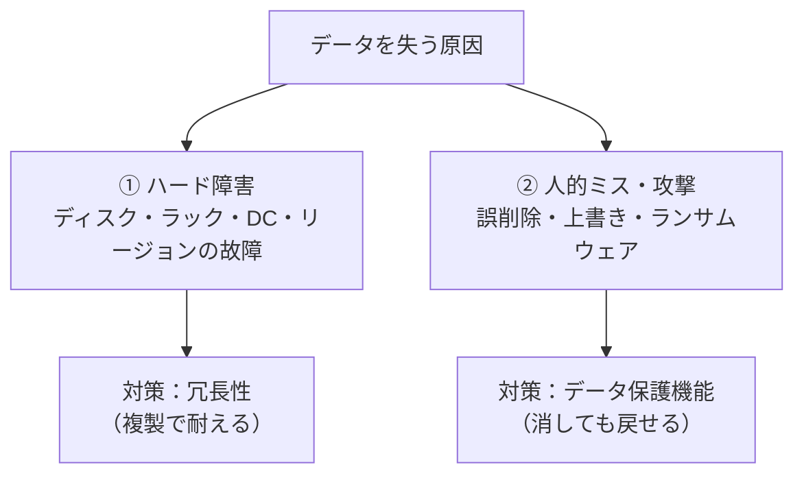
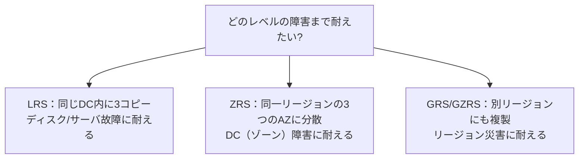
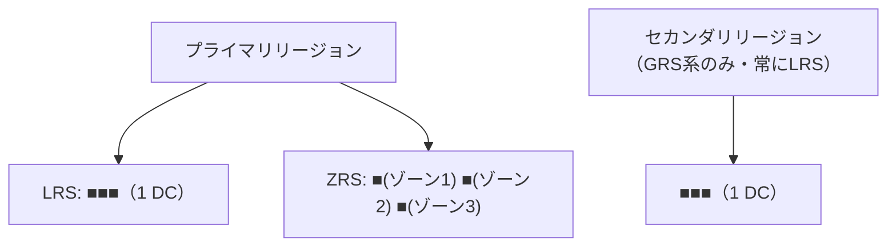
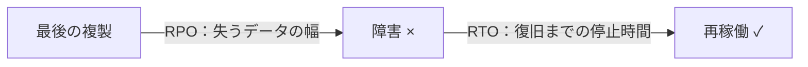
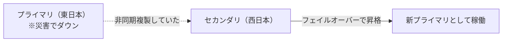
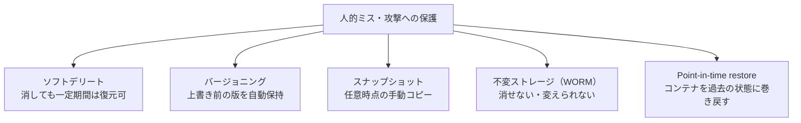
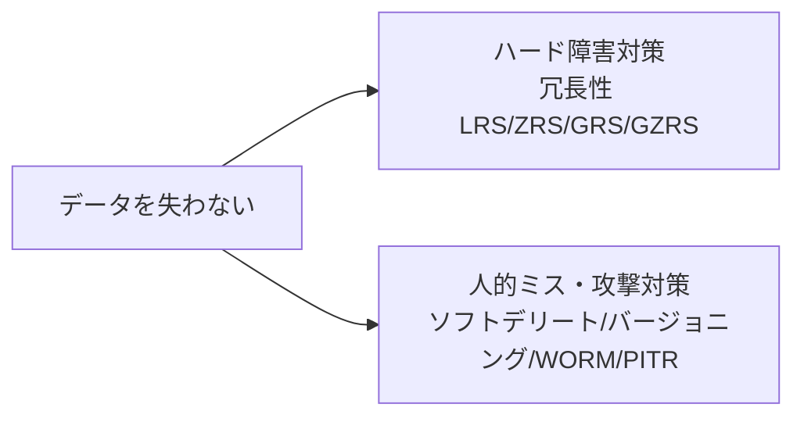

# Week 6 — データを失わない：冗長性とデータ保護

> **Phase 2a** | 学習プラン Week 6 / 10
> 学習目標：冗長性オプション（LRS/ZRS/GRS/GZRS/RA-GRS）を「どのレベルの障害まで耐えるか」で選べる。バージョニング・ソフトデリート・スナップショット・不変ストレージ・PITR を使い分け、「ハード障害」と「人的ミス・攻撃」の両面でデータを守る設計ができる

---

## 0. 今週の位置づけ

Week 5 までは「**漏らさない・守る**」（認証・暗号化・ネットワーク）だった。今週は「**失わない**」。データを失う原因は大きく 2 つあり、対策も 2 系統に分かれる。



| 失う原因 | 例 | 対策 |
|---|---|---|
| **ハード障害** | ディスク故障・データセンター火災・リージョン災害 | **冗長性**（LRS〜GZRS） |
| **人的ミス・攻撃** | 間違えて削除・上書き・ランサムウェアで暗号化 | **データ保護**（バージョニング・ソフトデリート・WORM 等） |

> **重要な概念の区別**：冗長性は「**物が壊れても**データを保つ」仕組み。だが**人間が消した・上書きした操作は冗長性では戻せない**（全複製に同じ削除が反映されるから）。誤削除・攻撃には別系統の「データ保護機能」が要る。この 2 つを混同しないことが今週の肝。

---

## 1. 冗長性：何台に・どこに複製するか

Storage は必ずデータを複数コピー（複製）して保つ。違いは「**いくつ・どこに**複製するか」＝**どのレベルの障害まで耐えるか**。

> **初学者向け用語補足：略称の読み解き方**
> 冗長性オプションは**頭文字の組み合わせ**でできている。分解すると一発で意味が分かる。
>
> | パーツ | 略 | 意味 |
> |---|---|---|
> | **RS** | **Redundant Storage** | 冗長ストレージ（＝複製して保つ。全オプション共通の語尾） |
> | **L** | **Local** | ローカル（1 つの DC 内） |
> | **Z** | **Zone** | ゾーン（複数の可用性ゾーン） |
> | **G** | **Geo** | 地理（別リージョン） |
> | **RA** | **Read-Access** | 読み取りアクセス（副リージョンを読める） |
>
> 組み合わせると：
> - **LRS** = **L**ocally **R**edundant **S**torage（ローカル冗長ストレージ）
> - **ZRS** = **Z**one-**R**edundant **S**torage（ゾーン冗長ストレージ）
> - **GRS** = **G**eo-**R**edundant **S**torage（地理冗長ストレージ）
> - **GZRS** = **G**eo-**Z**one-**R**edundant **S**torage（地理ゾーン冗長ストレージ）
> - **RA-GRS** = **R**ead-**A**ccess **G**eo-**R**edundant **S**torage（読み取りアクセス地理冗長ストレージ）



| オプション | 複製の置き方 | 耐えられる障害 | 弱点 |
|---|---|---|---|
| **LRS**（ローカル冗長） | **1 つの DC 内に 3 コピー** | ディスク・サーバ（ラック）故障 | **DC 全体やリージョンの障害には弱い** |
| **ZRS**（ゾーン冗長） | 同一リージョンの **3 つの可用性ゾーン**に分散 | **1 つのゾーン（DC）全損**に耐える | リージョン全体の災害には弱い |
| **GRS**（地理冗長） | LRS を **別リージョンにも**非同期複製（計 6 コピー） | **リージョン全体の災害** | 副リージョンは**通常読めない**（FO 時のみ） |
| **GZRS**（geo + zone） | プライマリは ZRS、別リージョンにも複製 | ゾーン障害＋リージョン災害の両方 | コスト高 |
| **RA-GRS / RA-GZRS** | GRS/GZRS ＋ **副リージョンを読み取り可能に** | 上記＋副リージョンから読める | 副は遅延ぶん古いことがある |

### コピー（複製）は何個保持される？

「サーバー台数」より「**データのコピー数**」で数えるのが正確。各コピーは別々のラック／DC（障害ドメイン）に置かれ、1 つの故障で複数が同時に失われないようになっている。

| オプション | プライマリ側 | セカンダリ側（別リージョン） | 合計 |
|---|---|---|---|
| **LRS** | 1 つの DC 内に **3** | — | **3** |
| **ZRS** | 3 つのゾーン（DC）に各 1 ＝ **3** | — | **3** |
| **GRS** | LRS で **3** | LRS で **3** | **6** |
| **GZRS** | ZRS で **3** | LRS で **3** | **6** |
| **RA-GRS** | LRS で **3** | LRS で **3**（**読み取り可**） | **6** |
| **RA-GZRS** | ZRS で **3** | LRS で **3**（**読み取り可**） | **6** |

- **最小は常に 3 コピー**（同一リージョン内で最低 3 つ＝Week 1 の「11 ナイン」の正体）。
- **地理（Geo）系は 2 倍の 6 コピー**（プライマリ 3 ＋ 別リージョン 3）。
- **セカンダリ側は常に LRS**（プライマリが ZRS でも、別リージョン側は 1 DC に 3）。
- **RA が付いてもコピー数は増えない**。RA-GRS は GRS と同じ 6 コピー。違いは「セカンダリを**読めるか**」だけ。



> **補足：「3 コピー」は教育用の単純化（実際は消失訂正符号も使う）**
> 本講座では「3 コピー」と説明するが、これは分かりやすさのための単純化。実際の耐久性は次の 2 本立て：
> - **新しい・書き込み中のデータ**：3 つの完全な複製（説明どおり）
> - **シール済み（確定した古い）データ**：**消失訂正符号（Erasure Coding）＝ LRC（Local Reconstruction Codes）** に変換。3 倍の容量を使わずに同等以上の耐久性を出す。
>
> **消失訂正符号**とは、データを断片＋復元用のパリティに分け、一部が壊れても残りから**計算で復元**する技術（RAID の発展形）。完全な 3 コピー（容量 300%）より少ない冗長量（例 ~150%）で同じ耐久性を実現できる。Azure は **LRC** を 2012 年から本番投入（USENIX ATC 2012 ベストペーパー）。
> → だから正確には「耐久性は**複製＋消失訂正符号**で実現」。コピー数の話は"考え方"として捉える。
>
> なお、この内部構造（3 層・パーティション単一所有・複製/符号化）の**骨格は 2011 年の論文から変わっていない**。変わったのは耐久性の実装（複製＋LRC）・自動分散の賢さ・スケール値の積み増し。一次情報：
> - 消失訂正符号：https://www.usenix.org/conference/atc12/technical-sessions/presentation/huang
> - アーキテクチャ全体（SOSP 2011）：https://azure.microsoft.com/en-us/blog/sosp-paper-windows-azure-storage-a-highly-available-cloud-storage-service-with-strong-consistency/

> **初学者向け用語補足：DC（データセンター）**
> **DC＝データセンター（Data Center）**＝サーバ・ストレージ・ネットワーク機器を大量に収容し安定稼働させるための**専用の建物（施設）**。クラウドの"実体"。Blob も最終的にはどこかの DC のラックに刺さったディスク（Week 1）の上に乗っている。
> 備えるもの：大量のサーバ・ディスク／冗長な電源（自家発電・UPS）／冷却設備／防火・耐震・物理警備／高速ネットワーク。＝「要塞化した巨大なサーバ倉庫」。
>
> ```mermaid
> flowchart TD
>     R["リージョン（地理エリア・例：東日本）"]
>     R --> AZ1["可用性ゾーン1 ＝独立したDC（群）"]
>     R --> AZ2["可用性ゾーン2 ＝別の独立したDC（群）"]
>     R --> AZ3["可用性ゾーン3 ＝別の独立したDC（群）"]
> ```
>
> | 用語 | 規模 | DC との関係 |
> |---|---|---|
> | **DC** | 建物 1 つ（〜数棟） | 物理的なサーバ倉庫そのもの |
> | **可用性ゾーン（AZ）** | 1 つ以上の独立した DC | 電源・冷却・NW が他ゾーンと独立した DC（群） |
> | **リージョン** | 複数の AZ の集まり | 東日本・西US などの地理エリア |
>
> Week 6 の「ディスク → ゾーン（DC）→ リージョン」は、「**1 本のディスク → 建物 1 つ（DC）→ 地理エリア全体**」と障害の規模が大きくなるのに合わせ、複製の置き場を広げる話。

> **初学者向け用語補足：可用性ゾーン（AZ）**
> 1 つのリージョン内にある、**電源・冷却・ネットワークが独立した複数のデータセンター（DC）群**。あるゾーンが停電・火災になっても、別ゾーンは生きている。ZRS は 3 つの AZ にデータを分散するので、**DC 1 個が全損してもデータが無事**。

### 「ローカル」と「ゾーン」と「地理」の三段階

```mermaid
flowchart LR
    subgraph R1["リージョン（例：東日本）"]
        subgraph AZ1["ゾーン1（DC）"]
            L["LRS：ここに3コピー"]
        end
        subgraph AZ2["ゾーン2（DC）"]
        end
        subgraph AZ3["ゾーン3（DC）"]
        end
    end
    subgraph R2["別リージョン（例：西日本）"]
        G["GRS：ここにも複製"]
    end
    AZ1 -. "ZRS は3ゾーンに分散" .- AZ2
    AZ2 -. .- AZ3
    R1 -->|"GRS は別リージョンへ非同期複製"| R2
```

- **LRS**：1 つの DC 内で守る。最も安いが DC ごと落ちるとアウト。
- **ZRS**：リージョン内の複数 DC（ゾーン）で守る。DC 1 個の全損に耐える。
- **GRS 系**：別リージョンにも複製。地震・大規模災害でリージョンごと落ちても残る。

---

## 2. 同期 vs 非同期と「RPO」

冗長性を理解する鍵が「複製が**同期か非同期か**」。

| | 同期複製 | 非同期複製 |
|---|---|---|
| いつ複製 | 書き込み成功を返す**前**に全コピー完了 | 書き込み成功後に**追いかけて**複製 |
| どこで使う | LRS / ZRS（同一リージョン内） | GRS / GZRS（別リージョンへ） |
| データ欠損 | ない | **災害時、複製前の数分が失われうる** |

> **初学者向け用語補足：RPO（目標復旧時点）**
> **RPO＝Recovery Point Objective（目標復旧時点）**。障害時に「**どこまで遡ってデータが戻るか＝最大何分ぶん失う覚悟か**」（失うデータの時間幅）。同一リージョン内（LRS/ZRS）は同期なので RPO ≒ 0。別リージョンへの GRS は非同期で、災害時は**まだ複製されていない直近の書き込み（通常 15 分以内）が失われうる**。だから GRS は「リージョン災害には耐えるが、直近数分は失うかも」。
>
> ```mermaid
> flowchart LR
>     LAST["最後の複製<br/>（セーブポイント）"] -->|"この間の書き込みが失われる<br/>＝ RPO"| CRASH["障害発生 ×"]
> ```

### 補足：RPO と RTO の違い（混同注意）

RPO は **RTO（目標復旧時間）** とペアで語られる。問うているものが違う。

| 指標 | 略 | 問い | 意味 |
|---|---|---|---|
| **RPO** | Recovery **Point** Objective | **どこまで遡って戻せるか** | 失うデータの時間幅（「直近◯分を失う」） |
| **RTO** | Recovery **Time** Objective | **復旧までどれだけかかるか** | ダウンしている時間（「◯分で復旧」） |



> **イメージ**：RPO＝「最後のセーブポイントはどこか」（セーブ以降の進行が消える）。RTO＝「復活までの待ち時間」。
>
> | 冗長性 | 複製 | RPO |
> |---|---|---|
> | LRS / ZRS（同一リージョン内） | 同期 | **≒ 0**（失わない） |
> | GRS / GZRS（別リージョンへ） | 非同期 | **0 でない**（直近数分を失いうる） |

---

## 3. フェイルオーバーと副リージョンの読み取り

GRS 系で**プライマリのリージョンが災害で死んだ**とき、副リージョンに切り替えるのが**フェイルオーバー（FO）**。



| 用語 | 意味 |
|---|---|
| **GRS** | 副リージョンに複製はするが、**普段は読めない**（FO したときだけ昇格して使える） |
| **RA-GRS** | 副リージョンを**普段から読み取り専用でアクセスできる**（`-secondary` エンドポイント） |

> **ポイント**：RA-GRS の副リージョン読み取りは**非同期複製の遅延ぶん古い**（Week 3 の「セカンダリ読み取りは古いことがある」）。災害前提の DR 用、または「多少古くてよい読み取りを別リージョンに逃がす」用途。整合性が要る処理はプライマリを読む。

---

## 4. ここからが本題：人的ミス・攻撃から守る

冗長性は「物の故障」には強いが、「**間違えて消した・上書きした・暗号化された**」には無力（全複製に同じ操作が伝わる）。ここを守るのが**データ保護機能**。



### ① ソフトデリート（論理削除）

削除しても**すぐには消えず、一定期間（保持期間）"ゴミ箱"に残り、復元できる**。Blob 単位・コンテナ単位・スナップショット単位で設定可能。

> **イメージ**：OS のゴミ箱。削除＝ゴミ箱に入る。保持期間内なら戻せる。期間を過ぎると本当に消える。**誤削除の最初の防波堤**。

### ② バージョニング（版管理）

Blob を上書き・削除すると、**変更前の内容が自動的に「以前のバージョン」として保存**される。いつでも過去の版に戻せる。

> **イメージ**：書類の版を全部とっておく。上書きしても旧版が残るので「間違えて上書きした」を戻せる。ソフトデリートが「削除」対策なら、バージョニングは「**上書き**」対策。

### ③ スナップショット

ある時点の Blob の**読み取り専用コピー**を**手動で**作る。バージョニングが自動なのに対し、スナップショットは「ここぞ」という時点を明示的に固定する。

### ④ 不変ストレージ（WORM）

**WORM（Write Once, Read Many）**＝一度書いたら**保持期間中は誰も（管理者すら）変更・削除できない**。法令・監査で「改ざんされていない証拠」が要るデータに使う。

| モード | 内容 |
|---|---|
| **時間ベース保持** | 指定期間は変更・削除不可 |
| **リーガルホールド** | 解除するまで無期限に変更・削除不可 |

> **ポイント**：WORM は**ランサムウェア対策にも強い**。攻撃者が暗号化・削除しようとしても、保持期間中は不変なので元データが守られる。

### ⑤ Point-in-time restore（PITR）

コンテナ全体を**過去の指定時点の状態に巻き戻す**。広範囲の誤操作・破損から「あの時点に戻す」復旧ができる（バージョニング＋ソフトデリート＋変更フィードが前提）。

---

## 5. 使い分けの早見表

| 守りたい事象 | 主に使う機能 |
|---|---|
| ディスク・サーバ故障 | LRS（冗長性の最低ライン） |
| データセンター（ゾーン）全損 | **ZRS** |
| リージョン災害 | **GRS / GZRS** |
| 副リージョンから読みたい | RA-GRS / RA-GZRS |
| 1 つの Blob を誤削除 | **ソフトデリート** |
| 1 つの Blob を誤上書き | **バージョニング** |
| 任意時点を明示的に固定 | スナップショット |
| 改ざん禁止・規制対応・ランサム対策 | **不変ストレージ（WORM）** |
| コンテナ全体を過去時点へ巻き戻し | **Point-in-time restore** |

> **設計の定石**：本番 Blob は「**ZRS or GZRS（冗長性）＋ バージョニング ＋ ソフトデリート**」を基本セットにし、規制データには **WORM** を足す。冗長性（ハード障害）と保護機能（人的ミス・攻撃）は**両方**入れる。

---

## 6. Week 6 全体の整理



| 用語 | 一言説明 |
|---|---|
| LRS / ZRS / GRS / GZRS | DC内3コピー / ゾーン分散 / 別リージョン複製 / 両方 |
| RA-GRS | 副リージョンを読み取り可能に（古いことあり） |
| 可用性ゾーン | リージョン内の独立した DC 群 |
| RPO | 障害時に最大どれだけ遡る（失う）か |
| フェイルオーバー | 副リージョンを昇格して継続 |
| ソフトデリート | 削除しても一定期間は復元可（ゴミ箱） |
| バージョニング | 上書き前の版を自動保持 |
| スナップショット | 任意時点の手動コピー |
| 不変ストレージ（WORM） | 保持期間中は変更・削除不可（規制・ランサム対策） |
| PITR | コンテナを過去時点へ巻き戻す |

---

## ハンズオン チェックリスト

- [ ] アカウントの冗長性設定（LRS/ZRS/GRS…）を確認し、LRS と ZRS の違いを説明できた
- [ ] バージョニングを有効化し、同名 Blob を上書き → 以前のバージョンが残ることを確認した
- [ ] Blob ソフトデリートを有効化し、削除 → 保持期間内に復元できることを確認した
- [ ] スナップショットを手動作成し、元 Blob を変更してもスナップショットが不変なことを確認した
- [ ] （任意）不変ストレージ（時間ベース保持）を設定し、保持期間中は削除できないことを確認した
- [ ] （任意）GRS に変更し、`-secondary` 読み取り（RA-GRS）が可能か確認した

---

## 自己チェック

1. **冗長性で守れる障害と、守れない事象は何か？**
   - キーワード：ハード障害は守れる／誤削除・上書きは守れない（別系統）
2. **LRS・ZRS・GRS の違いを「耐えられる障害レベル」で説明できるか？**
   - キーワード：ディスク / ゾーン(DC) / リージョン
3. **RPO とは何で、なぜ GRS は RPO ≒ 0 でないのか？**
   - キーワード：非同期複製・直近数分が失われうる
4. **ソフトデリートとバージョニングはそれぞれ何への対策か？**
   - キーワード：削除 / 上書き
5. **WORM がランサムウェアに強いのはなぜか？**
   - キーワード：保持期間中は変更・削除不可

---

## 次週の予告（Week 7）

「失わない」の次は「**賢く・安く保つ**」。コストとパフォーマンス：

- アクセス層 Hot / Cool / Cold / Archive とライフサイクル管理
- コスト構造（容量＋トランザクション＋転送＋早期削除・リハイドレートのペナルティ）
- リハイドレート・スケールターゲット・スロットリング（429/503）
- 「層選択＝コスト最適化の意思決定」
