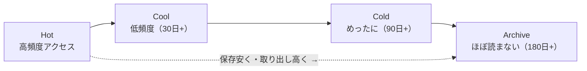
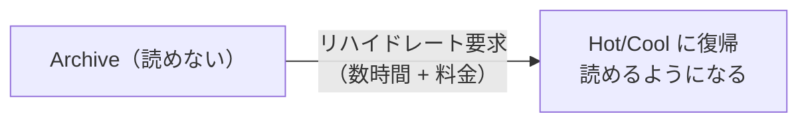
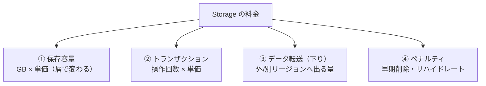
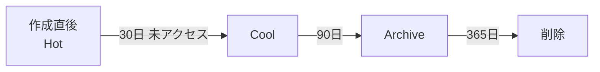
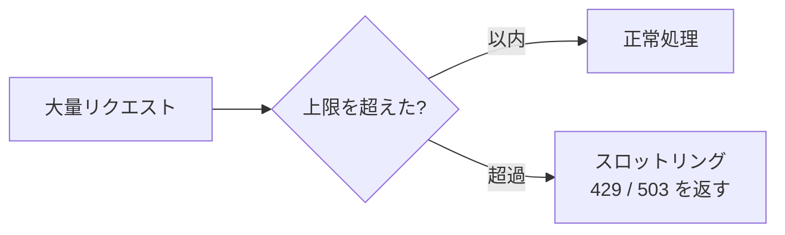
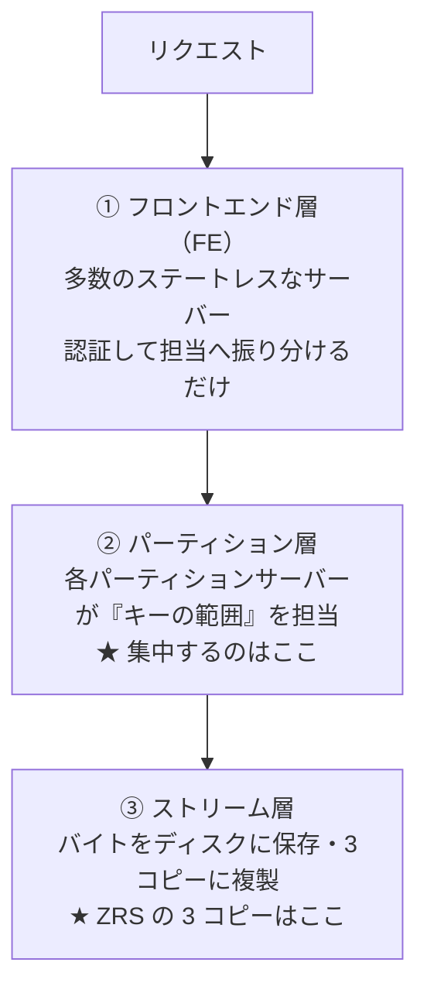
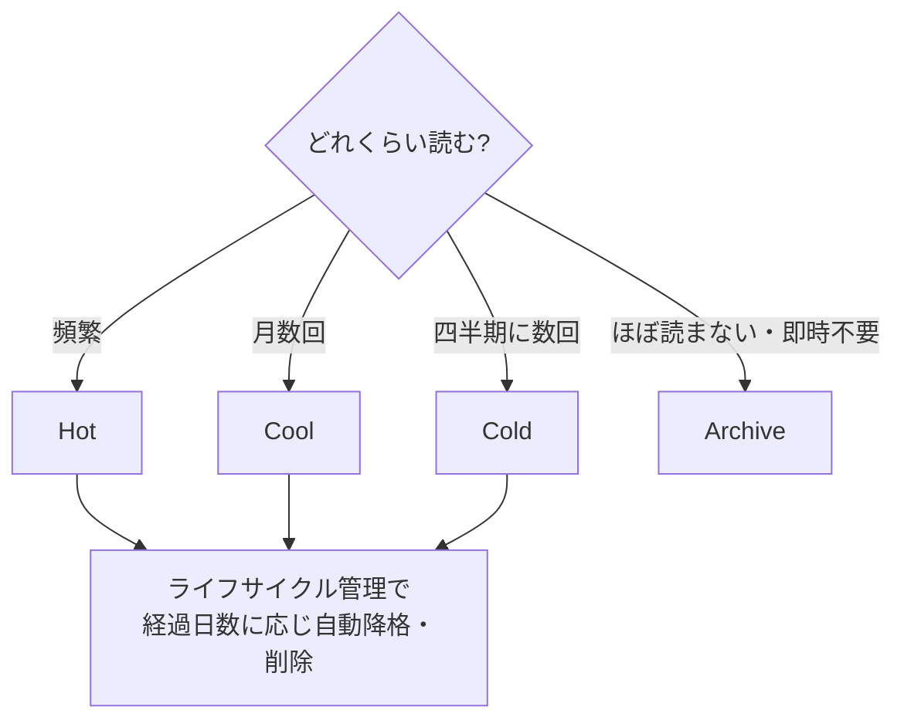

# Week 7 — コストとパフォーマンス：アクセス層と最適化

> **Phase 2a** | 学習プラン Week 7 / 10
> 学習目標：アクセス層（Hot/Cool/Cold/Archive）をアクセス頻度とコストで選べる。Storage のコスト構造（容量＋トランザクション＋転送＋ペナルティ）を理解し、ライフサイクル管理で自動最適化できる。スロットリング（429/503）とスケールターゲットを理解する

---

## 0. 今週の位置づけ

Week 6 までで「安全に・失わずに」保てるようになった。今週は「**賢く・安く保つ**」。

Storage のコストは「容量だけ」ではない。**アクセス層の選択がコストを大きく左右する**が、層を間違えると逆に高くつく落とし穴もある。だから「層選択＝コスト最適化の意思決定」として、コスト構造ごと理解する。

> **この週のキーメッセージ**：アクセス層は「**保存は安いが取り出すと高い**」というトレードオフ。アクセス頻度に合わせて選ばないと、安くするつもりが高くなる。

---

## 1. アクセス層：アクセス頻度で保存コストを変える

Blob には**アクセス層（access tier）**があり、「どれくらい頻繁に読むか」で**保存料金と取り出し料金のバランス**が変わる。



| 層 | 想定アクセス | 保存料金 | アクセス（取り出し）料金 | 最小保持 |
|---|---|---|---|---|
| **Hot** | 頻繁に読み書き | **高い** | **安い** | なし |
| **Cool** | 月数回（30 日以上） | 中 | 中 | 30 日 |
| **Cold** | 四半期に数回（90 日以上） | 低 | 高 | 90 日 |
| **Archive** | ほぼ読まない（180 日以上） | **最安** | **最も高い・即時に読めない** | 180 日 |

> **重要な概念の区別：保存料金 と アクセス料金は逆向き**
> 層が「冷たく」なるほど**保存は安く**なるが**取り出しは高く**なる。Hot は「置くのは高いが読むのは安い」、Archive は「置くのはほぼタダだが読むと高く・時間もかかる」。**頻繁に読むデータを Archive に置くと、取り出し料金で逆に高くつく**。

> **初学者向け用語補足：最小保持期間**
> Cool/Cold/Archive には「最低◯日は置く」約束がある。これより早く削除・別層に移動すると**早期削除ペナルティ**（残り日数ぶんの料金）がかかる（§3）。「すぐ消すデータを Cool に入れる」のは損。

---

## 2. Archive 層とリハイドレート

**Archive は別格**。最安だが、**そのままでは読めない（オフライン状態）**。読むには **Hot/Cool に戻す＝リハイドレート（rehydrate）**が必要で、**時間（数時間）と料金**がかかる。



| リハイドレート優先度 | 所要時間 | 料金 |
|---|---|---|
| Standard | 最大 15 時間程度 | 安い |
| High | 1 時間以内（小サイズ） | 高い |

> ⚠ **Archive の落とし穴**：「安いから」と何でも Archive に入れると、いざ読むとき①**数時間待たされ**②**リハイドレート料金＋取り出し料金**がかかる。Archive は「**法令保管・バックアップなど、めったに読まないが消せないデータ**」専用。すぐ使うかもしれないデータには不向き。

---

## 3. コスト構造：容量だけではない

Storage 料金は**複数の要素の合算**。容量しか見ないと見積もりを誤る。



| 要素 | 内容 | 注意 |
|---|---|---|
| **① 保存容量** | 置いている GB × 層ごとの単価 | 冷たい層ほど安い |
| **② トランザクション** | 読み/書き/一覧などの**操作回数**ごとに課金 | **冷たい層ほど 1 操作が高い**。小さいファイル大量アクセスで効く |
| **③ データ転送（下り/egress）** | リージョン外・インターネットへ**出ていく**量 | **入り（アップロード）は無料、出るのが有料**が基本 |
| **④ ペナルティ** | 早期削除・Archive リハイドレート | 最小保持より早く消すと残り日数ぶん課金 |

> **初学者向け用語補足：トランザクション課金**
> Week 1 で触れた「操作回数での課金」。Blob を 1 回読む・書く・一覧する、これら 1 つ 1 つが「トランザクション」として数えられ課金される。**Cool/Cold/Archive は 1 トランザクションの単価が Hot より高い**。だから「保存は安い Cool に入れたが、実は頻繁にアクセスしていてトランザクション料金がかさんだ」が起きる。**層選択は容量だけでなくアクセス回数も込みで考える**。

> **重要な概念の区別：入りは無料・出りは有料**
> Storage への**アップロード（ingress）は無料**だが、Storage から**別リージョンやインターネットへの下り（egress）は有料**。同一リージョン内の Azure サービス間は基本無料。だから「別リージョンの VM から大量に読む」「CDN なしで世界配信」は転送料金が膨らむ。

---

## 4. ライフサイクル管理：層移動を自動化する

「最初は Hot、30 日読まれなければ Cool、90 日で Archive、365 日で削除」——こうした**経過日数に応じた層移動・削除を自動実行**するのが**ライフサイクル管理ポリシー**。

> **初学者向け用語補足：基準は「年齢」ではなく「経過日数」**
> 条件は「Blob が何歳か」ではなく、**ある基準時点からの経過日数**で判定する。基準は 3 種類から選べる。
>
> | 条件（JSON のキー） | 基準＝何からの経過日数か |
> |---|---|
> | `daysAfterModificationGreaterThan` | **最終更新**からの経過日数 |
> | `daysAfterCreationGreaterThan` | **作成**からの経過日数 |
> | `daysAfterLastAccessTimeGreaterThan` | **最終アクセス**からの経過日数（アクセス追跡の有効化が必要） |
>
> 「30 日読まれなければ Cool」は**最終アクセス**基準（＝放置期間）、「更新後 90 日で Archive」は**最終更新**基準。「年齢（作成からの古さ）」だけではないので、本講座では**経過日数**と呼ぶ。



ポリシーは JSON で「条件（最終更新からの日数・プレフィックス・タグ）」と「アクション（層変更・削除）」を記述する。

```json
{
  "rules": [{
    "name": "logs-tiering",
    "enabled": true,
    "definition": {
      "filters": { "blobTypes": ["blockBlob"], "prefixMatch": ["logs/"] },
      "actions": { "baseBlob": {
        "tierToCool":    { "daysAfterModificationGreaterThan": 30 },
        "tierToArchive": { "daysAfterModificationGreaterThan": 90 },
        "delete":        { "daysAfterModificationGreaterThan": 365 }
      }}
    }
  }]
}
```

> **ポイント**：ライフサイクル管理は**手作業ゼロでコスト最適化**できる定番。ログ・バックアップのような「時間が経つほど読まれなくなる」データに効く。Week 6 のバージョニングと組み合わせ、「古いバージョンは早めに Cool/削除」もできる。

---

## 5. パフォーマンス：スケールターゲットとスロットリング

Storage には**スケールターゲット（性能上限）**があり、それを超えるとリクエストが**スロットリング（制限）**される。



| 用語 | 意味 |
|---|---|
| **スケールターゲット** | アカウント/パーティション単位の「秒間リクエスト数・帯域」の上限 |
| **スロットリング** | 上限超過時にリクエストを一時的に拒否すること |
| **429 Too Many Requests** | 「多すぎる」エラー。レート超過 |
| **503 Server Busy** | 「混んでいる」エラー。一時的な過負荷 |

> **初学者向け用語補足：429 / 503 と再試行**
> - **429**：あなたが**送りすぎ**。レート制限に当たった。
> - **503**：サーバ側が**一時的に混雑**。
> どちらも「少し待って再試行すれば通る」一時的エラー。SDK は**指数バックオフ（待ち時間を倍々にして再試行）**を自動で行う。アプリ設計では「429/503 は異常終了ではなくリトライ対象」と扱う。

> **ポイント**：スロットリングを避けるには——①**プレフィックスを分散**（後述）、②リトライ（指数バックオフ）、③恒常的に上限不足なら**Premium**や**アカウント分割**を検討。

### プレフィックスとパーティション

Blob はキー（名前）の範囲でパーティション分割され負荷分散される。**同じプレフィックスに集中すると 1 パーティションに負荷が偏り**スロットリングしやすい。具体的な Blob 名（URL）で見る。

**悪い例：先頭が同じ（タイムスタンプ・連番）**

```text
.../logs/2026-06-22T10:00:01-device1.log
.../logs/2026-06-22T10:00:02-device2.log
.../logs/2026-06-22T10:00:03-device3.log
        └── 全部この先頭が同じ → 辞書順で隣接 → 同じパーティションに集中
```

全部 `logs/2026-06-22T10:00:0…` 始まりで**辞書順に隣接** → 1 パーティションに集中 → 担当 1 サーバーが詰まり 429/503。

**良い例：先頭にばらける値（公式推奨は「3 桁のハッシュ」）**

```text
.../logs/3f2-2026-06-22T10:00:01-device1.log
.../logs/9c1-2026-06-22T10:00:02-device2.log
.../logs/a7e-2026-06-22T10:00:03-device3.log
        └── 先頭の3桁がバラバラ → 辞書順で全体に分散 → 複数パーティションに分かれる
```

> 公式ドキュメント（Azure Architecture Center）も「名前にタイムスタンプ・数値 ID を使うと 1 パーティションに集中する。**代わりに名前の前に 3 桁のハッシュを付ける**」と明記している。

> **イメージ**：図書館でタイトルのアルファベット順に本を並べる。全部「logs2026…」始まりだと**同じ棚（司書 1 人）**に殺到する。先頭にランダムな記号を付ければ棚全体に分散し、多くの司書が分担できる。
>
> **読み出しの並び順も欲しいなら**：`ハッシュ-タイムスタンプ` の順（ハッシュを先頭・時刻を後ろ）にすれば、分散と時刻ソートを両立できる。

| 状況 | プレフィックス分散 |
|---|---|
| 通常規模のアプリ | **気にしなくてよい**（Azure が自動でパーティション分割を最適化） |
| 秒間に膨大な書き込み（IoT・テレメトリ大量投入） | **効いてくる**。先頭ハッシュで分散を検討 |

#### 補足（詳しく知りたい人向け）：Storage の 3 層アーキテクチャ

> 「集中するのは結局どのサーバー？」を理解する深掘り。飛ばしても運用に支障ない。

まず誤解を正すと、**ZRS の「3 コピー」はあなた専用の処理サーバー 3 台ではない**。Storage は**多数の利用者で共有するマルチテナント分散システム**で、データは共有された大量のサーバー群に分散して載る。「3 コピー」は**耐久性のための複製**で、下記の一番下の層の話。Storage は内部で 3 層に分かれる。



| 層 | 役割 |
|---|---|
| ① フロントエンド層 | リクエストを受け認証し、担当パーティションサーバーへ**振り分けるだけ**（データを持たない・1 台に固定されない） |
| ② パーティション層 | キー空間を**範囲（パーティション）に分け**、各範囲を**1 つのパーティションサーバーが担当**して処理 |
| ③ ストリーム層 | 実際のバイトを保存し**3 コピーに複製**（LRS/ZRS の複製はここ。耐久性担当） |

- **「3 コピー」と「処理サーバー」は別の層**。3 コピーは③の耐久性、処理は②で行われる。
- **パーティション＝「コンテナ＋Blob 名」を辞書順に並べたキー空間を区切った範囲**。各範囲を**その瞬間 1 つのパーティションサーバーが所有**（単一所有）。同じプレフィックス＝同じ範囲＝**その 1 サーバーに集中**＝スロットリング。
- 1 アカウントのデータは**多数のパーティションに分かれ複数サーバーに分散**しうる（1 アカウント＝1 サーバーではない）。負荷が偏ると Storage はホットな範囲を分割・再割り当てするが、分割には時間がかかり、集中が続けば詰まる。

> **Week 3 とのつながり**：「1 つのキー範囲を 1 サーバーが所有」するから、書いた直後に読んでも必ず最新（**強整合 read-after-write**）が保証できる。単一所有は整合性の代償としての構造であり、その副作用が「集中するとそのサーバーが詰まる」。プレフィックス分散は、この単一所有の範囲を散らして複数サーバーに分ける工夫。

> **参考（この内部構造の出典）**
> この 3 層アーキテクチャは公開情報。一次情報は査読付き論文：
> - **論文** "Windows Azure Storage: A Highly Available Cloud Storage Service with Strong Consistency"（Calder ほか, SOSP 2011）
>   - 公式ブログ紹介：https://azure.microsoft.com/en-us/blog/sosp-paper-windows-azure-storage-a-highly-available-cloud-storage-service-with-strong-consistency/
>   - 論文 PDF（大学ミラー）：https://www.cs.purdue.edu/homes/csjgwang/CloudNativeDB/AzureStorageSOSP11.pdf
> - **公式ドキュメント（スケール上限・スロットリング・分散の実務ガイド）**
>   - パーティション分割戦略（パーティションキー＝アカウント+コンテナ+Blob 名／1 BLOB＝1 サーバー／3 桁ハッシュ推奨の直接の出典）：https://learn.microsoft.com/ja-jp/azure/architecture/best-practices/data-partitioning-strategies#partitioning-azure-blob-storage
>   - Scalability and performance targets for Blob storage：https://learn.microsoft.com/en-us/azure/storage/blobs/scalability-targets
>   - Performance checklist for Azure Blob Storage：https://learn.microsoft.com/en-us/azure/storage/blobs/storage-performance-checklist
>
> なお、プレフィックスに 3 桁ハッシュを付ける推奨は**現行の公式ドキュメントにも明記**されている（上記パーティション分割戦略ページ）。一方で Azure 側の**自動パーティション分割の改善**も進んでおり、通常規模では自動最適化に任せてよく、**タイムスタンプ／連番を先頭に使う超高スループット時に手当てとして検討**する、という位置づけ。本講座の但し書きもこれに合わせている。

### Premium 層（アクセス層とは別物）

Week 1 の **Premium BlockBlob アカウント**は SSD ベースで**低レイテンシ・高トランザクション**。アクセス層（Hot/Cool…）とは**別の軸**——アクセス層は「保存コストの最適化」、Premium は「性能の底上げ」。

> **混同しやすい**：Hot/Cool/Cold/Archive ＝ **同じ Standard 内の"温度"**（コスト最適化）。Premium ＝ **アカウント種別**（性能）。Premium に Archive はない。

---

## 6. 意思決定：どの層に置くか



| データの性質 | 推奨 |
|---|---|
| 稼働中アプリの画像・頻繁な読み書き | **Hot** |
| 月数回のバックアップ参照 | **Cool** |
| 四半期に数回の監査ログ | **Cold** |
| 法令保管・めったに読まない長期保存 | **Archive**（即時性不要が条件） |
| 時間で読まれなくなるログ全般 | Hot 開始 ＋ **ライフサイクルで自動降格** |

---

## 7. Week 7 全体の整理

| 用語 | 一言説明 |
|---|---|
| アクセス層 | Hot/Cool/Cold/Archive。冷たいほど保存安・取り出し高 |
| リハイドレート | Archive を読める層に戻す（数時間＋料金） |
| トランザクション課金 | 操作回数ごとの課金。冷たい層ほど単価高 |
| egress（下り転送） | リージョン外・ネットへ出る量が有料（入りは無料） |
| 早期削除ペナルティ | 最小保持より早く消すと残り日数ぶん課金 |
| ライフサイクル管理 | 経過日数（最終更新/作成/最終アクセス）に応じ層移動・削除を自動化（JSON ポリシー） |
| スケールターゲット | 性能上限（秒間リクエスト・帯域） |
| スロットリング / 429・503 | 上限超過で一時拒否。リトライ対象 |
| Premium | SSD ベースの性能特化アカウント（層とは別軸） |

---

## ハンズオン チェックリスト

- [ ] Blob のアクセス層を Hot → Cool → Archive と変更してみた
- [ ] Archive にした Blob はそのまま読めず、リハイドレートが要ることを確認した
- [ ] 料金計算ツールで「同じ 1TB を Hot と Archive に置いた場合」の保存料金差を確認した
- [ ] さらに「月に何回読むか」でトランザクション料金が逆転しうることを確認した
- [ ] ライフサイクル管理ポリシー（JSON）を作成し、`prefixMatch` と日数条件で層移動を設定した
- [ ] （任意）大量リクエストを送り 429/503 が返る様子と、SDK の自動リトライを観察した

---

## 自己チェック

1. **アクセス層で「保存料金」と「取り出し料金」が逆向きなのはなぜか？**
   - キーワード：冷たいほど保存安・取り出し高、頻繁アクセスを Archive に置く失敗
2. **Storage のコストは何の合算か？容量以外に何があるか？**
   - キーワード：容量・トランザクション・egress・ペナルティ
3. **「Cool に入れたのに高くなった」はなぜ起きうるか？**
   - キーワード：トランザクション単価・頻繁アクセス・早期削除
4. **Archive のリハイドレートとは何で、何に注意するか？**
   - キーワード：読める層に戻す・数時間・料金・即時性不要なデータ専用
5. **429 と 503 の違いと、アプリでの扱いは？**
   - キーワード：送りすぎ / 混雑・リトライ（指数バックオフ）

---

## 次週の予告（Week 8）

「賢く保つ」の次は「**安全に更新し・運用で見張る**」：

- ETag / 楽観的並行制御（If-Match）・Blob リース（同時更新の競合を防ぐ）
- メトリック・ログ・Azure Monitor・診断設定
- 容量・トランザクションのアラート
