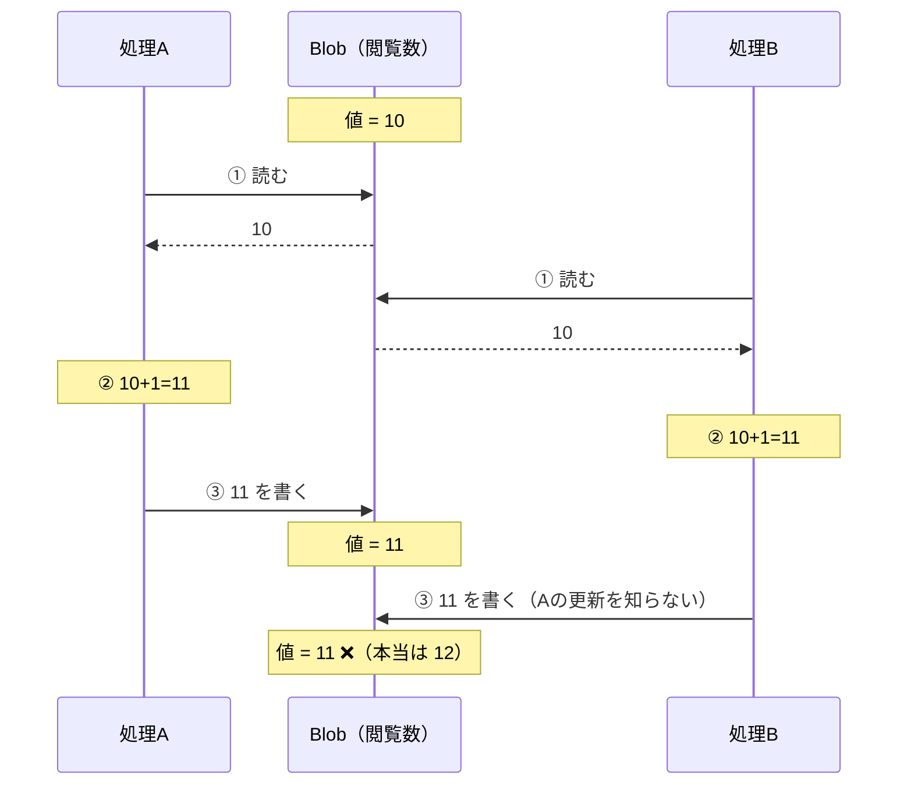
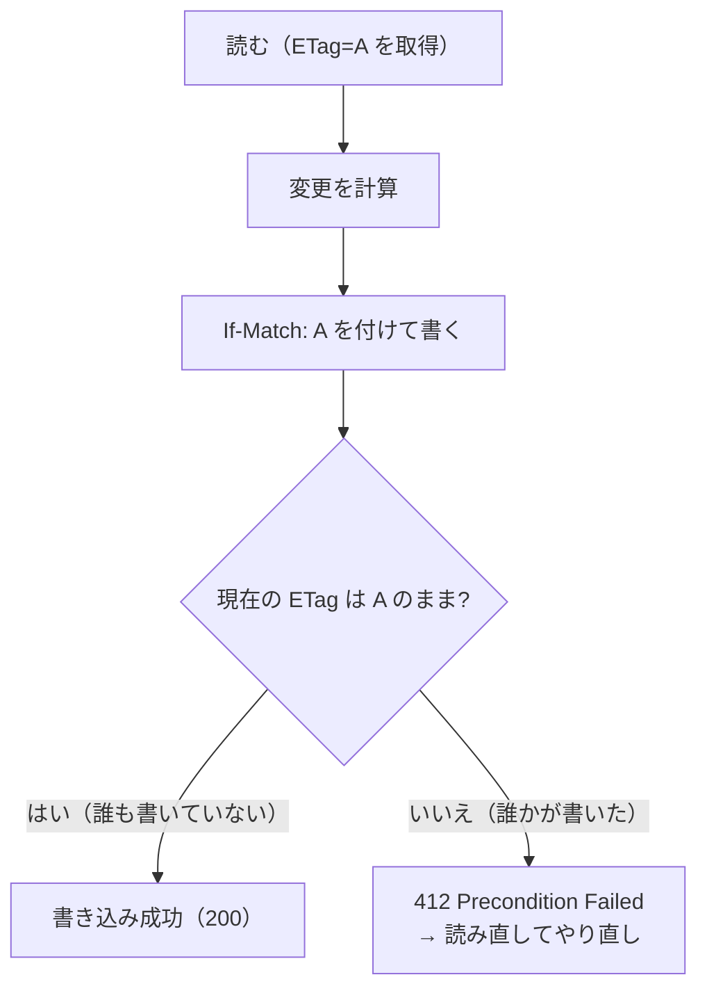
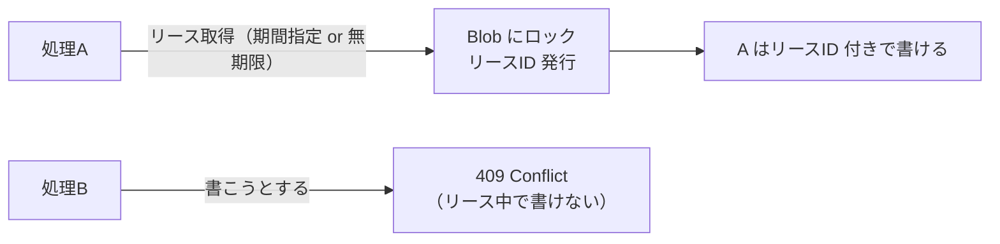
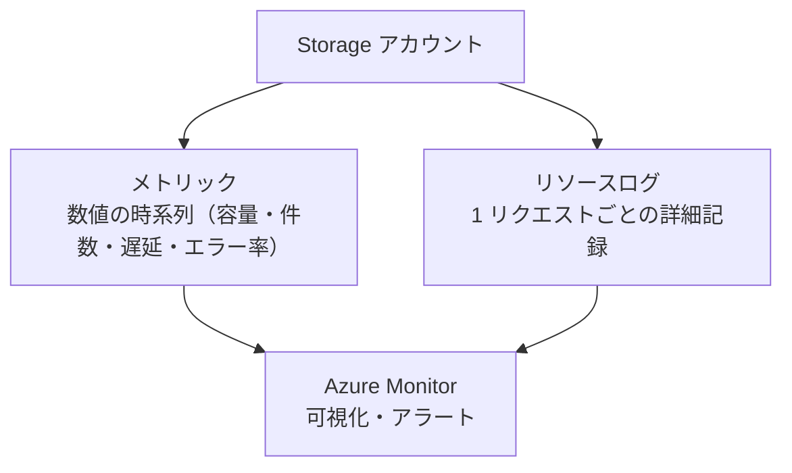
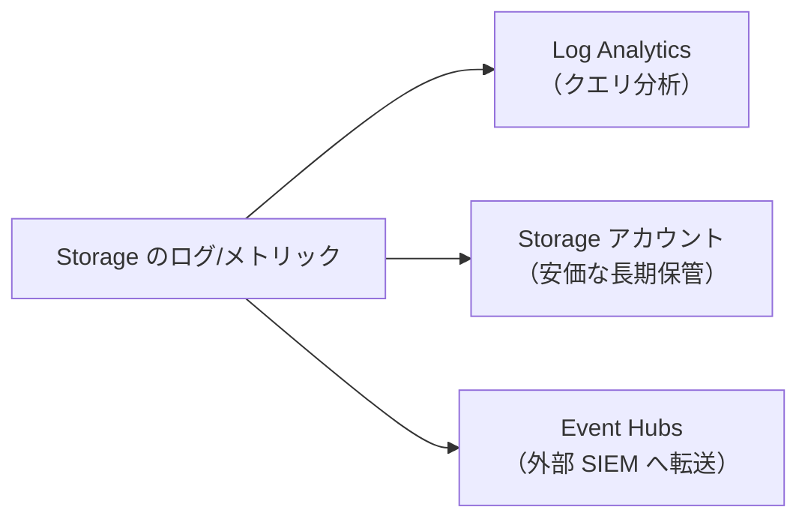
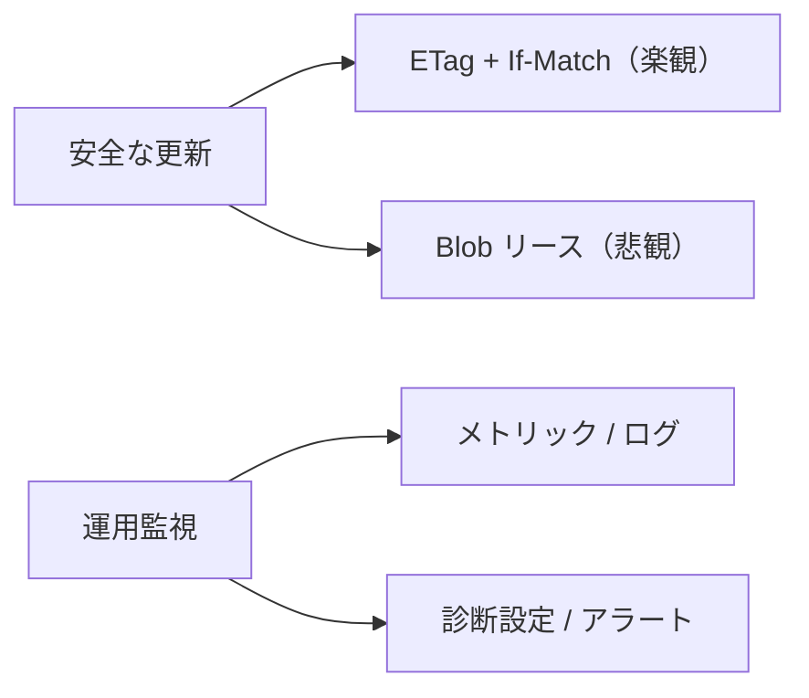

# Week 8 — 並行制御と運用監視

> **Phase 2a** | 学習プラン Week 8 / 10
> 学習目標：複数の書き手が同じ Blob を更新するときの競合を、ETag による楽観的並行制御（If-Match）と Blob リースで防げる。メトリック・ログ・診断設定で Storage を監視し、容量・トランザクション・エラーにアラートを設定できる

---

## 0. 今週の位置づけ

ここまでで「安全に・失わず・賢く」保てるようになった。今週は実運用で必須だが**教材で抜けがちな 2 つ**を扱う。

1. **並行制御**：複数の処理が**同じ Blob を同時に更新**したときの競合をどう防ぐか
2. **運用監視**：稼働中の Storage を**どう見張り、異常に気づくか**

> **なぜ並行制御が重要か**：Blob は「読んで → 変更して → 書き戻す」処理で、**間に他の人が書くと上書きで消える（lost update）**。これは Week 3 の強整合性とは別問題——強整合は「最新が読める」を保証するが、「**読んだ後に他人が書く**」競合は防いでくれない。

---

## 1. 失われる更新（lost update）問題

### 具体例：ページの閲覧数（カウンター）

Blob に「閲覧数：10」と書いてある。2 人（処理 A と処理 B）がほぼ同時にアクセスし、それぞれ「+1 しよう」とする。本来は 10 → **12**（2 回足す）になるべき。各処理がやることは 3 ステップ：**①読む → ②+1 を計算 → ③書き戻す**。

### 時系列で起きること（ここが肝）

| 時刻 | 処理A | 処理B | Blob の値 |
|---|---|---|---|
| t1 | **読む → 10 を取得** | | 10 |
| t2 | | **読む → 10 を取得** | 10 |
| t3 | 10 + 1 = **11 を計算** | | 10 |
| t4 | | 10 + 1 = **11 を計算** | 10 |
| t5 | **11 を書く** | | **11** |
| t6 | | **11 を書く** | **11** ← Aの分が消えた |

問題の根っこは **t2**：B が読んだとき、A はまだ書き戻していないので、**B も「10」を読んでしまう**。だから A も B も「10 に +1」して両方が「11」を書く。**2 回足したのに 11**。A の +1 が B の上書きで消えた——これが **lost update（失われた更新）**。



> **イメージ**：2 人が同じ在庫ノートを見て「残り 10 個」と確認 → それぞれ別の場所で「1 個売れたから 9」と書き換え → 後から書いた人のノートで上書き。**2 個売れたのにノートは「9」のまま**（本当は 8）。お互いが「相手も今いじっている」ことを知らないのが原因。

### なぜ「上書きアップロード」では防げないか

A も B も「自分が読んだ 10」を基準に正しく +1 している（**各自は正しい**）。問題は「**読んでから書くまでの間に、相手が割り込んで書いた**」こと。単純な上書きアップロードは「今書いていいか（誰かが先に書いていないか）」を確認しないので、後から書いた方が無条件に勝つ。

> **ポイント**：防ぐには、書く瞬間に「**自分が読んだ後、誰も書いていないか？**」を確認し、書かれていたら**やり直す**仕組みが要る。t6 で B が「読んだ版と今の版が同じか」を確認すれば、A が t5 で書いたせいで版が変わっている → 書き込みを拒否 → B は読み直して 12 をやり直せる。それが次節の **ETag + If-Match（楽観的並行制御）**。

---

## 2. ETag と楽観的並行制御（If-Match）

### ETag とは

**ETag（Entity Tag）**は Blob の「**バージョンを表す識別子**」。Blob が更新されるたびに変わる（Week 2 のシステムプロパティ）。「今読んだのはこの版」という指紋。

```text
GET blob → 本体 + ETag: "0x8DA...A1"   ← この版を読んだ
（誰かが更新すると ETag が変わる → "0x8DB...C2"）
```

### 楽観的並行制御（Optimistic Concurrency）

「**たぶん競合しない**」と楽観して、**書く瞬間に『読んだときから変わっていないか』だけ確認**する方式。確認には HTTP の **If-Match** ヘッダに、読んだときの ETag を入れる。



- **If-Match: A** ＝「現在の ETag が A の**ときだけ**書く」。
- 自分が読んだ後に誰かが書いていれば ETag が変わっているので、**412 Precondition Failed** で**拒否される**（上書きしない）。
- 拒否されたら「**読み直して・計算し直して・再試行**」する。

> **初学者向け用語補足：楽観 vs 悲観**
> - **楽観的（optimistic）**：競合は稀と仮定し、ロックせず進み、**書く瞬間だけ衝突チェック**。衝突したらやり直す。競合が少ない場面で高速。＝ ETag / If-Match。
> - **悲観的（pessimistic）**：競合する前提で、**先にロックを取って**他人を待たせる。競合が多い場面で確実。＝ Blob リース（次節）。

> **ポイント**：lost update を防ぐ基本は ETag + If-Match。SDK では `upload_blob(..., etag=現在のetag, match_condition=MatchConditions.IfNotModified)` のように指定する。**「読んだ ETag を覚えておき、書くとき照合」**が肝。

### If-None-Match の使いどころ

| 条件ヘッダ | 意味 | 用途 |
|---|---|---|
| **If-Match: <etag>** | その版のときだけ実行 | 上書き競合の防止（更新時） |
| **If-None-Match: <etag>** | その版で**ない**ときだけ実行 | キャッシュ検証（変わっていなければ 304）／新規作成のみ許可（`If-None-Match: *`） |

---

## 3. Blob リース（悲観的ロック）

**リース（lease）**＝Blob に**排他的な書き込みロック**を取る仕組み。リースを持つ間、**他の処理は書き込み・削除できない**。Week 7 で出た「ブロック/ページ/Blob にまたがる書き込みの一貫性は Blob リースで」がこれ。



| 操作 | 内容 |
|---|---|
| 取得（acquire） | リースを取る。期間（15〜60 秒）か無期限。**リース ID** を受け取る |
| 更新（renew） | 期限を延ばす |
| 解放（release） | ロックを外す |
| 中断（break） | 強制的にリースを終わらせる |

- リース中、書き込み・削除には**リース ID が必須**。持たない処理は **409 Conflict**。
- 期間付きリースは、処理が落ちても**期限切れで自動的に解放**される（デッドロック防止）。

> **使い分け**：
> - **短い更新の競合 → ETag/If-Match（楽観）**：軽量。衝突したらやり直すだけ。
> - **長めの排他処理・「この間は誰も触らせたくない」→ リース（悲観）**：確実だがロック管理が要る。
> - 代表例：**リーダー選出**（複数インスタンスのうち 1 つだけが処理する）に、無期限リースを「取れた 1 つだけがリーダー」として使うパターン。

---

## 4. 運用監視：何を見張るか

稼働中の Storage は「**見えないと守れない**」。Azure は監視の仕組みを 3 層で提供する。



| 種類 | 中身 | 用途 |
|---|---|---|
| **メトリック** | 容量・トランザクション数・**成功/失敗率**・E2E 遅延などの**数値の時系列** | 全体の健康状態をダッシュボードで把握・アラート |
| **リソースログ（診断ログ）** | **1 リクエストごと**の詳細（誰が・いつ・何を・結果コード・所要時間） | 障害調査・監査・「誰が消したか」追跡 |
| **Azure Monitor** | メトリック/ログを集約し可視化・アラート | 一元監視 |

### 主要メトリックの例

| メトリック | 見るべき理由 |
|---|---|
| **UsedCapacity** | 容量増加・コスト把握 |
| **Transactions** | アクセス量・トランザクション課金（Week 7） |
| **Availability** | 成功率。低下＝障害の兆候 |
| **SuccessE2ELatency / SuccessServerLatency** | 遅延。性能劣化の検知 |
| **2xx/4xx/5xx の比率** | **429/503 の増加＝スロットリング（Week 7）**、403 増＝認証問題 |

---

## 5. 診断設定とアラート

### 診断設定（ログの送り先を決める）

メトリック・ログは、**診断設定**で送り先を指定して初めて長期保存・分析できる。



| 送り先 | 用途 |
|---|---|
| **Log Analytics ワークスペース** | KQL でクエリ・調査・ダッシュボード |
| **Storage アカウント** | 安価に長期アーカイブ |
| **Event Hubs** | 外部の監視/SIEM へストリーム |

> **初学者向け用語補足：SIEM とは**
> **SIEM＝Security Information and Event Management（セキュリティ情報イベント管理／読み「シーム」）**。組織内の**あらゆる機器・サービスのログを 1 か所に集約し、相関分析して脅威をリアルタイムに検知・通知する専用システム**。
> 本質は**相関**：1 つのログだけでは「ただのアクセス失敗」に見えても、「**同じ IP が ファイアウォール→認証→Storage と次々失敗**」と複数ログを突き合わせると攻撃の兆候が見える。
> Storage との関係：診断設定 → **Event Hubs** → 外部 SIEM へストリームすれば、「深夜の大量 Delete」「異常 IP からの 403 連発」を**他システムのログと相関**して判断できる。＝ Storage 単体でなく**組織全体のセキュリティ監視に組み込む**。
> 代表製品：**Microsoft Sentinel**（Azure ネイティブのクラウド SIEM）・Splunk・IBM QRadar など。

### アラート

「**この状態になったら通知/自動対応**」を設定する。

| アラート例 | 条件 |
|---|---|
| 容量逼迫 | UsedCapacity が閾値超え |
| スロットリング多発 | 429/503 の率が上昇 |
| 可用性低下 | Availability が 99% 未満 |
| 認可エラー急増 | 403 の急増（キー漏洩・権限ミスの兆候） |
| 異常な削除 | DeleteBlob トランザクションの急増 |

> **ポイント**：監視はセキュリティとも繋がる。**403 の急増・深夜の大量 Delete・見慣れない IP からのアクセス**は、Week 4/5 で締めた防御をすり抜けた兆候かもしれない。「締める（予防）」と「見張る（検知）」は両輪。

---

## 6. Week 8 全体の整理



| 用語 | 一言説明 |
|---|---|
| lost update | 読んで書き戻す間に他人の更新が上書きで消える問題 |
| ETag | Blob の版を表す識別子（更新で変わる） |
| 楽観的並行制御 | 書く瞬間に ETag を照合（If-Match）。衝突は 412 |
| If-Match / If-None-Match | その版のとき/でないときだけ実行 |
| Blob リース | 排他的書き込みロック（悲観）。リース ID 必須・409 |
| メトリック | 容量・件数・遅延・エラー率の時系列 |
| リソースログ | 1 リクエストごとの詳細記録 |
| 診断設定 | ログ/メトリックの送り先指定 |
| アラート | 閾値超過で通知・自動対応 |

---

## ハンズオン チェックリスト

- [ ] Blob を取得し、レスポンスの ETag を確認した
- [ ] `If-Match: <古いetag>` を付けて、更新済み Blob に書き込み → **412** で拒否されることを確認した
- [ ] ETag 不一致時に「読み直して再試行」するコードを書いた
- [ ] Blob リースを取得し、リース ID なしの書き込みが **409** になることを確認した
- [ ] 期間付きリースが期限切れで自動解放されることを確認した
- [ ] 診断設定で Log Analytics にログを送り、KQL で DeleteBlob を検索した
- [ ] 「429/503 の率」または「Availability 低下」のアラートを作成した

---

## 自己チェック

1. **lost update とは何で、なぜ強整合性（Week 3）では防げないのか？**
   - キーワード：読んで書き戻す間の上書き・強整合は読みの最新性のみ保証
2. **楽観的並行制御の流れと、衝突時のステータスコードは？**
   - キーワード：ETag を読む→If-Match で書く→412→読み直して再試行
3. **ETag/If-Match（楽観）と Blob リース（悲観）の使い分けは？**
   - キーワード：軽い競合はやり直し / 長い排他はロック・リーダー選出
4. **メトリックとリソースログの違いと用途は？**
   - キーワード：数値の時系列 / 1 リクエストの詳細・障害調査監査
5. **監視がセキュリティに繋がる例を挙げられるか？**
   - キーワード：403 急増・大量 Delete・異常 IP

---

## 次週の予告（Week 9）

最後の応用：**エコシステム統合と高度機能**：

- Event Grid イベント・変更フィード（イベント駆動）
- 静的 Web サイトホスティング
- Data Lake Storage Gen2（階層名前空間 HNS・POSIX ACL）
- CDN / Front Door・Functions Blob トリガー連携
