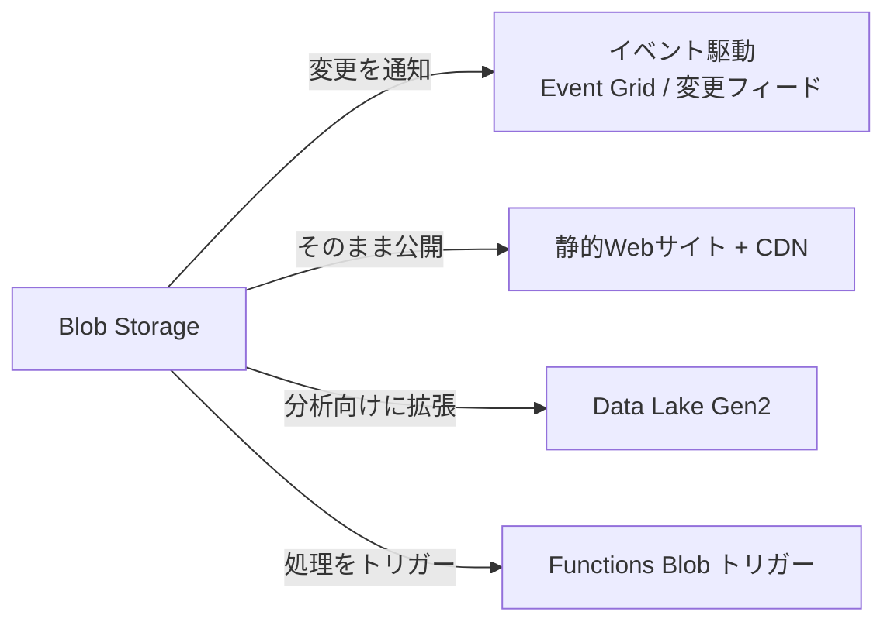
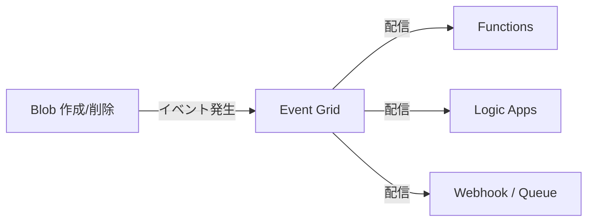
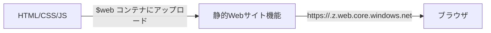
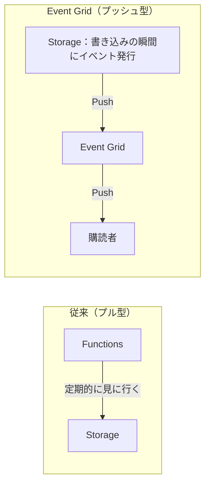
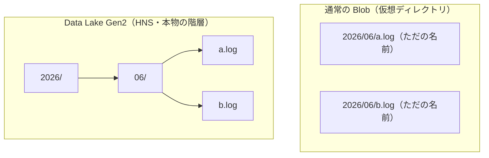
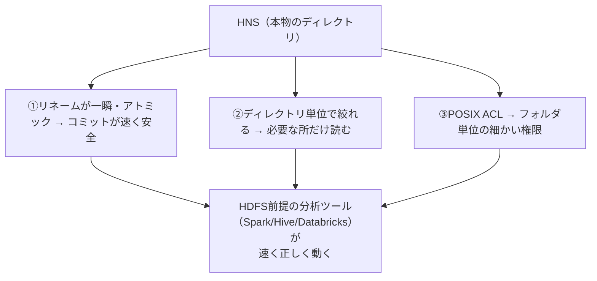
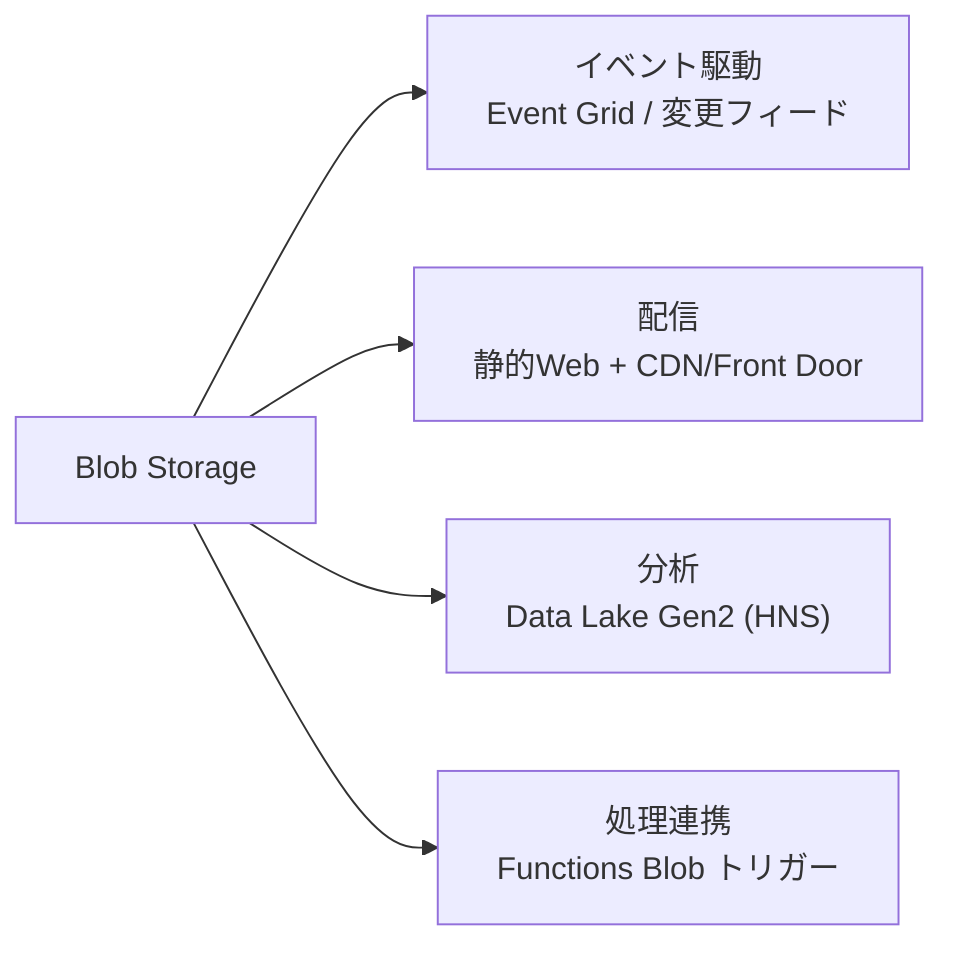

# Week 9 — エコシステム統合と高度機能

> **Phase 2b** | 学習プラン Week 9 / 10
> 学習目標：Blob を「置き場」だけでなく**イベント源・配信基盤・分析基盤**として使える。Event Grid / 変更フィードでイベント駆動を組み、静的 Web サイト・CDN で配信し、Data Lake Gen2（階層名前空間）で分析に繋げられる

---

## 0. 今週の位置づけ

Week 1〜8 で Blob 単体を深く学んだ。最終週の前に、**Blob を他サービスと組み合わせて活かす**応用を俯瞰する。Week 1 で「Storage は Azure の土台」と言った——その土台が周囲とどう繋がるかを見る。



---

## 1. イベント駆動：Blob の変化をトリガーにする

「Blob がアップロードされたら自動で処理を始めたい」——ポーリング（定期的に見に行く）ではなく、**変化が起きた瞬間に通知**するのがイベント駆動。手段は 2 つ。

### ① Event Grid（イベントを配信）

Blob の作成・削除などの**イベントを、リアルタイムに購読者へ配信**する仕組み。



| 特徴 | 内容 |
|---|---|
| 何を通知 | BlobCreated / BlobDeleted など |
| 配信先 | Functions・Logic Apps・Webhook・Queue 等 |
| 強み | **プッシュ型**（即時）・大規模・フィルタ可能 |

> **イメージ**：郵便受けを毎分見に行く（ポーリング）のではなく、**届いた瞬間にベルが鳴る**（イベント）。「画像がアップされたらサムネイル生成」「PDF が来たら解析」などを即時に起動できる。

### ② 変更フィード（Change Feed）

Blob の**変更履歴を時系列のログとして永続化**する機能。Event Grid が「今起きた通知（その場限り）」なのに対し、変更フィードは「**後から順番に読める変更の記録**」。

| | Event Grid | 変更フィード |
|---|---|---|
| 形 | プッシュ通知（その場） | 永続ログ（後から読む） |
| 用途 | 即時トリガー | 監査・差分同期・あとからまとめて処理 |
| 順序 | 個別配信 | **時系列で順序保証** |

> **使い分け**：「**今すぐ反応**」したいなら Event Grid、「**取りこぼさず順に処理・後から遡る**」なら変更フィード。両方併用も多い。

---

## 2. 静的 Web サイトホスティング

Blob は**そのまま Web サイトとして公開**できる。サーバー不要で HTML/CSS/JS/画像を配信する。



| 特徴 | 内容 |
|---|---|
| 置き場 | 専用の **`$web` コンテナ** |
| 公開 URL | 専用の Web エンドポイント（`*.web.core.windows.net`） |
| 既定ドキュメント | `index.html` など指定可 |
| 向くもの | SPA・ドキュメント・LP など**サーバー処理のない静的サイト** |

> **ポイント**：サーバーレスで激安・高耐久。動的処理（DB アクセス等）が要るならバックエンド（Functions/App Service）と組む。Week 2 の `Content-Type` が効く——正しく付かないとブラウザが表示できない。

> **初学者向け用語補足：静的サイトと「サーバー処理」とは**
> Web サイトを開くと裏でサーバーがページを返すが、返し方が 2 通りある。
> - **サーバー処理あり（動的）**：アクセスのたびに**サーバーでプログラムが走る**（DB を見る・ログイン確認・計算）。＝注文を聞いてから**その場で作る**レストラン。例：ログイン・検索結果・カート・タイムライン（人/状況で中身が変わる）。
> - **サーバー処理なし（静的）**：あらかじめ作った**完成済みファイル（HTML/CSS/JS/画像）をそのまま返すだけ**。＝棚の**出来合い弁当を渡すだけ**の売店。誰がいつ見ても同じ内容。
>
> **サーバー処理がない利点**：①安い（計算サーバー不要、保存＋転送だけ）②速い（即ファイルを返す・CDN 容易）③大量アクセスに強い④**安全**（攻撃される的＝サーバーコードや DB がない）⑤落ちにくい（11 ナインに乗る）⑥運用が楽（パッチ対象なし）。
>
> **誤解しやすい点：「静的＝動きがない」ではない**。静的サイトでも**ブラウザの中で JavaScript を動かせば**インタラクティブにできる。鍵は「**処理がどこで起きるか**」——サーバー（静的にはない）か、あなたのブラウザ内（静的でも OK）か。現代の定番は「**静的なフロント（Blob/CDN）＋ API バックエンド（Functions 等）**」で、動的な部分だけ API に投げる（Week 10 の構成もこれ）。
>
> **身近な静的サイトの例**：製品紹介・キャンペーンの LP、ドキュメント/技術文書サイト、ブログ・ポートフォリオ、イベント告知。GitHub Pages・Netlify・Vercel なども静的ホスティング。一方ネット銀行・Amazon のカート・SNS のタイムラインは「人ごとに中身が違う」ので動的が必須。

---

## 3. CDN / Front Door：速く・広く配信する

静的サイトや公開 Blob を**世界中に速く配信**し、Storage の負荷・転送コストを下げるのが **CDN / Front Door**。


| 効果 | 内容 |
|---|---|
| **高速化** | 地理的に近いエッジから配信（Week 1 の CDN） |
| **負荷軽減** | キャッシュがオリジン（Blob）への到達を減らす |
| **コスト削減** | egress（Week 7）をエッジが肩代わり |
| **保護** | Front Door は WAF も付けられる |

> **ポイント**：「公開コンテンツの世界配信」は CDN/Front Door が定石。Blob を直接世界中から読むと遅く・egress 高（Week 7）。**前段にキャッシュ**を置く。

> **重要な概念の整理：Front Door は「DNS + WAF」だけではない（キャッシュも持つ）**
> Azure Front Door（Standard/Premium）は**グローバル L7 アプリケーション配信ネットワーク**で、複数の役割を束ねる：**グローバル入口（anycast）＋ L7 ルーティング ＋ TLS 終端 ＋ コンテンツキャッシュ（CDN）＋ 動的サイト高速化 ＋ WAF ＋ グローバル負荷分散**。つまり**キャッシュ（CDN）は中核機能の一つ**で、「DNS + WAF だけ」ではない。
> - 「世界中から最寄りへ」は純粋な DNS 振り分けではなく **anycast の L7 グローバル入口**。DNS ベースの振り分けは別サービスの **Traffic Manager**、ドメイン（ゾーン）ホストは **Azure DNS** で、Front Door とは別物。
> - **CDN は Front Door に統合中**：現行は **Front Door Standard / Premium** に一本化（「Azure CDN Standard classic と同等＋追加機能」）。classic 系は retire 予定（Azure CDN Standard from Microsoft classic：2027/9/30、Front Door classic：2027/3/31）。**Premium の主な差**はマネージド WAF＋ボット対策と、オリジンへの **Private Link**（バックエンドを非公開化、Week 5）。
> - だから本講座で「CDN / Front Door」を並記したのは、**今や Front Door が CDN を内包**しているため。「Front Door（Standard/Premium）＝CDN＋高速化＋WAF＋グローバル LB の統合」と捉えるのが最新。
>
> 出典：
> - Caching — Azure Front Door：https://learn.microsoft.com/en-us/azure/frontdoor/front-door-caching
> - Front Door と Azure CDN の比較：https://learn.microsoft.com/en-us/azure/frontdoor/front-door-cdn-comparison
> - Azure CDN Standard from Microsoft (classic) 引退 FAQ：https://learn.microsoft.com/en-us/azure/cdn/classic-cdn-retirement-faq

---

## 4. Functions Blob トリガー（よくある統合）

Event Grid を使わずとも、**Functions が Blob の追加を直接トリガー**にできる（Blob トリガー）。Week 10 の実装でも使う発想。


> **注意**：従来の Blob トリガーはポーリング的で大規模・低遅延では不利な面があり、**大規模では Event Grid ベースの Blob トリガー**が推奨。「小規模・手軽＝従来トリガー、大規模・即時＝Event Grid 連携」と捉える。

### なぜ Event Grid は即時か（プル vs プッシュ）

「Blob トリガー」の検知の仕組みは 2 通りあり、速さの差は**ポーリングか Push か**で決まる。

| | 従来の Blob トリガー | Event Grid ベース |
|---|---|---|
| 仕組み | **Functions が見に行く**（ログ走査＋スキャン）＝プル型 | **Storage が操作の瞬間にイベント発行**＝プッシュ型 pub/sub |
| 速さ | 通常 数秒〜数分、**最悪 ~10 分** | ほぼ即時（秒以下〜数秒） |
| 大量 Blob | スキャンが重く遅延しやすい | 影響を受けにくい |



- **Event Grid が速いのは「速くポーリングしているから」ではなく、そもそも誰もポーリングしていないから**。Storage が**書き込み処理の一部としてイベントを吐き出す（Push）**ので、見に行く周期に縛られず即時。
- **従来トリガーは固定間隔ではない**。Storage のログ走査＋（ログが頼れないときの）コンテナ総スキャンのハイブリッドで、**コンテナに 1 万件超の Blob があると遅延しやすく、最悪で検知まで ~10 分**かかりうる（Microsoft も明記）。だから低遅延・大規模では Event Grid 方式が推奨。
- なお従来トリガーには「同じ Blob で 2 回起動しない」重複防止（blob receipt）の仕組みがある。

> **要点**：Event Grid の即時性は **Push 型 pub/sub** によるもの（プル型の周期がない）。従来トリガーは **プル型でログ走査＋スキャン**のため最悪 ~10 分の遅延がありうる。

---

## 5. Data Lake Storage Gen2：分析のための Blob

Blob を**ビッグデータ分析向けに拡張**したのが **Data Lake Storage Gen2（ADLS Gen2）**。実体は Blob と同じだが、**階層名前空間（HNS）**を有効にすることで「本物のディレクトリ」を持つ。

### 階層名前空間（HNS）とは

Week 2 で「Blob の `folder/file.txt` は**仮想ディレクトリ**（実は `/` 入りの名前）」と学んだ。HNS を有効にすると、**本物のディレクトリ構造**になる。



| | 通常 Blob（仮想ディレクトリ） | Data Lake Gen2（HNS） |
|---|---|---|
| ディレクトリ | 名前の `/` で擬似的に表現 | **本物のディレクトリ（実体）** |
| ディレクトリ操作 | 「フォルダのリネーム」＝中の全 Blob を 1 個ずつコピー（遅い） | **ディレクトリのリネーム/移動がアトミックな 1 操作（速い）** |
| アクセス制御 | コンテナ/RBAC 単位 | **POSIX ACL（ファイル/ディレクトリ単位の細かい権限）** |
| 向くもの | 一般のオブジェクト保存 | **大規模分析（Synapse/Databricks/Hadoop）** |

> **初学者向け用語補足：POSIX ACL**
> Linux 系のファイル権限（所有者/グループ/その他に読み書き実行）に似た、**ファイル・ディレクトリ単位の細かいアクセス制御**。「このディレクトリはこのグループだけ読める」を Blob 内部の階層で表現できる。分析基盤では大量のフォルダに細かく権限を付けたいので HNS の ACL が効く。

> **初学者向け用語補足：HNS の略**
> **HNS＝Hierarchical Namespace（階層名前空間）**。Hierarchical＝階層的な、Namespace＝名前の管理体系。「名前をフラットでなく**階層（ツリー）で管理する**」の意。通常 Blob は名前がフラット（`2026/06/a.log` はただの 1 名前）だが、HNS は本物のフォルダのツリーで持つ。

#### なぜディレクトリ構造が分析に向くのか

ビッグデータ分析ツール（Spark・Hive・Databricks・Hadoop）は、もともと **HDFS という"本物のファイルシステム"を前提**に作られている。だから本物のディレクトリがあると速く・正しく動く。理由は 3 つ。

**① 最重要：ディレクトリのリネーム＝一瞬・アトミック → コミットが速い**
分析ジョブは結果を書くとき「①一時フォルダ `_temp/` に大量ファイルを書く → ②成功したら `output/` に**リネーム**して確定（コミット）」という手順を踏む。

| | 通常 Blob（フラット） | HNS（本物の階層） |
|---|---|---|
| フォルダのリネーム | 中の全ファイルを 1 個ずつコピー＆削除 | **メタデータ 1 操作で一瞬** |
| 100 万ファイルだと | 激遅・途中失敗で**中途半端な出力（壊れる）** | **即座・アトミック**（全部成功 or 何もなし） |

「成功したらリネームで確定」という方式が、フラットだと激遅＆壊れやすい。HNS なら一瞬で安全に確定できる——これが HNS が分析基盤の標準である最大の理由。

**② ディレクトリ単位の絞り込み（パーティションプルーニング）が速い**
分析データは `logs/year=2026/month=06/day=22/*.parquet` のように**ディレクトリでパーティション分割**して置く。「2026 年 6 月だけ」のクエリは `month=06` のフォルダだけ読めばよい（パーティションプルーニング）。本物のディレクトリなら開くだけで高速。フラットだと全キーを前方一致スキャンで重い。

**③ ディレクトリ/ファイル単位の細かい権限（POSIX ACL）**
データレイクは多数のチームがフォルダごとに違う権限で使う。HNS は POSIX ACL でファイル/ディレクトリ単位に権限を付けられ、Hadoop/Spark 系が期待する権限モデルと一致する。



> **一言で**：分析ツールは「本物のファイルシステム（HDFS）」前提。とくに「ディレクトリのリネームで結果を確定」「ディレクトリ単位で必要な所だけ読む」が速く・正しくできることが命。フラットな Blob は苦手だが HNS は得意——だから分析基盤の標準ストレージになっている。

> **初学者向け用語補足：HDFS・Hadoop・Spark・Hive・Databricks とは**
> どれも「大量データを多数のマシンで分担処理する」ためのもので、共通して **HDFS（本物のファイルシステム）を前提**にしている。
>
> | 名前 | 何か | 一言で |
> |---|---|---|
> | **HDFS** | Hadoop Distributed File System | 大量データを**多数マシンに分散保存**する本物のファイルシステム（HNS が真似る対象） |
> | **Hadoop** | ビッグデータ処理の元祖（HDFS＋分散処理） | 分散処理の**土台・先祖** |
> | **Spark** | 高速な分散データ処理エンジン | 大量データを**多数マシンで並列・高速に加工/集計/ML** |
> | **Hive** | ファイル群に **SQL でクエリ**できる仕組み | ファイルの集まりに**「表」と「SQL」をかぶせる** |
> | **Databricks** | Spark のマネージドなクラウド分析基盤 | **Spark の商用版＋ノートブック**（Spark 開発元が提供） |
>
> ```mermaid
> flowchart TD
>     DATA["巨大データ（TB〜PB）"] --> FS["HDFS / Data Lake Gen2(HNS)<br/>本物のファイルシステム"]
>     FS --> SPARK["Spark：分散処理エンジン"]
>     FS --> HIVE["Hive：SQL でクエリ"]
>     SPARK --> DBX["Databricks：Spark のマネージド版"]
> ```
>
> **HNS との繋がり**：これらはどれも「ディレクトリのリネームで確定」「ディレクトリ単位で必要な所だけ読む」という HDFS の動きを前提に作られている。だからストレージが**本物の階層（HNS）**だと速く・正しく動く。**Azure では Data Lake Gen2（HNS）が HDFS の代わり**になり、Spark/Hive/Databricks のデータ置き場になる。
> **Azure での対応サービス**：Spark/Hive 相当をマネージド提供するのが **Azure Synapse Analytics・Azure Databricks・HDInsight**。これらの**データ置き場が Data Lake Gen2（HNS）**、という関係。

> **判断軸**：一般のファイル/オブジェクト保存 → **通常の Blob**。ビッグデータ分析の基盤 → **Data Lake Gen2（HNS 有効）**。HNS は作成時に決める設定（後から両立はできるが計画的に）。

---

## 6. Week 9 全体の整理



| 用語 | 一言説明 |
|---|---|
| Event Grid | Blob の変化をリアルタイムに購読者へプッシュ配信 |
| 変更フィード | Blob 変更を時系列ログとして永続化（後から順に読める） |
| 静的 Web サイト | `$web` コンテナで HTML 等をサーバーレス公開 |
| CDN / Front Door | エッジにキャッシュし高速・低コスト・WAF 配信 |
| Functions Blob トリガー | Blob 追加で関数を起動（大規模は Event Grid 連携） |
| Data Lake Gen2 | 分析向け Blob。HNS で本物の階層 |
| 階層名前空間（HNS） | 本物のディレクトリ。リネーム/移動が高速・ACL 可 |
| POSIX ACL | ファイル/ディレクトリ単位の細かい権限 |

---

## ハンズオン チェックリスト

- [ ] Event Grid で BlobCreated を購読し、アップロードで Function/Logic Apps が起動するのを確認した
- [ ] 変更フィードを有効化し、変更ログが時系列で読めることを確認した
- [ ] `$web` コンテナで静的 Web サイトを公開し、Web エンドポイントで表示した
- [ ] （任意）CDN/Front Door を前段に置き、キャッシュヒットを確認した
- [ ] HNS 有効のアカウントを作り、ディレクトリ作成・リネームが 1 操作で済むことを確認した
- [ ] 通常 Blob（仮想ディレクトリ）と HNS の「フォルダのリネーム」挙動の違いを体感した

---

## 自己チェック

1. **Event Grid と変更フィードの違いと使い分けは？**
   - キーワード：即時プッシュ / 永続ログ・順序保証
2. **静的 Web サイトはどんなサイトに向き、何が要るか？**
   - キーワード：サーバー処理のない静的・`$web`・Content-Type
3. **公開コンテンツを世界配信するとき CDN を挟む理由は？**
   - キーワード：高速化・負荷軽減・egress 削減
4. **HNS（階層名前空間）が分析に向くのはなぜか？**
   - キーワード：本物の階層・ディレクトリ操作が高速アトミック・POSIX ACL
5. **仮想ディレクトリと HNS で「フォルダのリネーム」はどう違うか？**
   - キーワード：全 Blob コピー（遅）/ 1 操作（速）

---

## 次週の予告（Week 10）

いよいよ総仕上げの**実装**：

- Bicep で Storage アカウント＋コンテナ＋データ保護を IaC 化
- Python Function（Managed Identity）で Blob アップロード/一覧/SAS 発行 API
- E2E テストで「アップロード → 一覧 → ダウンロード一致 → SAS アクセス」を検証
- Week 1〜9 の概念（オブジェクトモデル・認証 RBAC・データ保護）を実物に落とす
